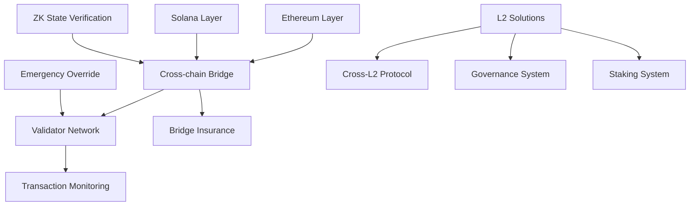

# Technical Dependencies Matrix

## Core Dependencies

## Feature Dependencies by Phase

### Phase 1 (Alpha) Dependencies
- **Ethereum Integration**
  - Required by: Governance, Token Deployment, Security Systems
  - Depends on: Validator Network
  
- **Solana Integration**
  - Required by: High-speed transactions, NFT operations
  - Depends on: Validator Network
  
- **Validator Network**
  - Required by: All blockchain operations
  - Depends on: Core infrastructure

### Phase 2 (Beta) Dependencies
- **Cross-chain Bridge**
  - Required by: Asset transfers, unified liquidity
  - Depends on: Both chain integrations, ZK verification
  
- **L2 Solutions**
  - Required by: Scaling operations
  - Depends on: Ethereum integration

### Phase 3 (Production) Dependencies
- **Advanced Features**
  - Required by: Enhanced functionality
  - Depends on: All core systems

## Critical Path Analysis

### Launch Critical Path
1. Core Infrastructure
   - Ethereum Integration
   - Solana Integration
   - Validator Network
   - Basic Security

2. Essential Features
   - Token System
   - Wallet Integration
   - Basic Governance
   - KYC/Compliance

3. Enhanced Features
   - Cross-chain Operations
   - L2 Scaling
   - Advanced Security

## Integration Requirements

### External Systems
- **Blockchain Nodes**
  - Ethereum RPC
  - Solana RPC
  - L2 endpoints

- **Security Services**
  - KYC providers
  - Chain analysis
  - Fraud detection

- **Infrastructure**
  - IPFS
  - Frontend hosting
  - API gateway

### Internal Systems
- **Core Services**
  - Authentication
  - Transaction processing
  - State management
  - Event system

- **Business Logic**
  - Token management
  - Governance
  - Analytics
  - User management

## Scaling Considerations

### Transaction Processing
- L1: Core operations
- L2: Bulk operations
- Solana: High-frequency
- Cross-chain: Asset bridges

### State Management
- ZK proofs for bridges
- State sync across chains
- Redundancy systems
- Recovery procedures

## Security Touchpoints

### Critical Security Features
- Bridge security
- Multi-sig controls
- Emergency systems
- Monitoring
- Compliance checks

### Security Dependencies
- All core features require security integration
- Cross-chain operations need additional validation
- L2 operations require specific security measures 