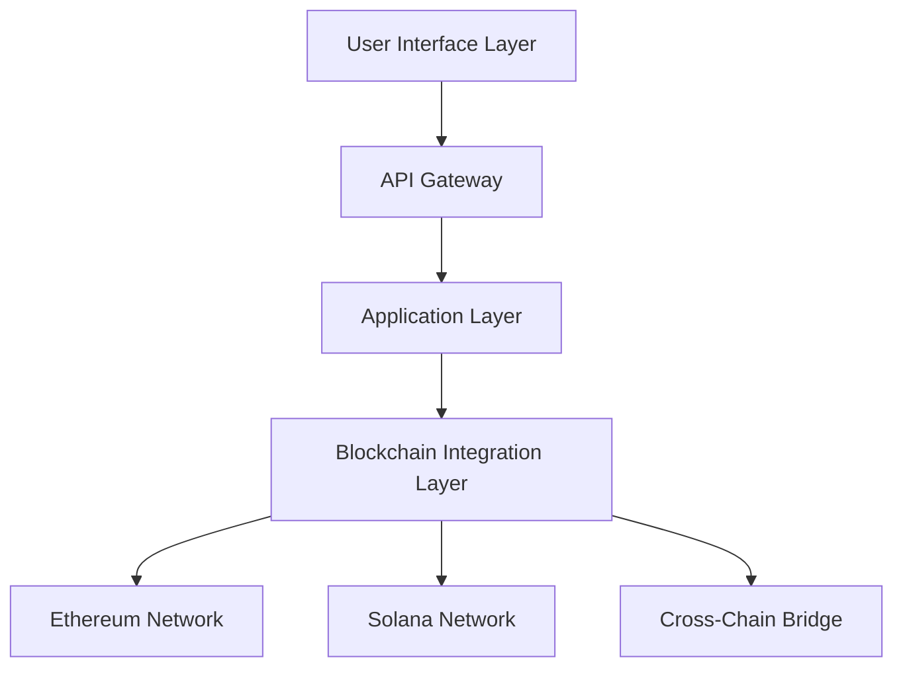
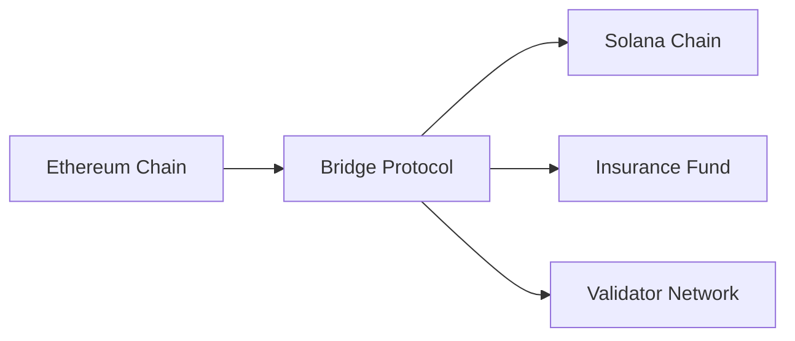

# King Blockchain Architecture Overview

## 1. System Architecture

### 1.1 High-Level Architecture

King Blockchain implements a dual-chain architecture leveraging both Ethereum and Solana networks to provide optimal performance, security, and user experience:

### 1.2 Core Components

1. **User Interface Layer**
   - Next.js-based web application
   - React Native mobile apps
   - Web3 wallet integration
   - Real-time updates via WebSocket

2. **API Gateway**
   - GraphQL API endpoint
   - REST API fallback
   - Rate limiting
   - Request validation
   - Authentication middleware

3. **Application Layer**
   - Creator token management
   - User authentication
   - Community features
   - Analytics engine
   - Content delivery

4. **Blockchain Integration Layer**
   - Smart contract interaction
   - Transaction management
   - State synchronization
   - Bridge operations
   - Multi-client validation

### 1.3 Technology Stack

#### Frontend
- Next.js 14+ (React framework)
- TailwindCSS (Styling)
- ethers.js (Ethereum interaction)
- @solana/web3.js (Solana interaction)
- Apollo Client (GraphQL)
- Vercel Edge Functions
- Vercel Edge Network (CDN)

#### Backend
- Vercel Serverless Functions
- Vercel Postgres (Primary database)
- Vercel KV (Redis-compatible cache)
- Vercel Blob (Object storage)
- GraphQL (Apollo Server)

#### Blockchain
- Solidity (Ethereum contracts)
- Rust (Solana programs)
- TheGraph (Indexing)
- IPFS/Arweave (Storage)

### 1.4 Cross-Chain Architecture

The system implements a secure bridge protocol for cross-chain operations:

Key features:
- Multi-signature validation
- Insurance protection
- State verification
- Automated monitoring
- Emergency controls

### 1.5 Scalability Design

The architecture is designed for horizontal scalability:

1. **Application Scaling**
   - Containerized microservices
   - Kubernetes orchestration
   - Auto-scaling policies
   - Load balancing
   - Geographic distribution

2. **Blockchain Scaling**
   - Layer 2 solutions (Arbitrum, Optimism)
   - Solana program optimization
   - State compression
   - Parallel transaction processing
   - Cross-chain load distribution

### 1.6 Security Architecture

Comprehensive security measures are implemented at all layers:

1. **Application Security**
   - JWT authentication
   - Rate limiting
   - DDoS protection
   - Input validation
   - HTTPS enforcement

2. **Blockchain Security**
   - Multi-client validation
   - Bridge insurance
   - Emergency controls
   - Automated monitoring
   - Formal verification

3. **Data Security**
   - End-to-end encryption
   - Secure key management
   - Data backup
   - Access control
   - Audit logging

## 2. Development Approach

### 2.1 Development Methodology

- Agile development process
- Two-week sprint cycles
- Continuous Integration/Deployment
- Automated testing
- Security-first approach

### 2.2 Quality Assurance

1. **Testing Levels**
   - Unit testing
   - Integration testing
   - Smart contract audits
   - Performance testing
   - Security scanning

2. **Monitoring**
   - Real-time metrics
   - Error tracking
   - Performance monitoring
   - User analytics
   - Blockchain analytics

### 2.3 Deployment Strategy

1. **Environment Setup**
   - Production (Vercel)
   - Staging (Vercel Preview)
   - Development (Local)
   - Preview (Per PR)

2. **Release Process**
   - GitHub integration
   - Automatic deployments
   - Preview environments
   - Rollback capabilities
   - Edge function distribution

3. **Infrastructure Management**
   - Vercel Dashboard
   - Automatic HTTPS
   - DDoS protection
   - Global CDN
   - Edge caching
   - Compression
   - Protocol optimization

## 3. Integration Points

### 3.1 External Integrations

1. **Blockchain Networks**
   - Ethereum mainnet/testnet
   - Solana mainnet/testnet
   - Layer 2 solutions

2. **Third-Party Services**
   - Wallet providers
   - Fiat gateways
   - Analytics services
   - Content delivery
   - Security monitoring

### 3.2 API Integration

1. **Public APIs**
   - Creator token management
   - User authentication
   - Transaction processing
   - Analytics data
   - Content access

2. **Internal APIs**
   - System monitoring
   - Administrative functions
   - Security controls
   - Bridge operations
   - Validator management

## 4. Future Considerations

### 4.1 Planned Enhancements

1. **Technical Improvements**
   - ZK-rollup integration
   - Enhanced bridge security
   - Improved scalability
   - Additional L2 support
   - Advanced analytics

2. **Feature Expansion**
   - NFT marketplace
   - DeFi integration
   - Advanced governance
   - Creator tools
   - Community features

### 4.2 Research Areas

1. **Technical Research**
   - ZK technology
   - Layer 2 scaling
   - Cross-chain communication
   - Smart contract optimization
   - Security enhancements

2. **Market Research**
   - User behavior
   - Feature adoption
   - Performance metrics
   - Security incidents
   - Competitor analysis
