# Data Flow

## 1. Transaction Flow

### 1.1 Creator Token Deployment

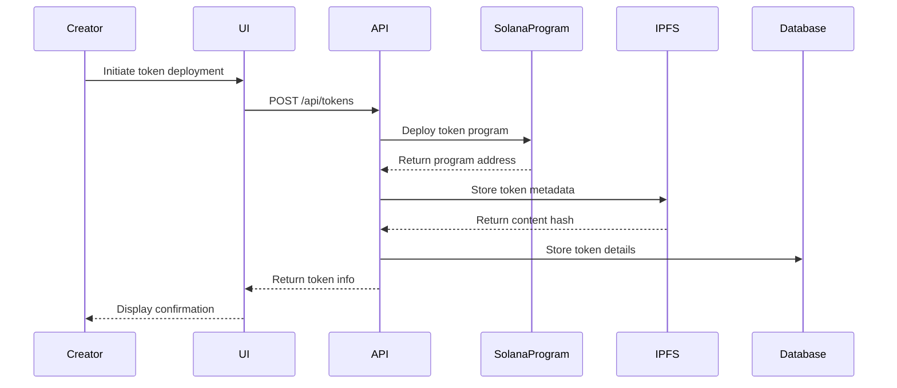

### 1.2 Token Purchase Flow

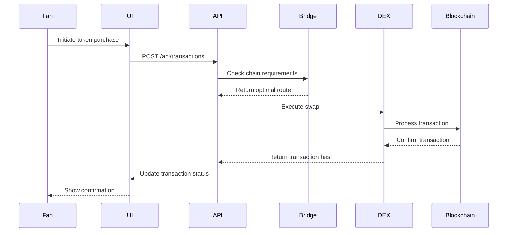

## 2. State Management

### 2.1 Chain State Synchronization

1. **Cross-Chain State**
```typescript
interface ChainState {
    // State tracking
    trackState(chainId: ChainID, state: State): Promise<void>;
    
    // State verification
    verifyState(chainId: ChainID, state: State): Promise<boolean>;
    
    // State synchronization
    syncState(sourceChain: ChainID, targetChain: ChainID): Promise<void>;
}
```

2. **State Flow**
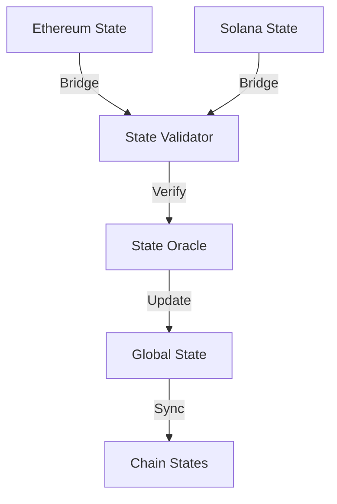

### 2.2 Data Consistency

1. **Consistency Checks**
```typescript
interface ConsistencyCheck {
    // Balance verification
    verifyBalances(token: TokenAddress): Promise<boolean>;
    
    // State validation
    validateState(state: State): Promise<ValidationResult>;
    
    // Conflict resolution
    resolveConflict(conflict: Conflict): Promise<Resolution>;
}
```

2. **Consistency Flow**
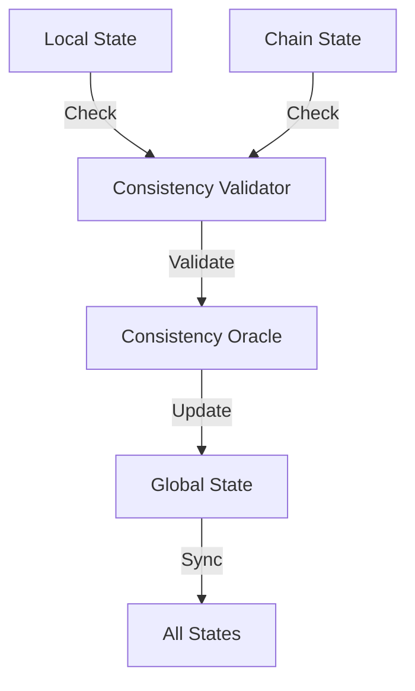

## 3. Event Processing

### 3.1 Event Flow

1. **Event Types**
```typescript
interface EventSystem {
    // Event emission
    emitEvent(event: Event): Promise<void>;
    
    // Event processing
    processEvent(event: Event): Promise<ProcessingResult>;
    
    // Event subscription
    subscribeToEvents(filter: EventFilter): Observable<Event>;
}
```

2. **Event Processing Flow**
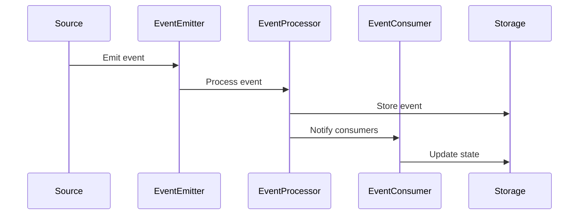

### 3.2 Real-time Updates

1. **WebSocket Implementation**
```typescript
interface WebSocketSystem {
    // Connection management
    connect(userId: string): Promise<WebSocketConnection>;
    disconnect(userId: string): Promise<void>;
    
    // Event streaming
    streamEvents(filter: EventFilter): Observable<Event>;
    
    // State updates
    pushUpdate(update: StateUpdate): Promise<void>;
}
```

2. **Update Flow**
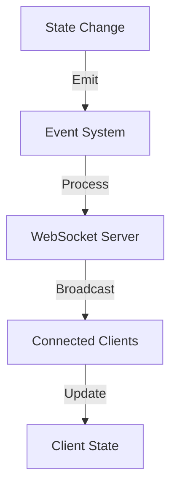

## 4. Data Storage Flow

### 4.1 Blockchain Storage

1. **On-Chain Data**
```solidity
interface StorageFlow {
    // State storage
    function storeState(bytes32 key, bytes32 value) external;
    function retrieveState(bytes32 key) external view returns (bytes32);
    
    // Event emission
    function emitEvent(bytes32 eventType, bytes data) external;
    
    // State verification
    function verifyState(bytes32 key, bytes32 value) external view returns (bool);
}
```

2. **Storage Flow**
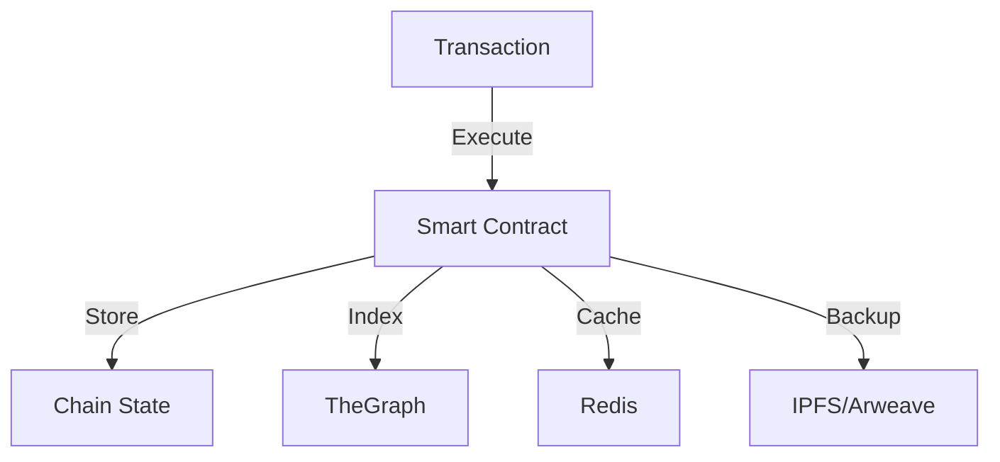

### 4.2 Off-Chain Storage

1. **Database Operations**
```typescript
interface DatabaseFlow {
    // Write operations
    write(data: Data): Promise<void>;
    
    // Read operations
    read(query: Query): Promise<Data>;
    
    // Cache management
    cache(key: string, value: any): Promise<void>;
    
    // Indexing
    index(data: Data): Promise<void>;
}
```

2. **Storage Hierarchy**
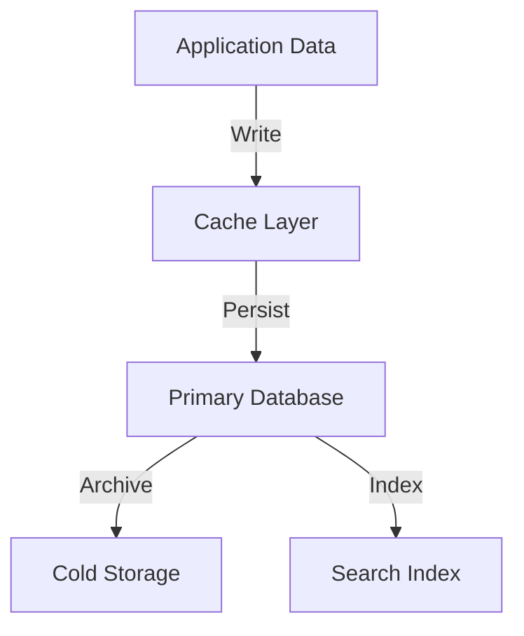

## 5. API Data Flow

### 5.1 GraphQL Flow

1. **Query Resolution**
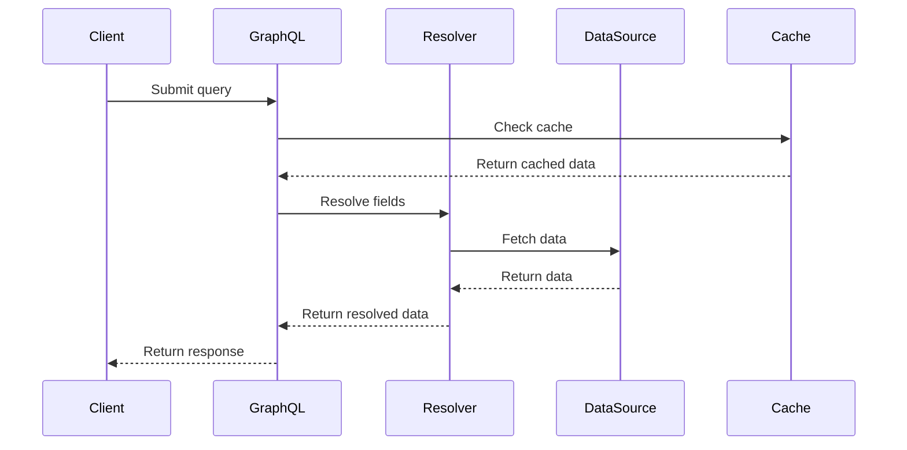

2. **Subscription Flow**
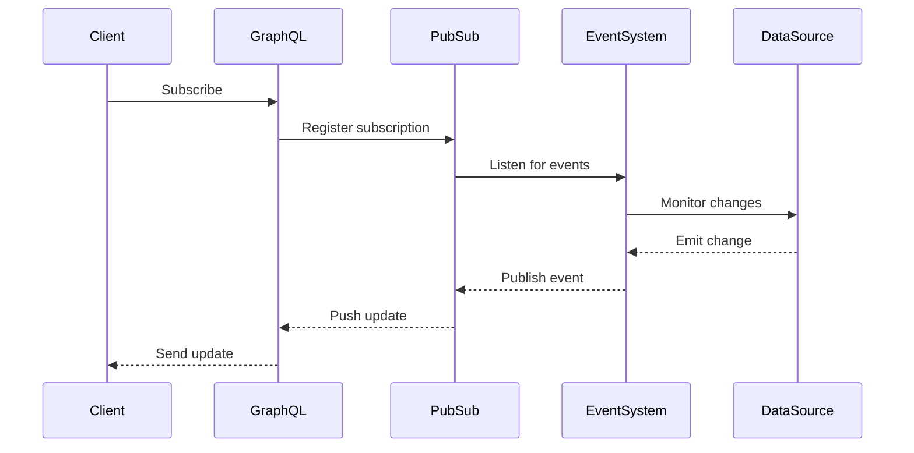

### 5.2 REST Flow

1. **Request Processing**
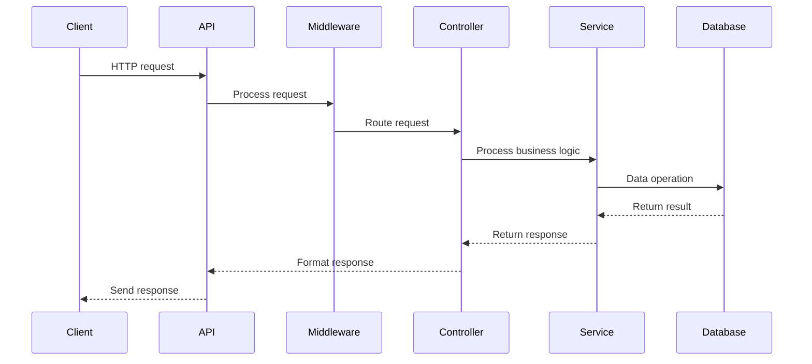

## 6. Security Flow

### 6.1 Authentication Flow

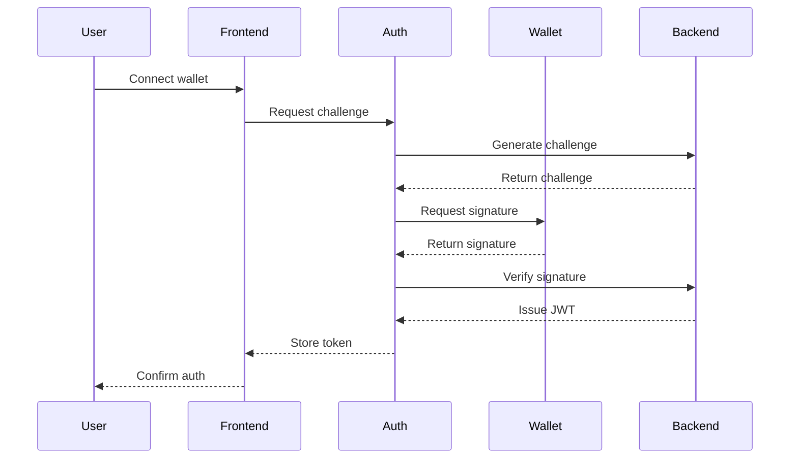

### 6.2 Transaction Security Flow

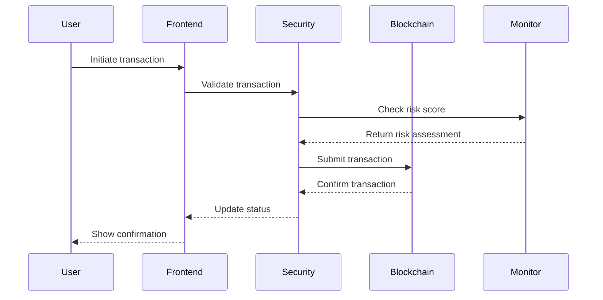

This document outlines the major data flows in the King Blockchain system, showing how information moves between different components and how various processes interact with each other.
