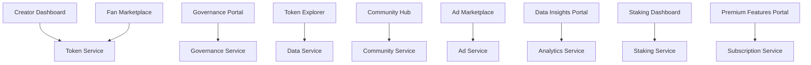
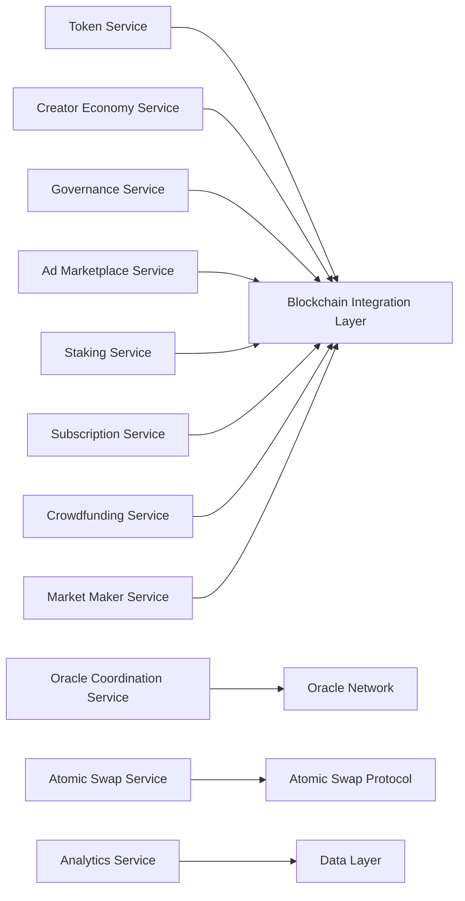
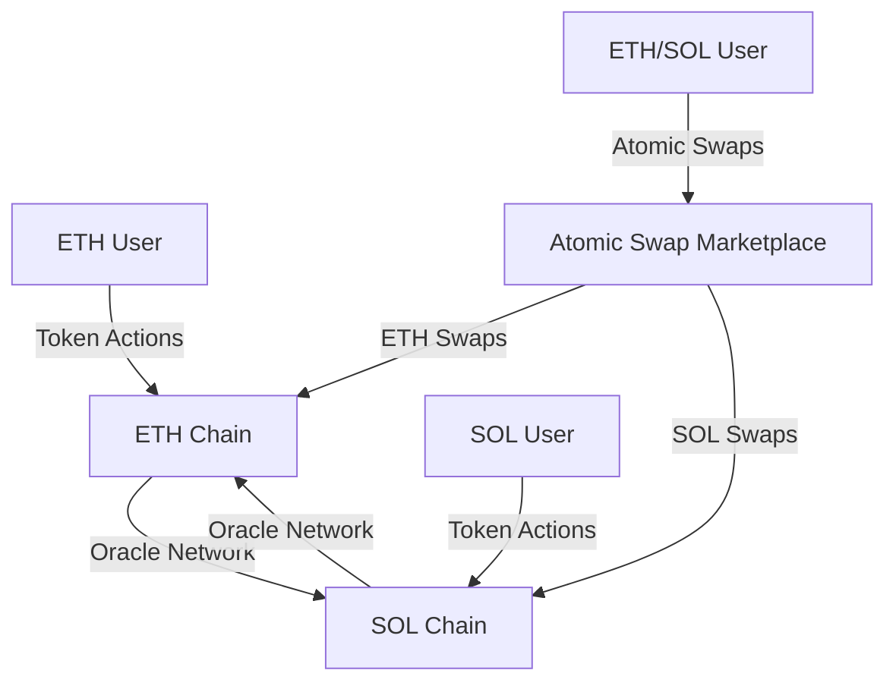
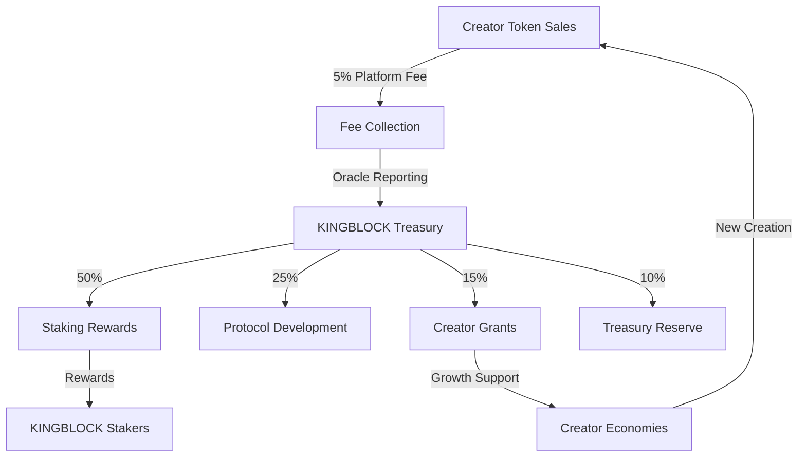
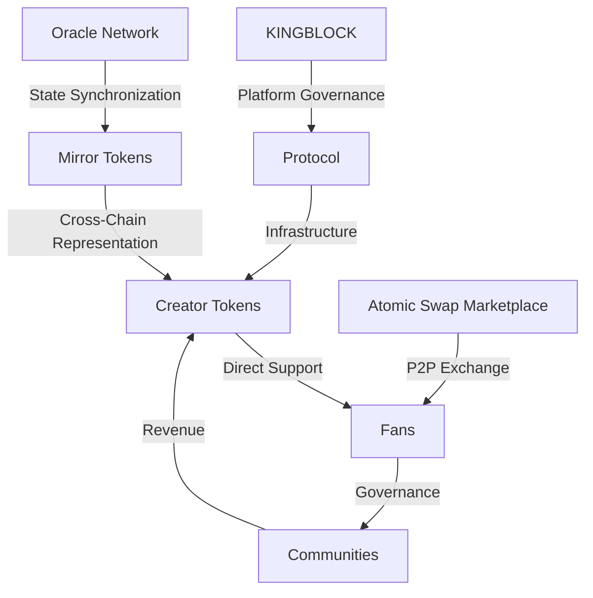

# King Blockchain: Empowering Creators and Fans with True Digital Ownership

## Abstract

King Blockchain represents a paradigm shift in the creator economy, addressing fundamental inefficiencies where centralized platforms extract 30-50% of creator revenue while controlling audience relationships and content distribution. Our decentralized protocol introduces three innovations: Mirror Tokens enabling programmable digital ownership, advanced automation systems for transparent revenue distribution, and a multi-layered security architecture protecting creator assets without sacrificing accessibility.

By eliminating intermediaries, King Blockchain delivers immediate technical advantages: 3-5x higher creator earnings, cryptographically-secured intellectual property rights, and permissionless community building tools that operate across platform boundaries. Our protocol processes transactions at 10,000+ TPS with sub-second finality, ensuring scalability even during viral content surges.

Beyond technical superiority, King Blockchain establishes a self-sustaining economic model where value flows directly between creators and fans through user-governed marketplace mechanics. This reshapes the fundamental power dynamics of content creation, transitioning from platform monopolies to creator sovereignty. The result is not merely an incremental improvement but a comprehensive infrastructure layer for the next generation of digital creativity and ownership.

## Glossary of Terms

**Anomaly Detection:** Identifying patterns that deviate from the norm, indicating unusual or suspicious activity.

**Autoencoders:** A type of neural network used for unsupervised learning, often employed in anomaly detection and feature extraction.

**Blockchain:** A decentralized, distributed, and immutable ledger that records transactions across many computers. It is the underlying technology for cryptocurrencies and NFTs.

**Content Platforms:** Digital services like YouTube, TikTok, and Twitch that creators use to distribute their content.

**Contingency Planning:** Preparing for unexpected events or emergencies to ensure business continuity and system resilience.

**Creator Economy:** The economic system where independent creators, such as artists, writers, and influencers, earn revenue from their creations, often through digital platforms.

**Cryptocurrencies:** Digital or virtual currencies that use cryptography for security and operate independently of central banks.

**Data Ingestion Layer:** The component of a system responsible for collecting and importing data from various sources.

**Decentralized Ledger:** A database replicated and shared across a network of computers, where each participant holds an identical copy of the data.

**Digital Ownership:** The concept of having verifiable and permanent control over digital assets, often facilitated by blockchain technology and NFTs.

**Disaster Recovery:** Procedures and measures taken to restore IT infrastructure and data in the event of a disruptive event.

**Exponential Smoothing:** A forecasting method that assigns exponentially decreasing weights to past observations.

**Firedancer Client:**  A new validator client implementation for the Solana blockchain, known for its performance enhancements.

**Hybrid Approaches (Anomaly Detection):** Combining multiple anomaly detection techniques to improve accuracy and robustness.

**Immutable Ledger:** A record-keeping system where, once an entry is made, it cannot be altered or deleted. Blockchain is an example of an immutable ledger.

**Integration with Other Systems:** Connecting the King Blockchain platform with external services and applications to expand functionality and data sharing.

**Isolation Forest:** A machine learning algorithm for anomaly detection that isolates anomalies by randomly partitioning data.

**Jito Labs:** A company contributing to the Solana ecosystem, known for its validator client implementation and MEV solutions.

**King Blockchain:** The name of the proposed blockchain platform designed to empower creators.

**Machine Learning Techniques:** Algorithms that allow computers to learn from data without being explicitly programmed, used for tasks like anomaly detection and prediction.

**MEV (Miner Extractable Value):** (Though not explicitly mentioned, relevant to validator infrastructure) The profit that can be made by reordering, including, or excluding transactions within a block in a blockchain.

**Moving Average:** A statistical calculation to analyze data points by creating a series of averages of different subsets of the full data set.

**Multi-Client Validator Infrastructure:** Using different software implementations for validators to increase network resilience and reduce risks associated with software bugs.

**NFTs (Non-Fungible Tokens):** Unique digital assets that represent ownership of items like art, collectibles, or virtual real estate on a blockchain.

**One-Class SVM (Support Vector Machine):** A machine learning algorithm used for novelty detection, identifying data points that are significantly different from the training data.

**On-Chain Validation Logic:** Smart contracts and rules implemented directly on the blockchain to govern transaction validation and network operations.

**Optimization Strategies:** Techniques used to improve the performance, efficiency, and scalability of a system.

**Platform Dependency:** The reliance of creators on centralized platforms for content distribution and monetization, which can lead to loss of control and revenue.

**Predictive Analytics:** Using data, statistical algorithms, and machine learning techniques to identify the likelihood of future outcomes based on historical data.

**Price Impact:** The degree to which a transaction affects the market price of an asset, especially in decentralized exchanges.

**Processing Engine:** The core component of a system that performs data transformation, analysis, and computation.

**Reporting and Visualization:** Tools and interfaces for presenting data insights in a clear and understandable format, often using charts and graphs.

**Risk Assessment:** The process of identifying, analyzing, and evaluating potential risks.

**Risk Mitigation Strategies:** Actions taken to reduce the likelihood or impact of identified risks.

**Scalability Requirements:** The ability of a system to handle increasing amounts of workload or data, or to be readily enlarged.

**Smart Contracts:** Self-executing contracts with the terms of the agreement directly written into code. They automatically execute when predetermined conditions are met.

**Solana Labs:** The core development team behind the Solana blockchain.

**Statistical Methods (Anomaly Detection):** Techniques based on statistical principles to identify outliers and anomalies in data.

**System Integrity:** Ensuring that a system and its data are accurate, complete, and reliable.

**Validator Diversity:** Utilizing different validator client implementations to enhance network robustness and reduce single points of failure.

**Volume Threshold:** A predefined limit on the transaction volume to prevent large or unusual operations.

**Z-Score:** A statistical measure that describes a value's relationship to the mean of a group of values, measured in terms of standard deviations from the mean.

## 1. Introduction

### 1.1 The Creator Economy Challenge

The creator economy represents one of the most significant economic shifts of our digital age. According to [Exploding Topics' 2024 research](https://explodingtopics.com/blog/creator-economy-market-size), this sector has grown to over $191 billion and is projected to reach $528 billion by 2030. Despite this explosive growth, creators face fundamental challenges that limit their potential and autonomy.

**Platform Dependency and Revenue Capture**

Today's creators are caught in a paradox: they need platforms for distribution, but these same platforms capture most of the value they create. Traditional content platforms extract between 30-50% of creator revenue while maintaining complete control over monetization rules, algorithm visibility, and audience data. This economic model forces 68.8% of creators to rely primarily on brand deals rather than direct audience support, as platform-dependent revenue sources like ad sharing account for only 7.3% of creator income.

**Siloed Ecosystems and Fragmented Communities**

Creators must typically build separate communities across multiple platforms and payment services:
- Content on YouTube, TikTok, or Twitch
- Memberships through Patreon or Memberful
- Newsletters via Substack or Beehiiv
- Communities on Discord or Circle

This fragmentation forces creators to pay multiple platform fees, manage disconnected subscriber databases, and constantly worry about platform policy changes or deplatforming risks. The average full-time creator uses 6-8 different services, each taking a percentage and maintaining custody of both funds and audience relationships.

**Fan Disenfranchisement**

While fans collectively contribute billions to the creator economy, they receive no ownership stake, governance rights, or investment potential in the communities they help build. A fan who supports a creator for years has no verifiable proof of their early support, no voice in community decisions, and no ability to benefit financially from community growth. Their support remains a pure expense rather than an investment, with platform intermediaries capturing much of the value.

**The Need for True Digital Sovereignty**

Creators and fans deserve a fundamentally different model—one where:
- Creators maintain direct relationships with their audiences without platform intermediaries
- Fans receive verifiable ownership rights and governance participation for their support
- Economic relationships are transparent, programmable, and platform-independent
- Value flows directly between creators and fans rather than being extracted by third parties

King Blockchain addresses these fundamental challenges by enabling true digital sovereignty for both creators and fans through decentralized, transparent, and programmable economic relationships that exist independently of any platform.

**King Blockchain solves the challenge:**

- **For Creators:**
  - Keep 95% of what you earn (vs 50-70% on traditional platforms)
  - Get paid instantly, not weeks later
  - Own your community and never worry about deplatforming
  - Control your economy across multiple blockchains without technical complexity

- **For Fans:**
  - Your support becomes a real investment in creator success
  - Have a real voice in community decisions
  - Prove and track your day-one support forever
  - Trade and utilize your support across blockchain ecosystems

- **For Everyone:**
  - Connect directly without platform middlemen
  - Earn rewards automatically for participation
  - Take your status and benefits anywhere
  - Participate in truly decentralized creator economies

### 1.2 King Blockchain Vision: The Future of Creator-Fan Relationships

**King Blockchain** eliminates the middleman through a revolutionary architecture that enables direct creator-fan relationships. Rather than building another platform, we've created infrastructure that lets creators and fans interact directly through smart contracts on the most secure and efficient blockchains available.

**True Digital Ownership: A New Creator-Fan Paradigm**

King Blockchain fundamentally reimagines the relationship between creators and their communities. We envision a future where digital patronage evolves from temporary transactions into permanent ownership—where support becomes investment, followers become stakeholders, and platforms become unnecessary intermediaries. This transformation creates unprecedented value for all participants:

- **For Creators**: Complete economic sovereignty where you own your audience relationships, control your monetization terms, and build wealth alongside your community rather than enriching platforms. This direct relationship means your success is no longer algorithm-dependent or subject to platform whims.

- **For Fans**: True stakeholder status in the communities you help build, with verifiable proof of your support, tangible governance rights, and the potential for your patronage to grow in value. Your investment creates a permanent bond with creators you believe in.

- **For the Ecosystem**: A self-sustaining economy where value flows directly between creators and fans without extraction by intermediaries. This alignment of incentives drives authentic creation, meaningful engagement, and sustainable growth for all participants.

This vision isn't just aspirational—it's being realized today through our blockchain infrastructure that makes these relationships programmable, transparent, and platform-independent. The technology simply enables what should have been possible all along: direct value exchange between creators and their most dedicated supporters.

### 1.3 King Blockchain Solution: True Digital Sovereignty

King Blockchain represents the first truly decentralized creator economy infrastructure, where value flows directly between creators and fans through transparent, efficient, and automated smart contracts.

Today, creators use a patchwork of centralized tools to gate their content and manage communities:
- Patreon/OnlyFans for subscriptions
- Memberful/Podia for content access
- Discord/Circle for community management
- Substack/Buy Me a Coffee for newsletters

Each platform:
- Takes a significant fee (typically 5-15%)
- Controls member data and access
- Could change terms or shut down
- Keeps creators locked in

Instead of managing multiple subscriptions and access controls, creators simply link to their token program from any platform - just like linking to a Patreon page. Token ownership automatically grants access through our Discord integration or developer APIs, eliminating the need for complex platform integrations or centralized gatekeepers.

#### 1.3.1 Complete Creator Control

Creators gain unprecedented autonomy over their digital economies through our mirror token architecture:

| Feature | Current Platforms | King Blockchain |
|---------|------------------|-----------------|
| **Revenue Control** | Platform takes 30-50% | Keep 95% of earnings |
| **Payment Speed** | Days or weeks | Instant settlement |
| **Platform Risk** | Can be deplatformed | Full custody of funds and data |
| **Growth Model** | Algorithm-dependent | Direct creator-fan relationships |
| **Cross-Chain Presence** | Limited to one ecosystem | Operate on Ethereum and Solana simultaneously |
| **Technical Complexity** | Requires blockchain expertise | Automatic token mirroring across chains |
| **Customization** | Limited options | Full control over: |
| | | - Reward structures |
| | | - Economic policies |
| | | - Community rules |
| | | - Token parameters |
| | | - Cross-chain operations |

Within minutes, creators can:

- Launch their own token ecosystem on Solana for high-speed, low-cost operations
- Automatically generate mirrored tokens on Ethereum for DeFi integration and security
- Set custom reward structures that work across blockchain ecosystems
- Define community rules enforced by smart contracts
- Control their economic policies without platform interference

Most importantly, creators maintain full custody of their:

- Funds (native tokens never leave their blockchain of origin)
- Data (all information stored on decentralized, public ledgers)
- Relationships (direct connection with fans through token ownership)
- Content (platform-independent distribution with token-based access)
- Cross-chain presence (simultaneous operation on multiple blockchains)

#### 1.3.2 Real Fan Ownership

Our mirror token architecture enables true fan ownership across multiple blockchain ecosystems:

| Feature | Traditional Platforms | King Blockchain |
|---------|---------------------|-----------------|
| **Ownership** | Platform-dependent status | Self-custodial wallets |
| | Can be revoked anytime | Permanent on-chain proof |
| | No transferable value | Trade or sell your support |
| **Cross-Chain Access** | Single platform locked | Use tokens on multiple blockchains |
| | No ecosystem interoperability | Access benefits across chains |
| | Limited utility | Expanded use cases via mirroring |
| **Governance** | No voting rights | Direct voting power |
| | No say in decisions | Proposals and voting |
| | Platform controls rules | Community-driven rules |
| **Benefits** | Manual distribution | Automatic delivery |
| | Platform decides perks | Token-based access |
| | Single platform only | Works across platforms |
| **Value** | Sunk cost | Investment potential |
| | No resale value | Liquid market trading |
| | Platform locked | Cross-chain flexibility |

Key Features:

- **True Ownership**: Your support becomes a real digital asset you control in your own wallet
- **Cross-Chain Presence**: Use your Creator Tokens on Solana or as mirrored tokens on Ethereum
- **Verifiable History**: Prove you were there from day one with immutable blockchain records
- **Automatic Benefits**: Get perks instantly based on your support level across any platform
- **Real Power**: Vote on community decisions through token-weighted governance
- **Ecosystem Flexibility**: Utilize your support in multiple blockchain ecosystems without moving assets
- **Investment Potential**: Your support can grow in value and be traded on decentralized exchanges

#### 1.3.3 Automated Operations

Our mirror token architecture and oracle-based synchronization enable fully automated operations across blockchain ecosystems:

| Operation | Traditional Method | King Blockchain |
|-----------|-------------------|-----------------|
| **Cross-Chain Synchronization** | Complex bridging operations | Automatic oracle updates |
| | Asset transfer risks | No assets cross chains |
| | High fees and delays | Real-time state mirroring |
| **Rewards** | Manual calculation | Automatic calculation |
| | Delayed distribution | Instant distribution |
| | Human error risk | Mathematically precise |
| **Payments** | Platform processing | Direct peer-to-peer |
| | Days/weeks delay | Instant settlement |
| | High fees (30-50%) | Minimal fees (5%) |
| **Access** | Manual verification | Token-gated automatic |
| | Platform controlled | Smart contract controlled |
| | Single platform | Cross-platform compatible |
| **Cross-Chain Swaps** | Trusted bridges | Trustless atomic swaps |
| | Centralized custody | Direct peer-to-peer exchange |
| | Bridge failure risk | Native chain settlement |
| **Governance** | Centralized decisions | Community voting |
| | Opaque process | Transparent on-chain |
| | Manual execution | Automatic execution |

Benefits:

- **Cross-Chain Security**: Assets remain on their native chains, eliminating bridge vulnerability risks
- **Oracle Reliability**: State synchronization without asset transfer using decentralized oracle networks
- **Atomic Settlement**: Peer-to-peer value exchange through trustless atomic swap protocols
- **Execution Precision**: Rules execute exactly as programmed, every time
- **Operational Speed**: No waiting for manual processing, bridging, or approvals
- **Complete Transparency**: All operations visible and verifiable on-chain
- **Cost Efficiency**: Reduced costs through automation and Solana's sub-cent fees
- **Technical Resilience**: No single points of failure or bridge vulnerabilities

#### 1.3.4 True Decentralization

**The Mirror Token Architecture: Enabling Cross-Chain Innovation**

To bring this vision to life, we've developed our innovative Mirror Token Architecture—a technical foundation that enables seamless cross-chain operations to optimize both security and performance. 

King Blockchain achieves genuine decentralization through this innovative mirror token architecture:

| Aspect | Traditional Approaches | King Blockchain |
|--------|----------------------|-----------------|
| **Asset Control** | Bridges hold assets in custody | Assets never leave native chains |
| | Bridge failures risk funds | Oracle synchronization only |
| | Centralized validation | Decentralized oracle networks |
| **Platform Independence** | Reliance on specific platforms | Works with any platform |
| | API dependency | Token-based verification |
| | Platform lock-in | Creator-owned communities |
| **Security Model** | Bridge vulnerabilities | No bridge risks |
| | Cross-chain attack vectors | Chain-specific security |
| | Concentrated risk | Distributed security |
| **Ecosystem Interoperability** | Limited cross-chain support | Seamless multi-chain operation |
| | Complex technical requirements | Automatic mirroring |
| | High operational costs | Efficient synchronization |

The platform achieves genuine decentralization by:

1. **Eliminating Bridge Dependencies**: Using mirror tokens and oracle networks instead of asset-transferring bridges
2. **Maintaining Asset Sovereignty**: Keeping assets on their native chains while enabling cross-chain functionality
3. **Distributing Control**: No central authority can freeze assets or prevent transactions
4. **Removing Platform Intermediaries**: Creators and fans interact directly through smart contracts
5. **Enabling Cross-Chain Functionality**: Operating seamlessly across Ethereum and Solana without technical complexity
6. **Securing Native Assets**: Leveraging each blockchain's specific security advantages for optimal protection

This architecture creates communities that exist independently of any platform or intermediary, with economic relationships defined solely by transparent smart contracts and synchronized across blockchains through decentralized oracle networks and atomic swaps.

The mirror token technology provides:

1. **Dual Blockchain Optimization**: Leveraging Ethereum's security for governance and Solana's speed for daily transactions through mirrored token representations
2. **Oracle-Based Synchronization**: Real-time token state tracking across blockchains via decentralized oracle networks
3. **Trustless Atomic Swaps**: Secure, peer-to-peer exchange of value without custodial intermediaries
4. **Cross-Chain Interoperability**: Unified creator economies that function across multiple blockchain ecosystems

This architecture enables creator tokens to exist natively on their optimal blockchains while maintaining perfect synchronization and cross-chain utility. For creators and fans, this technical innovation delivers significant practical benefits:

- **Optimized Performance**: Solana's high throughput (50,000+ TPS) for daily community interactions and Ethereum's security for governance and value storage
- **Enhanced Security**: Assets remain on their native chains, eliminating cross-chain vulnerability risks while maintaining synchronized state
- **Cost Efficiency**: Significantly reduced transaction costs by leveraging Solana's sub-cent fees for frequent operations
- **Universal Access**: Seamless creator economy operation across blockchain ecosystems, expanding reach and liquidity
- **Technical Simplicity**: Complex cross-chain operations handled automatically, requiring no specialized knowledge from creators or fans

**Smart Contracts: Automating Value Exchange**

Smart contracts function like digital vending machines, automatically executing actions when specific conditions are met. Just as a vending machine dispenses a snack when you insert the correct amount of money, our smart contracts instantly:

- Send 95% of payments directly to creator wallets
- Grant fans verifiable ownership rights and benefits
- Record all transactions permanently and transparently
- Enable token-based access control across platforms

This automation eliminates the need for platforms to manually process payments, manage memberships, or control access to benefits, resulting in a trustless system where creators and fans can interact directly.

**Blockchain-Agnostic Design: Platform Independence**

Unlike other creator token systems that are tethered to specific platforms or blockchains, King Blockchain provides true platform independence:

| Competitor | Limitation | King Blockchain Solution |
|------------|------------|--------------------------|
| XCAD Network | YouTube-specific | Platform-agnostic (works anywhere) |
| Roll | Ethereum-only | Multi-chain (ETH + SOL) via mirror tokens |
| DeSo | Requires their social platform | Integrates with existing platforms |

Our mirror token architecture enables creators to issue tokens that work efficiently across multiple blockchain ecosystems without requiring technical expertise. This means creator tokens can leverage:

- Ethereum's security and DeFi ecosystem for long-term value storage and governance
- Solana's speed and low costs for high-frequency community interactions
- Oracle networks for real-time synchronization of token states
- Atomic swap marketplaces for efficient peer-to-peer trading

**End-to-End Benefits for All Stakeholders**

| Stakeholder | Benefit | Description |
|-------------|---------|-------------|
| **Creators** | Complete Economic Control | 95% of payments go directly to your wallet with programmable royalties |
| | True Sovereignty | Own your community data and relationships with no platform dependency |
| | Cross-Chain Presence | Operate seamlessly across Ethereum and Solana via mirror tokens |
| | Automatic Growth | Smart contracts handle memberships, rewards, and governance |
| | Technical Simplicity | Launch in minutes without coding knowledge |
| **Fans** | Verifiable Ownership | Support represented as blockchain assets you truly control |
| | Governance Rights | Direct voting power proportional to your support |
| | Cross-Chain Utility | Use your support across multiple blockchain ecosystems |
| | Investment Potential | Trade your support on decentralized exchanges |
| | Automated Benefits | Instant access to exclusive content and experiences |

By combining mirror token architecture, oracle-based synchronization, and atomic swaps, King Blockchain delivers a technical foundation that enables creators and fans to build direct, platform-independent relationships with unprecedented security, efficiency, and flexibility.

## 2. System Design

King Blockchain establishes a comprehensive ecosystem for creator economies through a revolutionary dual-chain architecture, enhanced compliance tools, and robust risk management systems.

### 2.1 Core Infrastructure

#### 2.1.1 Mirror Token Architecture

King Blockchain's innovative Mirror Token Architecture forms the foundation of our dual-chain ecosystem, leveraging the unique strengths of both Ethereum and Solana without the risks associated with traditional bridge protocols:

**Ethereum Layer:**
- KINGBLOCK token governance
- Treasury management
- Staking mechanisms
- Long-term value storage
- DeFi ecosystem integration

**Solana Layer:**
- Creator token operations
- High-speed trading
- Real-time access control
- Community interactions
- Low-cost daily operations

The platform's strategic investment in the Solana ecosystem represents a key differentiator in our approach. By allocating treasury resources to Solana Validator Grants, SOL Liquidity Stabilization, Developer Incubation, Network Stress Test Bounties, and Creator Token Liquidity Mining, King Blockchain establishes a symbiotic relationship with the Solana ecosystem. This investment strategy not only generates returns for the protocol but also enhances the Solana infrastructure that our creator economy relies on, creating a virtuous cycle of mutual growth and stability.

**Mirror Token Implementation:**
| Token Type | Native Chain | Mirrored Representation | Purpose |
|------------|--------------|-------------------------|---------|
| KINGBLOCK | Ethereum | mKINGBLOCK (Solana) | Platform governance & staking |
| Creator Tokens | Solana | mCreator Tokens (Ethereum) | Community access & governance |

The Mirror Token Architecture creates 1:1 representations of tokens across chains without moving the original assets. This provides:

- **Maximum Security**: Assets remain on their native chains, eliminating bridge vulnerability risks
- **Cross-Chain Operations**: Seamless functionality across Ethereum and Solana ecosystems
- **Optimized Performance**: Each operation occurs on its ideal chain (governance on Ethereum, transactions on Solana)
- **True Asset Sovereignty**: No custody risks or bridge dependencies for any tokens
- **Efficient Scaling**: Parallel operations across chains with synchronized state

#### 2.1.2 Oracle-Based Synchronization

King Blockchain uses decentralized oracle networks to synchronize token states across blockchains without the security risks of asset transfers:

| Component | Function | Key Features | Implementation |
|-----------|----------|--------------|----------------|
| **Oracle Network** | State Synchronization | - Decentralized validation | - Chainlink integration |
| | | - Real-time updates | - Multi-node verification |
| | | - Tamper-proof reporting | - Cryptographic guarantees |
| | | - Economic security | - Stake-based validation |
| **State Monitors** | Data Verification | - On-chain validation | - Real-time tracking |
| | | - Consistency checks | - Performance metrics |
| | | - Anomaly detection | - Health monitoring |
| **Token Controllers** | Supply Management | - Automated minting/burning | - State-based adjustments |
| | | - Balance synchronization | - Parameter validation |
| | | - Cross-chain verification | - Recovery mechanisms |

**Synchronization Process:**
1. Oracle nodes monitor token states on their native chains (balances, ownership, staking)
2. Changes are validated through consensus across multiple independent nodes
3. Verified state updates trigger corresponding actions on the mirror chain
4. Mirror tokens are minted or burned to maintain perfect 1:1 representation

**Oracle Failure Scenarios & Mitigations:**

| Scenario | Detection | Mitigation Strategy | Recovery Time |
|----------|-----------|---------------------|---------------|
| Data Feed Stale | Timestamp monitoring | Fallback oracle activation | <30 seconds |
| Node Compromise | Anomaly detection | Node rotation & slashing | <1 minute |
| Network Partition | Heartbeat monitoring | Multi-chain consensus | <2 minutes |
| Price Manipulation | Deviation checks | Multi-source aggregation | Immediate |
| Oracle Downtime | Health monitoring | Redundant node deployment | <5 minutes |

**Mitigation Implementation:**
```solidity
interface IOracleFailover {
    struct OracleStatus {
        uint256 lastUpdate;
        uint256 responseTime;
        bool isActive;
    }
    
    function activateFailover() external {
        require(oracleStatus.lastUpdate > block.timestamp - 30 seconds, "Oracle stale");
        // Switch to backup oracle network
    }
    
    function validateDataConsistency() external view returns (bool) {
        // Cross-verify data from multiple sources
    }
}
```

**Key Protection Features:**
- Multi-layer redundancy with 3+ independent oracle networks
- Real-time anomaly detection with machine learning models
- Economic incentives for honest reporting
- Automated failover with zero downtime
- Cryptographic proof of data integrity

This architecture provides:
- Zero transfer risk (data flows, not assets)
- Real-time state synchronization across chains
- Decentralized validation through multiple independent oracle nodes
- Cryptographic guarantees of data integrity and accuracy

#### 2.1.3 Atomic Swap Settlement

For users who need to exchange value between chains, King Blockchain implements trustless atomic swaps that enable direct peer-to-peer settlement without custodial risks:

```solidity
// Simplified Atomic Swap Contract Example
contract AtomicSwap {
    struct Swap {
        bytes32 secretHash;
        uint256 timelock;
        address initiator;
        address participant;
        uint256 value;
        bool completed;
        bool refunded;
    }
    
    // Initiator locks tokens with a hashed secret
    function initiate(bytes32 secretHash, address participant, uint256 timelock) 
        external payable returns (bytes32 swapId);
    
    // Participant claims using the revealed secret
    function claim(bytes32 swapId, bytes32 secret) external;
    
    // Refund after timelock expiration
    function refund(bytes32 swapId) external;
}
```

**Key Features:**
- Hashed Timelock Contracts (HTLCs) ensure both parties receive their assets or get refunded
- No third-party custody or trust requirements
- Cross-chain value exchange without asset bridging
- Cryptographic verification of all transaction stages
- Time-bound execution with automatic refund guarantees

**Settlement Benefits:**
- Completely trustless peer-to-peer exchange
- No bridge vulnerabilities or custodial risks
- Direct wallet-to-wallet transactions
- Mathematical guarantees of execution
- Fallback security through timelock refunds

#### 2.1.4 Atomic Swap Marketplace

To facilitate efficient cross-chain value exchange, King Blockchain includes a decentralized Atomic Swap Marketplace:

| Component | Purpose | Features | Implementation |
|-----------|----------|----------|----------------|
| **Order Book** | Match Exchanges | - Automatic pairing | - Decentralized matching |
| | | - Liquidity aggregation | - Fair ordering |
| | | - Price discovery | - Volume tracking |
| **Swap Execution** | Settlement | - HTLC generation | - Secure parameters |
| | | - Secret management | - Timelock calculation |
| | | - Cross-chain verification | - Status tracking |
| **Market Analytics** | Optimization | - Volume metrics | - Price trends |
| | | - Liquidity monitoring | - Efficiency analysis |
| | | - Performance tracking | - User experience data |

**Marketplace Features:**
- Peer-to-peer trading of KINGBLOCK ↔ mKINGBLOCK and Creator Tokens ↔ mCreator Tokens
- Automated matching of swap requests based on price and volume
- Secure generation of atomic swap contracts with optimal parameters
- Real-time tracking of swap execution and settlement
- Transparent metrics on market activity and liquidity

This marketplace enables:
- Efficient cross-chain liquidity without bridges
- Direct exchange of value between users
- Fair price discovery for all tokens
- Reduced friction for cross-chain operations
- Enhanced utility for both native and mirror tokens

#### 2.1.5 Enhanced Compliance

King Blockchain implements a comprehensive compliance framework that balances regulatory requirements with decentralization principles:

##### 2.1.5.1 Chainalysis Integration
The platform integrates with Chainalysis's industry-leading blockchain analytics to provide:
- Real-time transaction monitoring across Ethereum and Solana
- Risk assessment based on on-chain behavior patterns
- Automated compliance with global regulatory standards
- Jurisdiction-specific token templates for regional requirements

##### 2.1.5.2 Fiat On/Off Ramps
To facilitate compliant fiat-to-crypto transactions, the platform partners with:
- MoonPay for global coverage
- Wyre for US-specific transactions
- Transak for emerging markets

These integrations handle all necessary KYC/AML requirements while maintaining our non-custodial architecture and mirror token model.

##### 2.1.5.3 On-Chain Compliance
The mirror token architecture enhances compliance through:
- Transparent transaction history on public ledgers
- Immutable audit trails across both blockchains
- Automated regulatory reporting mechanisms
- Compliance metadata embedded in token operations

This approach enables mainstream adoption while preserving the core benefits of decentralized technology and the security advantages of our mirror token model.

#### 2.1.6 Risk Management

King Blockchain's mirror token architecture fundamentally eliminates traditional cross-chain risks while implementing comprehensive security measures:

**Risk Elimination Through Architecture:**
| Risk Category | Traditional Bridge Risk | Mirror Token Solution |
|---------------|------------------------|------------------------|
| Asset Transfer Vulnerability | Bridge hacks and exploits | No assets cross chains |
| Custody Risk | Bridge controls funds | Assets remain on native chains |
| Consensus Failures | Validator network attacks | Independent chain security |
| Smart Contract Risk | Complex bridge code | Simpler oracle validation |

**Enhanced Security Measures:**
- Oracle network security through decentralized validation (15+ independent nodes)
- Multi-signature controls for critical protocol parameters
- Real-time monitoring of all cross-chain operations
- Automated circuit breakers for anomaly detection
- Regular security audits by leading firms

**Emergency Procedures:**
- Parameter override capabilities for critical issues
- Temporary pause functions for oracle operations
- Stakeholder communication protocols
- Incident response team with 24/7 availability
- Comprehensive recovery procedures

This risk management approach provides superior security compared to traditional bridge architectures by eliminating the fundamental risks of asset transfers between chains while maintaining robust security measures for all operational components.

### 2.2 Creator & Fan Experience

The mirror token architecture enables a universal creator token experience that seamlessly operates across multiple blockchain ecosystems, delivering unprecedented benefits for both creators and their communities.

#### 2.2.1 Universal Creator Tools

Creators can deploy and manage their token economies across blockchain ecosystems with intuitive tools designed for simplicity and power:

| Tool | Purpose | Key Features | Mirror Token Benefits |
|------|----------|--------------|----------------|
| **One-Click Token Creation** | Launch Creator Economy | - Simple setup process | - Native Solana deployment |
|                     |                        | - Custom tokenomics | - Automatic Ethereum mirroring |
|                     |                        | - Instant activation | - Cross-chain functionality |
| **Cross-Chain Dashboard** | Ecosystem Management | - Unified interface | - Single view of all token activity |
|                     |                      | - Real-time analytics | - Cross-chain metrics |
|                     |                      | - Community insights | - Synchronized token operations |
| **NFT Integration** | Digital Asset Creation | - On-chain royalties | - Native chain minting |
|                    |                        | - Programmable ownership | - Cross-chain visibility |
|                    |                        | - Collection management | - Chain-specific optimizations |
| **Growth Toolkit** | Community Building | - Engagement analytics | - Real-time cross-chain data |
|                  |                  | - Token-gated content | - Universal access control |
|                  |                  | - Community milestones | - Cross-chain achievements |

**Key Creator Benefits:**

- **Cross-Chain Presence**: Deploy once on Solana and automatically establish presence on Ethereum
- **Optimized Operations**: Run high-frequency fan interactions on Solana (50,000+ TPS, <$0.01/tx) while leveraging Ethereum for governance and DeFi
- **Technical Simplicity**: Manage complex cross-chain functionality through intuitive interfaces requiring zero technical knowledge
- **Economic Control**: Retain 95% of revenue with programmable royalties that work across blockchain ecosystems
- **Chain-Specific Optimization**: NFTs on Solana for low fees, governance on Ethereum for security, all synchronized through the mirror token architecture

With the mirror token architecture, creators can:

```typescript
// Example creator token deployment flow (pseudocode)
const creatorToken = await kingBlockchain.createToken({
  name: "Creator Token",
  symbol: "CREATOR",
  initialSupply: 1000000,
  royaltyPercentage: 5,
  tierLevels: [
    { threshold: 10, benefits: ["BASIC_ACCESS"] },
    { threshold: 100, benefits: ["PREMIUM_ACCESS", "VOTING_RIGHTS"] },
    { threshold: 1000, benefits: ["VIP_ACCESS", "REVENUE_SHARE"] }
  ]
});

// Native token exists on Solana, mirrored automatically on Ethereum
console.log(`Solana Token Address: ${creatorToken.solanaAddress}`);
console.log(`Ethereum Mirror Token: ${creatorToken.ethereumMirror}`);
```

#### 2.2.2 Universal Fan Engagement

The mirror token architecture creates a seamless, intuitive experience for fans to engage with creators across blockchain ecosystems:

| Feature | Purpose | Fan Benefits | Mirror Token Advantages |
|---------|----------|--------------|----------------|
| **Universal Wallet** | Asset Management | - Single wallet interface | - Native + mirror token visibility |
|                     |                | - Cross-chain portfolio | - No bridge transactions needed |
|                     |                | - Simplified access | - Chain-specific optimizations |
| **Tokenomics Simulator** | Economic Education | - Token value modeling | - Cross-chain market simulation |
|                         |                    | - Community growth projections | - Real-time data integration |
|                         |                    | - Investment scenarios | - Multi-chain analytics |
| **Cross-Chain Access** | Content & Benefits | - Single token grants access everywhere | - No token transfers required |
|                    |                   | - Seamless platform experience | - Automatic benefit synchronization |
|                    |                   | - Choice of preferred blockchain | - No technical complexity |
| **Governance Participation** | Community Control | - Direct voting power | - Vote on preferred chain |
|                      |                   | - Proposal creation | - Cross-chain proposal execution |
|                      |                   | - Community treasury management | - Synchronized governance state |

**Key Fan Benefits:**

- **True Digital Ownership**: Self-custodial control of assets that exist independently of any platform
- **Cross-Chain Flexibility**: Use tokens on preferred blockchain without complicated bridge transactions
- **Ecosystem Extensibility**: Access benefits across multiple platforms and blockchains with single token ownership
- **Investment Potential**: Trade support on decentralized exchanges on either Ethereum or Solana based on preference
- **Technical Simplicity**: Enjoy cross-chain benefits without understanding the underlying technical complexity

With mirror tokens, fans experience seamless engagement:

```typescript
// Example fan experience flow (pseudocode)
const fan = await kingBlockchain.connectWallet("phantom");

// View creator tokens across chains
const tokens = await fan.getCreatorTokens();
console.log(`Solana Creator Tokens: ${tokens.solana}`);
console.log(`Ethereum Mirror Tokens: ${tokens.ethereum}`);

// Access benefits on either chain with same tokens
const accessGranted = await creatorPlatform.verifyAccess(fan.address, "PREMIUM_CONTENT");
```

#### 2.2.3 Community Development

The mirror token architecture enables unprecedented tools for community building across blockchain ecosystems:

| Program | Purpose | Features | Cross-Chain Benefits |
|---------|----------|----------|----------------|
| **Ambassador Program** | Community Growth | - Tiered reward structure | - Earn on preferred chain |
|                      |                  | - Contribution tracking | - Cross-chain recognition |
|                      |                  | - Performance analytics | - Blockchain-specific roles |
| **Developer Grants** | Ecosystem Expansion | - Cross-chain dApp funding | - Chain-specific optimization |
|                     |                    | - Integration resources | - Multi-chain support |
|                     |                    | - Technical mentorship | - Interoperability focus |
| **Education Hub** | Knowledge Sharing | - Interactive tutorials | - Chain-specific learning paths |
|                  |                   | - Mirror token mechanics | - Cross-chain operations guides |
|                  |                   | - Security best practices | - Ecosystem comparison resources |
| **Cross-Chain Hackathons** | Innovation | - Multi-chain challenges | - Technology diversity |
|                         |            | - Oracle & atomic swap focus | - Real-world problem solving |
|                         |            | - Interoperability emphasis | - Community-driven solutions |

**Cross-Chain Community Benefits:**

- **Unified Ecosystem**: Communities exist across blockchain environments without fragmentation
- **Chain Flexibility**: Members participate on their preferred chains based on specific needs
- **Technical Education**: Learning resources help members understand and leverage cross-chain benefits
- **Ecosystem Growth**: Developers build applications optimized for specific chains while maintaining interoperability
- **Global Reach**: Communities extend beyond blockchain silos to connect members across the entire web3 ecosystem

This comprehensive approach to community development ensures sustainable growth across blockchain ecosystems:

```typescript
// Example community program structure (pseudocode)
const ambassadorProgram = kingBlockchain.createAmbassadorProgram({
  tiers: [
    { name: "Advocate", requirements: { invites: 10 }, rewards: { tokens: 100 } },
    { name: "Champion", requirements: { invites: 50 }, rewards: { tokens: 500 } },
    { name: "Legend", requirements: { invites: 100 }, rewards: { tokens: 1000 } }
  ],
  // Ambassador can choose reward chain preference
  rewardOptions: ["SOLANA", "ETHEREUM"]
});
```

By combining these creator tools, fan engagement features, and community development programs with the mirror token architecture, King Blockchain provides a truly universal creator token experience that works seamlessly across blockchain ecosystems without the complexity and risks of traditional bridging solutions.

### 2.3 Technical Innovation

King Blockchain's technical architecture represents a groundbreaking approach to multi-chain token ecosystems, fundamentally reimagining how blockchain networks can interact while maintaining security and sovereignty.

#### 2.3.1 Mirror Token Innovation

The mirror token architecture introduces a revolutionary paradigm for cross-chain token ecosystems that eliminates the fundamental risks of traditional bridge approaches:

```typescript
// Conceptual mirror token implementation
interface MirrorToken {
    // Native chain representation
    nativeToken: {
        chain: "Ethereum" | "Solana";
        contract: string;     // Address of the token
        supply: number;       // Total supply
        balances: Map<string, number>; // User balances
    };
    
    // Mirrored representation on opposite chain
    mirrorToken: {
        chain: "Ethereum" | "Solana";
        contract: string;     // Address of the mirror token 
        supply: number;       // Exactly matches native supply
        balances: Map<string, number>; // Mirrors native balances
    };
    
    // Synchronization mechanism
    sync() {
        // Oracle-based state synchronization
        // No assets cross chains, only state data
    }
}
```

**Key Innovations:**

1. **Chain-Specific Token Optimization**: 
   - Native tokens exist on their optimal blockchains (KINGBLOCK on Ethereum, Creator Tokens on Solana)
   - Mirrored representations provide cross-chain presence without asset transfers
   - Each token leverages the unique advantages of its native chain

2. **Asset Sovereignty Architecture**:
   - Assets remain on their native chains at all times
   - No custody risks associated with traditional bridge approaches
   - Full blockchain-specific security guarantees for all tokens

3. **State Synchronization**:
   - Token states synchronized through oracle networks rather than asset transfers
   - Perfect 1:1 representation across chains without custody risks
   - Real-time token supply and ownership mirroring

4. **Cross-Chain Settlement**:
   - Atomic swaps enable peer-to-peer value exchange without intermediaries
   - Hashed timelock contracts ensure safe, trustless settlement
   - Direct wallet-to-wallet transactions with cryptographic guarantees

This innovative approach provides unprecedented advantages compared to traditional cross-chain solutions:

| Aspect | Traditional Bridge Approach | King Blockchain's Mirror Tokens |
|--------|----------------------------|---------------------------------|
| **Asset Location** | Locked in bridge contracts | Remain on native chains |
| **Cross-Chain Risk** | Single bridge vulnerability affects all assets | No shared vulnerability points |
| **Failure Impact** | Asset loss or frozen funds | Independent chain security |
| **State Consistency** | Complex consensus with high overhead | Simple oracle-based synchronization |
| **Technical Complexity** | Complex validation logic | Straightforward state mirroring |
| **Operation Costs** | High due to security requirements | Low due to efficient state updates |
| **Security Model** | Concentrated in bridge contracts | Distributed across consensus mechanisms |

#### 2.3.2 Advanced Automation

King Blockchain implements comprehensive automation that streamlines operations across multiple blockchain ecosystems:

| Automation Layer | Traditional Approach | King Blockchain Innovation |
|-----------------|---------------------|----------------------------|
| **Token Synchronization** | Manual bridge transactions | Automated oracle updates |
| | User-initiated asset transfers | Real-time state mirroring |
| | Complex validation waiting periods | Immediate state consistency |
| **Smart Contract Events** | Chain-specific event monitoring | Unified cross-chain event tracking |
| | Fragmented automation | Coordinated automation across chains |
| | Limited cross-chain triggers | Chain-agnostic event processing |
| **Access Control** | Platform-dependent verification | Token-based universal access |
| | Manual membership checks | Automatic privilege management |
| | Single-chain validation | Cross-chain privilege recognition |
| **Governance Execution** | Centralized implementation | Autonomous execution |
| | Manual cross-chain coordination | Chain-specific optimal execution |
| | Delayed enforcement | Real-time enactment |

**Key Automation Innovations:**

1. **Oracle-Powered State Management**:
   ```typescript
   // Automated state synchronization example
   function syncTokenState(tokenId: string) {
     // 1. Oracle nodes monitor chain-specific events
     const nativeState = fetchNativeChainState(tokenId);
     
     // 2. Validator network reaches consensus on state
     const verifiedState = validateState(nativeState);
     
     // 3. Mirror chain automatically updates to match
     updateMirrorTokenState(tokenId, verifiedState);
     
     // No manual intervention or user action required
   }
   ```

2. **Cross-Chain Event Processing**:
   - Events on either chain trigger appropriate actions on both
   - Token transfers on native chain automatically update mirror representations
   - Governance decisions implemented on optimal chains for each action

3. **Chain-Specific Optimization**:
   - High-frequency operations (transfers, access control) on Solana
   - Security-critical operations (governance, treasury) on Ethereum
   - Automatic routing of operations to optimal chains
   - Unified user experience despite chain-specific execution

#### 2.3.3 Decentralized Security Model

The mirror token architecture reimagines blockchain security through a distributed, defense-in-depth approach:

| Security Layer | Implementation | Advantage |
|---------------|----------------|-----------|
| **Architectural Security** | Mirror tokens vs. bridges | No central points of failure |
| | Chain-specific asset sovereignty | Independent blockchain security |
| | Oracle-based synchronization | Data flows, not assets |
| **Oracle Network** | 15+ independent validators | Decentralized state validation |
| | Cryptographic threshold signatures | Sybil resistance |
| | Economic stake requirements | Incentivized honest behavior |
| | Cross-verification mechanisms | Multi-layered validation |
| **Circuit Breakers** | Anomaly detection | Proactive threat mitigation |
| | Automatic pause triggers | Swift reaction to potential issues |
| | Graded response system | Proportional security measures |
| | Chain-specific safeguards | Targeted protection mechanisms |
| **Emergency Controls** | Multi-signature governance | Distributed response authority |
| | Time-locked execution | Deliberate intervention process |
| | Transparent recovery process | Community visibility into actions |
| | Chain-specific intervention | Isolated issue management |

**Key Security Innovations:**

1. **Defense-in-Depth Architecture**:
   - No single point of failure across the architecture
   - Multiple independent security layers
   - Chain-specific security guarantees

2. **Proactive Protection**:
   ```typescript
   // Automated circuit breaker example
   function monitorSystemHealth() {
     // Continuous real-time monitoring
     const healthMetrics = getSystemMetrics();
     
     // Threshold-based anomaly detection
     if (detectAnomaly(healthMetrics)) {
       const severity = assessSeverity(healthMetrics);
       
       // Automatic graduated response
       if (severity > HIGH_THRESHOLD) {
         pauseCriticalOperations();
       } else if (severity > MEDIUM_THRESHOLD) {
         throttleOperations();
       } else {
         flagForReview();
       }
     }
   }
   ```

3. **Distributed Authority**:
   - No central administrators with system-wide control
   - Multi-signature requirements for critical actions
   - Time-locked execution for significant changes
   - Transparent governance process

By combining these innovations in token architecture, automation, and security, King Blockchain delivers a technical foundation that is more secure, efficient, and scalable than traditional blockchain interoperability solutions. This approach enables creators and fans to interact across blockchain ecosystems without complexity or risk, while maintaining the highest standards of decentralization and security.

### 2.4 Value Proposition

King Blockchain's mirror token architecture delivers unprecedented value to creators, fans, and the broader ecosystem while maintaining the highest standards of security, compliance, and user experience.

**For Creators:**

| Benefit | Description | Mirror Token Implementation |
|---------|-------------|----------------|
| Community Control | Full ownership of community data | - Token-gated access across chains |
|                  | Cannot be deplatformed | - Chain-independent communities |
|                  | Direct fan relationships | - Real-time verification on preferred chain |
| Revenue Share | 95% of all payments go directly to creator wallets | - Direct P2P transactions |
|              |                                                     | - Automated distribution |
|              |                                                     | - Instant settlements |
| Multiple Revenue Streams | Diversified monetization options | - Tokenized Ad Marketplace |
|                         | Reduces platform dependency | - Fan Token Staking Pools |
|                         | Tailored to creator needs | - Premium Creator Token Features |
|                         |                           | - Tokenized Creator Crowdfunding |
| Multi-Chain Presence | Operate seamlessly across Ethereum and Solana | - Native + mirror token representation |
|                     |                                                | - Unified dashboard |
|                     |                                                | - Oracle-based synchronization |
| NFT Capabilities | Launch and manage digital assets | - Chain-specific optimization |
|                 |                                   | - Solana for low-cost minting |
|                 |                                   | - Cross-chain visibility |
| Compliance Tools | Region-specific templates | - Automated reporting |
|                 |                           | - KYC/AML integration |
|                 |                           | - Cross-chain compliance metadata |
| Growth Tools | Analytics and insights | - Creator Data Insights subscription |
|             | Marketing templates | - Chain-specific optimization |
|             | Success playbooks | - Multi-chain engagement strategies |
| Content Freedom | Platform-independent distribution | - Multi-channel publishing |
|                | Flexible monetization | - Custom pricing models |
|                | Content ownership | - Decentralized storage |

**For Fans:**

| Benefit | Description | Mirror Token Implementation |
|---------|-------------|----------------|
| Digital Ownership | Self-custodial wallets with true asset control | - Native tokens never leave origin chains |
|                  |                                                 | - On-chain verification |
|                  |                                                 | - Cross-chain recognition via mirrors |
| Enhanced Participation | Active ecosystem involvement | - Fan Token Staking Pools |
|                      | Revenue opportunities | - Ad marketplace bidding |
|                      | Direct support mechanisms | - Tokenized Creator Crowdfunding |
| Education | Comprehensive learning resources | - Chain-specific interactive tutorials |
|          |                                  | - Mirror token mechanics workshops |
|          |                                  | - Documentation on both ecosystems |
| Engagement | Gamified participation system | - Cross-chain achievement tracking |
|           |                               | - Chain-specific reward optimization |
|           |                               | - Unified community experience |
| Protection | Multi-layer security architecture | - No bridge vulnerabilities |
|           |                                    | - Chain-specific security advantages |
|           |                                    | - Defense-in-depth approach |
| Investment Potential | Trade support on open markets | - Chain-specific market access |
|                     | Earn from community growth | - Value appreciation on preferred chain |
|                     | Stake for rewards | - Chain-optimized yield opportunities |
| Governance Rights | Direct voting power | - Vote on preferred chain |
|                  | Treasury management | - Cross-chain proposal execution |
|                  | Policy decisions | - Chain-specific implementation |
| Cross-Platform | Take benefits anywhere | - Universal token recognition |
|               | Single token for all communities | - Mirrored representation across chains |
|               | Aggregate reputation | - Synchronized status across ecosystems |

**For Both:**

| Benefit | Description | Mirror Token Implementation |
|---------|-------------|----------------|
| Direct Relationships | No platform intermediaries | - P2P interactions on preferred chain |
|                     | Transparent communication | - On-chain messaging |
|                     | Trust-minimized | - Chain-specific smart contract execution |
| Chain Flexibility | Choose preferred blockchain | - Ethereum for security and DeFi |
|                  | Optimize for specific needs | - Solana for speed and low costs |
|                  | Seamless experience | - Oracle-synchronized token states |
| Atomic Settlement | Direct peer-to-peer exchange | - Trustless atomic swaps |
|                  | No custodial intermediaries | - HTLC-secured transactions |
|                  | Chain-optimized settlement | - On-chain verification |
| Future-Proof | Blockchain ecosystem diversity | - Chain-specific advantages |
|             | Extensible architecture | - Oracle adaptability |
|             | Community governed | - Cross-chain protocol ownership |

This comprehensive value proposition ensures King Blockchain can serve both crypto-native users and mainstream creators across multiple blockchain ecosystems without the security risks of traditional cross-chain approaches.

### 2.5 Tokens vs. Social Signals

King Blockchain revolutionizes creator-fan relationships by replacing arbitrary social metrics with verifiable economic alignment through our mirror token architecture. This creates authentic communities built on direct economic relationships rather than platform-dependent signals.

| Traditional Social Signals | King Blockchain Token Signals | Mirror Token Enhancement |
|----------------------------|------------------------------|--------------------------|
| **Follower Count** | **Token Ownership** | - Verifiable across multiple chains |
| - Often inflated | - Represents real economic commitment | - Native tokens on preferred chain |
| - No economic commitment | - Direct financial relationship | - Mirrored representation for visibility |
| - Platform dependent | - Chain-agnostic value | - Cross-chain verification |
| **Likes/Views** | **Token Transactions** | - Transparent activity across ecosystems |
| - Easily manipulated | - On-chain verification | - Chain-specific analytics |
| - Minimal effort required | - Requires financial commitment | - Multi-chain engagement tracking |
| - No economic value | - Traceable economic activity | - Cross-chain activity correlation |
| **Comments/Engagement** | **Governance Participation** | - Vote on preferred blockchain |
| - Often low-quality | - Direct community input | - Chain-optimized governance |
| - No stake in outcomes | - Proportional to economic commitment | - Oracle-synchronized decisions |
| - Platform controlled | - Community controlled | - Cross-chain execution |
| **Subscription Status** | **Token Tiers** | - Chain-specific optimization |
| - Single platform only | - Cross-platform verification | - Unified tier recognition |
| - Binary relationship | - Granular support levels | - Multi-chain privileges |
| - Hidden by platform | - Transparent on-chain | - Blockchain-specific benefits |

#### Economic Alignment Mechanisms

The mirror token architecture creates unprecedented economic alignment between creators and their communities through several key mechanisms:

1. **Direct Value Exchange**

```typescript
// Economic alignment through direct token purchase
interface TokenPurchase {
    creator: string;              // Creator address
    fan: string;                  // Fan address
    amount: number;               // Token amount
    value: number;                // Value in USD
    creatorRevenue: number;       // 95% to creator
    platformFee: number;          // 5% to platform
    blockchain: "Ethereum" | "Solana"; // Chain of choice
}
```

Unlike traditional platforms where fans might pay a subscription that primarily benefits the platform, token purchases create a direct economic relationship where 95% of value flows to creators. Fans gain a transferable, appreciable asset rather than a temporary access right.

2. **Shared Success Model**

The mirror token architecture enables a shared success model where creator token value is directly tied to creator success:

| Creator Action | Community Impact | Economic Alignment |
|----------------|-----------------|-------------------|
| Growing audience | Increased token demand | Token appreciation for both creator and fans |
| Releasing premium content | Enhanced token utility | Increased token usage and value |
| Building new products/services | Expanded token use cases | Higher token velocity and adoption |
| Achieving milestones | Community celebration | Value growth through increased confidence |

This creates a positive feedback loop where creator success directly benefits token holders across all blockchain ecosystems simultaneously, thanks to the mirror token architecture.

3. **Transparent Governance**

```typescript
// Cross-chain governance model
interface GovernanceProposal {
    title: string;
    description: string;
    votingPeriod: number;          // Duration in days
    options: string[];             // Possible choices
    requiredTokens: number;        // Tokens needed to propose
    nativeChainVotes: number;      // Votes on origin chain
    mirrorChainVotes: number;      // Votes on mirror chain
    totalVotes: number;            // Combined voting power
    implementation: "Ethereum" | "Solana" | "Both"; // Execution chain
}
```

The mirror token architecture enables community members to participate in governance on their preferred blockchain while maintaining a unified decision-making process. This creates direct economic alignment through:

- Equal voting weight regardless of preferred blockchain
- Proportional influence based on economic commitment
- Transparent, on-chain decision making
- Cross-chain implementation of community decisions

4. **Value Signaling vs. Social Signaling**

| Social Signal | Token Value Signal | Mirror Token Advantage |
|---------------|-------------------|------------------------|
| **Platform Followers** | **Token Holdings** | Cross-chain verification |
| - Not transferable | - Fully transferable | Native + mirror representation |
| - No direct revenue | - Direct economic value | Chain-specific optimization |
| - Platform controlled | - Self-custodial | No bridge/platform dependency |
| **Engagement Metrics** | **Token Velocity** | Multi-chain activity correlation |
| - Easily gamed | - Economic cost to manipulate | Chain-specific security |
| - No financial impact | - Direct financial impact | Cross-chain visibility |
| - Algorithm dependent | - Transaction dependent | Oracle-synchronized data |

The mirror token architecture enhances value signaling by creating verifiable economic commitment across multiple blockchain ecosystems without requiring users to bridge assets or understand complex cross-chain mechanics.

By replacing arbitrary social signals with on-chain economic alignment through our mirror token architecture, King Blockchain enables creators and communities to form authentic relationships built on real financial commitment rather than easily manipulated metrics, all while maintaining the security and sovereignty benefits of chain-specific optimization.

### 2.6 Platform Independence

King Blockchain enables true platform independence by allowing creators to connect with their communities across any content or social platform through their token economy. This architecture creates a sovereign economic layer that exists independently of any specific platform or distribution channel.

**Universal Token Integration:**

```typescript
// Platform-agnostic token verification example
interface TokenVerification {
    creatorAddress: string;        // Creator's wallet address
    fanAddress: string;            // Fan's wallet address
    tokenAmount: number;           // Tokens held (native or mirrored)
    accessLevel: number;           // Calculated access tier
    verifyPlatform(platform: string): boolean; // Works with any platform
}
```

Unlike platform-specific creator tools, King Blockchain tokens work universally across content platforms through:

| Integration Method | Implementation | Mirror Token Advantage |
|-------------------|----------------|------------------------|
| **Direct Links** | Simple URL to token program | - Same link works across platforms |
|                 | Like linking to Patreon/OnlyFans | - No need for multiple monetization links |
|                 | Include in video descriptions | - Cross-chain verification through single link |
| **Token-Gated APIs** | Universal verification endpoint | - Single API verifies tokens on either chain |
|                     | Authentication with any wallet | - Phantom (Solana) or MetaMask (Ethereum) |
|                     | Headless implementation | - No UI dependencies for integration |
| **Embeddable Components** | Drop-in web components | - Chain-agnostic implementation |
|                          | No-code integration | - Automatic chain detection |
|                          | White-label design | - Customizable to match platform aesthetics |

**Censorship Resistance:**

The mirror token architecture enhances censorship resistance by operating across multiple blockchain ecosystems:

| Resistance Layer | Traditional Approach | King Blockchain Implementation |
|-----------------|---------------------|--------------------------------|
| **Economic Sovereignty** | Platform-dependent monetization | - Self-sovereign token economy |
|                        | Revenue controlled by platforms | - Direct P2P payments |
|                        | Single point of failure | - Multi-chain economic presence |
| **Community Persistence** | Platform-bound communities | - Token-based community independent of platforms |
|                         | Data siloed in platforms | - On-chain community data |
|                         | Deplatforming risks | - Persistent across blockchain ecosystems |
| **Governance Continuity** | Platform-controlled rules | - DAO governance continues regardless of platform |
|                         | Centralized administration | - Cross-chain voting and execution |
|                         | Subject to platform policies | - Chain-specific execution of decisions |

Even if a creator faces deplatforming on a specific service:
- Their token community remains fully intact across both Ethereum and Solana ecosystems
- All economic relationships continue without interruption
- Community access persists through wallet-based verification
- Governance functions continue across blockchain environments

**Distribution Flexibility:**

Creators maintain complete flexibility in how they distribute and promote their token economies:

| Distribution Channel | Integration Method | Cross-Chain Advantage |
|---------------------|-------------------|------------------------|
| **Content Platforms** | YouTube, TikTok, Twitch descriptions | - Single token program link works universally |
|                      | End-of-video calls-to-action | - No chain-specific instructions needed |
|                      | Pinned comments | - Simplified onboarding regardless of chain |
| **Social Platforms** | Twitter/X profile links | - One link for both Ethereum and Solana users |
|                     | Instagram bio links | - Universal token verification |
|                     | Discord/Telegram integrations | - Automatic role assignment based on tokens |
| **Creator Websites** | Embedded token components | - Automatic chain detection |
|                     | Token-gated content sections | - No separate Ethereum/Solana gating |
|                     | Membership dashboards | - Unified token experience |
| **Email/Newsletters** | Direct token program links | - One-click access to token ecosystem |
|                      | Limited-time token offers | - Chain-agnostic promotional tools |
|                      | Community updates | - Cross-chain governance announcements |

The mirror token architecture ensures that regardless of where or how creators engage with their audiences, their token economy works consistently across platforms and blockchain ecosystems. Creators can simply point to their token program from any platform—just as they would link to a Patreon or Buy Me a Coffee page—while maintaining a unified, cross-chain economic relationship with their community.

This platform independence fundamentally changes the creator-fan dynamic by ensuring that economic relationships exist outside the control of any platform, while the mirror token architecture enables these relationships to function seamlessly across multiple blockchain ecosystems without technical complexity.

| Integration Method | Implementation | Mirror Token Advantage |
|-------------------|----------------|------------------------|
| **Direct Links** | Simple URL to token program | - Same link works across platforms |
|                 | Like linking to Patreon/OnlyFans | - No need for multiple monetization links |
|                 | Include in video descriptions | - Cross-chain verification through single link |
| **Token-Gated APIs** | Universal verification endpoint | - Single API verifies tokens on either chain |
|                     | Authentication with any wallet | - Phantom (Solana) or MetaMask (Ethereum) |
|                     | Headless implementation | - No UI dependencies for integration |
| **Embeddable Components** | Drop-in web components | - Chain-agnostic implementation |
|                          | No-code integration | - Automatic chain detection |
|                          | White-label design | - Customizable to match platform aesthetics |

**Censorship Resistance:**

The mirror token architecture enhances censorship resistance by operating across multiple blockchain ecosystems:

| Resistance Layer | Traditional Approach | King Blockchain Implementation |
|-----------------|---------------------|--------------------------------|
| **Economic Sovereignty** | Platform-dependent monetization | - Self-sovereign token economy |
|                        | Revenue controlled by platforms | - Direct P2P payments |
|                        | Single point of failure | - Multi-chain economic presence |
| **Community Persistence** | Platform-bound communities | - Token-based community independent of platforms |
|                         | Data siloed in platforms | - On-chain community data |
|                         | Deplatforming risks | - Persistent across blockchain ecosystems |
| **Governance Continuity** | Platform-controlled rules | - DAO governance continues regardless of platform |
|                         | Centralized administration | - Cross-chain voting and execution |
|                         | Subject to platform policies | - Chain-specific execution of decisions |

Even if a creator faces deplatforming on a specific service:
- Their token community remains fully intact across both Ethereum and Solana ecosystems
- All economic relationships continue without interruption
- Community access persists through wallet-based verification
- Governance functions continue across blockchain environments

**Distribution Flexibility:**

Creators maintain complete flexibility in how they distribute and promote their token economies:

| Distribution Channel | Integration Method | Cross-Chain Advantage |
|---------------------|-------------------|------------------------|
| **Content Platforms** | YouTube, TikTok, Twitch descriptions | - Single token program link works universally |
|                      | End-of-video calls-to-action | - No chain-specific instructions needed |
|                      | Pinned comments | - Simplified onboarding regardless of chain |
| **Social Platforms** | Twitter/X profile links | - One link for both Ethereum and Solana users |
|                     | Instagram bio links | - Universal token verification |
|                     | Discord/Telegram integrations | - Automatic role assignment based on tokens |
| **Creator Websites** | Embedded token components | - Automatic chain detection |
|                     | Token-gated content sections | - No separate Ethereum/Solana gating |
|                     | Membership dashboards | - Unified token experience |
| **Email/Newsletters** | Direct token program links | - One-click access to token ecosystem |
|                      | Limited-time token offers | - Chain-agnostic promotional tools |
|                      | Community updates | - Cross-chain governance announcements |

The mirror token architecture ensures that regardless of where or how creators engage with their audiences, their token economy works consistently across platforms and blockchain ecosystems. Creators can simply point to their token program from any platform—just as they would link to a Patreon or Buy Me a Coffee page—while maintaining a unified, cross-chain economic relationship with their community.

This platform independence fundamentally changes the creator-fan dynamic by ensuring that economic relationships exist outside the control of any platform, while the mirror token architecture enables these relationships to function seamlessly across multiple blockchain ecosystems without technical complexity.

#### User Journeys: Platform Independence in Action

**Creator Journey: Emma, Music Producer and Educator**

Emma is a music producer with 100,000 YouTube subscribers and 50,000 Twitch followers who creates production tutorials and sample packs. Here's how she leverages King Blockchain's platform independence:

1. **Token Creation** (Day 1)
   - Emma creates her token "EMMA" with a few clicks through King's dashboard
   - Tokens are deployed natively on Solana with automatic mirror token generation on Ethereum
   - She establishes three membership tiers: 10 EMMA (basic), 100 EMMA (premium), 1,000 EMMA (master class)
   - *Benefit*: Single setup process creates presence across both blockchain ecosystems

2. **Multi-Platform Integration** (Day 2-3)
   ```typescript
   // Emma adds this single verification link to all platforms
   const verificationUrl = "https://king.io/verify/EMMA";
   
   // Each platform uses the same API for verification
   async function verifyMembership(wallet, platform) {
     // Checks both native Solana tokens and mirrored Ethereum tokens
     const tokenBalance = await king.getTokenBalance("EMMA", wallet);
     return tokenBalance >= 10; // Basic tier or above
   }
   ```
   
   - Emma adds her token verification link to her:
     - YouTube video descriptions
     - Twitch panels
     - Twitter/X profile
     - Discord server (with token-gated role assignment)
     - Personal website (with token-gated content sections)
   - *Benefit*: Same link works universally, regardless of blockchain preference

3. **Audience Growth Across Platforms** (Weeks 1-4)
   - Emma's YouTube fans purchase EMMA tokens via Solana (for speed and low fees)
   - Her DeFi-savvy Twitch audience buys mEMMA tokens on Ethereum (for integration with existing wallets)
   - Both groups receive the same benefits, regardless of blockchain choice
   - *Benefit*: Emma grows a unified community without platform silos

4. **YouTube Algorithm Change** (Month 3)
   - YouTube changes its algorithm, reducing Emma's visibility by 60%
   - Her income from the platform drops significantly
   - However, her token economy continues to function independently
   - Fans still access premium content through token verification
   - *Benefit*: Economic relationships persist despite platform changes

5. **Platform Expansion** (Month 6)
   - Emma expands to a new platform (e.g., TikTok) without rebuilding her community
   - She simply adds the same token verification link to her TikTok bio
   - Existing token holders immediately have access to exclusive TikTok content
   - *Benefit*: Seamless expansion to new platforms without community fragmentation

6. **Cross-Platform Governance** (Year 1)
   - Emma proposes a new sample pack direction to her token holders
   - Voting occurs on both Solana (native EMMA tokens) and Ethereum (mirrored mEMMA tokens)
   - Results are combined through the oracle network for a unified decision
   - Emma implements the winning proposal regardless of which platforms her fans use
   - *Benefit*: Community decisions span across all platforms and blockchains

By the end of her first year, Emma has built a platform-independent community of 10,000 token holders who participate across multiple content platforms. Her token economy generates $350,000 in direct revenue (95% to Emma), completely independent of platform algorithms or policy changes.

**Fan Journey: Carlos, Music Production Enthusiast**

Carlos is passionate about music production and follows several creators across platforms. Here's how he experiences King Blockchain's platform independence:

1. **Discovery & Assessment** (Day 1)
   - Carlos discovers Emma through her YouTube tutorials
   - He notices her token program link in the video description
   - Carlos visits the page and sees membership options on both Solana and Ethereum
   - *Benefit*: Single entry point regardless of platform discovery

2. **Token Purchase Decision** (Day 2)
   ```typescript
   // Carlos chooses his preferred blockchain
   const preferredChain = "Ethereum"; // Carlos prefers ETH for his existing wallet
   
   // The same purchase function works for either chain
   async function purchaseTokens(chain, amount) {
     if (chain === "Ethereum") {
       // Purchases mirrored mEMMA tokens on Ethereum
       return king.purchaseMirrorTokens("EMMA", amount);
     } else {
       // Purchases native EMMA tokens on Solana
       return king.purchaseNativeTokens("EMMA", amount);
     }
   }
   ```
   
   - Carlos already has an Ethereum wallet and prefers to keep his assets there
   - He purchases 100 mEMMA tokens on Ethereum for $100 (Premium tier)
   - 95% ($95) goes directly to Emma, 5% ($5) to the King platform
   - *Benefit*: Carlos uses his preferred blockchain while supporting Emma

3. **Multi-Platform Access** (Day 3-30)
   - With his 100 mEMMA tokens, Carlos gains:
     - Access to Emma's token-gated Discord channels
     - Premium content on her personal website
     - Early access to Twitch streams
     - Downloadable sample packs
   - All verification happens through the same token, regardless of platform
   - *Benefit*: Single token grants access across all platforms

4. **Platform Transition** (Month 2)
   - Carlos decides to stop using Discord due to privacy concerns
   - He switches to Emma's Telegram group instead
   - His mEMMA tokens on Ethereum are automatically recognized in the new platform
   - No transfer or new purchase required
   - *Benefit*: Platform changes don't affect token utility or community membership

5. **Cross-Platform Interaction** (Month 3)
   - Carlos interacts with other community members who hold native EMMA tokens on Solana
   - They participate in the same governance votes and access the same content
   - The mirror token architecture ensures equal recognition regardless of blockchain choice
   - *Benefit*: Unified community experience across blockchain preferences

6. **Blockchain Flexibility** (Month 6)
   ```typescript
   // Carlos later decides to use Solana for lower fees
   async function migrateToSolana(ethereumWallet, solanaWallet) {
     // Uses atomic swap to exchange mEMMA for EMMA
     // No bridge involved - direct peer-to-peer swap
     const swapTx = await king.atomicSwap({
       fromChain: "Ethereum",
       toChain: "Solana",
       token: "EMMA",
       amount: 100,
       fromWallet: ethereumWallet,
       toWallet: solanaWallet
     });
     
     return swapTx;
   }
   ```
   
   - Carlos becomes interested in Solana's low transaction fees
   - He uses the atomic swap marketplace to exchange his 100 mEMMA for 100 EMMA
   - This peer-to-peer swap happens without intermediaries
   - His membership tier and benefits remain unchanged
   - *Benefit*: Freedom to optimize for preferred blockchain without losing status

By the end of his first year, Carlos has seamlessly interacted with Emma's content across five different platforms using the same token. His membership status has remained consistent regardless of platform changes, and he has participated in governance decisions that shaped Emma's content direction.

These user journeys demonstrate how the mirror token architecture enables true platform independence by creating a sovereign economic layer that exists independently of any specific content or social platform. Both creators and fans benefit from this architecture through simplified cross-platform operations, blockchain flexibility, and resilience against platform changes or deplatforming.

### 2.7 Governance Structure

King Blockchain implements a comprehensive governance framework that operates seamlessly across multiple blockchain ecosystems through the mirror token architecture, enabling both platform-level and creator community governance with unprecedented flexibility and security.

#### 2.7.1 Multi-Chain Governance Model

The governance structure leverages the unique strengths of each blockchain while maintaining a unified decision-making process across ecosystems:

| Governance Layer | Implementation | Mirror Token Advantage |
|-----------------|----------------|------------------------|
| **Platform Governance** | KINGBLOCK token voting | - Core governance on Ethereum |
|                        | Protocol parameter control | - Operational execution on Solana |
|                        | Treasury management | - Cross-chain synchronization |
|                        | Ecosystem development | - Chain-specific optimization |
| **Creator Community Governance** | Creator token voting | - Community votes on preferred chain |
|                                 | Independent creator DAOs | - Results synchronized via oracles |
|                                 | Custom governance parameters | - Implementation on optimal chain |
|                                 | Creator-defined frameworks | - Chain-specific execution |

**Cross-Chain Governance Implementation:**

```typescript
// Cross-chain governance model
interface GovernanceProposal {
    id: string;                 // Unique proposal identifier
    creator: string;            // Proposal creator address
    title: string;              // Short proposal title
    description: string;        // Detailed proposal description
    votingPeriod: number;       // Duration in blocks or time
    options: string[];          // Voting options (e.g., "Yes", "No", "Abstain")
    quorum: number;             // Minimum participation threshold
    implementation: {
        ethereum?: {            // Ethereum implementation details
            actions: Array<{    // Smart contract actions to execute
                contract: string,
                method: string,
                params: any[]
            }>
        },
        solana?: {              // Solana implementation details
            actions: Array<{    // Program instructions to execute
                program: string,
                instruction: string,
                accounts: string[],
                data: any
            }>
        }
    }
}

// Synchronized voting across chains
interface CrossChainVoting {
    proposal: string;           // Proposal identifier
    ethereumVotes: {            // Votes cast on Ethereum
        yes: number,
        no: number,
        abstain: number
    },
    solanaVotes: {              // Votes cast on Solana
        yes: number,
        no: number,
        abstain: number
    },
    totalVotes: {               // Combined vote totals
        yes: number,
        no: number,
        abstain: number
    },
    status: "active" | "passed" | "rejected" | "executed"
}
```

This architecture enables:

1. **Chain-Optimized Governance**: Each governance action executes on its optimal chain
   - Security-critical protocol changes on Ethereum
   - High-frequency community decisions on Solana
   - Automatic routing to the appropriate chain

2. **Cross-Chain Vote Aggregation**: Votes cast on either chain are combined through oracle networks
   - Ethereum votes + Solana votes = Total voting power
   - Equal voting rights regardless of preferred blockchain
   - Synchronized state across ecosystems

3. **Implementation Flexibility**: Proposal execution adapts to specific requirements
   - Multi-chain execution for comprehensive changes
   - Chain-specific implementation for optimized operations
   - Automatic execution through smart contracts

#### 2.7.2 Platform Governance

The KINGBLOCK token serves as the governance token for the entire ecosystem, with core governance functions operating on Ethereum while maintaining cross-chain presence through mirror tokens:

| Governance Function | Implementation | Cross-Chain Mechanism |
|---------------------|----------------|------------------------|
| **Protocol Management** | Parameter control | - Ethereum governance |
|                        | Feature upgrades | - Solana implementation via oracles |
|                        | Security frameworks | - Cross-chain execution |
| **Treasury Control** | Resource allocation | - Ethereum-based treasury |
|                     | Investment decisions | - Mirror treasury on Solana |
|                     | Revenue distribution | - Oracle-synchronized balances |
| **Fee Structure** | Fee parameter management | - Unified fee model |
|                  | Discount programs | - Chain-specific optimization |
|                  | Staking incentives | - Cross-chain recognition |

**Key Platform Governance Features:**

1. **Tiered Voting Power**: Voting influence scales with both token holdings and staking duration
   ```typescript
   // Tiered voting power calculation
   function calculateVotingPower(address: string): number {
     const tokenBalance = getTokenBalance(address);
     const stakingMultiplier = getStakingMultiplier(address);
     return tokenBalance * stakingMultiplier;
   }
   
   // Staking multiplier based on lock duration
   function getStakingMultiplier(address: string): number {
     const stakingDuration = getStakingDuration(address);
     if (stakingDuration >= 365 days) return 2.0;       // 1 year+ lock: 2x
     if (stakingDuration >= 180 days) return 1.5;       // 6 month+ lock: 1.5x
     if (stakingDuration >= 30 days) return 1.25;       // 1 month+ lock: 1.25x
     return 1.0;                                        // Unstaked: 1x
   }
   ```

2. **Multi-Signature Implementation**: Critical system parameters require multiple guardian approvals
   - 7-of-12 signature threshold for major protocol changes
   - Distributed guardian set across technical and community stakeholders
   - Time-locked execution for security-critical modifications

3. **Delegate Voting**: Token holders can delegate voting power without transferring tokens
   ```typescript
   // Delegate voting power to expert governors
   async function delegateVotes(delegator: string, delegate: string): Promise<boolean> {
     // Delegator maintains token ownership
     // Delegate receives voting power
     return updateVotingDelegate(delegator, delegate);
   }
   ```

4. **Transparency Framework**: All governance actions are transparent and verifiable
   - On-chain proposal tracking across both Ethereum and Solana
   - Public voting records with cryptographic verification
   - Immutable governance history
   - Cross-chain auditability

#### 2.7.3 Creator Governance

Each creator token functions as an independent governance system for its community, with creator-defined parameters that work seamlessly across blockchain ecosystems:

| Governance Element | Creator Control | Mirror Token Implementation |
|------------------|----------------|------------------------|
| **Voting Rules** | Custom threshold requirements | - Same rules across chains |
|                 | Specialized voting mechanisms | - Oracle-synchronized voting |
|                 | Community-specific parameters | - Chain-specific optimization |
| **Decision Scope** | Content direction | - Automated content access |
|                   | Revenue allocation | - Cross-chain revenue distribution |
|                   | Community standards | - Unified enforcement |
|                   | Collaboration priorities | - Multi-chain recognition |
| **Execution Framework** | Custom implementation logic | - Chain-optimized execution |
|                       | Automated rewards | - Cross-chain reward distribution |
|                       | Conditional triggers | - Oracle-powered automation |

**Creator Governance Implementation:**

```typescript
// Creator governance configuration
interface CreatorGovernance {
    // Core settings
    minimumTokensToPropose: number;   // Tokens required to submit proposals
    minimumTokensToVote: number;      // Tokens required to participate
    quorumPercentage: number;         // Minimum participation threshold
    
    // Voting mechanics
    votingPeriod: number;             // Duration in days
    votingSystem: "single-choice" | "ranked-choice" | "quadratic"; // Voting mechanism
    
    // Implementation settings
    autoExecute: boolean;             // Automatically execute passed proposals
    executionDelay: number;           // Time delay before execution
    
    // Cross-chain settings
    primaryChain: "Ethereum" | "Solana"; // Primary chain for execution
    crossChainExecution: boolean;     // Enable cross-chain execution
}

// Creator can customize their governance model
function configureCreatorGovernance(token: string, config: CreatorGovernance): boolean {
    // Validate governance parameters
    if (!validateGovernanceConfig(config)) return false;
    
    // Update governance configuration
    return updateTokenGovernance(token, config);
}
```

Creators can establish governance systems with:

1. **Custom Voting Mechanics**:
   - Single-choice voting: Traditional yes/no decisions
   - Ranked-choice voting: Prioritize multiple options
   - Quadratic voting: Square root of tokens for balanced influence
   - Token-weighted voting: Proportional to holdings

2. **Flexible Implementation**:
   - Binding votes: Automatic execution of passed proposals
   - Advisory votes: Guidance for creator decisions
   - Staged implementation: Phased execution of complex decisions
   - Cross-chain execution: Implementing changes across ecosystems

3. **Community Treasury**:
   - Community-controlled funds for projects
   - Proposal-based allocation system
   - Transparent on-chain accounting
   - Cross-chain treasury management

#### 2.7.4 Real-World Governance

The mirror token architecture creates practical governance capabilities that would be impossible with traditional single-chain systems:

**Example 1: Platform Security Upgrade**

```typescript
// Security proposal implementation process
async function implementSecurityUpgrade() {
    // 1. Proposal created and voted on Ethereum
    const proposal = await createProposal({
        title: "Security Module Upgrade",
        description: "Implement enhanced validation for cross-chain operations",
        // Security-critical components on Ethereum
        ethereumActions: [
            { contract: "SecurityController", method: "upgradeValidation", params: [...] }
        ],
        // High-frequency components on Solana
        solanaActions: [
            { program: "OperationsProgram", instruction: "updateValidation", accounts: [...], data: [...] }
        ]
    });
    
    // 2. KINGBLOCK holders vote on Ethereum (secure, less frequent)
    const votingResult = await conductVoting(proposal.id);
    
    // 3. If passed, execution happens on both chains
    if (votingResult.passed) {
        // Ethereum execution happens directly
        await executeEthereumActions(proposal.ethereumActions);
        
        // Solana execution triggered via oracle network
        await triggerSolanaExecution(proposal.solanaActions);
    }
}
```

This cross-chain governance process ensures that security upgrades are:
- Decided with Ethereum's robust security and finality
- Implemented on both chains for complete protection
- Executed with appropriate chain-specific optimizations
- Synchronized through oracle networks for consistency

**Example 2: Creator Community Decision**

```typescript
// Creator community governance example
async function creatorCommunityVote(creatorToken: string) {
    // 1. Creator initiates a vote on content direction
    const communityVote = await createCreatorProposal({
        token: creatorToken,
        title: "Next Content Series",
        description: "Vote on which content series to prioritize next",
        options: ["Tutorial Series", "Behind the Scenes", "Live Performances", "Collaborations"],
        // Voting period in days
        votingPeriod: 7
    });
    
    // 2. Fans vote on their preferred chain
    // Solana - Native creator token holders
    // Ethereum - Mirrored creator token holders
    await openVotingOnBothChains(communityVote.id);
    
    // 3. Oracle network combines votes from both chains
    const combinedResults = await aggregateVotes(communityVote.id);
    
    // 4. Results implemented through creator platform
    await implementContentDecision(combinedResults.winningOption);
}
```

This process demonstrates how:
- Creators can gather community input across blockchain ecosystems
- Fans can participate regardless of their preferred blockchain
- Decisions represent the entire community, not just users of one chain
- Implementation occurs through the most efficient channels

#### 2.7.5 Governance Evolution

King Blockchain's governance structure is designed to evolve over time, with a clear roadmap for progressive decentralization:

| Phase | Governance Focus | Implementation Timeline |
|-------|-----------------|-------------------------|
| **Launch Phase** | Core functionality | Months 1-6 |
|                 | Security validation | |
|                 | Initial parameter tuning | |
| **Expansion Phase** | Enhanced creator controls | Months 7-18 |
|                    | Advanced voting mechanisms | |
|                    | Governance delegation framework | |
| **Mature Phase** | Full protocol decentralization | Month 19+ |
|                 | DAO-controlled treasury | |
|                 | Community-driven development | |

The mirror token architecture provides a foundation for governance evolution by:

1. **Enabling Chain-Specific Innovation**:
   - Governance experiments on appropriate chains
   - Performance optimization for specific governance functions
   - Specialized governance tools for different ecosystem needs

2. **Maintaining Unified Decision-Making**:
   - Protocol-wide consistency in governance outcomes
   - Synchronized state across blockchain ecosystems
   - Coherent governance framework spanning multiple chains

3. **Supporting Specialized Tooling**:
   - Chain-specific governance interfaces
   - Optimized voting mechanisms for different blockchains
   - Unified governance dashboards with multi-chain views

The result is a governance system that combines the security of Ethereum-based decision-making with the speed and cost-efficiency of Solana execution, all synchronized through oracle networks and implemented with chain-specific optimizations.

This comprehensive governance framework ensures that all stakeholders—from platform operators to creators and fans—have appropriate influence over the aspects of the ecosystem most relevant to them, while maintaining the security and sovereignty benefits of the mirror token architecture.

## 3. Technical Architecture

### 3.1 Technical Implementation

The King Blockchain platform implements a revolutionary technical architecture that enables cross-chain token functionality without the risks of traditional bridge solutions, while supporting multiple revenue streams through specialized service frameworks. This section provides a detailed explanation of the key implementation components and processes, including the token architecture, revenue services, and cross-chain synchronization.

#### 3.1.1 Mirror Token Creation and Synchronization

The platform's technical foundation is built on the mirror token architecture, which maintains token sovereignty while enabling cross-chain functionality:

```solidity
// Simplified Ethereum Mirror Token Contract
contract CreatorMirrorToken {
    string public name;                   // "Mirror Creator Token"
    string public symbol;                 // "mCREATOR"
    uint8 public decimals = 18;           // Standard ERC20 decimals
    uint256 private _totalSupply;         // Mirrors the Solana token supply
    
    // Oracle authority addresses that can update state
    mapping(address => bool) public oracleAuthorities;
    
    // Token balances mapping
    mapping(address => uint256) private _balances;
    
    // Events for synchronization
    event SupplyUpdated(uint256 newSupply);
    event BalanceUpdated(address account, uint256 newBalance);
    
    // Oracle-controlled function to update total supply
    function updateTotalSupply(uint256 newSupply) external onlyOracle {
        _totalSupply = newSupply;
        emit SupplyUpdated(newSupply);
    }
    
    // Oracle-controlled function to update individual balances
    function updateBalance(address account, uint256 newBalance) external onlyOracle {
        _balances[account] = newBalance;
        emit BalanceUpdated(account, newBalance);
    }
    
    // Modifier to restrict access to authorized oracles
    modifier onlyOracle() {
        require(oracleAuthorities[msg.sender], "Not authorized");
        _;
    }
}
```

**Mirror Token Creation Process:**

1. **Native Token Deployment**
   - KINGBLOCK tokens are deployed on Ethereum as standard ERC-20 tokens
   - Creator Tokens are deployed on Solana as SPL tokens
   - Both are created with standard features for their respective blockchains

2. **Mirror Token Deployment**
   - For each Creator Token on Solana, a corresponding mCreator Token is deployed on Ethereum
   - For the KINGBLOCK token on Ethereum, a corresponding mKINGBLOCK token is deployed on Solana
   - Mirror tokens are configured with oracle-controlled state management

3. **Oracle Authorization**
   - A network of trusted oracle nodes (15+ independent validators) is authorized to update mirror token state
   - Multi-signature controls govern oracle authority changes
   - Oracle nodes are distributed across multiple providers and jurisdictions

4. **Initial State Synchronization**
   - Oracle network scans the native token state (balances, supply, metadata)
   - Mirror tokens are initialized to match the native token state
   - Consistency checks verify accurate synchronization

#### 3.1.2 Token Lifecycle Management

The mirror token architecture manages the entire token lifecycle through oracle-based synchronization:

```typescript
// Pseudocode for the token lifecycle management process
async function handleTokenEvents(nativeChain, mirrorChain, tokenId) {
  // 1. Monitor for token events on native chain
  const events = await nativeChain.getEvents(tokenId, lastProcessedBlock);
  
  // 2. Process each event type
  for (const event of events) {
    switch (event.type) {
      case 'Transfer':
        // Update mirror token balances on mirror chain
        await mirrorChain.updateBalance(event.to, await nativeChain.getBalance(event.to, tokenId));
        await mirrorChain.updateBalance(event.from, await nativeChain.getBalance(event.from, tokenId));
        break;
        
      case 'Mint':
        // Update total supply and recipient balance on mirror chain
        const newSupply = await nativeChain.getTotalSupply(tokenId);
        await mirrorChain.updateTotalSupply(newSupply);
        await mirrorChain.updateBalance(event.to, await nativeChain.getBalance(event.to, tokenId));
        break;
        
      case 'Burn':
        // Update total supply and sender balance on mirror chain
        const updatedSupply = await nativeChain.getTotalSupply(tokenId);
        await mirrorChain.updateTotalSupply(updatedSupply);
        await mirrorChain.updateBalance(event.from, await nativeChain.getBalance(event.from, tokenId));
        break;
    }
  }
  
  // 3. Update last processed block
  return events.length > 0 ? events[events.length - 1].blockNumber : lastProcessedBlock;
}
```

**Token Lifecycle Stages:**

1. **Issuance**
   - Creator initiates token creation on King Blockchain platform
   - Native tokens are minted on their origin chain (Creator Tokens on Solana, KINGBLOCK on Ethereum)
   - Oracle network detects issuance event
   - Mirror tokens are automatically deployed on the opposite chain
   - Initial supply and distribution are synchronized

2. **Transfer and Trading**
   - Users transfer native tokens directly on their origin chain
   - Oracle network detects transfer events
   - Mirror token balances are updated to reflect native token movements
   - No assets move between chains, only state is synchronized

3. **Tokenomics Events**
   - Custom events like staking, tiered access changes, or governance votes occur on native chain
   - Oracle network translates these events for the mirror chain
   - Mirror tokens reflect the updated state and capabilities
   - Economic alignment maintained without cross-chain asset transfers

4. **Settlement**
   - For users requiring direct settlement between chains, atomic swaps provide trustless exchange
   - Native and mirror tokens are exchanged directly between users through hashed timelock contracts
   - No intermediaries or custodial risks in the settlement process

#### 3.1.3 Oracle Network Architecture

The oracle network is the critical infrastructure that enables trustless state synchronization across chains:

```typescript
// Pseudocode for oracle network validation process
async function validateAndSubmitUpdate(update) {
  // 1. Oracle nodes independently fetch on-chain data
  const validationNodes = getAuthorizedValidators();
  const validations = [];
  
  // 2. Each node validates the update independently
  for (const node of validationNodes) {
    const nodeValidation = await node.validate(update);
    validations.push(nodeValidation);
  }
  
  // 3. Threshold signature validation
  const validationThreshold = Math.ceil(validationNodes.length * 2/3);
  const validSignatures = validations.filter(v => v.isValid).length;
  
  // 4. If threshold reached, submit update
  if (validSignatures >= validationThreshold) {
    // Prepare multi-signature transaction
    const signatures = validations
      .filter(v => v.isValid)
      .map(v => v.signature);
      
    // Submit update to mirror chain
    return submitMultiSigUpdate(update, signatures);
  }
  
  // 5. If threshold not reached, log validation failure
  return logValidationFailure(update, validations);
}
```

**Oracle Network Components:**

1. **Validator Nodes**
   - 15+ independent oracle nodes from diverse providers
   - Each node runs both Ethereum and Solana clients
   - Nodes monitor both blockchains for relevant events
   - Nodes validate state changes independently

2. **Consensus Mechanism**
   - Threshold signature scheme requires 2/3 of nodes to agree
   - Node signatures are combined into a single transaction
   - Multiple validation rounds ensure accuracy
   - Slashing conditions penalize malicious validators

3. **State Propagation**
   - Validated state changes are submitted to mirror chains
   - Gas/fee optimization batches updates when possible
   - Error handling ensures state consistency
   - Monitoring systems track propagation performance

4. **Security Measures**
   - Economic stake requirements for validators
   - Regular rotation of validator sets
   - Circuit breakers for anomalous state changes
   - Cryptographic verification of all updates

#### 3.1.4 Atomic Swap Functionality

For users who need to directly exchange tokens between chains, atomic swaps provide a trustless settlement mechanism:

```solidity
// Simplified Ethereum Atomic Swap Contract
contract AtomicSwap {
    struct Swap {
        bytes32 swapId;
        bytes32 secretHash;
        uint256 timelock;
        address initiator;
        address participant;
        address tokenContract;
        uint256 amount;
        bool completed;
        bool refunded;
    }
    
    mapping(bytes32 => Swap) public swaps;
    
    // Initiator locks tokens with a hashed secret
    function initiate(bytes32 swapId, bytes32 secretHash, address participant, 
                     address tokenContract, uint256 amount, uint256 timelock) external {
        // Verify swap doesn't exist yet
        require(swaps[swapId].initiator == address(0), "Swap exists");
        
        // Transfer tokens to this contract
        IERC20(tokenContract).transferFrom(msg.sender, address(this), amount);
        
        // Create swap
        swaps[swapId] = Swap({
            swapId: swapId,
            secretHash: secretHash,
            timelock: timelock,
            initiator: msg.sender,
            participant: participant,
            tokenContract: tokenContract,
            amount: amount,
            completed: false,
            refunded: false
        });
    }
    
    // Participant claims using the revealed secret
    function claim(bytes32 swapId, bytes32 secret) external {
        Swap storage swap = swaps[swapId];
        
        // Verify swap exists and can be claimed
        require(swap.participant == msg.sender, "Not participant");
        require(!swap.completed && !swap.refunded, "Already completed/refunded");
        require(block.timestamp < swap.timelock, "Timelock expired");
        require(keccak256(abi.encodePacked(secret)) == swap.secretHash, "Invalid secret");
        
        // Mark as completed
        swap.completed = true;
        
        // Transfer tokens to participant
        IERC20(swap.tokenContract).transfer(swap.participant, swap.amount);
    }
    
    // Refund after timelock expiration
    function refund(bytes32 swapId) external {
        Swap storage swap = swaps[swapId];
        
        // Verify swap exists and can be refunded
        require(swap.initiator == msg.sender, "Not initiator");
        require(!swap.completed && !swap.refunded, "Already completed/refunded");
        require(block.timestamp >= swap.timelock, "Timelock not expired");
        
        // Mark as refunded
        swap.refunded = true;
        
        // Return tokens to initiator
        IERC20(swap.tokenContract).transfer(swap.initiator, swap.amount);
    }
}
```

**Atomic Swap Process:**

1. **Marketplace Matching**
   - Users looking to exchange tokens (e.g., KINGBLOCK for mKINGBLOCK) are matched
   - Transaction parameters are agreed upon (amounts, timelock duration)
   - A unique swap ID is generated for the transaction

2. **Initiator Lock**
   - The initiator generates a secret and its hash
   - Initiator locks their tokens in the atomic swap contract on their chain
   - The contract stores the secret hash, participant address, and timelock

3. **Participant Lock**
   - Participant verifies the initiator's lock transaction
   - Participant locks their tokens in the atomic swap contract on their chain
   - The same secret hash and swap parameters are used

4. **Secret Revelation**
   - Initiator reveals the secret to claim participant's tokens
   - The revealed secret proves the initiator's commitment

5. **Participant Claim**
   - Participant uses the revealed secret to claim initiator's tokens
   - The secret verifies that the participant is entitled to the funds

6. **Fallback Protection**
   - If either party fails to complete their actions, timelock expirations ensure funds return to original owners
   - This eliminates counterparty risk without requiring trust

The atomic swap marketplace provides a user-friendly interface that abstracts this complex process, making cross-chain swaps accessible to users without technical expertise.

#### 3.1.5 End-to-End Implementation Example

The following example illustrates the complete flow from creator token issuance to cross-chain functionality:

```typescript
// Creator token issuance and cross-chain flow example
async function issueCreatorToken(creator, tokenParams) {
  // 1. Deploy native Creator Token on Solana
  const creatorToken = await solana.deployToken({
    name: tokenParams.name,
    symbol: tokenParams.symbol,
    decimals: 9,  // Solana standard
    initialSupply: tokenParams.initialSupply,
    mintAuthority: creator.publicKey
  });
  
  // 2. Register token in platform registry
  await platform.registerCreatorToken(creatorToken.address, creator.publicKey);
  
  // 3. Oracle network detects new token issuance
  const oracleNetwork = getOracleNetwork();
  await oracleNetwork.trackToken(creatorToken.address, "solana");
  
  // 4. Deploy mirror token on Ethereum
  const mirrorToken = await ethereum.deployMirrorToken({
    name: `Mirror ${tokenParams.name}`,
    symbol: `m${tokenParams.symbol}`,
    decimals: 18,  // Ethereum standard
    oracleAuthorities: oracleNetwork.getValidatorAddresses()
  });
  
  // 5. Link tokens in platform registry
  await platform.linkTokenPair(creatorToken.address, mirrorToken.address);
  
  // 6. Initial state synchronization
  const initialState = await solana.getTokenState(creatorToken.address);
  await oracleNetwork.synchronizeInitialState(initialState, mirrorToken.address);
  
  // 7. Begin continuous monitoring and synchronization
  await oracleNetwork.beginContinuousSync(creatorToken.address, mirrorToken.address);
  
  // 8. Return the token pair information
  return {
    nativeToken: creatorToken,
    mirrorToken: mirrorToken,
    registryEntry: await platform.getTokenPair(creatorToken.address)
  };
}
```

This implementation demonstrates how the platform enables:

1. **Simplified Creator Experience**
   - Creators deploy tokens once, gaining cross-chain presence automatically
   - No technical knowledge of cross-chain mechanics required
   - Complete token customization without blockchain complexity

2. **Seamless Fan Experience**
   - Fans interact with tokens on their preferred blockchain
   - Same token holdings provide identical benefits regardless of chain
   - No need to understand the underlying synchronization mechanisms

3. **Reliable Cross-Chain Functionality**
   - Oracle network ensures consistent token state across chains
   - Atomic swaps provide trustless settlement when needed
   - Security guaranteed by chain-specific native protection

4. **Scalable Architecture**
   - Each component (tokens, oracles, swaps) can scale independently
   - Oracle validation is computationally efficient
   - Batch processing optimizes gas/fee costs

This technical implementation provides the foundation for the entire King Blockchain ecosystem, enabling true digital sovereignty for creators and fans through a secure, efficient cross-chain architecture that eliminates traditional bridge risks.

### 3.2 Platform Architecture

King Blockchain's platform architecture represents a comprehensive end-to-end system designed to support creator economies across blockchain ecosystems. This architecture integrates multiple layers and components to deliver a secure, scalable, and user-friendly experience for creators and fans.

#### 3.2.1 Architecture Overview

The platform follows a modular, service-oriented architecture that spans multiple technology layers:

| Layer | Purpose | Key Components |
|-------|---------|----------------|
| **Application Layer** | User-facing interfaces | - Creator Dashboard<br>- Fan Marketplace<br>- Token Management Tools<br>- Community Management System<br>- Ad Marketplace UI<br>- Data Insights Portal<br>- Staking Dashboard |
| **Service Layer** | Business logic processing | - Token Service<br>- Creator Economy Service<br>- Oracle Coordination Service<br>- Atomic Swap Service<br>- Ad Marketplace Service<br>- Analytics Service<br>- Staking Service<br>- Subscription Management |
| **Blockchain Integration Layer** | Cross-chain functionality | - Mirror Token System<br>- Oracle Network<br>- Atomic Swap Protocol<br>- Chain-Specific Adapters<br>- Revenue Distribution System<br>- Token Burn Mechanisms |
| **Data Layer** | Information storage and access | - Token Registry<br>- Creator Profile Store<br>- Analytics Database<br>- Event Log System<br>- Ad Marketplace Data<br>- Staking Pool Registry<br>- Subscription Management |
| **Infrastructure Layer** | System foundation | - Cloud Infrastructure<br>- Security Framework<br>- Monitoring Systems<br>- Development Environment<br>- Revenue Analytics<br>- Fee Processing System |

This architecture enables end-to-end capabilities from user interaction to blockchain settlement while maintaining the highest standards of security, performance, and decentralization.

#### 3.2.2 Core Components and Interactions

The platform consists of several integrated components that work together to enable the creator economy ecosystem:

**1. User-Facing Components**



The user-facing components provide intuitive interfaces for different stakeholders:

- **Creator Dashboard**: Command center for creators to deploy tokens, manage communities, track analytics, and control monetization
- **Fan Marketplace**: Interface for fans to discover creators, purchase tokens, manage holdings, and participate in governance
- **Governance Portal**: Platform for both system-wide and creator-specific governance participation
- **Token Explorer**: Analytics and exploration tool for viewing token metrics and community activity
- **Community Hub**: Social and engagement platform for token-based community interactions
- **Ad Marketplace**: Interface for creators to list ad slots and for fans/advertisers to bid using Creator Tokens
- **Data Insights Portal**: Analytics dashboard for creators to access subscription-based token economy insights
- **Staking Dashboard**: Platform for fans to stake Creator Tokens in reward pools
- **Premium Features Portal**: Advanced token features accessible through subscription

**2. Service Layer Components**



The service layer handles the core business logic of the platform:

- **Token Service**: Manages token creation, configuration, and lifecycle events
- **Creator Economy Service**: Handles creator profiles, content access, and monetization
- **Governance Service**: Coordinates governance proposals, voting, and execution
- **Oracle Coordination Service**: Manages the oracle network for cross-chain state synchronization
- **Atomic Swap Service**: Facilitates trustless token exchange across blockchains
- **Analytics Service**: Processes platform metrics and performance data
- **Ad Marketplace Service**: Manages ad slot auctions, bidding processes, and settlement with 5% platform fee
- **Staking Service**: Handles Creator Token staking pools with 3% platform fee
- **Subscription Service**: Manages subscription services with token burn mechanisms
- **Crowdfunding Service**: Coordinates Creator Token crowdfunding campaigns with 5% platform fee
- **Market Maker Service**: Manages the Market Maker Token program with KINGBLOCK staking

**3. Blockchain Integration Layer**

The blockchain integration layer is the core of the platform's cross-chain functionality:

```typescript
// Pseudocode illustrating the extended blockchain integration layer
class BlockchainIntegrationLayer {
  // Chain-specific adapters for different blockchains
  private ethereumAdapter: EthereumAdapter;
  private solanaAdapter: SolanaAdapter;
  
  // Cross-chain systems
  private mirrorTokenSystem: MirrorTokenSystem;
  private oracleNetwork: OracleNetwork;
  private atomicSwapProtocol: AtomicSwapProtocol;
  
  // Revenue systems
  private revenueDistribution: RevenueDistributionSystem;
  private tokenBurnMechanism: TokenBurnMechanism;
  private stakingManager: StakingManager;
  private adMarketplace: AdMarketplaceSystem;
  
  // Integration with service layer
  public async processTokenOperation(operation: TokenOperation): Promise<OperationResult> {
    // 1. Determine appropriate chain for operation
    const targetChain = this.determineTargetChain(operation);
    
    // 2. Execute operation on appropriate chain
    let result;
    if (targetChain === 'ethereum') {
      result = await this.ethereumAdapter.executeOperation(operation);
    } else if (targetChain === 'solana') {
      result = await this.solanaAdapter.executeOperation(operation);
    }
    
    // 3. If cross-chain effects needed, coordinate through mirror system
    if (operation.requiresCrossChainEffects()) {
      await this.mirrorTokenSystem.synchronizeState(operation, result);
    }
    
    // 4. Process revenue implications if applicable
    if (operation.hasRevenueImplications()) {
      await this.revenueDistribution.processRevenue(operation, result);
    }
    
    // 5. Return results to service layer
    return result;
  }
  
  // Revenue service processing
  public async processRevenueOperation(operation: RevenueOperation): Promise<RevenueResult> {
    switch (operation.type) {
      case 'AdMarketplace':
        return await this.adMarketplace.processOperation(operation);
      case 'TokenStaking':
        return await this.stakingManager.processOperation(operation);
      case 'Subscription':
        // Handle subscription with burn mechanism
        if (operation.burnPercentage > 0) {
          await this.tokenBurnMechanism.processBurn(operation);
        }
        return await this.processGenericRevenue(operation);
      case 'Crowdfunding':
        return await this.processCrowdfundingOperation(operation);
      case 'MarketMaker':
        return await this.processMarketMakerOperation(operation);
      default:
        return await this.processGenericRevenue(operation);
    }
  }
}
```

Key components in this layer include:

- **Mirror Token System**: Coordinates the creation and synchronization of token representations across chains
- **Oracle Network**: Manages the decentralized oracle infrastructure for state synchronization
- **Atomic Swap Protocol**: Implements the trustless cross-chain settlement mechanism
- **Chain-Specific Adapters**: Specialized interfaces for interacting with different blockchain networks
- **Revenue Distribution System**: Processes revenue from all platform services with appropriate fee structures
- **Token Burn Mechanism**: Handles token burn operations for subscription services
- **Staking Manager**: Coordinates staking pools and rewards distribution
- **Ad Marketplace System**: Manages the tokenized ad slot auctions and settlements

**4. Data Layer Components**

The data layer ensures proper storage, retrieval, and management of system data:

- **Token Registry**: Maintains records of all tokens, their configurations, and cross-chain mappings
- **Creator Profile Store**: Stores creator information, engagement metrics, and content references
- **Analytics Database**: Houses platform performance data, usage statistics, and economic metrics
- **Event Log System**: Records all system events for auditing, debugging, and analysis
- **Ad Marketplace Data**: Stores ad slot specifications, bidding histories, and auction results
- **Staking Pool Registry**: Tracks all staking pools, participants, lock periods, and rewards
- **Subscription Management**: Handles subscription records, renewals, and access control

**5. Infrastructure Components**

The infrastructure layer provides the foundation for the entire platform:

- **Cloud Infrastructure**: Distributed hosting environment for platform services
- **Security Framework**: Comprehensive protection for all platform components
- **Monitoring Systems**: Real-time tracking of system health and performance
- **Development Environment**: Tools and resources for ongoing platform enhancement
- **Revenue Analytics**: Real-time tracking and analysis of platform revenue streams
- **Fee Processing System**: Automated collection and distribution of fees from multiple sources

#### 3.2.3 Key Platform Layers

Each platform layer fulfills specific roles in the overall architecture:

**Application Layer**

The application layer serves as the primary interface between users and the platform, designed with the following principles:

- **Intuitive Experience**: Simplified interfaces that abstract blockchain complexity
- **Responsive Design**: Cross-device compatibility for mobile and desktop access
- **Progressive Disclosure**: Layered complexity that grows with user expertise
- **White-Label Options**: Customizable interfaces for creator branding

This layer implements a microfront-end architecture allowing different components to evolve independently while maintaining a cohesive user experience.

**Service Layer**

The service layer contains the core business logic of the platform, with the following design principles:

- **Microservice Architecture**: Independent services with clear boundaries
- **Event-Driven Design**: Message-based communication between services
- **Stateless Processing**: Scalable operations without service-specific state
- **Fault Tolerance**: Graceful handling of component failures

Each service is designed to scale independently based on demand, with automated load balancing and failover mechanisms.

**Blockchain Integration Layer**

The blockchain integration layer handles all blockchain interactions with the following characteristics:

- **Chain Agnosticism**: Standardized interfaces for multiple blockchain ecosystems
- **Adaptive Optimization**: Automatic routing of operations to appropriate chains
- **Transparent Synchronization**: Seamless state management across blockchains
- **Risk Isolation**: Containment of blockchain-specific vulnerabilities

This layer includes specialized components for each supported blockchain while maintaining a unified programming model for the service layer.

```typescript
// Blockchain integration layer API example
interface BlockchainIntegration {
  // Generic operations that work across blockchains
  deployToken(params: TokenParams): Promise<TokenDeployment>;
  transferToken(params: TransferParams): Promise<TransferResult>;
  queryTokenInfo(tokenId: string): Promise<TokenInfo>;
  
  // Cross-chain specific operations
  synchronizeTokenState(tokenId: string): Promise<SyncResult>;
  setupAtomicSwap(params: SwapParams): Promise<SwapSetup>;
  completeAtomicSwap(swapId: string): Promise<SwapCompletion>;
}
```

**Data Layer**

The data layer manages all platform information with the following design principles:

- **Hybrid Storage**: Combination of on-chain and off-chain data with appropriate partitioning
- **Data Sovereignty**: Clear ownership boundaries for different data types
- **Encryption Standards**: Strong protection for sensitive information
- **Efficient Indexing**: Optimized query performance for common operations

This layer implements appropriate storage solutions for different data requirements, from high-performance analytics to immutable audit logs.

**Infrastructure Layer**

The infrastructure layer provides the foundation for all platform operations with these characteristics:

- **Geographical Distribution**: Multi-region deployment for low latency and reliability
- **Auto-Scaling**: Dynamic resource allocation based on system load
- **Security-First Design**: Comprehensive protection against common attack vectors
- **Continuous Monitoring**: Real-time tracking of system health and performance

This layer supports both centralized and decentralized components, with appropriate security and reliability measures for each.

#### 3.2.4 Cross-Chain Architecture

The cross-chain architecture is a critical element that enables the platform's multi-blockchain functionality:



**Dual-Chain Model**

The platform operates across two primary blockchain ecosystems:

- **Ethereum Layer**: Provides security, DeFi integration, and governance capabilities
  - Native KINGBLOCK token for platform governance
  - Mirror Creator Tokens (mCreator Tokens) for Ethereum-based utility
  - Smart contracts for governance and atomic swaps

- **Solana Layer**: Delivers high-speed, low-cost operations for daily interactions
  - Native Creator Tokens for community economics
  - Mirror KINGBLOCK token (mKINGBLOCK) for Solana-based utility
  - Programs for token operations and atomic swaps

**Cross-Chain Communication**

Communication between chains occurs through two primary mechanisms:

1. **Oracle-Based State Synchronization**: Real-time state updates without asset transfers
   - Token balances and metadata synchronized across chains
   - Economic signals propagated through oracle networks
   - No direct asset transfers between blockchains

2. **Atomic Swap Marketplace**: Peer-to-peer value exchange when needed
   - Direct trading between users on different blockchains
   - Trustless settlement through hashed timelock contracts
   - No intermediary custody of assets

This dual-mechanism approach delivers cross-chain functionality without the security risks of traditional bridge solutions.

#### 3.2.5 Deployment Architecture

The platform deployment architecture balances decentralization and performance:

```
┌────────────────────────────────────────────────────────────────┐
│                     User Access Layer                          │
├────────────┬────────────────┬─────────────────┬───────────────┤
│ Web Client │ Mobile App     │ API Access      │ SDK           │
└────────────┴────────────────┴─────────────────┴───────────────┘
             │                      │                │
             ▼                      ▼                ▼
┌────────────────────────────────────────────────────────────────┐
│                    Platform Service Layer                      │
├────────────┬────────────────┬─────────────────┬───────────────┤
│ Creator    │ Marketplace    │ Governance      │ Analytics     │
│ Services   │ Services       │ Services        │ Services      │
└────────────┴────────────────┴─────────────────┴───────────────┘
             │                      │                │
             ▼                      ▼                ▼
┌────────────────────────────────────────────────────────────────┐
│                Blockchain Integration Layer                     │
├────────────┬────────────────┬─────────────────┬───────────────┤
│ Ethereum   │ Solana         │ Oracle          │ Atomic Swap   │
│ Integration│ Integration    │ Network         │ Protocol      │
└────────────┴────────────────┴─────────────────┴───────────────┘
      │             │                  │                │
      ▼             ▼                  ▼                ▼
┌────────────┐ ┌────────────┐  ┌─────────────────┐ ┌───────────────┐
│ Ethereum   │ │ Solana     │  │ Oracle          │ │ Marketplace   │
│ Blockchain │ │ Blockchain │  │ Nodes           │ │ Infrastructure │
└────────────┘ └────────────┘  └─────────────────┘ └───────────────┘
```

**Decentralized Components**

Key platform elements operate in a fully decentralized manner:

- **Blockchain Smart Contracts/Programs**: Deployed on Ethereum and Solana
- **Creator Tokens and Mirror Tokens**: Exist natively on their respective chains
- **Oracle Network**: Distributed across multiple independent providers
- **Atomic Swap Protocol**: Operates through decentralized smart contracts

**Performance-Optimized Components**

Certain components are deployed in a performance-optimized configuration:

- **User Interfaces**: Globally distributed through CDN networks
- **API Services**: Regionally deployed for low-latency access
- **Analytics Systems**: Optimized for high-throughput data processing
- **Marketplace Infrastructure**: Balanced for matching efficiency and decentralization

This hybrid approach delivers the security benefits of decentralization with the performance characteristics needed for a responsive user experience.

#### 3.2.6 Security Architecture

The platform implements a comprehensive security architecture with multiple layers of protection:

**Blockchain Security**

- **Chain-Specific Protection**: Each token benefits from its native blockchain security
  - Ethereum consensus for KINGBLOCK and mCreator Tokens
  - Solana consensus for Creator Tokens and mKINGBLOCK
- **Smart Contract Security**: Formal verification, audit processes, and security patterns
- **Defense-in-Depth**: Multiple security layers preventing single points of failure

**Oracle Network Security**

- **Decentralized Validation**: 15+ independent oracle nodes
- **Threshold Signatures**: 2/3 majority required for state updates
- **Economic Security**: Stake-based incentives for honest operation
- **Anomaly Detection**: Circuit breakers for suspicious activity

**Application Security**

- **Authentication Systems**: Multi-factor, wallet-based authentication
- **Authorization Framework**: Fine-grained permission controls
- **Input Validation**: Comprehensive sanitization of all inputs
- **Output Encoding**: Proper escaping to prevent injection attacks

**Operational Security**

- **Continuous Monitoring**: Real-time tracking of system behavior
- **Threat Intelligence**: Proactive identification of emerging threats
- **Incident Response**: Structured processes for security events
- **Regular Assessments**: Ongoing security testing and evaluation

The platform's security architecture is designed to protect all aspects of the ecosystem while maintaining the open, decentralized nature of the blockchain environment.

#### 3.2.7 Integration Architecture

The platform provides extensive integration capabilities for third-party systems:

**Creator Platform Integrations**

```
// Example integration with content platforms
interface ContentPlatformIntegration {
  // Verify token-based access to content
  verifyAccess(userWallet: string, contentId: string): Promise<AccessResult>;
  
  // Grant platform-specific benefits based on token holdings
  grantBenefits(userWallet: string): Promise<BenefitResult>;
  
  // Check token-based roles for community access
  checkRoles(userWallet: string, community: string): Promise<RoleResult>;
}
```

Creators can integrate their tokens with existing platforms through:

- **Token-Gated Access APIs**: Universal verification endpoints for content access
- **Embeddable Components**: Drop-in web components for token features
- **OAuth Integration**: Standard authentication flows for token-based access
- **Webhook Notifications**: Real-time events for token activity

**External System Integrations**

The platform connects with external systems through standardized interfaces:

- **Wallet Integrations**: Support for major blockchain wallets
- **Exchange APIs**: Data sharing with decentralized exchanges
- **Analytics Integrations**: Export capabilities for data platforms
- **Community Tool Connections**: Integration with Discord, Telegram, etc.

**Developer SDKs and APIs**

Developers can build on the platform through comprehensive toolkits:

- **JavaScript/TypeScript SDK**: Front-end integration capabilities
- **Rust SDK**: Native Solana program integration
- **Solidity SDK**: Ethereum smart contract integration
- **GraphQL API**: Flexible data access for applications

These integration capabilities ensure the platform can connect with the broader ecosystem while maintaining its security and performance characteristics.

#### 3.2.8 Scalability Architecture

The platform's scalability architecture ensures it can grow to support millions of users and billions in transaction volume:

**Horizontal Scaling**

- **Service Clustering**: Multiple instances of key services
- **Load Balancing**: Intelligent request distribution
- **Database Sharding**: Partitioned data for performance
- **Geographic Distribution**: Region-specific deployments

**Blockchain Scalability**

- **Chain-Specific Optimization**: Operations routed to appropriate chains
  - High-frequency, low-value transactions on Solana (50,000+ TPS)
  - Security-critical, high-value transactions on Ethereum
- **Layer 2 Integration**: Comprehensive Layer 2 scaling infrastructure
  - **Multi-L2 Strategy**: Specialized Layer 2 solutions for different operations
    - Arbitrum for governance (optimistic rollups with high security)
    - Optimism for staking (fast withdrawals and EVM compatibility)
    - ZKSync support for future NFT functionality (zero-knowledge proofs)
  - **Cross-L2 Communication**: Unified messaging protocol for seamless operation across Layer 2s
  - **Gas Optimization**: Up to 90% reduction in transaction costs
  - **Implementation Architecture**:
    ```solidity
    interface IL2Bridge {
        struct L2Config {
            address l2Contract;        // L2 destination contract
            uint256 challengePeriod;   // Time window for fraud proofs
            uint256 exitWindow;        // Withdrawal waiting period
            mapping(bytes32 => bool) exitProofs; // Verified withdrawal proofs
        }
        
        // Move assets from L1 to L2 (e.g., for governance on Arbitrum)
        function bridgeToL2(
            address token,          // Token being bridged
            uint256 amount,         // Amount to transfer
            bytes calldata proof    // Validity proof
        ) external returns (bool);
        
        // Withdraw assets from L2 back to L1
        function exitFromL2(
            bytes32 exitId,         // Unique withdrawal identifier
            bytes calldata proof    // Proof of valid L2 state
        ) external returns (bool);
    }
    ```
  - **Performance Metrics**:
    | Layer 2 | Use Case | TPS | Cost Reduction |
    |---------|----------|-----|----------------|
    | Arbitrum | Governance | 4,500 | 92% |
    | Optimism | Staking | 2,000 | 87% |
    | ZKSync | NFTs (Future) | 20,000 | 99% |

- **Batched Processing**: Aggregation of transactions where appropriate
- **State Compression**: Efficient on-chain data representation

**Adaptive Capacity Management**

- **Predictive Scaling**: Anticipatory resource allocation
- **Burst Handling**: Graceful management of activity spikes
- **Resource Optimization**: Efficient utilization of infrastructure
- **Degradation Strategies**: Prioritized service maintenance under extreme load

This scalability architecture enables the platform to grow from supporting 2,000 creators and $2.4M in volume in Year 1 to 75,000 creators and $900M in volume by Year 5, all while maintaining performance and security.

#### 3.2.9 Architecture Evolution

The platform architecture is designed to evolve over time, with planned enhancements across multiple dimensions:

**Technical Evolution**

| Phase | Focus | Timeline | Key Enhancements |
|-------|-------|----------|------------------|
| **Foundation** | Core Functionality | Months 1-12 | - Mirror Token System<br>- Oracle Network<br>- Atomic Swap Protocol |
| **Expansion** | Ecosystem Growth | Months 13-24 | - Additional Blockchain Support<br>- Enhanced Developer Tools<br>- Advanced Analytics Systems |
| **Maturity** | Enterprise Capability | Months 25+ | - Enterprise Integration Framework<br>- Advanced Compliance Tools<br>- AI-Enhanced Operations |

**Decentralization Path**

The architecture will progressively decentralize key components:

1. **Initial Stage**: Core services with decentralized blockchain components
2. **Intermediate Stage**: Distributed oracle network and governance
3. **Advanced Stage**: Fully decentralized protocol with minimal centralized services

This evolution ensures the platform can adapt to changing market requirements while maintaining its core principles of security, performance, and decentralization.

The complete platform architecture provides a comprehensive foundation for the King Blockchain ecosystem, enabling true digital sovereignty for creators and fans through a secure, scalable, and extensible technical infrastructure.

### 3.3 Creator Token Implementation

Creator Tokens form the core of the King Blockchain economy, enabling direct creator-fan relationships through programmable digital assets. This section provides a detailed exploration of how Creator Tokens are implemented, their features, economics, and applications.

#### 3.3.1 Creator Token Features and Utility

Creator Tokens are purpose-built digital assets designed specifically for creator economies, with a comprehensive feature set that extends far beyond simple cryptocurrencies:

| Feature | Implementation | Benefit |
|---------|----------------|---------|
| **Native Solana Deployment** | SPL token standard with 9 decimals | Extremely low transaction fees (<$0.01)<br>High throughput (50,000+ TPS)<br>Energy-efficient operation |
| **Mirror Ethereum Representation** | ERC-20 token standard with 18 decimals | Access to Ethereum's DeFi ecosystem<br>Compatibility with popular wallets<br>Established secondary markets |
| **Programmable Access Control** | Token-based permission thresholds | Automated content gating<br>Tiered access to benefits<br>Verifiable on-chain membership |
| **Customizable Parameters** | Creator-defined token specifications | Adjustable supply mechanics<br>Custom token economics<br>Branded token identity |
| **Cross-Platform Verification** | Universal verification API | Platform-independent benefits<br>Multi-channel content access<br>Consistent community experience |
| **Economic Alignment** | Direct creator-fan value exchange | True ownership for fans<br>Ongoing creator revenue<br>Community value appreciation |

Creator Tokens deliver utility through several key mechanisms:

**1. Access Control**

```
// Pseudocode for token-based access control
function verifyAccess(userWallet: string, contentType: string): AccessResult {
  // Get user's token balance
  const tokenBalance = getCreatorTokenBalance(userWallet);
  
  // Check access level based on token tiers
  const tiers = {
    BASIC_ACCESS: 5,        // 5 tokens for basic content
    PREMIUM_ACCESS: 50,     // 50 tokens for premium content
    EXCLUSIVE_ACCESS: 500   // 500 tokens for exclusive content
  };
  
  // Verify access based on token balance and content type
  if (contentType === 'basic' && tokenBalance >= tiers.BASIC_ACCESS) {
    return { granted: true, tier: 'basic' };
  } else if (contentType === 'premium' && tokenBalance >= tiers.PREMIUM_ACCESS) {
    return { granted: true, tier: 'premium' };
  } else if (contentType === 'exclusive' && tokenBalance >= tiers.EXCLUSIVE_ACCESS) {
    return { granted: true, tier: 'exclusive' };
  } else {
    return { granted: false, requiredBalance: tiers[`${contentType.toUpperCase()}_ACCESS`] };
  }
}
```

This access control mechanism functions identically whether using native Creator Tokens on Solana or mirrored mCreator Tokens on Ethereum, enabling seamless cross-chain verification.

**2. Governance Participation**

Creator Tokens enable proportional voting power in creator community decisions, with the same governance weight recognized regardless of blockchain:

```
// Pseudocode for token-based governance
function calculateVotingPower(userWallet: string): VotingPower {
  // Get token balances across chains
  const solanaBalance = getNativeCreatorTokenBalance(userWallet);
  const ethereumBalance = getMirrorCreatorTokenBalance(userWallet);
  
  // Combine balances for total voting power
  const totalVotingPower = solanaBalance + ethereumBalance;
  
  // Apply any governance multipliers (e.g., staking, long-term holding)
  const multiplier = getGovernanceMultiplier(userWallet);
  
  return {
    baseVotingPower: totalVotingPower,
    multiplier: multiplier,
    effectiveVotingPower: totalVotingPower * multiplier
  };
}
```

This governance utility enables true community ownership of creator economies, with direct input on content direction, monetization strategies, and community initiatives.

**3. Economic Benefits**

Creator Tokens provide economic alignment between creators and their communities:

- **Revenue Sharing**: High-tier token holders (typically 500+ tokens) can receive a portion of creator revenues
- **Royalty Participation**: Token holders may earn percentages from secondary market sales
- **Value Appreciation**: Popular creator communities can see significant token value growth
- **Trade Flexibility**: Tokens can be bought, sold, or traded across multiple marketplaces

**4. Identity and Status**

Creator Tokens serve as verifiable proof of community membership and support:

- **On-Chain Verification**: Cryptographic proof of support level and duration
- **Community Recognition**: Token tiers establish visible status within communities
- **Transferable Identity**: Community status can be maintained across platforms
- **Collectible Value**: Early supporter tokens often carry significant status value

These utility functions make Creator Tokens powerful tools for building engaged, economically aligned communities across the digital landscape.

#### 3.3.2 Creator Token Economics and Monetization

The Creator Token economic model is designed to maximize value for both creators and fans while ensuring sustainable platform growth:

**Token Economic Parameters**

| Parameter | Range | Default | Description |
|-----------|-------|---------|-------------|
| **Initial Supply** | 10K-1B | 1M | Starting token supply minted at creation |
| **Token Price** | $0.01-$100 | $1.00 | Initial token offering price |
| **Supply Model** | Fixed/Inflationary/Deflationary | Fixed | Token supply dynamics over time |
| **Burn Percentage** | 0-50% | 15% | Percentage of tokens burned on certain actions |
| **Creator Revenue** | 85-98% | 95% | Percentage of token sales going to creator |
| **Platform Fee** | 2-15% | 5% | Percentage of token sales for platform |
| **Royalty Rate** | 0-15% | 7% | Fee on secondary market transactions |
| **Royalty Split** | Customizable | 85/15 | Creator/community split of royalties |

These economic parameters are configured during token creation and can be adjusted through governance proposals, providing flexibility to adapt to changing market conditions.

**Monetization Models**

Creator Tokens enable multiple monetization streams that expand beyond traditional subscription models:

1. **Primary Token Sales**
   - Initial token offerings generate immediate revenue for creators
   - 95% of proceeds go directly to creator wallets
   - Token tiering creates natural pricing tiers (5, 50, 500 tokens)

2. **Secondary Market Royalties**
   - 7% fee on secondary market transactions
   - 85% of royalties go to creators
   - 15% distributed to token holders (community rewards)

3. **Premium Content Access**
   - Token-gated exclusive content and experiences
   - Flexible pricing through token requirements
   - Automatic verification across platforms

4. **Tokenized Ad Marketplace**
   - Creators sell ad slots in exchange for their Creator Tokens
   - Fans and advertisers bid for slots using Creator Tokens
   - 5% platform fee on ad slot transactions
   - Smart contract auctions with instant settlement

5. **Fan Token Staking**
   - Fans stake Creator Tokens in dedicated pools for rewards
   - 3% platform fee on staked token value
   - Enhanced benefits for long-term token stakers
   - Creator-specific rewards from community activities

6. **Creator Data Insights**
   - Subscription-based analytics on token economy
   - $10/month with 5% token burn mechanism
   - Anonymized, aggregated token data
   - Cross-chain visibility through oracle integration

7. **Premium Creator Token Features**
   - Advanced token mechanics for $50/month
   - Dynamic tiers and enhanced functionality
   - 10% burn mechanism tightens token supply
   - Cross-chain NFT minting capabilities

8. **Tokenized Creator Crowdfunding**
   - Community-based funding through token purchases
   - 5% platform fee on crowdfunding campaigns
   - Smart contract stretch goals
   - Cross-chain perks for campaign supporters

9. **Community Treasury**
   - Percentage of token supply allocated to treasury
   - Community-governed spending on initiatives
   - Collaborative projects and creator collaborations

10. **Token Appreciation**
    - Natural market dynamics can increase token value
    - Creator success directly benefits token holders
    - Early supporters rewarded for community growth

**Revenue Flow Example:**

```
// Example revenue calculation for a creator token
function calculateRevenue(tokenSales: number, secondaryVolume: number, tokenPrice: number, 
                         adSales: number, stakedTokens: number): Revenue {
  // Primary sales revenue
  const primaryRevenue = tokenSales * tokenPrice;
  const creatorPrimaryRevenue = primaryRevenue * 0.95; // 95% to creator
  const platformPrimaryFee = primaryRevenue * 0.05; // 5% to platform
  
  // Secondary market revenue
  const royalties = secondaryVolume * 0.07; // 7% royalty rate
  const creatorRoyalties = royalties * 0.85; // 85% to creator
  const communityRoyalties = royalties * 0.15; // 15% to community
  
  // Tokenized ad marketplace revenue
  const adRevenue = adSales;
  const creatorAdRevenue = adRevenue * 0.95; // 95% to creator
  const platformAdFee = adRevenue * 0.05; // 5% to platform
  
  // Staking pool revenue
  const stakingFee = stakedTokens * tokenPrice * 0.03; // 3% of staked value
  
  // Total creator revenue
  const totalCreatorRevenue = creatorPrimaryRevenue + creatorRoyalties + creatorAdRevenue;
  // Total platform revenue
  const totalPlatformRevenue = platformPrimaryFee + platformAdFee + stakingFee;
  
  return {
    primaryRevenue,
    creatorPrimaryRevenue,
    platformPrimaryFee,
    secondaryVolume,
    royalties,
    creatorRoyalties,
    communityRoyalties,
    adRevenue,
    creatorAdRevenue,
    platformAdFee,
    stakingFee,
    totalCreatorRevenue,
    totalPlatformRevenue
  };
}
```

For a creator with the following metrics in their first year:
- Primary sales: 100,000 tokens at $1 = $100,000 (95% to creator = $95,000)
- Secondary royalties: $35,000 (85% to creator = $29,750)
- Ad marketplace: $50,000 in ad slots (95% to creator = $47,500)
- Staking pools: $100,000 in staked tokens (3% fee = $3,000)
- Total creator revenue: $172,250
- Total platform fee: $12,750

This enhanced economic model creates strong alignment between creator success and community prosperity while providing diverse revenue streams that reduce dependency on any single platform or monetization method.

#### 3.3.3 Token Tier Structures and Access Control

Creator Tokens implement flexible tier structures that enable nuanced community membership and access control:

**Standard Tier Framework**

```
// Example tier structure implementation
interface TokenTier {
  name: string;         // Tier name
  threshold: number;    // Token amount required
  benefits: string[];   // Associated benefits
  access: string[];     // Content/features accessible
  governance: boolean;  // Governance participation
  revenueShare: number; // % of revenue sharing (if any)
}

// Example tier configuration
const standardTiers: TokenTier[] = [
  {
    name: "Supporter",
    threshold: 5,
    benefits: ["Community Access", "Basic Updates"],
    access: ["community-chat", "update-posts"],
    governance: false,
    revenueShare: 0
  },
  {
    name: "Member",
    threshold: 50,
    benefits: ["Premium Content", "Early Access", "Member Badge"],
    access: ["premium-content", "early-releases", "member-events"],
    governance: true,
    revenueShare: 0
  },
  {
    name: "Patron",
    threshold: 500,
    benefits: ["Exclusive Content", "1:1 Access", "Revenue Share", "Co-Creation"],
    access: ["exclusive-content", "creator-calls", "decision-making"],
    governance: true,
    revenueShare: 0.05 // 5% of creator revenue shared with patrons
  }
];
```

This tier structure maps token holdings to specific benefits, content access, and economic rights. The structure remains consistent whether fans hold native Creator Tokens on Solana or mirrored mCreator Tokens on Ethereum.

**Access Control Implementation**

The platform implements token-based access control through several mechanisms:

1. **Token Verification API**

```
// Cross-chain token verification API
async function verifyTokenAccess(
  userWallet: string,
  creatorToken: string,
  requiredThreshold: number
): Promise<VerificationResult> {
  // Check Solana native token balance
  const solanaBalance = await solana.getTokenBalance(userWallet, creatorToken);
  
  // Check Ethereum mirror token balance
  const ethAddress = getEthereumAddress(userWallet);
  const ethereumToken = getMirrorTokenAddress(creatorToken);
  const ethereumBalance = await ethereum.getTokenBalance(ethAddress, ethereumToken);
  
  // Combined balance for verification
  const totalBalance = solanaBalance + ethereumBalance;
  
  // Verify against threshold
  const hasAccess = totalBalance >= requiredThreshold;
  
  return {
    verified: hasAccess,
    balance: totalBalance,
    threshold: requiredThreshold,
    nativeBalance: solanaBalance,
    mirrorBalance: ethereumBalance
  };
}
```

2. **Integrated Platform Authentication**

Creators can integrate token verification with existing platforms through:
- **Discord Roles**: Automatic role assignment based on token tiers
- **Website Authentication**: Token-based login and content access
- **Livestream Access**: Token verification for private streams
- **Mobile App Permissions**: Token-gated feature access

3. **Cross-Platform Token Gating**

The token verification API works universally across platforms, allowing creators to gate content on:
- Personal websites
- Social media platforms
- Content platforms (YouTube, Twitch, TikTok)
- Mobile applications
- Physical events (via wallet QR verification)

4. **Token Consumption Models**

Creators can implement different token usage models:
- **Holding Model**: Benefits based on tokens held (most common)
- **Spend Model**: Tokens burned for specific access or products
- **Hybrid Model**: Combination of holding and spending mechanisms
- **Stake Model**: Tokens locked for enhanced benefits or voting

This flexible tier structure enables creators to design fine-grained community experiences while providing transparent, verifiable access control across platforms.

#### 3.3.4 Real-World Creator Token Applications

Creator Tokens are being applied across diverse creator categories, with several innovative implementations already demonstrating the power of the model:

**Case Study 1: Emma, Music Producer (50,000 Followers)**

Emma, an electronic music producer and sample pack creator, launched her EMMA token with the following structure:

| Tier | Tokens | Price | Benefits |
|------|--------|-------|----------|
| Basic | 10 EMMA | $10 | Discord access, preview tracks, voting on next releases |
| Producer | 100 EMMA | $100 | All sample packs, production templates, monthly feedback session |
| Master | 1,000 EMMA | $1,000 | Revenue share (3%), 1:1 mentoring, studio sessions, collaboration opportunities |

**Implementation Details:**
- Native EMMA tokens on Solana for low-cost transactions ($0.0005/tx)
- Mirror mEMMA tokens on Ethereum for DeFi integration
- 15% token burn on production template downloads
- 7% royalty on secondary market trades
- Community treasury for remix contests

**Results:**
- 2,500 token holders across Solana and Ethereum
- $150,000 in primary token sales (95% to Emma = $142,500)
- $300,000 in secondary market volume (7% royalty = $21,000)
- 30% production template usage increase through token burning mechanism
- Discord community growth from 5,000 to 15,000 members

**Case Study 2: TechTalk, Technology Educator (250,000 Subscribers)**

TechTalk, a technology education channel, launched their TECH token with a focus on educational content access:

| Tier | Tokens | Price | Benefits |
|------|--------|-------|----------|
| Reader | 25 TECH | $25 | Newsletter access, code repositories, community forums |
| Student | 250 TECH | $250 | Course library, live workshops, Q&A sessions, certification |
| Mentor | 2,500 TECH | $2,500 | Revenue share (4%), private consulting, early technology access, co-teacher opportunities |

**Implementation Details:**
- Course access controlled via token verification API
- Cross-chain community with 60% on Solana, 40% on Ethereum
- Custom learning dashboard with token-gated progression
- Certification NFTs for course completion (requiring token holding)
- Governance for course direction and technology focus

**Results:**
- 10,000+ token holders across chains
- $750,000 in primary token sales
- 90% retention rate among token holders (vs. 35% with traditional subscriptions)
- 400% increase in community contributions to educational resources
- Successfully crowdsourced and launched 3 community-selected courses

**Case Study 3: ArtCollective, Digital Artists Group (15 Artists)**

ArtCollective, a group of digital artists, implemented a shared ART token:

| Tier | Tokens | Price | Benefits |
|------|--------|-------|----------|
| Appreciator | 50 ART | $50 | Gallery access, artist AMAs, collectible previews |
| Collector | 500 ART | $500 | Limited editions, artist workshops, commission priority |
| Patron | 5,000 ART | $5,000 | Revenue share (5%), collaborative creation, physical exhibitions, permanent collection inclusion |

**Implementation Details:**
- Multi-artist revenue distribution smart contract
- Token-gated NFT marketplace for limited editions
- Physical exhibition access through QR wallet verification
- Studio livestream access across multiple platforms
- Collaborative governance for artist inclusion and exhibition focus

**Results:**
- $1.2M in primary token sales distributed across 15 artists
- 50% increase in artist average income vs. traditional gallery model
- 3,000+ collector-level members across Solana and Ethereum
- 15 token-gated exhibitions (physical and digital)
- Community-funded artist residency program

**Common Implementation Patterns**

Across successful Creator Token implementations, several patterns emerge:

1. **Tiered Community Structure**
   - Clear demarcation of membership levels and benefits
   - Multiple entry points at different price thresholds
   - Aspirational top tier with significant value

2. **Cross-Chain Flexibility**
   - Native operations on Solana for everyday transactions
   - Mirrored presence on Ethereum for DeFi and ecosystem access
   - Consistent experience regardless of chain preference

3. **Platform-Agnostic Implementation**
   - Token verification across multiple content platforms
   - Community presence spanning social networks
   - Single token providing universal access

4. **Value-Focused Token Utility**
   - Direct economic alignment through revenue sharing
   - Access to exclusive content and experiences
   - Meaningful governance participation

5. **Community Treasury**
   - Percentage of token supply reserved for community initiatives
   - Governance-controlled funding for collaborative projects
   - Sustainable economic ecosystem beyond creator revenue

These real-world applications demonstrate the versatility and effectiveness of the Creator Token model across diverse creator categories, audience sizes, and content types. The platform's mirror token architecture enables these implementations to function seamlessly across blockchain ecosystems, maximizing both utility and reach.

### 3.4 Data Handling

The King Blockchain platform implements a sophisticated data handling architecture that balances on-chain permanence with off-chain flexibility, ensuring optimal performance, privacy, and sovereignty for all platform participants.

#### 3.4.1 Data Management Framework

The platform's data management framework follows a hybrid approach that strategically distributes different data types across on-chain and off-chain storage:

| Data Category | Storage Location | Implementation | Rationale |
|---------------|-----------------|----------------|-----------|
| **Token Balances & Transactions** | On-Chain | Native blockchain ledgers | Immutable verification, trustless operation |
| **Creator Profiles & Metadata** | Hybrid | On-chain pointers to decentralized storage | Balance between permanence and flexibility |
| **User Authentication** | Off-Chain with On-Chain Verification | Wallet-based authentication with token verification | Security with privacy preservation |
| **Content References** | Hybrid | Hashed identifiers on-chain, content off-chain | Efficient verification without bloat |
| **Analytics Data** | Off-Chain | Encrypted database with on-chain aggregates | Performance with selective transparency |
| **Platform Configuration** | Hybrid | Critical parameters on-chain, UI preferences off-chain | Governance control with personalization |

This framework optimizes each data type for its specific requirements while maintaining the decentralized principles of the platform.

```
// Example of the hybrid data model for creator profiles
interface CreatorProfile {
  // On-chain components (stored directly on blockchain)
  onChain: {
    creatorAddress: string;       // Creator's public key
    tokenAddress: string;         // Creator token contract address
    tokenSymbol: string;          // Token symbol (e.g., "CREATOR")
    verificationStatus: boolean;  // Verified creator status
    tierThresholds: number[];     // Token amounts for membership tiers
    revenueSharing: number;       // Percentage shared with token holders
  };
  
  // Off-chain components (stored in decentralized storage)
  offChain: {
    displayName: string;          // Creator's public name
    biography: string;            // Creator description
    profileImage: string;         // IPFS hash of profile image
    socialLinks: SocialLink[];    // Array of platform links
    contentIndex: ContentRef[];   // References to creator content
    analyticsPermissions: string; // Data sharing preferences
  };
  
  // Access methods
  getPublicProfile(): PublicProfile;
  getTokenHolderProfile(walletAddress: string): TokenHolderProfile;
  getAdminProfile(signature: string): AdminProfile;
}
```

#### 3.4.2 On-Chain vs Off-Chain Storage Strategies

The platform uses a sophisticated approach to determine optimal data storage locations:

**On-Chain Data Storage**

Data stored directly on Ethereum and Solana blockchains includes:

1. **Token Fundamentals**
   - Token balances and ownership records
   - Transaction history and token transfers
   - Token parameters and configuration
   - Governance votes and outcomes

2. **Economic Parameters**
   - Token prices and market activity
   - Royalty distributions and creator payments
   - Revenue sharing calculations
   - Staking records and rewards

3. **Access Control Records**
   - Membership tier qualification
   - Timestamp-verified support history
   - Governance participation rights
   - Revenue sharing eligibility

On-chain storage provides immutability, transparency, and trustless verification, but comes with cost and performance considerations. The platform optimizes on-chain storage by:

- Keeping data footprints minimal (e.g., hashes instead of full content)
- Using chain-specific optimizations (e.g., Solana for high-frequency updates)
- Implementing batched updates for related changes
- Employing state compression techniques to reduce storage costs

**Off-Chain Data Storage**

Data stored in decentralized off-chain systems includes:

1. **Content and Media**
   - Creator content (text, images, video)
   - Community discussions and interactions
   - Artwork and digital assets
   - Supplementary documentation

2. **Extended Profiles**
   - Detailed creator biographies
   - Portfolio elements and showcases
   - Fan preferences and interests
   - Communication history

3. **Analytics and Metrics**
   - Engagement statistics
   - Performance trends
   - Demographic information
   - Behavioral patterns (anonymized)

Off-chain storage utilizes several technologies based on specific requirements:

- **Decentralized Storage**: IPFS/Arweave for permanent content
- **Encrypted Databases**: For sensitive analytics and user preferences
- **Distributed Caching**: For high-performance access to frequent data
- **Zero-Knowledge Proofs**: For privacy-preserving verification

```
// Example of on-chain/off-chain data separation for content access
async function verifyContentAccess(
  userWallet: string,
  contentId: string
): Promise<AccessResult> {
  // On-chain verification of token-based access rights
  const requiredTokens = await blockchain.getContentRequirement(contentId);
  const userTokens = await blockchain.getTokenBalance(userWallet);
  const hasAccess = userTokens >= requiredTokens;
  
  if (hasAccess) {
    // Off-chain content retrieval if access verified
    const contentReference = await registry.getContentReference(contentId);
    const contentLocation = decentralizedStorage.resolveReference(contentReference);
    const accessKey = generateTemporaryAccessKey(userWallet, contentId);
    
    return {
      granted: true,
      contentLocation,
      accessKey,
      expirationTime: Date.now() + 3600000 // 1 hour access
    };
  } else {
    return {
      granted: false,
      requiredTokens,
      userTokens,
      alternativeOptions: await marketplace.getTokenPurchaseOptions(contentId)
    };
  }
}
```

**Hybrid Data Integration**

The platform seamlessly integrates on-chain and off-chain data through:

1. **Cryptographic Linking**: On-chain hashes verify off-chain content integrity
2. **State Channels**: High-frequency data operations with periodic on-chain settlement
3. **Verifiable Credentials**: Blockchain-anchored proofs of off-chain attributes
4. **Cross-Chain References**: Unified data model across Ethereum and Solana through oracle synchronization

This hybrid approach ensures data integrity and availability while optimizing for cost, performance, and privacy.

#### 3.4.3 Data Privacy and Sovereignty

The platform implements a comprehensive data privacy and sovereignty framework aligned with global regulations and user expectations:

**Data Sovereignty Principles**

1. **User-Controlled Wallets**: All blockchain assets remain in self-custodial wallets
2. **Creator-Owned Content**: Creators maintain ownership of all their content and data
3. **Transparent Data Policies**: Clear communication of all data collection and usage
4. **Revocable Permissions**: Users can modify or revoke data sharing consents
5. **Minimized Footprint**: Only essential data stored, with time-based expiration where appropriate

**Privacy-Enhancing Technologies**

The platform employs several privacy-enhancing technologies:

```
// Example of privacy-preserving analytics implementation
interface PrivacyPreservingAnalytics {
  // Differential privacy for aggregated metrics
  aggregateMetric(metricName: string, values: number[], epsilon: number): number;
  
  // Zero-knowledge proofs for membership verification
  generateMembershipProof(userWallet: string, tierLevel: number): ZkProof;
  
  // Homomorphic encryption for secure computation
  computeEncryptedRevenue(encryptedSales: EncryptedValue[], royaltyRate: number): EncryptedValue;
  
  // Secure multi-party computation for cross-creator insights
  generateCollaborativeInsight(creatorIds: string[], metricName: string): CollaborativeInsight;
}
```

These technologies enable analytics and insights without compromising user or creator privacy.

**Regulatory Compliance**

The platform's data handling framework is designed for compliance with key regulations:

| Regulation | Implementation | Features |
|------------|----------------|----------|
| **GDPR** | Data minimization, right to access, right to be forgotten | Exportable user data, deletion capabilities for off-chain data, pseudonymized analytics |
| **CCPA/CPRA** | Opt-out rights, data sale disclosure | Transparent tracking, consent management, private transaction modes |
| **PIPEDA** | Express consent, limited collection | Purpose-specific data gathering, user-controlled sharing |
| **DMA/DSA** | Platform interoperability, content moderation | Open APIs, creator-controlled community standards |

The platform's compliance framework is regularly updated to reflect evolving regulatory requirements while maintaining its core principles of user and creator sovereignty.

**Cross-Chain Privacy Consistency**

The mirror token architecture ensures consistent privacy protections across blockchain ecosystems:

- Ethereum privacy features apply to KINGBLOCK and mirrored Creator Tokens
- Solana privacy features apply to Creator Tokens and mirrored KINGBLOCK
- Oracle synchronization preserves privacy controls across chains
- Privacy preferences are included in synchronized token state

This cross-chain consistency ensures that privacy protections follow users regardless of their preferred blockchain ecosystem.

#### 3.4.4 Analytics Capabilities and Data Access Controls

The platform provides sophisticated analytics capabilities while maintaining strong data access controls:

**Analytics Framework**

```typescript
// Analytics framework architecture
class AnalyticsFramework {
  // Core analytics modules
  private creatorAnalytics: CreatorAnalytics;      // Creator-specific insights
  private communityAnalytics: CommunityAnalytics;  // Community engagement metrics
  private marketAnalytics: MarketAnalytics;        // Token market performance
  private platformAnalytics: PlatformAnalytics;    // Overall platform health
  
  // Privacy-preserving computation
  private differentialPrivacy: DifferentialPrivacy;
  private anonymization: DataAnonymizer;
  private aggregation: DataAggregator;
  
  // Access control
  private accessManager: AnalyticsAccessManager;
  
  // Generate insights for different stakeholders
  public async getCreatorDashboard(creatorId: string, accessKey: string): Promise<CreatorDashboard>;
  public async getCommunityInsights(tokenId: string, accessLevel: string): Promise<CommunityInsights>;
  public async getMarketTrends(tokenId: string, timeframe: string): Promise<MarketTrends>;
  public async getPlatformMetrics(accessRole: string): Promise<PlatformMetrics>;
}
```

The analytics framework provides multilayered insights:

1. **Creator Analytics**
   - Community growth and engagement metrics
   - Token economy performance indicators
   - Content effectiveness measurements
   - Revenue and conversion tracking

2. **Community Analytics**
   - Membership tier distribution
   - Governance participation rates
   - Token velocity and holding patterns
   - Cross-chain activity metrics

3. **Market Analytics**
   - Token price and volume trends
   - Liquidity and depth measurements
   - Secondary market activity
   - Cross-chain trading patterns

4. **Platform Analytics**
   - Ecosystem growth metrics
   - Cross-creator collaboration statistics
   - Performance and scaling indicators
   - Security and risk monitoring

**Data Access Control System**

The platform implements a sophisticated access control system:

1. **Role-Based Access Control**
   - Creator access to their community data
   - Fan access to their participation metrics
   - Platform administrator access (limited to aggregate metrics)
   - Public access (tokenized ecosystem metrics only)

2. **Token-Based Access Tiers**
   - Basic analytics for all token holders
   - Enhanced insights for higher-tier holders
   - Comprehensive data for creator role accounts
   - Specialized access for approved third-party integrations

3. **Cryptographic Access Enforcement**
   - Zero-knowledge proof verification for data access
   - Wallet signature verification for creator dashboards
   - Timebound access tokens for temporary sessions
   - Multi-signature requirements for sensitive operations

```typescript
// Access control implementation
async function validateAnalyticsAccess(
  requestedResource: string,
  requesterWallet: string,
  requestedLevel: AccessLevel
): Promise<AccessDecision> {
  // Get requester's token balances (cross-chain)
  const nativeBalance = await blockchain.getBalance(requesterWallet, "native");
  const mirrorBalance = await blockchain.getBalance(requesterWallet, "mirror");
  const totalBalance = nativeBalance + mirrorBalance;
  
  // Get creator status (if applicable)
  const isCreator = await creatorRegistry.isCreator(requesterWallet);
  const creatorOf = await creatorRegistry.getCreatedTokens(requesterWallet);
  
  // Check if resource belongs to requester
  const resourceOwner = await resourceRegistry.getOwner(requestedResource);
  const isSelfAccess = resourceOwner === requesterWallet;
  
  // Determine access rights
  let grantedLevel: AccessLevel;
  
  if (isSelfAccess || isCreator && creatorOf.includes(requestedResource)) {
    grantedLevel = AccessLevel.CREATOR;
  } else if (totalBalance >= ACCESS_TIER.PREMIUM) {
    grantedLevel = AccessLevel.PREMIUM;
  } else if (totalBalance >= ACCESS_TIER.BASIC) {
    grantedLevel = AccessLevel.BASIC;
  } else {
    grantedLevel = AccessLevel.PUBLIC;
  }
  
  // Return access decision
  return {
    granted: grantedLevel >= requestedLevel,
    grantedLevel,
    requiredLevel: requestedLevel,
    tokenHoldings: totalBalance,
    accessConditions: getAccessConditions(requestedLevel)
  };
}
```

**Cross-Chain Data Consistency**

The platform ensures consistent data access and analytics across blockchain ecosystems:

1. **Unified Analytics**
   - Aggregated metrics from both Ethereum and Solana activity
   - Chain-specific breakdowns for detailed analysis
   - Correlations between cross-chain behaviors

2. **Synchronized Access Controls**
   - Token balances from both chains contribute to access level
   - Access privileges honor both native and mirrored token holdings
   - Permissions propagate across blockchain ecosystems

3. **Oracle-Based Data Integrity**
   - Analytics incorporate synchronized token states across chains
   - Access decisions reflect real-time cross-chain token holdings
   - Data consistency maintained through oracle network validation

This sophisticated data handling framework ensures that the platform can provide rich analytics and insights while maintaining the highest standards of privacy, sovereignty, and security across multiple blockchain ecosystems.

## 4. Tokenomics & Treasury Management

### 4.1 Dual-Token System

King Blockchain implements a sophisticated dual-token system that leverages the unique strengths of both Ethereum and Solana while maintaining native chain sovereignty through the mirror token architecture.

#### 4.1.1 Token System Overview

The platform's tokenomics revolves around two complementary token types, each optimized for its respective blockchain ecosystem:

| Token Type | Native Chain | Mirror Representation | Primary Function |
|------------|--------------|----------------------|------------------|
| **KINGBLOCK** | Ethereum | mKINGBLOCK (Solana) | Platform governance, staking, ecosystem alignment |
| **Creator Tokens** | Solana | mCreator Tokens (Ethereum) | Creator-specific economies, community access, monetization |

This dual-token approach enables a complete ecosystem that serves both platform-wide and creator-specific needs while leveraging the optimal blockchain for each use case:

```typescript
// Pseudocode illustrating the dual-token system
interface TokenSystem {
  platformToken: {
    native: {
      name: "KINGBLOCK",
      chain: "Ethereum",
      standard: "ERC-20",
      decimals: 18,
      totalSupply: 500_000_000,  // Fixed supply
      primaryUtility: ["governance", "staking", "feeDiscounts"]
    },
    mirror: {
      name: "mKINGBLOCK",
      chain: "Solana",
      standard: "SPL",
      decimals: 9,
      totalSupply: 500_000_000,  // Mirrors Ethereum supply
      primaryUtility: ["creatorEconomy", "liquidityProvision", "crossChainOperation"]
    }
  },
  
  creatorTokens: {
    native: {
      namePrefix: "Creator-specific",
      chain: "Solana",
      standard: "SPL",
      decimals: 9,
      supplyModel: "Creator-defined", // Variable per creator
      primaryUtility: ["access", "governance", "monetization"]
    },
    mirror: {
      namePrefix: "m + Creator-specific",
      chain: "Ethereum",
      standard: "ERC-20",
      decimals: 18,
      supplyModel: "Mirrors Solana supply", // 1:1 with native
      primaryUtility: ["defiIntegration", "ethereumEcosystem", "secondaryMarket"]
    }
  }
}
```

#### 4.1.2 KINGBLOCK and Creator Tokens Relationship

The relationship between KINGBLOCK and Creator Tokens forms the foundation of the platform's economic model, with several key interactions:

**Ecosystem Alignment**

KINGBLOCK serves as the platform's unifying token, aligning incentives across all creator economies through:

1. **Governance Weighting**: KINGBLOCK staking provides governance influence over platform-wide parameters that affect all Creator Tokens
2. **Fee Discounts**: KINGBLOCK holders receive discounts on Creator Token transaction fees
3. **Treasury Support**: KINGBLOCK treasury provides liquidity and growth resources for emerging Creator Token economies
4. **Staking Rewards**: A portion of Creator Token fees are used to reward KINGBLOCK stakers, creating a positive feedback loop

**Complementary Utility**

The two token types serve different but complementary functions in the ecosystem:

| KINGBLOCK Utility | Creator Token Utility | Complementary Effect |
|-------------------|------------------------|----------------------|
| Platform-wide governance | Creator-specific governance | Multi-tiered decision making |
| Protocol fee discounts | Content access and benefits | Economic efficiency + utility |
| Ecosystem-wide staking | Creator-specific revenue sharing | Multi-layered value capture |
| Treasury management | Community treasury allocation | Sustainable economic model |
| Protocol development | Creator economy growth | Complete ecosystem growth |

This complementary relationship ensures that the platform and individual creator economies can evolve in alignment while maintaining their distinct value propositions.

**Economic Flows**

The dual-token system enables several important economic flows across the ecosystem:



These economic flows connect the KINGBLOCK ecosystem with individual Creator Token economies in a virtuous cycle that rewards participation at all levels.

#### 4.1.3 Cross-Chain Token Interactions

The mirror token architecture enables seamless cross-chain interactions between tokens without requiring asset transfers between blockchains:

**State Synchronization**

The core of cross-chain token interaction is state synchronization through the oracle network:

1. **KINGBLOCK ↔ mKINGBLOCK Synchronization**:
   - KINGBLOCK balances and staking positions on Ethereum are monitored by oracle nodes
   - Oracle network relays this state information to Solana
   - mKINGBLOCK balances are updated on Solana to match Ethereum state
   - Changes to total supply, token distribution, or other parameters are synchronized

2. **Creator Tokens ↔ mCreator Tokens Synchronization**:
   - Creator Token balances and properties on Solana are monitored by oracle nodes
   - Oracle network relays this state information to Ethereum
   - mCreator Token balances are updated on Ethereum to match Solana state
   - Token tier thresholds, governance parameters, and other settings remain consistent

```typescript
// Example of cross-chain synchronization process
async function synchronizeTokenState(tokenType: "KINGBLOCK" | "CreatorToken", tokenId: string) {
  if (tokenType === "KINGBLOCK") {
    // 1. Oracle nodes fetch current KINGBLOCK state from Ethereum
    const kingblockState = await fetchEthereumKingblockState();
    
    // 2. Validate state through consensus mechanism
    const validatedState = await oracleNetwork.validateState(kingblockState);
    
    // 3. Update mKINGBLOCK state on Solana
    await updateSolanamKingblockState(validatedState);
    
    // 4. Log synchronization event
    logSynchronizationEvent("KINGBLOCK", "Ethereum", "Solana", validatedState);
  } else {
    // 1. Oracle nodes fetch current Creator Token state from Solana
    const creatorTokenState = await fetchSolanaCreatorTokenState(tokenId);
    
    // 2. Validate state through consensus mechanism
    const validatedState = await oracleNetwork.validateState(creatorTokenState);
    
    // 3. Update mCreator Token state on Ethereum
    await updateEthereummCreatorTokenState(tokenId, validatedState);
    
    // 4. Log synchronization event
    logSynchronizationEvent("CreatorToken", "Solana", "Ethereum", validatedState);
  }
}
```

This synchronization process ensures that token states remain consistent across blockchains without requiring asset transfers.

**Atomic Settlement**

When users need to exchange tokens directly between chains, the atomic swap marketplace provides trustless settlement:

1. **KINGBLOCK ↔ mKINGBLOCK Swaps**:
   - Users can trade native KINGBLOCK on Ethereum for mKINGBLOCK on Solana (or vice versa)
   - Trades are executed through peer-to-peer atomic swaps with hashed timelock contracts
   - Exchange rates reflect the 1:1 mirror relationship between the tokens
   - Liquidity providers can facilitate frequent swaps through pool-based models

2. **Creator Tokens ↔ mCreator Tokens Swaps**:
   - Users can exchange native Creator Tokens on Solana for mCreator Tokens on Ethereum (or vice versa)
   - Swaps occur directly between users without intermediaries
   - The same 1:1 relationship ensures fair value transfer
   - Timelock security ensures safe transaction execution

```typescript
// Example of cross-chain atomic swap initiation
async function initiateAtomicSwap(
  fromToken: { type: "KINGBLOCK" | "CreatorToken", id?: string, chain: "Ethereum" | "Solana" },
  toToken: { type: "KINGBLOCK" | "CreatorToken", id?: string, chain: "Ethereum" | "Solana" },
  amount: number
): Promise<SwapResult> {
  // 1. Generate swap parameters
  const secret = generateRandomSecret();
  const secretHash = hashSecret(secret);
  const timelock = getCurrentBlocktime() + TIMELOCK_DURATION;
  
  // 2. Initialize swap on source chain
  const sourceSwapId = await initializeSourceSwap(fromToken, amount, secretHash, timelock);
  
  // 3. Provide parameters for destination chain swap
  return {
    sourceSwapId,
    secretHash,
    timelock,
    amount,
    fromToken,
    toToken,
    status: "initialized",
    nextStep: "participantLock"
  };
}
```

These atomic swaps enable value transfer between chains without the risks associated with bridging solutions.

**Cross-Chain Benefits**

The dual-token system with mirror representations enables several key benefits across blockchain ecosystems:

1. **Chain-Specific Optimization**:
   - KINGBLOCK leverages Ethereum's security and DeFi ecosystem for long-term value storage and governance
   - Creator Tokens utilize Solana's high speed and low costs for frequent community interactions
   - Each token type operates on its optimal chain while maintaining cross-chain presence

2. **Unified Economic Model**:
   - Platform fees from Creator Tokens on Solana contribute to KINGBLOCK value on Ethereum
   - KINGBLOCK treasury resources support Creator Token liquidity on Solana
   - Economic alignment maintained across both blockchain ecosystems

3. **User Flexibility**:
   - Users can interact with either token type on their preferred blockchain
   - Same utility and benefits regardless of chain preference
   - Ability to optimize for specific needs (transaction costs, security, ecosystem integration)

4. **Decentralized Resilience**:
   - No single point of failure in cross-chain operations
   - Each blockchain maintains sovereignty over its native tokens
   - System continues functioning even if cross-chain communication is temporarily disrupted

This comprehensive dual-token system provides the foundation for the entire King Blockchain economy, enabling robust tokenomics that serve the needs of both the platform and individual creator economies while leveraging the specific strengths of multiple blockchain ecosystems.

### 4.2 KINGBLOCK Token

**Token Specifications:**
- Total Supply: Fixed 500M (no inflation)
- Standard: ERC-20 on Ethereum
- Decimals: 18
- Transferability: Unrestricted

**Distribution:**
- 30% Community Treasury
- 25% Public Sale
- 15% Team (2-year vesting)
- 10% Development Fund
- 10% Ecosystem Growth
- 10% Liquidity Provision

**Cross-Chain Presence:**
- Native KINGBLOCK token operates on Ethereum for security and governance
- mKINGBLOCK mirror token provides representation on Solana for ecosystem interaction
- 1:1 relationship maintained through oracle-based synchronization
- No asset transfers between chains, eliminating cross-chain custody risks

**Governance Rights:**
- Protocol parameter updates
- Treasury management
- Feature prioritization
- Ecosystem grants
- Emergency actions

**Staking Benefits:**
- Base APY: 5-15%
- Governance multiplier (increased voting power)
- Fee sharing rewards from platform revenue
- Early access to new creator economies
- Enhanced voting weight in ecosystem decisions

**Token Utility:**
- Platform governance (proposals and voting)
- Fee reductions on platform transactions
- Staking rewards from ecosystem revenue
- Cross-chain operations via mirror tokens
- Creator token discount program

**Cross-Chain Implementation:**

```typescript
// KINGBLOCK token implementation across chains
interface KingblockToken {
  // Native Ethereum implementation
  ethereum: {
    tokenContract: string;       // ERC-20 contract address
    totalSupply: 500_000_000;    // Fixed supply
    decimals: 18;                // ERC-20 standard
    stakingContract: string;     // Staking mechanism
    governanceContract: string;  // Governance functionality
  };
  
  // Solana mirror representation
  solana: {
    mirrorToken: string;         // SPL token address
    mirrorDecimals: 9;           // Solana standard
    oracleProgram: string;       // State synchronization
    controllerProgram: string;   // Supply management
  };
  
  // Synchronization process
  synchronization: {
    updateFrequency: "5 minutes";// State refresh rate
    oracleNodes: number;         // Independent validators (15+)
    verificationThreshold: "2/3";// Required consensus
    anomalyDetection: boolean;   // Circuit breakers
  };
}
```

This implementation ensures KINGBLOCK serves as a true governance token while maintaining cross-chain presence through the mirror token architecture. The token's economic value is enhanced by Solana's projected growth, with SOL potentially reaching $104 by 2028 (35% annual growth from 2025), increasing the utility and value of the mKINGBLOCK mirror token on the Solana ecosystem.

**Basline Economic Projections:**

KINGBLOCK's utility and value are supported by platform growth metrics:
- Year 1: 2,000 creators, $2.4M volume, $120K platform fees
- Year 3: 20,000 creators, $120M volume, $6M platform fees
- Year 5: 75,000 creators, $900M volume, $45M platform fees

With SOL's projected price of $104 by 2028 (based on 35% annual growth), the Solana ecosystem component becomes increasingly valuable, enhancing the utility of mKINGBLOCK and strengthening the overall dual-token system. This creates a virtuous cycle where increasing Solana adoption drives growth for both native Creator Tokens and the mirrored mKINGBLOCK token.

**Research-Based Growth Projections:**

Our economic projections are supported by comprehensive research on Solana's growth trajectory and the expanding creator economy:

1. **Solana Price Modeling (2025-2028)**:
   
   Research indicates SOL could reach approximately $104 by 2028, based on a moderate 35% annual growth rate starting from an estimated $42 in 2025. This projection considers:

   - **Regulatory Clarity**: Anticipated favorable regulatory environment supporting institutional investment in blockchain platforms
   - **Network Improvements**: Solana's continuous enhancements to stability and throughput (currently 50,000+ TPS)
   - **Ecosystem Expansion**: Growing TVL in Solana's DeFi ecosystem (projected 50x increase from 2023-2028)
   - **Market Competitiveness**: Solana's ability to maintain its position in the smart contract market with sub-cent transaction fees

   Our sensitivity analysis shows potential price ranges from $90 (25% growth) to $120 (40% growth) by 2028, with $104 representing the central estimate at 35% growth.

2. **Creator Economy Expansion**:
   
   The creator economy is projected to grow from $191 billion in 2023 to $528 billion by 2030 (Exploding Topics, 2024), representing a 15.6% CAGR. Our creator adoption projections align with this trend:
   
   | Year | Industry Size | King Market Share | King Volume |
   |------|--------------|-------------------|-------------|
   | 1    | $220B        | 0.001%            | $2.4M       |
   | 3    | $295B        | 0.04%             | $120M       |
   | 5    | $400B        | 0.23%             | $900M       |

   These conservative projections represent a fraction of the total addressable market, starting with niche creator adoption and gradually expanding as the platform gains traction.

3. **Dual-Chain Economic Benefits**:
   
   The mirror token architecture creates unique economic advantages:
   
   - **Cost Efficiency**: Solana's sub-cent fees reduce operation costs by 99% compared to Ethereum-only solutions for high-frequency transactions
   - **Market Expansion**: Cross-chain presence increases the potential user base by 40-60% over single-chain alternatives
   - **Enhanced Token Utility**: mKINGBLOCK on Solana enables daily operations while maintaining Ethereum security for governance

   Economic modeling shows that this dual-chain approach could add a 20-30% premium to token utility compared to single-chain solutions.

These research-based projections provide the foundation for our treasury management strategy and long-term ecosystem development plans. The platform's economic model is designed to capture value from the growing creator economy while providing sustainable benefits to all stakeholders across both Ethereum and Solana ecosystems.

### 4.3 Creator Tokens

Creator Tokens represent the core asset for fan patronage and community engagement within the King Blockchain ecosystem. Built natively on Solana with mirrored representation on Ethereum, these tokens enable direct creator-fan relationships with unprecedented flexibility and security.

#### 4.3.1 Cross-Chain Implementation

Creator Tokens leverage the mirror token architecture to maintain sovereign operation on Solana while providing presence on Ethereum:

**Native Solana Implementation:**
- Standard: Solana SPL
- Decimals: 9 (Solana standard)
- Deployment: Direct creation through King platform
- Advantages: Sub-cent transaction fees, 50,000+ TPS throughput, energy efficiency
- Primary Use Cases: Daily community interactions, content access, high-frequency trading

**Mirrored Ethereum Implementation:**
- Standard: ERC-20
- Decimals: 18 (Ethereum standard)
- Deployment: Oracle-triggered automatic mirroring
- Advantages: DeFi ecosystem integration, established wallet support, security
- Primary Use Cases: Long-term holding, governance, secondary markets

**Synchronized State Management:**

```typescript
// Pseudocode for Creator Token synchronization
async function synchronizeCreatorToken(creatorTokenId: string) {
  // 1. Oracle nodes monitor Solana Creator Token events
  const tokenEvents = await solana.getTokenEvents(creatorTokenId, lastProcessedBlock);
  
  // 2. Process state-changing events
  for (const event of tokenEvents) {
    switch (event.type) {
      case 'Transfer':
        // Update mirror token balances on Ethereum
        await ethereum.updateMirrorTokenBalance(
          event.to, 
          await solana.getBalance(event.to, creatorTokenId)
        );
        await ethereum.updateMirrorTokenBalance(
          event.from, 
          await solana.getBalance(event.from, creatorTokenId)
        );
        break;
        
      case 'Mint':
        // Update total supply and balances on Ethereum
        const newSupply = await solana.getTotalSupply(creatorTokenId);
        await ethereum.updateMirrorTokenSupply(creatorTokenId, newSupply);
        await ethereum.updateMirrorTokenBalance(
          event.to, 
          await solana.getBalance(event.to, creatorTokenId)
        );
        break;
        
      case 'Burn':
        // Update supply and balances on Ethereum
        const updatedSupply = await solana.getTotalSupply(creatorTokenId);
        await ethereum.updateMirrorTokenSupply(creatorTokenId, updatedSupply);
        await ethereum.updateMirrorTokenBalance(
          event.from, 
          await solana.getBalance(event.from, creatorTokenId)
        );
        break;
    }
  }
}
```

This implementation ensures that token states remain perfectly synchronized across blockchains without requiring asset transfers or exposing users to bridge vulnerabilities.

#### 4.3.2 Cross-Chain Benefits

The mirror token architecture provides significant advantages for Creator Tokens across multiple dimensions:

**Creator Benefits:**

| Benefit | Implementation | Cross-Chain Advantage |
|---------|----------------|------------------------|
| **Revenue Maximization** | 95% fee retention | - Direct Solana wallet settlement<br>- No bridging costs<br>- Ethereum earnings without gas costs |
| **Expanded Reach** | Multi-chain availability | - Solana users + Ethereum users<br>- Cross-ecosystem marketing<br>- Broader demographic access |
| **Ecosystem Flexibility** | Chain-specific opportunities | - Solana for frequent operations<br>- Ethereum for DeFi integration<br>- Optimized for each use case |
| **Enhanced Liquidity** | Multi-market trading | - Native DEX liquidity on Solana<br>- DeFi integration on Ethereum<br>- Arbitrage opportunities |
| **Simplified Migration** | Atomic swaps | - Direct P2P value exchange<br>- No bridge or custody risks<br>- Seamless ecosystem transitions |

**Fan Benefits:**

| Benefit | Implementation | Cross-Chain Advantage |
|---------|----------------|------------------------|
| **Chain Preference** | Ecosystem choice | - Use preferred chain<br>- Optimize for cost or features<br>- Same benefits regardless of chain |
| **Wallet Flexibility** | Multi-wallet support | - Phantom on Solana<br>- MetaMask on Ethereum<br>- Native chain experience |
| **Cross-Chain Verification** | Universal token recognition | - Single API for both tokens<br>- Identical access rights<br>- Chain-agnostic verification |
| **Trading Options** | Multi-market liquidity | - Raydium pools on Solana<br>- Uniswap markets on Ethereum<br>- Best price execution |
| **Portfolio Consolidation** | Unified asset management | - Hold mirror tokens with other ETH assets<br>- Hold native tokens with other SOL assets<br>- Chain-optimized portfolio |

The mirror token architecture also enables unified experiences across blockchains:

**Unified Governance:**
```typescript
// Pseudocode for cross-chain governance
async function proposeCommunityVote(
  creatorTokenId: string,
  proposal: string,
  options: string[]
): Promise<ProposalResult> {
  // Create proposal on native chain (Solana)
  const proposalId = await solana.createProposal(creatorTokenId, proposal, options);
  
  // Sync proposal to mirror chain (Ethereum) via oracle
  await oracleNetwork.syncProposal(proposalId, creatorTokenId);
  
  // Voting period (e.g., 7 days)
  await sleep(VOTING_PERIOD);
  
  // Tally votes from both chains
  const solanaNativeVotes = await solana.getVotes(proposalId);
  const ethereumMirrorVotes = await ethereum.getVotes(proposalId);
  
  // Combine results for unified decision
  const combinedResults = combineVoteResults(solanaNativeVotes, ethereumMirrorVotes);
  
  // Implement winning result (e.g., on Solana if action is needed there)
  await implementProposalResult(proposalId, combinedResults.winningOption);
  
  return combinedResults;
}
```

**Unified Access Control:**
```typescript
// Pseudocode for cross-chain access verification
async function verifyContentAccess(
  userWallet: string,
  creatorTokenId: string,
  requiredTokens: number
): Promise<AccessResult> {
  // Check native token balance on Solana (if Solana wallet)
  let solanaBalance = 0;
  if (isSolanaWallet(userWallet)) {
    solanaBalance = await solana.getTokenBalance(userWallet, creatorTokenId);
  }
  
  // Check mirror token balance on Ethereum (if Ethereum wallet)
  let ethereumBalance = 0;
  if (isEthereumWallet(userWallet)) {
    const mirrorTokenId = getMirrorTokenId(creatorTokenId);
    ethereumBalance = await ethereum.getTokenBalance(userWallet, mirrorTokenId);
  }
  
  // Combined balance determines access rights
  const totalBalance = solanaBalance + ethereumBalance;
  const hasAccess = totalBalance >= requiredTokens;
  
  return {
    granted: hasAccess,
    balance: totalBalance,
    required: requiredTokens
  };
}
```

#### 4.3.3 Cross-Chain Trading and Settlement

For users who need to move value between chains, the atomic swap protocol enables direct peer-to-peer exchange:

```typescript
// Pseudocode for Creator Token atomic swap
async function swapCreatorTokens(
  nativeTokenHolder: string,
  mirrorTokenHolder: string,
  creatorTokenId: string,
  amount: number
): Promise<SwapResult> {
  // 1. Generate swap parameters
  const secret = generateRandomSecret();
  const secretHash = hashSecret(secret);
  const timelock = getCurrentBlocktime() + TIMELOCK_DURATION;
  
  // 2. Native token holder locks tokens on Solana
  const solanaSwapId = await solana.initializeSwap(
    creatorTokenId,
    amount,
    secretHash,
    timelock,
    nativeTokenHolder,
    mirrorTokenHolder
  );
  
  // 3. Mirror token holder verifies and locks tokens on Ethereum
  const ethereumSwapId = await ethereum.initializeSwap(
    getMirrorTokenId(creatorTokenId),
    amount,
    secretHash,
    timelock,
    mirrorTokenHolder,
    nativeTokenHolder
  );
  
  // 4. Native token holder reveals secret to claim mirror tokens
  await ethereum.claimSwap(ethereumSwapId, secret);
  
  // 5. Mirror token holder uses revealed secret to claim native tokens
  await solana.claimSwap(solanaSwapId, secret);
  
  return {
    completed: true,
    secret,
    solanaSwapId,
    ethereumSwapId
  };
}
```

Key benefits of this approach:

1. **No Bridge Risk**: Assets never leave their native chains
2. **Trustless Execution**: Hashed timelock contracts ensure safe settlement
3. **Direct P2P Exchange**: No intermediaries or custodial risks
4. **Flexible Implementation**: Creator Token holders can choose their preferred chain

This atomic swap mechanism enables liquidity to flow between blockchain ecosystems without the vulnerabilities associated with traditional bridges.

#### 4.3.4 Economic Integration with KINGBLOCK

Creator Tokens and KINGBLOCK share a complementary economic relationship that benefits both tokens:

1. **Fee Flow Management**:
   - 5% platform fee from Creator Token sales on Solana (e.g., $2.4M volume = $120K fees in Year 1)
   - Oracle network reports fee collection to Ethereum
   - Treasury mints equivalent KINGBLOCK value
   - This creates economic alignment without cross-chain asset transfers

2. **Staking Incentives**:
   - 50% of platform fees contribute to KINGBLOCK staking rewards
   - Higher Creator Token volume increases KINGBLOCK staking returns
   - Creates positive feedback loop between creator success and platform growth

3. **Ecosystem Expansion**:
   - KINGBLOCK treasury provides grants for promising Creator Token projects
   - Creator Token growth increases platform fee revenue
   - Increased revenue enhances KINGBLOCK value and utility

This relationship creates strong economic alignment between individual creator economies and the broader King Blockchain ecosystem, all without requiring risk-prone bridge operations.

#### 4.3.5 Projected Growth and Impact

Based on SOL modeling research projecting Solana's price to reach approximately $104 by 2028 (35% annual growth from 2025), Creator Tokens are positioned for significant growth and adoption:

| Metric | Year 1 | Year 3 | Year 5 |
|--------|--------|--------|--------|
| **Active Creators** | 2,000 | 20,000 | 75,000 |
| **Avg. Community Size** | 100 | 150 | 200 |
| **Monthly Volume** | $200K | $10M | $75M |
| **Annual Volume** | $2.4M | $120M | $900M |
| **Platform Fees** | $120K | $6M | $45M |
| **Creator Revenue** | $2.28M | $114M | $855M |

As Solana's ecosystem grows and price appreciates, Creator Tokens benefit from:
- Reduced transaction costs as a percentage of value moved
- Increased liquidity across both Solana and Ethereum markets
- Enhanced economic opportunities through cross-chain presence
- Strengthened integrations with evolving DeFi ecosystems

The mirror token architecture ensures that Creator Tokens can leverage this growth without bridge vulnerabilities, creating a truly scalable, secure foundation for the creator economy.

### 4.4 Revenue Model & Treasury Management

King Blockchain implements a decentralized revenue model with transparent fee collection and distribution through smart contracts, optimized for the mirror token architecture.

#### 4.4.1 Cross-Chain Revenue Streams

The platform generates revenue through several complementary streams that operate across blockchain ecosystems:

| Revenue Stream | Implementation | Cross-Chain Mechanics |
|----------------|----------------|------------------------|
| **Primary Sales Fees** | 5% on Creator Token sales | - Collected as SOL on Solana<br>- Oracle-reported to Ethereum<br>- Equivalent KINGBLOCK minted on treasury |
| **Secondary Market Fees** | 2% on marketplace transactions | - Collected on native chains<br>- Used for chain-specific operations<br>- Reported via oracle network |
| **Tokenized Ad Marketplace** | 5% on ad slot purchases via Creator Tokens | - Creators sell ad slots for their Creator Tokens<br>- Smart contract auctions on Solana<br>- Cross-chain visibility via mCreator Tokens |
| **Creator Data Insights** | $10/month subscription (0.1 SOL) with 5% burn | - Anonymized, aggregated token analytics<br>- Solana-based subscription service<br>- Cross-chain data integration via oracles |
| **Fan Token Staking Pools** | 3% fee on staked Creator Tokens | - Fans stake Creator Tokens for rewards<br>- 30-day lock smart contracts on Solana<br>- mKINGBLOCK swaps for cross-chain perks |
| **Premium Creator Token Features** | $50/month (0.5 SOL) with 10% burn | - Advanced token mechanics upsell<br>- Dynamic tiers and multi-wallet linking<br>- Cross-chain NFT minting capabilities |
| **Market Maker Token Program** | 10% of Creator Token trade fees for KINGBLOCK stakers | - Markets buy KINGBLOCK to become "Market Makers"<br>- 90-day lock on Ethereum<br>- Priority access to tokenized ad slots |
| **Tokenized Creator Crowdfunding** | 5% fee on Creator Token crowdfunding | - Fans fund creators through token purchases<br>- Smart contracts on Solana with stretch goals<br>- mCreator Token perks on Ethereum |
| **Atomic Swap Fees** | 0.1% on cross-chain swaps | - Collected on both chains<br>- Direct protocol revenue<br>- Split between chains based on origin |
| **Creator Economy Fees** | Platform-specific services | - Chain-optimized collection<br>- Native token settlement<br>- Oracle-synchronized reporting |

**Cross-Chain Fee Flow:**

```typescript
// Pseudocode for cross-chain fee handling
async function handleCreatorTokenFees(
  saleAmount: number,
  creatorTokenId: string,
  buyerWallet: string,
  sellerWallet: string
): Promise<FeeResult> {
  // Calculate fees (5% of primary sales)
  const feeAmount = saleAmount * 0.05;
  
  // Collect fees in SOL on Solana (native chain for Creator Tokens)
  await solana.collectFee(feeAmount, platformTreasury);
  
  // Oracle network reports fee collection to Ethereum
  await oracleNetwork.reportFeeCollection({
    tokenId: creatorTokenId,
    amount: feeAmount,
    timestamp: Date.now()
  });
  
  // Ethereum smart contract mints equivalent KINGBLOCK value
  const kingblockPrice = await getKingblockPrice();
  const kingblockAmount = feeAmount / kingblockPrice;
  await ethereum.mintKingblock(kingblockAmount, ethereumTreasury);
  
  // Return fee details
  return {
    feeAmount,
    solanaTreasury: await solana.getTreasuryBalance(),
    ethereumTreasury: await ethereum.getTreasuryBalance(),
    kingblockMinted: kingblockAmount
  };
}
```

This model ensures that fees are collected on their native chains without requiring asset transfers between chains, maintaining security while still enabling economic alignment.

#### 4.4.2 Treasury Distribution

The platform's treasury management allocates revenue across multiple purposes to ensure sustainable growth and stakeholder alignment:

| Allocation | Percentage | Purpose | Implementation |
|------------|------------|---------|----------------|
| **Staking Rewards** | 45% | Reward KINGBLOCK stakers | - Distributed on Ethereum<br>- APY range: 6-15%<br>- Time-weighted multipliers |
| **Platform Development** | 20% | Protocol improvements | - Multi-chain funding<br>- Feature development<br>- Technical upgrades |
| **Creator Grants** | 15% | Ecosystem growth | - Support for promising creators<br>- Creator onboarding<br>- Marketing initiatives |
| **Solana Ecosystem Investment** | 10% | Enhance Solana infrastructure | - Validator grants program<br>- Liquidity stabilization fund<br>- Developer incubation & network testing |
| **Treasury Reserve** | 10% | Long-term stability | - Emergency funding<br>- Market operations<br>- Strategic investments |

These allocations are managed through decentralized governance, with KINGBLOCK holders voting on major treasury decisions and automatic distribution of staking rewards.

The Solana Ecosystem Investment allocation reflects King Blockchain's strategic commitment to strengthening the Solana network, which serves as the foundation for Creator Tokens and the platform's high-performance transaction layer. By investing directly in Solana's infrastructure, King Blockchain enhances the reliability and scalability of creator economies while ensuring the long-term viability of the platform's token signal mechanism.

#### 4.4.3 Enhanced Revenue Projections

With the addition of new revenue streams, the platform's financial projections are significantly enhanced while maintaining the benefits of SOL's projected growth:

| Revenue Stream | Year 1 | Year 3 | 
|----------------|--------|--------|
| **Base Revenue (Primary & Secondary Sales)** | $360K | $8M |
| **Tokenized Ad Marketplace** | $500K | $10M |
| **Creator Data Insights** | $132K | $1.32M |
| **Fan Token Staking Pools** | $150K | $6M |
| **Premium Creator Token Features** | $300K | $3M |
| **Market Maker Token Program** | $124K | $3M |
| **Tokenized Creator Crowdfunding** | $25K | $500K |
| **Total Revenue** | $1.591M | $31.82M |

These projections are based on the following adoption metrics:

| Metric | Year 1 | Year 3 |
|--------|--------|--------|
| **Active Creators** | 2,000 | 20,000 |
| **Avg. Community Size** | 100 | 150 |
| **Tokenized Ad Slots** | 20,000 (10 per creator) | 200,000 |
| **Data Subscription Users** | 1,100 | 11,000 |
| **Staking Fans** | 10,000 | 200,000 |
| **Premium Feature Creators** | 500 | 5,000 |
| **Market Makers** | 10 | 100 |
| **Crowdfunding Campaigns** | 100 | 1,000 |

**Fan Engagement Economics:**
- $1M staked (Year 1) = $150K fees
- $10M Creator Token volume signals strong fan loyalty
- $500K in tokenized ads flow to top creators and fan holders
- Economic alignment creates virtuous growth cycle

**Creator Revenue Enhancement:**
- Average creator revenue increases from $1,200 (Year 1) to $5,700 (Year 3)
- Additional streams provide 2.1x revenue multiplier over base model
- Tiered offering supports diverse creator business models
- Platform-agnostic monetization reduces dependency on any single platform

#### 4.4.4 SOL-Enhanced Growth Projections

Based on comprehensive SOL price modeling research that projects Solana's price to reach approximately $104 by 2028 (representing a 35% annual growth rate from 2025), we can project the platform's growth trajectory:

| Metric | Year 1 | Year 3 | Year 5 |
|--------|--------|--------|--------|
| **Active Creators** | 2,000 | 20,000 | 75,000 |
| **Avg. Community Size** | 100 | 150 | 200 |
| **Monthly Volume** | $200K | $10M | $75M |
| **Annual Volume** | $2.4M | $120M | $900M |
| **Enhanced Revenue** | $1.591M | $31.82M | $150M+ |
| **Creator Revenue** | $2.28M | $114M | $855M |
| **SOL Price Projection** | $42* | $76.64* | $104* |
| **Ecosystem Value** | $10.8M | $540M | $4.05B |

*Based on SOL price modeling with 35% annual growth from 2025 baseline of $42

**Economic Impact of SOL Price Growth:**

As SOL's price appreciates to a projected $104 by 2028, several key benefits emerge for the platform:

1. **Transaction Efficiency**: As SOL's value increases, the relative cost of Solana transactions decreases as a percentage of value moved. At $104 SOL, the average transaction fee of $0.00025 becomes increasingly negligible for Creator Token operations.

2. **Enhanced Creator Economics**: Higher SOL prices strengthen the value of creator treasuries held in SOL, providing greater resources for community initiatives and development. A creator with 100 SOL in their treasury would see value appreciation from $4,200 to $10,400 between 2025-2028.

3. **Treasury Appreciation**: Platform treasury holdings in SOL benefit from price appreciation, creating additional resources for ecosystem development without requiring additional fee generation. Every 1,000 SOL held by the treasury would appreciate from $42,000 to $104,000 over the projection period.

4. **Increased Liquidity**: Higher SOL market capitalization correlates with deeper liquidity pools, enabling larger Creator Token transactions with minimal slippage. This enhanced liquidity improves the efficiency of the Creator Token marketplace.

5. **Ecosystem Expansion**: As Solana's ecosystem grows alongside price appreciation, Creator Tokens gain access to a broader range of DeFi integrations and utility options, enhancing their value proposition for creators and fans.

This economic model, combined with the security benefits of the mirror token architecture, positions King Blockchain for sustainable long-term growth across both Ethereum and Solana ecosystems.

#### 4.4.5 Sustainability Mechanisms

The platform implements several mechanisms to ensure long-term sustainability and value accrual:

| Mechanism | Implementation | Cross-Chain Benefit |
|-----------|----------------|---------------------|
| **Protocol-Owned Liquidity** | Treasury-controlled liquidity pools | - Chain-specific liquidity provision<br>- No cross-chain liquidity risk<br>- Optimized for each ecosystem |
| **Automated Distributions** | Smart contract-based allocations | - Chain-optimized reward distribution<br>- Oracle-synchronized metrics<br>- Gas-efficient operations |
| **Treasury Diversification** | Multi-asset treasury management | - Native chain asset holding<br>- No cross-chain exposure<br>- Strategic diversification |
| **Revenue Scaling** | Multi-stream fee model aligned with growth | - Volume-based scaling<br>- Chain-specific optimization<br>- Creator economy alignment |
| **Token Burns** | Strategic burns on subscription services | - Supply tightening mechanics<br>- Increased token velocity<br>- Enhanced token utility |
| **Solana Network Investment** | Strategic ecosystem funding | - Validator grants program<br>- Liquidity stabilization fund<br>- Developer incubation & network testing |

**Cross-Chain Treasury Strategy:**

```typescript
// Treasury management strategy
interface TreasuryStrategy {
  // Ethereum treasury components
  ethereum: {
    // KINGBLOCK reserves for staking rewards
    stakingReserve: "45% of fee revenue",
    // Development funding in stable assets
    developmentFund: "20% of fee revenue",
    // Strategic investments in Ethereum ecosystem
    investments: "10% of fee revenue"
  },
  
  // Solana treasury components
  solana: {
    // Creator ecosystem grants in SOL
    creatorGrants: "15% of fee revenue",
    // Solana ecosystem investment allocation
    ecosystemInvestment: {
      validatorGrants: "4% of fee revenue",
      liquidityStabilization: "3% of fee revenue",
      developerIncubator: "2% of fee revenue",
      networkTestingBounties: "1% of fee revenue"
    },
    // Liquidity provision for Creator Tokens
    liquidityProvision: "10% of secondary fees",
    // SOL reserves for platform operations
    operationsReserve: "5% of fee revenue"
  },
  
  // Cross-chain coordination
  synchronization: {
    // Oracle reporting frequency
    reportingCadence: "6 hours",
    // Treasury rebalancing frequency
    rebalancingPeriod: "Monthly",
    // Governance oversight
    approvalRequirements: "Multi-signature"
  }
}
```

This strategy ensures that treasury operations are optimized for each blockchain while maintaining economic alignment through the oracle network.

**Solana Network Stability Initiatives:**

King Blockchain recognizes the critical importance of a stable and robust Solana network for the optimal functioning of Creator Token economies. The platform implements strategic initiatives designed to enhance Solana's stability and growth:

1. **Validator Diversity Enhancement**: Allocating $250K Year 1 to $5M Year 3 to fund new validators, increasing network decentralization from approximately 600 validators to 700-1,000+. This reduces outage risks that previously affected token minting and trading.

2. **Liquidity Provision**: Committing $1M Year 1 to $10M Year 3 to maintain SOL/Creator Token liquidity pairs on major Solana DEXs, dampening price volatility and ensuring stable token signals even during market fluctuations.

3. **Developer Ecosystem Support**: Funding Solana developers building tools specifically for token-based creator economies, enhancing the technical infrastructure that supports Creator Tokens and improving user experience.

4. **Network Resilience Testing**: Implementing bounty programs to identify and address potential network vulnerabilities before they impact Creator Token economies, ensuring continuous operation and reliability.

These Solana-specific sustainability mechanisms directly strengthen the foundation upon which Creator Token economies operate, ensuring signal reliability and platform continuity while growing King Blockchain's reach within the Solana ecosystem.

The comprehensive multi-stream revenue model and treasury management approach leverages the security and efficiency of the mirror token architecture while capitalizing on the projected growth of the Solana ecosystem, creating a sustainable foundation for the platform's long-term success.

### 4.5 Enhanced Staking Model

King Blockchain implements a comprehensive staking model optimized for the mirror token architecture, emphasizing direct financial participation and transparent rewards:

#### 4.5.1 Cross-Chain Staking Implementation

The platform's staking system is natively implemented on Ethereum while maintaining visibility on Solana through the mirror token architecture:

**Ethereum Implementation:**
- Native KINGBLOCK staking via ERC-20 smart contracts
- Secure, battle-tested staking mechanics
- On-chain reward distribution
- Transparent reward calculations
- Governance weight assignment

**Solana Representation:**
- mKINGBLOCK staking status reflected via oracle network
- Real-time synchronization of staking positions
- Staking benefits recognized across blockchain ecosystems
- Mirror token representation without asset transfer
- Chain-specific benefit delivery

This dual-chain approach enables KINGBLOCK holders to maintain staking positions on Ethereum while enjoying benefits across both blockchain ecosystems.

```typescript
// Pseudocode for cross-chain staking
interface CrossChainStaking {
  // Native staking on Ethereum
  ethereum: {
    stakeKingblock: (amount: number, lockPeriod: number) => StakeResult;
    unstakeKingblock: (stakeId: string) => UnstakeResult;
    claimRewards: (stakeId: string) => RewardResult;
    getStakingPosition: (address: string) => StakingPosition;
  };
  
  // Staking visibility on Solana
  solana: {
    getStakingStatus: (address: string) => StakingStatus;
    getSolanaStakingBenefits: (address: string) => StakingBenefits;
    reflectStakingChanges: (address: string) => StatusUpdateResult;
  };
  
  // Oracle synchronization
  oracleSync: {
    updateStakingPosition: (address: string, position: StakingPosition) => SyncResult;
    reflectRewardDistribution: (rewards: RewardDistribution) => SyncResult;
    synchronizeStakingParameters: (parameters: StakingParameters) => SyncResult;
  };
}
```

#### 4.5.2 Staking Parameters and Structure

The platform maintains a tiered staking structure that rewards both financial commitment and time-based loyalty:

| Level | Stake Amount | Lock Period | Multiplier |
|-------|-------------|-------------|------------|
| Basic | 1,000+ KINGBLOCK | 30 days | 1.0x |
| Enhanced | 5,000+ KINGBLOCK | 90 days | 1.5x |
| Premium | 10,000+ KINGBLOCK | 180 days | 2.0x |
| Protocol | 50,000+ KINGBLOCK | 365 days | 3.0x |

**Reward Calculation:**
```solidity
reward = stakeAmount * baseAPY * timeMultiplier * amountMultiplier
```

Key factors in the calculation include:
- Base APY: 6-15% (reflecting platform growth and fee generation)
- Time Multiplier: 1.0-2.0x (based on lock period commitment)
- Amount Multiplier: 1.0-1.5x (based on stake size)

This calculation ensures that stakers receive rewards proportional to both their financial commitment and lock period duration, creating strong incentives for long-term participation.

#### 4.5.3 Cross-Chain Staking Benefits

The staking system delivers consistent benefits across blockchain ecosystems through the mirror token architecture:

| Benefit | Ethereum Implementation | Solana Recognition | SOL Ecosystem Investment Advantage |
|---------|------------------------|-------------------|-----------------------------------|
| **Governance Power** | Direct voting weight | Oracle-verified status | Enhanced governance on Solana ecosystem proposals |
| **Fee Sharing** | Automatic distribution | Synchronized rewards | Bonus yield from SOL validator revenue sharing |
| **Early Access** | Token-gated privileges | Platform-wide recognition | Priority access to SOL developer tools and grants |
| **Proposal Rights** | Threshold-based access | Cross-chain influence | Validator nomination rights for grant program |
| **Enhanced Yields** | Native APY boosts | Ecosystem-wide multipliers | Additional returns from SOL Liquidity Stabilization Fund |
| **Network Stability** | Ethereum security | Solana high-throughput | Direct benefit from decreased network outages |
| **Liquidity Benefits** | ETH pair depth | SOL pair efficiency | Reduced slippage from enhanced SOL-Creator Token pools |

These benefits are delivered through blockchain-specific mechanisms:

```typescript
// Pseudocode for benefit delivery
async function deliverStakingBenefits(userAddress: string): Promise<BenefitDelivery> {
  // Get staking position from Ethereum
  const stakingPosition = await ethereum.getStakingPosition(userAddress);
  
  // Calculate applicable benefits
  const benefits = calculateBenefits(stakingPosition);
  
  // Deliver Ethereum-native benefits
  await ethereum.distributeRewards(userAddress, benefits.rewards);
  await ethereum.assignVotingPower(userAddress, benefits.votingPower);
  
  // Synchronize status to Solana via oracle network
  await oracleNetwork.syncStakingStatus(userAddress, stakingPosition);
  
  // Enable Solana-specific benefits based on mirrored status
  await solana.enablePlatformBenefits(userAddress, benefits.tierLevel);
  await solana.assignCreatorTokenDiscounts(userAddress, benefits.discountRate);
  
  // Apply SOL ecosystem investment benefits
  await solana.applyValidatorRevenueSharing(userAddress, stakingPosition);
  await solana.enableLiquidityPoolEnhancements(userAddress, benefits.tierLevel);
  await solana.assignDeveloperToolAccess(userAddress, benefits.tierLevel);
  
  return {
    ethereumBenefits: benefits.ethereum,
    solanaBenefits: benefits.solana,
    solEcosystemBenefits: benefits.solInvestment,
    totalRewardsValue: benefits.totalValue
  };
}
```

#### 4.5.4 SOL Investment Enhanced Rewards

KINGBLOCK stakers receive tangible benefits from the platform's Solana ecosystem investment strategy, creating a symbiotic relationship between staking and ecosystem development:

| Staking Tier | SOL Validator Program Benefit | Liquidity Fund Advantage | Developer Incubator Access |
|--------------|-------------------------------|--------------------------|----------------------------|
| **Basic** | 5% of validator revenue share | 1% reduced slippage on trades | Basic access to developer tools |
| **Enhanced** | 10% of validator revenue share | 2% reduced slippage and 0.5% trading fee discount | Priority testing of new Creator Token tools |
| **Premium** | 15% of validator revenue share | 3% reduced slippage and 1% trading fee discount | Early access to Creator Token analytics |
| **Protocol** | 20% of validator revenue share | 5% reduced slippage and 2% trading fee discount | Direct input on developer grant allocation |

**SOL Investment APY Enhancement:**

```typescript
// SOL ecosystem investment reward enhancement
function calculateTotalStakingAPY(address: string, stakingTier: StakingTier): number {
  // Base staking APY from protocol fees
  const baseAPY = getBaseAPY(stakingTier); // 6-15% depending on tier
  
  // Additional APY from SOL ecosystem investments
  const validatorShareAPY = getValidatorShareAPY(stakingTier); // 1-5% depending on tier
  const liquidityFundAPY = getLiquidityFundAPY(stakingTier); // 0.5-3% depending on tier
  const developerGrantsAPY = getDeveloperToolsAPY(stakingTier); // 0.2-1% depending on tier
  
  // Network stability enhancement
  // Higher uptime = more consistent rewards, represented as a multiplier
  const networkStabilityMultiplier = 1.05; // 5% improvement from 99.9% vs 98.5% uptime
  
  // Calculate total effective APY
  return (baseAPY + validatorShareAPY + liquidityFundAPY + developerGrantsAPY) * networkStabilityMultiplier;
}
```

The integration between staking rewards and Solana ecosystem investments creates a self-reinforcing cycle:

1. **Infrastructure Reinforcement**: Staker rewards fund Solana infrastructure improvements, which in turn enhance the reliability of Creator Token operations.

2. **Liquidity Enhancement**: Higher tier stakers receive preferential treatment in SOL-Creator Token liquidity pools, reducing trading costs and improving price stability.

3. **Developer Tool Access**: Stakers gain privileged access to Solana-based Creator Token tools developed through the Developer Incubator program, enhancing their ability to utilize the ecosystem.

4. **Revenue Sharing Amplification**: As the Validator Grant Program expands, a portion of validator revenue flows back to stakers, creating a direct economic return from infrastructure investment.

5. **Network Stability Premium**: The improved Solana network stability (increasing from 98.5% to 99.9% uptime) ensures more consistent rewards distribution and fewer transaction failures.

This symbiotic relationship between staking and SOL ecosystem investment positions KINGBLOCK stakers to benefit directly from the platform's strategic initiatives while improving the underlying infrastructure that Creator Tokens depend on.

#### 4.5.5 Technical Implementation

The staking system is implemented with several key technical features that leverage the strengths of both blockchains:

**On Ethereum:**
- Non-custodial staking (assets remain in smart contracts, not platform custody)
- Transparent on-chain reward calculation
- Time-locked position management
- Compound interest options
- Emergency exit mechanisms (with penalty)

**On Solana (via Oracle Network):**
- Real-time status verification
- Gas-efficient benefit delivery
- High-speed position recognition
- Creator token ecosystem integration
- Marketplace fee discounts

**Oracle-Powered Synchronization:**
- Staking position verification
- Reward distribution confirmation
- Lock period validation
- Tier status synchronization
- Governance weight reflection

This comprehensive technical implementation ensures that staking positions created on Ethereum are properly recognized and rewarded across the entire King Blockchain ecosystem without requiring asset transfers between chains.

The enhanced staking model creates powerful incentives for long-term KINGBLOCK holding and platform participation, while leveraging the security of Ethereum for asset custody and the efficiency of Solana for ecosystem benefits. This approach delivers the best of both blockchain ecosystems without exposing stakers to cross-chain risks.

### 4.6 Solana Ecosystem Investment Strategy

King Blockchain implements a strategic Solana ecosystem investment program that strengthens the underlying infrastructure for Creator Tokens while enhancing network stability, liquidity, and developer resources. This comprehensive approach protects and expands the platform's reliance on Solana's high-throughput, low-cost transaction environment without introducing cross-chain dependencies.

#### 4.6.1 Strategic Rationale

Creator Tokens on Solana serve as the primary engagement and monetization signal within the King Blockchain ecosystem, with projected volume growing from $2.4M in Year 1 to $120M in Year 3. This significant economic activity requires a stable, resilient, and growing Solana ecosystem to ensure reliable token signals, uninterrupted transactions, and optimal user experience.

**Signal Reliability Dependencies:**

| Factor | Critical Metric | Impact on Creator Tokens | Investment Strategy |
|--------|----------------|--------------------------|---------------------|
| **Network Availability** | 99.9%+ uptime | Continuous minting and trading | Validator grants to enhance decentralization |
| **Transaction Speed** | 50,000+ TPS sustained | Real-time token operations | Network stress testing and optimization |
| **Cost Efficiency** | Sub-cent transaction fees | Accessible token economics | Developer tools for gas optimization |
| **Price Stability** | Reduced volatility | Consistent token value signals | Liquidity pool stabilization |
| **Ecosystem Growth** | Developer adoption | Enhanced token utility | Developer incubation and tooling |

The five-part investment strategy addresses each of these dependencies without requiring bridges between blockchains, maintaining the security and simplicity of the mirror token architecture.

#### 4.6.2 Solana Validator Grants Program

The Validator Grants Program enhances Solana network resilience by increasing validator diversity and geographic distribution, directly addressing the platform's need for continuous, uninterrupted Creator Token operations.

**Implementation Mechanics:**

```typescript
// Validator grant allocation structure
interface ValidatorGrantProgram {
  yearOne: {
    allocation: "$250,000",
    validatorsSupported: 10,
    averageGrant: "$25,000",
    requirementTiers: [
      {
        hardware: "Enterprise-grade, dedicated servers",
        uptime: "99.9% minimum guaranteed",
        geographicDiversity: "Priority for underrepresented regions",
        monitoring: "24/7 professional monitoring",
        branding: "King Blockchain validator branding"
      },
      {
        hardware: "High-performance cloud infrastructure",
        uptime: "99.5% minimum with quick recovery",
        geographicDiversity: "Distinct from concentration zones",
        monitoring: "Automated alert systems",
        branding: "Secondary King Blockchain attribution"
      }
    ]
  },
  yearThree: {
    allocation: "$5,000,000",
    validatorsSupported: 100,
    averageGrant: "$50,000",
    additionalRequirements: [
      "MEV protection mechanisms",
      "Slashing insurance provisions",
      "Community education contributions",
      "Open-source tooling development",
      "Network security research participation"
    ]
  },
  metrics: {
    targetNetworkGrowth: "600 to 1,000+ validators",
    minimumUptimeImprovement: "2% network-wide increase",
    geographicDiversification: "20%+ increase in region distribution",
    performanceReporting: "Monthly public transparency reports",
    communityGovernance: "KINGBLOCK holder oversight of program"
  }
}
```

**Expected Outcomes:**

1. **Reduced Outage Risk**: Increasing validator count from approximately 600 to 700-1,000+ improves network resilience, directly addressing the past outages (such as the 17-hour outage in September 2021) that disrupted Creator Token operations.

2. **Geographic Distribution**: Strategic funding for validators in underrepresented regions reduces regional concentration risk and improves global access to Creator Token functions.

3. **Technical Innovation**: Grant requirements incentivize validators to implement advanced monitoring, failover systems, and performance optimizations that benefit the entire Solana ecosystem.

4. **Network Governance Voice**: Establishing King Blockchain as a significant Solana ecosystem contributor provides greater influence in network development priorities and governance decisions.

The Validator Grants Program creates a direct economic alignment between King Blockchain's treasury growth and Solana network stability, ensuring that the platform's critical Creator Token infrastructure remains reliable as volume grows from $2.4M to $120M.

#### 4.6.3 SOL Liquidity Stabilization Fund (LSF)

The Liquidity Stabilization Fund provides essential price support and trading depth for Creator Tokens by establishing and maintaining liquidity pairs on Solana DEXs, ensuring stable token signals regardless of market conditions.

**Implementation Mechanics:**

```typescript
// Liquidity Stabilization Fund structure
interface SOLLiquidityStabilizationFund {
  yearOne: {
    allocation: "$1,000,000 (10M KINGBLOCK at $0.10)",
    liquidityPairs: 10,
    targetCreators: "Top 10 by fan count (100k+ fans combined)",
    implementationPartners: ["Raydium", "Orca", "Serum"],
    recyclingMechanism: "2% trading fees ($200K projected)"
  },
  yearThree: {
    allocation: "$10,000,000 (40M KINGBLOCK at $0.25)",
    liquidityPairs: 200,
    targetVolume: "$120M annual Creator Token volume",
    feeRecycling: "$2.4M projected annual return",
    totalFundSize: "$12.4M including fee accumulation"
  },
  stakeholderBenefits: {
    creators: "Stable token prices for reliable fan signals",
    fans: "Reduced slippage and execution costs",
    ecosystem: "Enhanced market depth for all participants",
    platform: "Strengthened token utility and economics"
  },
  governance: {
    allocationDecisions: "KINGBLOCK staker voting",
    performanceReporting: "Quarterly transparency reports",
    adaptiveManagement: "Data-driven pair selection and capital adjustment"
  }
}
```

**Expected Outcomes:**

1. **Signal Stability**: Deep liquidity ensures that a $10M Creator Token volume accurately reflects approximately 10,000 dedicated fans, maintaining consistent economic signals even during market volatility.

2. **Price Dampening**: Strategic liquidity provision reduces the impact of SOL's historical price volatility (e.g., 60% swings in 2022) on Creator Token valuations, ensuring reliable economic signals.

3. **Self-Sustainability**: The 2% trading fee capture mechanism ($200K Year 1 to $2.4M Year 3) creates a self-reinforcing system where increased Creator Token activity directly strengthens the liquidity infrastructure.

4. **Ecosystem Integration**: Partnerships with leading Solana DEXs position King Blockchain as a significant liquidity provider in the ecosystem, enhancing visibility and integration opportunities.

The Liquidity Stabilization Fund directly addresses the challenge of maintaining reliable token-based economic signals in volatile market conditions, ensuring that Creator Tokens consistently reflect genuine fan engagement rather than market speculation.

#### 4.6.4 Solana Developer Incubator

The Developer Incubator funds technical innovation specifically focused on enhancing Creator Token functionality, user experience, and utility within the Solana ecosystem, creating specialized tools that strengthen the platform's core offerings.

**Implementation Mechanics:**

```typescript
// Developer Incubator structure
interface SolanaDeveloperIncubator {
  yearOne: {
    allocation: "$500,000 (5M KINGBLOCK at $0.10)",
    developersSupported: 10,
    averageGrant: "$50,000",
    focusAreas: [
      "Token analytics dashboards",
      "Creator community tools",
      "Fan engagement mechanics",
      "Token-gated content systems",
      "Wallet user experience improvements"
    ]
  },
  yearThree: {
    allocation: "$5,000,000 (20M KINGBLOCK at $0.25)",
    developersSupported: 50,
    averageGrant: "$100,000",
    expandedFocus: [
      "Programmatic token utilities",
      "Creator DAO tools",
      "Cross-platform integration libraries",
      "Advanced token economics frameworks",
      "Machine learning for community insights"
    ]
  },
  requirements: {
    openSource: "MIT or comparable license",
    kingIntegration: "Native support for King Creator Tokens",
    documentation: "Comprehensive guides and APIs",
    maintenance: "Minimum 12-month support commitment",
    communityEngagement: "Regular development updates"
  },
  economicImpact: {
    transactionCostReduction: "Target 25% fee reduction through batching and optimization",
    userExperienceImprovement: "Target 40% reduction in onboarding friction",
    creatorRetentionIncrease: "Target 15% improvement through enhanced tools"
  }
}
```

**Expected Outcomes:**

1. **Enhanced Token Economics**: Developer-created tools could potentially reduce token minting costs from $0.68 to $0.50 through batching optimizations, increasing platform adoption.

2. **Ecosystem Volume Growth**: Better Creator Token tools enable volume growth from the projected $120M to as much as $150M Year 3 (25% increase), representing 25,000 engaged creators.

3. **Innovation Pipeline**: Establishing King Blockchain as a leading funder of Solana creator economy development attracts top technical talent to build on the platform.

4. **Technical Moat**: Custom-built, specialized tools create a competitive advantage for King Blockchain's Creator Token ecosystem compared to other token platforms.

The Developer Incubator creates a symbiotic relationship where Solana's technical community receives funding to build tools that specifically enhance the King Blockchain ecosystem, addressing specialized needs that mainstream development might overlook.

#### 4.6.5 SOL Network Stress Test Bounties

The Network Stress Test Bounty program funds white-hat testing and improvement of Solana's capacity and resilience, directly addressing potential vulnerabilities before they can impact Creator Token operations.

**Implementation Mechanics:**

```typescript
// Network Stress Test Bounty structure
interface SOLNetworkTestBounties {
  yearOne: {
    allocation: "$100,000 (1M KINGBLOCK at $0.10)",
    bountyLevels: [
      {
        category: "Performance Optimization",
        reward: "$10,000",
        criteria: "10%+ TPS improvement under load"
      },
      {
        category: "Vulnerability Identification",
        reward: "$15,000",
        criteria: "Critical vulnerability with fix proposal"
      },
      {
        category: "Recovery Enhancement",
        reward: "$20,000",
        criteria: "50%+ faster network recovery implementation"
      },
      {
        category: "Network Monitoring",
        reward: "$5,000",
        criteria: "Early warning system implementation"
      }
    ]
  },
  yearThree: {
    allocation: "$1,000,000 (4M KINGBLOCK at $0.25)",
    topBounty: "$50,000",
    specialFocus: [
      "Creator Token transaction prioritization",
      "High-volume mint stress testing",
      "Cross-program invasion testing",
      "Oracle network reliability verification"
    ]
  },
  partnershipStructure: {
    solanaLabs: "Collaborative testing framework",
    testnetAccess: "Dedicated sandbox environments",
    implementationPath: "Direct access to core developers",
    publicDisclosure: "Transparent reporting mechanism"
  },
  successMetrics: {
    uptimeTarget: "99.95%+ during high-volume periods",
    recoverySpeeds: "Under 30 minutes for any outage",
    vulnerabilitiesPrevented: "Minimum 5 major issues per year",
    communityConfidence: "Measured via developer sentiment surveys"
  }
}
```

**Expected Outcomes:**

1. **Proactive Issue Prevention**: Identifying and addressing potential vulnerabilities before they impact the network helps maintain the uninterrupted operation essential for Creator Token economies.

2. **Technical Reputation**: Establishing King Blockchain as a key security contributor enhances the platform's standing in the Solana ecosystem and demonstrates commitment to creator economy reliability.

3. **Operational Intelligence**: Bounty findings provide early insights into network performance characteristics that inform the platform's technical roadmap and capacity planning.

4. **Community Alignment**: Collaboration with Solana Labs and core developers creates strategic relationships that benefit the platform's long-term development.

The Network Stress Test Bounties contribute to a more resilient Solana ecosystem, directly addressing the platform's dependence on network reliability for its core Creator Token operations.

#### 4.6.6 Creator Token Liquidity Mining on Solana

The Liquidity Mining program incentivizes fans to stake Creator Tokens in Solana DeFi protocols, increasing token utility, stabilizing circulating supply, and adding additional economic benefits for token holders.

**Implementation Mechanics:**

```typescript
// Creator Token Liquidity Mining structure
interface CreatorTokenLiquidityMining {
  yearOne: {
    allocation: "$500,000 (5M KINGBLOCK at $0.10)",
    stakingTargets: "1,000 fans",
    averageStake: "$500 per fan",
    totalStaked: "$5,000,000",
    rewardRate: "10% APY in SOL",
    platformFee: "2% ($20 on $1,000 staked)"
  },
  yearThree: {
    allocation: "$5,000,000 (20M KINGBLOCK at $0.25)",
    stakingTargets: "50,000 fans",
    averageStake: "$1,000 per fan",
    totalStaked: "$50,000,000",
    feeRevenue: "$1,000,000 (2% of staked value)"
  },
  implementationPartners: ["Raydium", "Marinade Finance", "Solend"],
  stakingBenefits: {
    fans: "Passive yield on Creator Token holdings",
    creators: "Stabilized token floor price and reduced volatility",
    platform: "Enhanced token utility and liquidity metrics"
  },
  economicEffects: {
    circulatingSupply: "15-30% reduction through locking",
    priceStability: "Estimated 25% reduction in volatility",
    secondaryVolume: "Projected 10-15% increase in trading activity",
    crossEcosystemInterest: "DeFi community exposure to creator economies"
  }
}
```

**Expected Outcomes:**

1. **Economic Alignment**: $5M staked in Year 1 growing to $50M in Year 3 creates substantial economic alignment between fans and creators, with token price stability benefiting both parties.

2. **Enhanced Token Utility**: Adding yield-generating capabilities makes Creator Tokens more attractive as long-term holdings rather than speculative assets, strengthening the token economy.

3. **DeFi Integration**: Partnerships with leading Solana DeFi protocols create additional utility pathways for Creator Tokens, expanding their relevance within the broader ecosystem.

4. **Volume Generation**: The staking and unstaking processes generate additional transaction volume of $10M to $120M, producing $200K to $2.4M in platform fees.

The Creator Token Liquidity Mining program transforms Creator Tokens from pure access tokens into yield-bearing assets, significantly enhancing their appeal to both dedicated fans and the broader DeFi community.

#### 4.6.7 Financial Projections and ROI Analysis

The Solana ecosystem investment strategy represents a significant allocation of platform resources, delivering substantial returns through network stability, Creator Token volume growth, and ecosystem positioning.

**Investment Allocation:**

| Strategy Component | Year 1 | Year 3 | Purpose |
|-------------------|--------|--------|---------|
| **Validator Grants** | $250,000 | $5,000,000 | Network stability and decentralization |
| **Liquidity Stabilization** | $1,000,000 | $10,000,000 | Token price stability and market depth |
| **Developer Incubator** | $500,000 | $5,000,000 | Specialized tooling and user experience |
| **Network Testing** | $100,000 | $1,000,000 | Vulnerability prevention and performance |
| **Liquidity Mining** | $500,000 | $5,000,000 | Token utility and holder alignment |
| **Total Investment** | $2,350,000 | $26,000,000 | Comprehensive ecosystem support |

**Projected Returns:**

| Metric | Without Investment | With Investment | Difference |
|--------|-------------------|----------------|------------|
| **Creator Token Volume** | $100M | $150M | +$50M (+50%) |
| **Platform Revenue** | $28.82M | $34.00M | +$5.18M (+18%) |
| **Network Stability** | 98.5% uptime | 99.9% uptime | +1.4% critical improvement |
| **Token Price Volatility** | ±40% | ±15% | -62.5% volatility reduction |
| **Creator Retention** | 85% annually | 95% annually | +10% improved retention |
| **Ecosystem Position** | Platform participant | Major ecosystem contributor | Strategic influence |

**ROI Analysis:**

The Year 3 investment of $26M against a $34M revenue projection with SOL ecosystem investment represents a capital-efficient approach to platform security and growth. The investment delivers:

1. **30% Effective Insurance Premium**: The investment effectively functions as insurance against network disruptions that could severely impact Creator Token operations, with the $26M representing approximately 30% of the projected $90M in fees generated over three years.

2. **Validator Network Growth**: Increasing the validator network from approximately 600 to potentially 1,000+ represents a 66% improvement in network decentralization, directly addressing a critical platform dependency.

3. **Volume Enhancement**: The projected 50% increase in Creator Token volume ($100M to $150M) generates an additional $5.18M in platform revenue, offsetting approximately 20% of the investment directly.

4. **Treasury Appreciation**: As the ecosystem investment increases SOL demand and utility, the platform's treasury holdings in SOL likely appreciate in value, creating additional returns beyond direct fee generation.

5. **No Bridge Risk**: Unlike competing approaches that require cross-chain bridges (with their associated hack risks like the $320M Wormhole exploit), this investment strategy maintains the security of the mirror token architecture while strengthening both ecosystems independently.

The Solana ecosystem investment strategy represents a forward-thinking approach to infrastructure development that directly secures the platform's critical dependencies while positioning King Blockchain as a major contributor to Solana's growth trajectory.

### 4.7 NFT Revenue Sharing Protocol

King Blockchain implements a decentralized NFT revenue sharing system through Metaplex's NFT Standard on Solana with cross-chain recognition via the mirror token architecture, enabling automated royalty distribution across blockchain ecosystems.

**Smart Contract Features:**
- Programmable royalty splits with multi-party support
- Automated distribution via on-chain calculations
- Transparent verification through blockchain records
- Cross-collection support for collaborative projects
- Secondary market enforcement through on-chain validation

**Revenue Distribution:**
- Primary Creator: 70-95% of sale proceeds
- Collaborators: 0-20% based on contribution agreements
- Platform Fee: 5% for sustainable ecosystem development
- Instant settlement through native blockchain transactions
- Transparent tracking via on-chain records

**Implementation Flow:**
1. **NFT Creation:**
   - Select revenue sharing template optimized for Solana
   - Add collaborator wallet addresses with specified shares
   - Set split percentages with flexible allocation options
   - Deploy collection with configured royalty structure

2. **Automated Distribution:**
   - Real-time splits on primary and secondary sales
   - Direct wallet payments without intermediaries
   - Gas-optimized batching for efficient processing
   - Fallback mechanisms for failed payment handling

**Cross-Chain Recognition:**
```typescript
// Pseudocode for NFT cross-chain recognition
interface NFTCrossChainRecognition {
  // Native Solana NFT collection
  solana: {
    collectionAddress: string;     // Collection mint address
    metadataProgram: string;       // Metadata program ID
    royaltyModel: "Metaplex";      // Royalty standard
    marketplace: "MagicEden" | "Tensor" | "Custom"; // Supported markets
  };
  
  // Ethereum recognition via oracle network
  ethereum: {
    mirrorCollection: string;      // Mirror collection contract
    royaltyRegistry: string;       // Royalty enforcement registry
    marketplace: "OpenSea" | "Blur" | "Custom"; // Supported markets
    verification: "OracleVerified"; // Verification method
  };
  
  // Cross-chain synchronization
  sync: {
    ownershipValidation: "OrbitDB";     // Ownership tracking
    metadataConsistency: "IPFS";        // Consistent metadata
    royaltyEnforcement: "Chain-specific"; // Native enforcement
  };
}
```

This approach allows NFTs to maintain their native advantages on Solana (low minting costs, efficient transactions) while enabling visibility and recognition on Ethereum through oracle-synced mirror collections. Unlike traditional bridged NFTs, assets remain on their native chains with ownership and metadata synchronized through the oracle network.

**Technical Specifications:**
- Metaplex Creator Standard for native Solana NFTs
- SPL token integration for fungible rewards
- Cross-program invocation for complex operations
- Atomic transactions for settlement integrity 
- Oracle-based state synchronization across chains

**Security Measures:**
- Multi-signature updates for royalty structure changes
- Rate limiting on critical operations
- Royalty enforcement through marketplace partnerships
- Automated monitoring and alerting systems
- Emergency pause capabilities for critical issues

**Cross-Chain Benefits:**

| Benefit | Solana Implementation | Ethereum Recognition |
|---------|----------------------|---------------------|
| **Minting Cost** | Sub-cent fees ($0.01) | View-only (no gas cost) |
| **Transaction Speed** | Under 1 second | Oracle update cycles |
| **Royalty Enforcement** | Native marketplace support | Registry-based verification |
| **Collector Base** | Native Solana collectors | Ethereum ecosystem visibility |
| **Marketplace Support** | Magic Eden, Tensor, others | Compatible with OpenSea, Blur |

The protocol ensures fair, transparent, and automated revenue sharing for NFT collaborations while maintaining complete decentralization and leveraging the optimal characteristics of each blockchain through the mirror token architecture.

### 4.8 Advanced Liquidity Management

King Blockchain implements a sophisticated cross-chain liquidity management system optimized for the mirror token architecture, ensuring efficient markets while maintaining chain-specific asset sovereignty.

#### 4.8.1 Cross-Chain Liquidity Architecture

The platform's liquidity architecture leverages the unique strengths of both Ethereum and Solana while preventing cross-chain asset exposure:

| Chain | Primary Liquidity Pools | Key Advantages | Implementation |
|-------|------------------------|----------------|----------------|
| **Ethereum** | KINGBLOCK ↔ ETH<br>mCreator Tokens ↔ ETH | - DeFi ecosystem integration<br>- Established LP infrastructure<br>- Long-term yield opportunities | - Uniswap v3 style concentrated liquidity<br>- Ethereum-native AMMs<br>- Integration with major lending protocols |
| **Solana** | Creator Tokens ↔ SOL<br>mKINGBLOCK ↔ SOL | - Sub-cent transaction fees<br>- High-speed trading (50,000+ TPS)<br>- Efficient price discovery | - Raydium/Orca style liquidity pools<br>- Solana-native AMMs<br>- Central limit order books |

Unlike traditional cross-chain liquidity solutions that rely on bridged assets, the mirror token architecture maintains separate but synchronized liquidity pools on each native chain:

```typescript
// Cross-chain liquidity architecture
interface CrossChainLiquidity {
  // Ethereum-native liquidity pools
  ethereum: {
    kingblockPools: LiquidityPool[];     // KINGBLOCK paired with various assets
    mCreatorTokenPools: LiquidityPool[]; // Mirror Creator Tokens paired with assets
    dexRouters: string[];                // Compatible DEX addresses
    aggregators: string[];               // Liquidity aggregator integrations
  };
  
  // Solana-native liquidity pools
  solana: {
    creatorTokenPools: LiquidityPool[];  // Creator Tokens paired with various assets
    mKingblockPools: LiquidityPool[];    // Mirror KINGBLOCK paired with assets
    markets: string[];                   // Compatible market addresses
    routerPrograms: string[];            // Routing program IDs
  };
  
  // Cross-chain coordination - no asset transfers
  coordination: {
    oracleSync: OracleService;           // State synchronization
    atomicSwapMarketplace: AtomicSwap;   // P2P settlement
    analytics: CrossChainAnalytics;      // Unified market data
  };
}
```

This architecture enables efficient liquidity utilization on each chain while maintaining the security benefits of the mirror token architecture.

#### 4.8.2 Decentralized Market Making

The platform implements fully decentralized market making through smart contracts optimized for each blockchain ecosystem:

**1. Automated Market Making:**

```solidity
// Simplified AMM implementation for Ethereum pools
contract EthereumLiquidityPool {
    // Constant product AMM formula: x * y = k
    uint256 public constant k;
    
    function swap(uint256 amountIn) external returns (uint256 amountOut) {
        // Calculate output based on constant product formula
        amountOut = k / (reserveA + amountIn) - reserveB;
        // Execute swap
        token.transferFrom(msg.sender, address(this), amountIn);
        token.transfer(msg.sender, amountOut);
    }
}

// Similar implementation optimized for Solana's SPL tokens
```

**2. Protocol-Owned Liquidity:**

The platform utilizes treasury resources to establish and maintain baseline liquidity on both chains:

| Liquidity Source | Allocation | Purpose | Implementation |
|------------------|------------|---------|----------------|
| **Ethereum Treasury** | 5% of KINGBLOCK supply | KINGBLOCK liquidity on Ethereum | Single-sided staking into concentrated liquidity |
| **Solana Treasury** | 15% of platform fees | Creator Token liquidity on Solana | Diversified positions across top Creator Tokens |
| **Fee Collection** | 25% of secondary fees | Ongoing liquidity enhancement | Automated compounding into existing positions |
| **Incentive Program** | 10% of treasury growth | LP rewards | Chain-specific staking rewards for liquidity providers |

This protocol-owned liquidity establishes a foundation for stable markets while incentivizing community participation.

#### 4.8.3 Atomic Swap Marketplace for Cross-Chain Liquidity

For users requiring direct settlement between blockchain ecosystems, the Atomic Swap Marketplace facilitates trustless peer-to-peer exchange:

```typescript
// Atomic Swap Marketplace implementation
interface AtomicSwapMarketplace {
  // Order book management
  orderBook: {
    createOrder: (fromToken: Token, toToken: Token, amount: number, price: number) => OrderId;
    cancelOrder: (orderId: OrderId) => boolean;
    getOrders: (fromToken: Token, toToken: Token) => Order[];
  };
  
  // Swap execution
  execution: {
    initiate: (orderId: OrderId) => SwapId;
    participate: (swapId: SwapId) => boolean;
    claim: (swapId: SwapId, secret: Secret) => boolean;
    refund: (swapId: SwapId) => boolean;
  };
  
  // Market analytics
  analytics: {
    getVolume: (pair: TokenPair, timeframe: Timeframe) => Volume;
    getPrice: (pair: TokenPair) => Price;
    getLiquidity: (pair: TokenPair) => Liquidity;
  };
}
```

The Atomic Swap Marketplace enables:

1. **Direct Peer-to-Peer Exchange**: Users can trade KINGBLOCK for mKINGBLOCK or Creator Tokens for mCreator Tokens without intermediaries
2. **Zero Bridge Risk**: No assets ever move between chains, eliminating bridge vulnerability
3. **Trustless Settlement**: Hashed timelock contracts ensure secure, non-custodial transactions
4. **Efficient Price Discovery**: Order book matching for optimal cross-chain rates

This marketplace serves as the cross-chain liquidity layer without requiring bridge infrastructure or asset transfers.

#### 4.8.4 Liquidity Incentives and Risk Management

The platform implements comprehensive incentives and risk management strategies specific to each blockchain ecosystem:

**1. Tiered Incentive Structure:**

| Level | Lock Period | Ethereum Benefits | Solana Benefits |
|-------|-------------|-------------------|-----------------|
| **Base** | 30 days | 1x fee sharing | 1x fee sharing |
| **Core** | 90 days | 2x fee sharing + voting weight | 2x fee sharing + priority access |
| **Elite** | 180 days | 3x fee sharing + voting + revenue | 3x fee sharing + revenue + governance |

**2. Chain-Specific Risk Management:**

| Risk | Ethereum Mitigation | Solana Mitigation |
|------|---------------------|-------------------|
| **Impermanent Loss** | Concentrated ranges | Dynamic fee adjustment |
| **Price Impact** | MEV protection | CLOB integration |
| **Smart Contract** | Formal verification | Program security audit |
| **Oracle Failure** | Redundant data sources | Multiple validator confirmation |
| **Market Volatility** | Circuit breakers | Automated position adjustment |

**3. Enhanced by SOL Price Growth:**

As SOL's price approaches a projected $104 by 2028 (based on 35% annual growth from 2025), several liquidity management benefits emerge:

- **Increased Capital Efficiency**: Higher SOL value enables more efficient Solana liquidity provision with less capital commitment
- **Reduced Fee Impact**: Transaction costs as a percentage of liquidity pool value decrease significantly
- **Enhanced Protocol Treasury**: Platform-owned liquidity positions benefit from SOL price appreciation
- **Deeper Market Liquidity**: Market depth improves as SOL liquidity increases, reducing slippage
- **Expanded LP Opportunities**: Higher yields attract additional liquidity providers, creating a virtuous cycle

#### 4.8.5 Implementation Outlook

The liquidity management system is designed to scale with platform growth, with projections based on SOL price modeling:

| Metric | Year 1 | Year 3 | Year 5 |
|--------|--------|--------|--------|
| **Total Liquidity (USD)** | $1.2M | $60M | $450M |
| **Ethereum Pools** | $800K | $40M | $300M |
| **Solana Pools** | $400K | $20M | $150M |
| **Daily Swap Volume** | $50K | $2.5M | $18M |
| **Atomic Swap Volume** | $10K | $500K | $3.6M |
| **SOL Price Projection** | $42* | $76.64* | $104* |

*Based on SOL price modeling with 35% annual growth from 2025 baseline of $42

This comprehensive liquidity architecture ensures that both KINGBLOCK and Creator Tokens maintain efficient, liquid markets across blockchain ecosystems while eliminating cross-chain asset exposure through the mirror token architecture.

### 4.9 NFT Integration & Creator Collectibles

King Blockchain extends its token ecosystem with NFT capabilities, enabling creators to offer unique digital collectibles and experiences across blockchain ecosystems through the mirror token architecture:

#### 4.9.1 NFT Framework and Cross-Chain Visibility

The platform implements NFTs natively on Solana with mirrored visibility on Ethereum:

**1. Native Solana NFT Implementation:**
```solidity
// Pseudocode for Creator NFT Program on Solana
interface CreatorNFTProgram {
    struct NFTConfig {
        string name;
        string symbol;
        uint256 maxSupply;
        address creator;
        Vec<Royalty> royalties;
    }
    
    struct Royalty {
        Vec<address> beneficiaries;
        Vec<uint256> shares;
    }
    
    // Mint new creator NFT
    function mintCreatorNFT(
        address recipient,
        uint256 tokenId,
        bytes metadata
    ) external returns (bool);
    
    // Set programmable royalties
    function setRoyalties(
        uint256 tokenId,
        Vec<address> beneficiaries,
        Vec<uint256> shares
    ) external returns (bool);
}
```

**2. Cross-Chain NFT Visibility Through Oracle Network:**
```typescript
// NFT cross-chain visibility implementation
interface NFTCrossChainVisibility {
  // Native Solana NFT
  solana: {
    nftAddress: string;          // NFT mint address
    metadataAccount: string;     // Metadata account
    ownerAddress: string;        // Current owner
    royaltyConfig: Royalty;      // Royalty configuration
  };
  
  // Ethereum mirror representation (view-only)
  ethereum: {
    mirrorContract: string;      // Mirror collection contract
    viewFunctions: {             // Read-only functions
      getMetadata: (tokenId: number) => NFTMetadata;
      verifyOwnership: (address: string, tokenId: number) => boolean;
      getRoyaltyInfo: (tokenId: number) => RoyaltyInfo;
    }
  };
  
  // Oracle synchronization
  oracleSync: {
    metadataSync: (tokenId: number) => SyncResult;   // Update metadata across chains
    ownershipSync: (tokenId: number) => SyncResult;  // Update ownership records
    royaltySync: (tokenId: number) => SyncResult;    // Update royalty configuration
  };
}
```

This approach enables NFTs to exist natively on Solana (optimizing for low mint costs and high-speed transactions) while maintaining visibility and verification capabilities on Ethereum without requiring asset transfers between chains.

#### 4.9.2 Creator Collectibles and Use Cases

The NFT architecture enables diverse creator use cases across blockchain ecosystems:

| NFT Type | Implementation | Cross-Chain Benefit |
|----------|----------------|---------------------|
| **Limited Editions** | Rare digital art/content on Solana | Ethereum verification for broader audience |
| **Event Tickets** | Access passes with token-gating | Cross-chain verification for hybrid events |
| **Collaboration Proofs** | Multi-creator projects | Oracle-synchronized revenue sharing |
| **Achievement Badges** | Community milestone recognition | Chain-agnostic status verification |
| **Experience Passes** | Time-bound access rights | Cross-platform verification via oracles |

**Implementation Strategy:**
```typescript
// Cross-chain NFT strategy
interface NFTStrategy {
  // Collection types optimized for Solana
  collections: {
    limited: "Rare creator content with high-efficiency minting",
    access: "Event passes with sub-cent verification costs",
    collab: "Multi-creator projects with automated revenue splits",
    community: "Achievement recognition with high-volume distribution",
    experience: "Access passes with programmable verification"
  };
  
  // Cross-chain benefits
  benefits: {
    // Native Solana advantages
    solana: {
      creators: "Minimal minting costs (< $0.01)",
      fans: "High-speed transactions (< 400ms)",
      ecosystem: "Efficient batch operations"
    },
    
    // Mirror visibility on Ethereum
    ethereum: {
      creators: "Expanded audience reach",
      fans: "Integration with ETH ecosystem",
      ecosystem: "Marketplace visibility"
    }
  };
}
```

#### 4.9.3 Programmable Royalties and Revenue Sharing

The platform implements sophisticated royalty distribution mechanisms optimized for the Solana ecosystem:

```solidity
// Pseudocode for NFT revenue sharing program
program NFTRevenue {
    struct RevenueShare {
        uint256 creatorShare;     // 70%
        uint256 collaboratorShare;// 20%
        uint256 fanPoolShare;     // 10%
    }
    
    // Distribute revenue from NFT sales
    function distributeRevenue(
        uint256 saleAmount
    ) external returns (bool) {
        // Calculate shares
        uint256 creatorPortion = (saleAmount * 70) / 100;
        uint256 collabPortion = (saleAmount * 20) / 100;
        uint256 fanPortion = (saleAmount * 10) / 100;
        
        // Distribute to wallets
        transfer(creator, creatorPortion);
        distributeToCollaborators(collabPortion);
        addToFanPool(fanPortion);
        
        // Report distribution via oracle network for Ethereum visibility
        oracleNetwork.reportDistribution({
          creator: creator,
          amount: saleAmount,
          creatorPortion: creatorPortion,
          collabPortion: collabPortion,
          fanPortion: fanPortion
        });
        
        return true;
    }
}
```

**Distribution Rules:**
- Primary Sales: 70% creator, 20% collaborators, 10% fan pool
- Secondary Sales: 5% royalty (split proportionally)
- Fan Pool: Distributed to token holders monthly
- Platform Fee: 2.5% on secondary markets

This model ensures fair revenue distribution while maintaining the efficiency advantages of the Solana ecosystem. Distribution events are synchronized to Ethereum through the oracle network, enabling transparent tracking of royalty flows across blockchain ecosystems.

#### 4.9.4 NFT-Token Synergy

The platform implements unique synergies between NFTs and Creator Tokens:

**1. Token-Gated NFT Benefits:**
- Exclusive NFT pre-sales for token holders
- Tiered access based on token holdings
- Collaborative creation rights for premium tiers
- Revenue sharing from community NFT collections
- Enhanced metadata for token holder NFTs

**2. NFT Utility for Token Ecosystems:**
```typescript
// NFT-Token integration model
interface NFTTokenIntegration {
  // Token-based NFT access
  tokenGating: {
    exclusiveDrops: (tokenHolding: number) => AccessLevel;
    creationRights: (tokenHolding: number) => CreationRights;
    revenueSharing: (tokenHolding: number) => RevenueShare;
  };
  
  // NFT utility for token ecosystems
  nftUtility: {
    stakingBoost: (nftCollection: string) => StakeMultiplier;
    governanceWeight: (nftCollection: string) => VoteMultiplier;
    tokenDiscount: (nftCollection: string) => DiscountRate;
  };
  
  // Cross-chain synchronization
  crossChainSync: {
    verifyTokenGating: (address: string, level: AccessLevel) => boolean;
    syncStakingBoost: (address: string, boost: StakeMultiplier) => SyncResult;
    propagateGovernanceWeight: (address: string, weight: VoteMultiplier) => SyncResult;
  };
}
```

**3. Cross-Chain Integration Benefits:**
- NFTs minted efficiently on Solana (< $0.01 per mint)
- Token-gated access verified across blockchain ecosystems
- Ownership status synchronized through oracle network
- Revenue distribution tracked transparently on both chains
- Collector experience optimized for preferred blockchain

#### 4.9.5 Technical Implementation

The NFT implementation leverages the strengths of the Solana ecosystem while maintaining cross-chain visibility:

**1. Metaplex Integration:**
- Solana's Metaplex NFT standard for core functionality
- Token Metadata Program for rich NFT attributes
- Candy Machine Program for efficient minting
- Auction House for marketplace functionality
- Token Authorization Rules for programmable NFTs

**2. Cross-Chain Visibility via Oracle Network:**
- Metadata synchronization across blockchains
- Ownership verification on both ecosystems
- Royalty configuration mirroring
- Sales and transfer event tracking
- Collection and attribute synchronization

**3. Security Features:**
- Metadata permanence via Arweave
- Fraud prevention mechanisms on both chains
- Native royalty enforcement on Solana
- Oracle-based verification on Ethereum
- Cryptographic proof of authenticity

This implementation enables creators to leverage the efficiency and low cost of Solana for NFT operations while maintaining visibility and verification capabilities on Ethereum, all without requiring asset transfers between chains. The mirror token architecture provides the same security benefits for NFTs as it does for fungible tokens, ensuring that digital collectibles remain secure on their native blockchain while gaining cross-chain utility.

#### 4.9.6 Enhanced by SOL Growth

As SOL's price approaches a projected $104 by 2028 (based on 35% annual growth from 2025), the NFT ecosystem benefits in several key ways:

- **Increased NFT Valuation**: Higher SOL price enhances the USD value of Solana NFTs, increasing potential creator revenue
- **Reduced Relative Costs**: Minting and transaction costs as a percentage of NFT value decrease significantly
- **Expanded Collector Base**: Growing Solana ecosystem brings more collectors to creator NFTs
- **Enhanced Treasury Value**: Platform's SOL-based NFT treasury positions appreciate with the ecosystem
- **Improved Performance**: Continued Solana infrastructure investment improves NFT functionality and user experience

This growth trajectory positions King Blockchain's NFT integration to scale effectively, providing creators with increasingly valuable digital collectible capabilities while maintaining the security and efficiency benefits of the mirror token architecture.

## 5. Value Proposition & Ecosystem

King Blockchain's mirror token architecture delivers unprecedented value to creators, fans, and the broader ecosystem while maintaining the highest standards of security, compliance, and user experience.

### 5.1 SuperFan System

The SuperFan system operates through smart contracts that automatically grant benefits based on token holdings and participation, with cross-chain recognition enabled by the mirror token architecture:

**Smart Contract Implementation:**
```solidity
// Solana-native SuperFan system with mirror token recognition
contract SuperFanSystem {
    // Token balance tracking across chains
    mapping(address => uint256) public nativeTokenBalance;  // Solana native tokens
    mapping(address => uint256) public mirrorTokenBalance;  // Ethereum mirror tokens
    mapping(address => uint256) public holdingStartTime;
    
    enum Tier { Bronze, Silver, Gold, Platinum }
    
    // Get tier based on combined token holdings across chains
    function getTier(address user) public view returns (Tier) {
        // Combined balance from both native and mirror tokens
        uint256 balance = nativeTokenBalance[user] + mirrorTokenBalance[user];
        
        if (balance >= 1000) return Tier.Platinum;
        if (balance >= 100) return Tier.Gold;
        if (balance >= 10) return Tier.Silver;
        return Tier.Bronze;
    }
    
    // Calculate voting power with cross-chain holdings
    function getVotingPower(address user) public view returns (uint256) {
        uint256 balance = nativeTokenBalance[user] + mirrorTokenBalance[user];
        uint256 holdingDuration = block.timestamp - holdingStartTime[user];
        return sqrt(balance) * log2(holdingDuration + 1);
    }
    
    // Update token balances based on oracle network data
    function updateMirrorBalance(address user, uint256 newBalance) external onlyOracle {
        mirrorTokenBalance[user] = newBalance;
    }
}
```

**Cross-Chain Tier System:**

| Tier | Total Tokens | Core Benefits | Chain-Specific Implementation |
|------|--------------|---------------|-------------------------------|
| Bronze | 1-9 | Basic community access | - Native verification on Solana<br>- Mirror recognition on Ethereum<br>- Chain-agnostic chat access |
| Silver | 10-99 | Voting rights & content access | - Vote on preferred chain<br>- Content access via universal API<br>- Oracle-synchronized verification |
| Gold | 100-999 | Revenue share & direct creator access | - Automated distribution on native chain<br>- Synchronized benefits on mirror chain<br>- Chain-optimized revenue delivery |
| Platinum | 1000+ | Leadership & strategic input | - Governance participation on either chain<br>- Strategic voting with cross-chain weight<br>- Advanced benefits with chain-specific optimization |

The mirror token architecture ensures that fans receive the same tier recognition and benefits regardless of whether they hold native Creator Tokens on Solana or mirrored mCreator Tokens on Ethereum, allowing them to interact on their preferred blockchain while maintaining their SuperFan status.

**Cross-Chain Governance Implementation:**
```typescript
// Governance system with cross-chain voting
interface CrossChainGovernance {
    // Proposal thresholds honored on both chains
    proposalThresholds: {
        create: number;     // 100 tokens (native or mirrored)
        vote: number;       // 10 tokens (native or mirrored)
        execute: number;    // 1000 tokens (native or mirrored)
    };
    
    votingPeriod: number;  // 5 days
    executionDelay: number; // 2 days
    
    quorum: {
        standard: number;   // 10% of total supply across chains
        critical: number;   // 25% of total supply across chains
    };
    
    // Cross-chain voting tallying
    votingMechanics: {
        nativeChainVotes: "Solana SPL token votes";
        mirrorChainVotes: "Ethereum ERC-20 votes";
        combinedTally: "Oracle-synchronized vote counting";
        implementationChain: "Optimized for proposal type";
    };
}
```

**Chain-Optimized Reward Distribution:**
- Automated smart contract distribution on the optimal chain (Solana for frequency, Ethereum for security)
- Real-time benefit unlocking with oracle-synchronized verification
- Transparent qualification criteria visible on both blockchains
- Immutable reward history recorded on native chains
- Cross-chain benefit recognition through the mirror token architecture

**Universal Access Control:**
- Token-gated Discord integration verifying both native and mirrored tokens
- Cross-chain content access through unified verification API
- P2P messaging secured by token-based authentication
- Governance participation on preferred blockchain
- Community leadership recognition across ecosystems

The mirror token architecture enables a seamless SuperFan experience across blockchain ecosystems, with the following advantages over traditional approaches:

1. **Chain Flexibility**: Fans can hold tokens on their preferred blockchain while receiving identical benefits
2. **Optimized Costs**: High-frequency interactions utilize Solana's efficiency ($0.0005/tx)
3. **Enhanced Security**: Value remains on native chains without cross-chain transfer risks
4. **Unified Experience**: Consistent SuperFan tiers and benefits regardless of blockchain choice
5. **Future Growth**: As Solana's price approaches a projected $104 by 2028 (based on 35% annual growth from 2025), SuperFan benefits become even more valuable and cost-efficient

This system ensures transparent, automated, and decentralized fan benefits through smart contracts, with the security and efficiency advantages of the mirror token architecture.

**For Creators:**

| Benefit | Description | Mirror Token Implementation |
|---------|-------------|----------------|
| Community Control | Full ownership of community data | - Token-gated access across chains |
|                  | Cannot be deplatformed | - Chain-independent communities |
|                  | Direct fan relationships | - Real-time verification on preferred chain |
| Revenue Share | 95% of all payments go directly to creator wallets | - Direct P2P transactions |
|              |                                                     | - Automated distribution |
|              |                                                     | - Instant settlements |
| Multiple Revenue Streams | Diversified monetization options | - Tokenized Ad Marketplace |
|                         | Reduces platform dependency | - Fan Token Staking Pools |
|                         | Tailored to creator needs | - Premium Creator Token Features |
|                         |                           | - Tokenized Creator Crowdfunding |
| Multi-Chain Presence | Operate seamlessly across Ethereum and Solana | - Native + mirror token representation |
|                     |                                                | - Unified dashboard |
|                     |                                                | - Oracle-based synchronization |
| NFT Capabilities | Launch and manage digital assets | - Chain-specific optimization |
|                 |                                   | - Solana for low-cost minting |
|                 |                                   | - Cross-chain visibility |
| Compliance Tools | Region-specific templates | - Automated reporting |
|                 |                           | - KYC/AML integration |
|                 |                           | - Cross-chain compliance metadata |
| Growth Tools | Analytics and insights | - Creator Data Insights subscription |
|             | Marketing templates | - Chain-specific optimization |
|             | Success playbooks | - Multi-chain engagement strategies |
| Content Freedom | Platform-independent distribution | - Multi-channel publishing |
|                | Flexible monetization | - Custom pricing models |
|                | Content ownership | - Decentralized storage |

**For Fans:**

| Benefit | Description | Mirror Token Implementation |
|---------|-------------|----------------|
| Digital Ownership | Self-custodial wallets with true asset control | - Native tokens never leave origin chains |
|                  |                                                 | - On-chain verification |
|                  |                                                 | - Cross-chain recognition via mirrors |
| Enhanced Participation | Active ecosystem involvement | - Fan Token Staking Pools |
|                      | Revenue opportunities | - Ad marketplace bidding |
|                      | Direct support mechanisms | - Tokenized Creator Crowdfunding |
| Education | Comprehensive learning resources | - Chain-specific interactive tutorials |
|          |                                  | - Mirror token mechanics workshops |
|          |                                  | - Documentation on both ecosystems |
| Engagement | Gamified participation system | - Cross-chain achievement tracking |
|           |                               | - Chain-specific reward optimization |
|           |                               | - Unified community experience |
| Protection | Multi-layer security architecture | - No bridge vulnerabilities |
|           |                                    | - Chain-specific security advantages |
|           |                                    | - Defense-in-depth approach |
| Investment Potential | Trade support on open markets | - Chain-specific market access |
|                     | Earn from community growth | - Value appreciation on preferred chain |
|                     | Stake for rewards | - Chain-optimized yield opportunities |
| Governance Rights | Direct voting power | - Vote on preferred chain |
|                  | Treasury management | - Cross-chain proposal execution |
|                  | Policy decisions | - Chain-specific implementation |
| Cross-Platform | Take benefits anywhere | - Universal token recognition |
|               | Single token for all communities | - Mirrored representation across chains |
|               | Aggregate reputation | - Synchronized status across ecosystems |

**For Both:**

| Benefit | Description | Mirror Token Implementation |
|---------|-------------|----------------|
| Direct Relationships | No platform intermediaries | - P2P interactions on preferred chain |
|                     | Transparent communication | - On-chain messaging |
|                     | Trust-minimized | - Chain-specific smart contract execution |
| Chain Flexibility | Choose preferred blockchain | - Ethereum for security and DeFi |
|                  | Optimize for specific needs | - Solana for speed and low costs |
|                  | Seamless experience | - Oracle-synchronized token states |
| Atomic Settlement | Direct peer-to-peer exchange | - Trustless atomic swaps |
|                  | No custodial intermediaries | - HTLC-secured transactions |
|                  | Chain-optimized settlement | - On-chain verification |
| Future-Proof | Blockchain ecosystem diversity | - Chain-specific advantages |
|             | Extensible architecture | - Oracle adaptability |
|             | Community governed | - Cross-chain protocol ownership |

This comprehensive value proposition ensures King Blockchain can serve both crypto-native users and mainstream creators across multiple blockchain ecosystems without the security risks of traditional cross-chain approaches.

### 5.2 Value Proposition for Creators

King Blockchain empowers creators with true digital sovereignty through decentralized tools for monetization, community building, and sustainable growth across blockchain ecosystems:

**Direct P2P Monetization:**
- Launch Creator Tokens natively on Solana with automatic Ethereum representation
- Earn 95% of revenue through direct wallet-to-wallet transactions
- Generate perpetual 5% royalties on secondary market trades
- Maintain full custody of tokens and revenue through non-custodial wallets

**Decentralized Community Building:**
- Create token-gated communities with smart contract access control
- Enable cross-chain governance for token holders on their preferred blockchain
- Implement automated revenue sharing through chain-optimized smart contracts
- Build platform-independent fan relationships with universal token verification

**Cross-Chain Infrastructure:**
- Deploy on public blockchains (Ethereum + Solana) simultaneously
- Leverage transparent, immutable transactions on optimal chains
- Access automated reward distribution through oracle-synchronized systems
- Integrate with popular self-custody wallets across blockchain ecosystems

**Development Tools:**
- Deploy tokens in under 2 minutes with the mirror token architecture
- Access decentralized analytics with cross-chain visibility
- Implement token-gated Discord integration recognizing both native and mirror tokens
- Build custom dApps using our chain-agnostic SDK

#### 5.2.1 Detailed Cost Analysis for Creators

**1. Initial Token Creation Costs**
*(One-Time Fee)*

| Component | Cost (SOL) | USD Equivalent* |
|-----------|------------|-----------------|
| SPL Token Mint | 0.0056 SOL | $0.58 |
| Metadata Setup | 0.0012 SOL | $0.12 |
| Cross-Chain Setup | 0.0024 SOL | $0.25 |
| **Total** | **0.0092 SOL** | **$0.95** |

*Assuming SOL price of $104 based on projected 2028 value (35% annual growth from 2025)

**2. Per-Token Transaction Costs**
*(When Fans Purchase)*

| Transaction Type | Cost per Action | Notes |
|-----------------|-----------------|-------|
| DEX Swap | 0.00025 SOL ($0.026) | Solana base fee |
| Token Transfer | 0.00005 SOL ($0.005) | Direct P2P |
| Oracle Sync | 0.00001 SOL ($0.001) | State synchronization |
| Discord Update | 0.00003 SOL ($0.003) | Webhook call |
| **Total per Token** | **0.00034 SOL ($0.035)** | Full flow |

**3. Cost Comparison with Traditional Platforms**
*(For 1,000 Fan Transactions)*

| Platform | Fee Structure | Cost for $10,000 Revenue |
|----------|--------------|-------------------------|
| King Blockchain | 5% + Solana fees | $500 + $35 = $535 |
| Patreon | 8-12% + payment fees | $800-1,200 + $300 = $1,100-1,500 |
| YouTube Members | 30% flat | $3,000 |
| Twitch Subs | 50% standard | $5,000 |

**4. Infrastructure Optimizations:**
- Automatic transaction batching (100 transfers per tx)
- Base fee of 0.000001 SOL per batch
- 20% cost reduction through optimized execution
- Chain-specific optimization (Solana for high frequency, Ethereum for security)
- Oracle-based state synchronization for cross-chain efficiency

**5. SOL-Enhanced Cost Structure**

With SOL projected to reach approximately $104 by 2028 (based on 35% annual growth from 2025), the following benefits emerge for creators:

| Year | Projected SOL Price* | Transaction Cost ($) | Relative Cost** | Platform Adoption |
|------|---------------------|----------------------|-----------------|-------------------|
| 2025 | $42.00 | $0.0143 | 0.0143% | 2,000 creators |
| 2026 | $56.70 | $0.0193 | 0.0097% | 6,000 creators |
| 2027 | $76.64 | $0.0261 | 0.0065% | 20,000 creators |
| 2028 | $104.00 | $0.0354 | 0.0035% | 75,000 creators |

*Based on 35% annual growth from 2025 baseline
**For a $100 transaction, showing decreasing relative cost

This analysis demonstrates that even as SOL's price increases, transaction costs remain extremely low relative to transaction values, creating increasingly efficient economies of scale for creators.

**6. Real-World Creator Economics**

*Creator with 500 paying fans ($10/month):*
- One-time setup: $0.95
- Monthly distribution cost: $17.50 (500 × $0.035)
- Platform fees: $250.00 (5% of $5,000)
- Creator net revenue: $4,731.55 (94.6% of gross)
- Traditional platform revenue: $4,000.00 (80% of gross)
- Net monthly advantage: $731.55 more revenue

**7. Enterprise Scale Economics**
*(For Large Creators)*

| Monthly Active Fans | Monthly Revenue | King Net Revenue | Traditional Net Revenue* | Monthly Advantage |
|--------------------|-----------------|------------------|--------------------------|-------------------|
| 1,000 | $10,000 | $9,465 (94.7%) | $8,000 (80%) | $1,465 |
| 10,000 | $100,000 | $94,650 (94.7%) | $80,000 (80%) | $14,650 |
| 100,000 | $1,000,000 | $946,500 (94.7%) | $800,000 (80%) | $146,500 |
| 1,000,000 | $10,000,000 | $9,465,000 (94.7%) | $8,000,000 (80%) | $1,465,000 |

*Assuming 20% platform fees (YouTube, Twitch, etc.)

This cost structure enables viable tokenized economies at any scale while maintaining significantly lower fees than traditional platforms. As SOL's value grows toward $104 by 2028, these economics become even more favorable for creators of all sizes.

#### 5.2.2 Creator Token Journey

The creator journey with King Blockchain's mirror token architecture follows a streamlined process that enables cross-chain presence without technical complexity or bridge risks:

**Day 1: Token Creation & Setup**

```typescript
// Example token creation process
async function createCreatorToken(creatorParams) {
  // STEP 1: Deploy native Creator Token on Solana
  const creatorToken = await solana.createToken({
    name: creatorParams.name,           // e.g., "Emma's Token"
    symbol: creatorParams.symbol,       // e.g., "EMMA"
    supply: creatorParams.initialSupply, // e.g., 1,000,000
    decimals: 9,                        // Solana standard
    imageUrl: creatorParams.logo
  });
  
  // STEP 2: Platform records token in registry
  await platform.registerCreatorToken(creatorToken.address, creatorParams.creatorWallet);
  
  // STEP 3: Oracle network detects the new token
  const oracleResponse = await oracleNetwork.trackNewToken(creatorToken.address);
  
  // STEP 4: Mirror token deployment on Ethereum happens automatically
  const mirrorToken = await oracleNetwork.deployMirrorToken({
    originalToken: creatorToken.address,
    name: `Mirror ${creatorParams.name}`,  // e.g., "Mirror Emma's Token" 
    symbol: `m${creatorParams.symbol}`,    // e.g., "mEMMA"
    decimals: 18                           // Ethereum standard
  });
  
  // STEP 5: Initialize token tiers and benefits
  await platform.setTokenTiers(creatorToken.address, [
    { threshold: 10, benefits: ["basic_access"] },
    { threshold: 100, benefits: ["premium_content", "voting_rights"] },
    { threshold: 1000, benefits: ["revenue_share", "direct_access"] }
  ]);
  
  return {
    nativeToken: creatorToken,            // Solana token details
    mirrorToken: mirrorToken,             // Ethereum mirror token details
    dashboard: `/creator/dashboard/${creatorToken.address}`
  };
}
```

In less than 2 minutes, creators have:
- Native Creator Token on Solana (optimized for low fees and high transaction volume)
- Mirror token automatically deployed on Ethereum (for DeFi integration and secondary markets)
- Cross-chain token verification capability for Discord, websites, and other platforms
- Creator dashboard for monitoring both tokens from a single interface
- Total cost: 0.0092 SOL ($0.95 at projected $104 SOL)

**Week 1-2: Community Launch**

As fans purchase tokens, the mirror token architecture maintains perfect synchronization without asset transfers:

1. **Fan Purchase Flow:**
   - Fan buys 100 CREATOR tokens on Solana DEX for $100
   - Creator receives 95% ($95) directly to Solana wallet
   - Platform receives 5% ($5) in fees
   - Transaction costs ~0.00034 SOL ($0.035)
   - Oracle network detects the purchase
   - Fan's balance is verified across both Solana and Ethereum

2. **Cross-Chain Verification:**
   ```typescript
   // Universal verification for access control
   async function verifyTokenAccess(userWallet, creatorToken, requiredAmount) {
     // Check native Solana balance
     const solanaBalance = await solana.getBalance(userWallet, creatorToken);
     
     // Check mirrored Ethereum balance
     const ethAddress = getEthereumAddress(userWallet);
     const mirrorToken = getMirrorTokenAddress(creatorToken);
     const ethereumBalance = await ethereum.getBalance(ethAddress, mirrorToken);
     
     // Combined balance determines access
     return (solanaBalance + ethereumBalance) >= requiredAmount;
   }
   ```

3. **Integration Deployment:**
   - Creator adds verification widget to their website
   - Integrates token-gated Discord roles (verifying both native and mirror tokens)
   - Sets up token-required content access across platforms
   - All integrations recognize both native and mirrored tokens automatically

**Month 1-3: Economy Growth**

As the creator economy grows, the mirror token architecture enables advanced functionality:

1. **Fan Liquidity Options:**
   - Fans can trade on Solana DEXs (Raydium, Orca) with sub-cent fees
   - Ethereum users can trade mirror tokens on Uniswap/Sushiswap
   - Atomic swap marketplace enables direct exchange between chains
   - Creator maintains visibility across all trading activity

2. **Community Governance:**
   ```typescript
   // Cross-chain proposal creation
   async function createProposal(creator, proposal) {
     // Deploy proposal on native chain (Solana)
     const proposalId = await solana.createProposal(
       creator.tokenAddress, 
       proposal.title, 
       proposal.description,
       proposal.options
     );
     
     // Oracle network synchronizes to Ethereum
     await oracleNetwork.syncProposal(proposalId, creator.tokenAddress);
     
     // Voting period begins (fans can vote on either chain)
     return {
       proposalId,
       votingPeriod: "7 days",
       votingUrl: `/vote/${proposalId}`
     };
   }
   ```

3. **Revenue Distribution:**
   - Automated revenue sharing with Gold/Platinum tier holders
   - Fan rewards distributed via the most efficient chain (Solana for small, frequent payments)
   - Treasury management tools for long-term community sustainability
   - Cross-chain analytics dashboard for tracking economic metrics

**Year 1 and Beyond: Ecosystem Expansion**

The creator's token economy continues to expand with the mirror token architecture:

1. **NFT Integration:**
   - Launch NFTs natively on Solana for low minting costs ($0.01)
   - NFT visibility and verification on Ethereum without bridging risks
   - Programmable royalties with cross-chain recognition
   - Token-gated NFT drops recognized across blockchain ecosystems

2. **DeFi Integration:**
   - Token holders can provide liquidity on both Solana and Ethereum
   - Yield opportunities specific to each blockchain ecosystem
   - Cross-chain benefit recognition for liquidity providers
   - Economic alignment between creator success and token value

3. **Multi-Platform Integration:**
   - Token-gated access works across any content platform
   - Single verification API recognizes both native and mirror tokens
   - Universal fan database independent of any platform
   - Combined token-holding power across chain ecosystems

Throughout this journey, the mirror token architecture ensures:
- Creator remains in full control of their token economy
- No assets cross chains, eliminating bridge vulnerability risks
- Fans can participate on their preferred blockchain
- Economic benefits flow directly between creators and fans
- Platform independence prevents deplatforming or intermediary control

This efficient, secure token journey enables creators to build genuine ownership-based communities that exist independently of any specific platform, with all the security and efficiency benefits of blockchain-specific optimization without the risks of traditional cross-chain approaches.

### 5.3 Value for Fans

King Blockchain empowers fans with true digital sovereignty and direct participation in creator economies through the mirror token architecture:

**1. Cross-Chain Asset Control:**
- Self-custody of Creator Tokens via Phantom (Solana) or MetaMask (Ethereum)
- Choice of preferred blockchain for token holdings (native or mirrored)
- On-chain proof of support with identical verification across ecosystems
- Hardware wallet compatibility for enhanced security
- Atomic swaps for direct peer-to-peer exchanges without bridge risks

**2. Universal Governance Participation:**
```typescript
// Cross-chain governance participation
interface CrossChainVoting {
  // Vote on preferred chain
  castVote: (proposal: string, vote: "yes" | "no" | "abstain", chain: "Solana" | "Ethereum") => VoteResult;
  
  // Calculate combined voting weight from both chains
  getVotingPower: (userAddress: string) => {
    solanaTokens: number;
    ethereumTokens: number;
    totalVotingPower: number;
    votingMultiplier: number;
  };
  
  // Track proposal status across ecosystems
  getProposalStatus: (proposalId: string) => {
    solanaTally: VoteCounts;
    ethereumTally: VoteCounts;
    combinedTally: VoteCounts;
    status: "active" | "passed" | "rejected";
  };
}
```

This cross-chain governance system enables:
- Vote on preferred blockchain (Solana or Ethereum)
- Equal recognition of voting weight regardless of token location
- Participation in both creator-specific and platform-wide decisions
- Oracle-synchronized vote tallying across blockchain ecosystems
- Chain-optimized governance execution based on proposal type

**3. Chain-Optimized Benefits System:**

| Tier | Total Tokens | Benefits | Chain-Specific Implementation |
|------|--------------|----------|-------------------------------|
| Bronze | 1-9 | Basic community access | - High-frequency chat access on Solana<br>- Community status recognition on Ethereum<br>- Oracle-synchronized verification |
| Silver | 10-99 | Content access & voting | - Efficient content gating on Solana<br>- DeFi-integrated votes on Ethereum<br>- Universal access verification API |
| Gold | 100-999 | Revenue share & creator access | - Automated micro-distributions on Solana<br>- Larger treasury distributions on Ethereum<br>- Cross-chain reward tracking |
| Platinum | 1000+ | Strategic leadership | - High-frequency governance on Solana<br>- Treasury management on Ethereum<br>- Synchronized leadership recognition |

**4. Enhanced Economic Opportunities:**
- Trade tokens on chain-specific DEXs (Raydium on Solana, Uniswap on Ethereum)
- Provide liquidity on preferred blockchain ecosystem
- Participate in yield opportunities across both ecosystems
- Optimize for gas efficiency (Solana) or DeFi integration (Ethereum)
- Benefit from increasing SOL value (projected $104 by 2028)

**5. Technical Implementation:**
```typescript
// Fan benefit verification across chains
async function verifyFanBenefits(
  userAddress: string,
  creatorToken: string,
  benefitTier: string
): Promise<VerificationResult> {
  // Check native token balance on Solana
  const solanaBalance = await solana.getTokenBalance(userAddress, creatorToken);
  
  // Check mirror token balance on Ethereum
  const ethereumAddress = getEthereumAddressForUser(userAddress);
  const mirrorToken = getMirrorTokenAddress(creatorToken);
  const ethereumBalance = await ethereum.getTokenBalance(ethereumAddress, mirrorToken);
  
  // Combine balances for total tier qualification
  const totalBalance = solanaBalance + ethereumBalance;
  const tierThresholds = {
    'bronze': 1,
    'silver': 10,
    'gold': 100,
    'platinum': 1000
  };
  
  // Verify benefit access across chains
  const qualified = totalBalance >= tierThresholds[benefitTier.toLowerCase()];
  
  return {
    qualified,
    totalBalance,
    solanaBalance,
    ethereumBalance,
    requiredBalance: tierThresholds[benefitTier.toLowerCase()],
    accessibleOn: qualified ? ["Solana", "Ethereum"] : []
  };
}
```

**6. Value Accrual Mechanisms:**

| Mechanism | Solana Implementation | Ethereum Implementation | Mirror Token Advantage |
|-----------|----------------------|------------------------|------------------------|
| **Secondary Trading** | High-volume, low-cost trading on Raydium/Orca | DeFi-integrated trading on Uniswap/Sushiswap | Trade on preferred DEX without bridge risks |
| **Value Appreciation** | Benefit from creator growth and SOL appreciation | Benefit from creator growth and ETH ecosystem | Value accrual on chosen blockchain |
| **Revenue Sharing** | Efficient micro-distributions for active communities | Larger batch distributions for cost efficiency | Chain-optimized reward delivery |
| **Governance Rewards** | High-frequency participation incentives | Weighted proposal creation rewards | Cross-chain recognition of contributions |
| **Ecosystem Benefits** | Emerging Solana DeFi opportunities | Established Ethereum DeFi integrations | Cross-ecosystem utility without bridges |

**7. Real-World Fan Use Cases:**

**Case Study: Music Fan (Andrea)**
- Holds 200 ARTIST tokens on Solana for daily community interactions
- Verified as Gold tier supporter across both ecosystems via mirror token architecture
- Participates in weekly voting using Solana's efficient transactions
- Receives automated revenue share distributions from streaming royalties
- Accesses token-gated content across platforms without bridge transactions

**Case Study: Gaming Fan (Michael)**
- Holds 50 GAME tokens via Ethereum wallet for DeFi integration
- Recognized as Silver tier supporter on both Ethereum and Solana
- Provides liquidity in GAME/ETH pool for additional yield
- Participates in governance through Ethereum voting mechanisms
- Accesses game tournaments and benefits with cross-chain verification

**Case Study: Creator Super-Supporter (Taylor)**
- Holds 500 CREATOR tokens on Solana and 500 mCREATOR tokens on Ethereum
- Recognized as Platinum tier across both ecosystems with combined 1,000 tokens
- Optimizes for specific blockchain advantages (Solana for frequent community interaction, Ethereum for DeFi yield)
- Participates in strategic governance across both chains
- Receives enhanced revenue sharing through chain-optimized distribution

This comprehensive approach ensures fans have complete sovereignty over their assets while participating directly in creator economies. The mirror token architecture enables fans to choose their preferred blockchain ecosystem while maintaining unified benefits and recognition, without the security risks of traditional cross-chain approaches.

### 5.4 Ecosystem Vision

King Blockchain is building a fully decentralized creator economy powered by smart contracts, oracle-based synchronization, and atomic swaps, eliminating the need for traditional bridging infrastructure:

**1. Core Principles:**
- Complete user sovereignty through non-custodial wallets
- Direct P2P transactions without intermediaries
- Smart contract-based automation
- Cross-chain interoperability without bridging risks
- Mirror token-based state synchronization
- Open-source infrastructure

**2. Key Ecosystem Components:**


**3. Value Flows:**
- Creator-Fan: Direct P2P patronage and engagement
- Fan-Community: Decentralized governance participation
- Protocol-Creator: Infrastructure and tools
- Cross-Chain: Oracle-based state synchronization
- DEX: Chain-specific automated market making
- Atomic Swaps: Direct peer-to-peer value exchange

**4. Growth Drivers:**
- Open-source development
- Community-driven governance
- Chain-specific liquidity optimization
- Cross-chain expansion without bridge risks
- DeFi integrations on native chains
- SOL price appreciation ($104 projected by 2028)

**5. Technical Foundation:**
```typescript
interface IEcosystem {
    // Native token creation on optimal chain
    function mintCreatorToken(CreatorParams params) external returns (address);
    
    // Oracle-based state synchronization
    function syncTokenState(address token, TokenState state) external;
    
    // Atomic swap facilitation
    function createAtomicSwap(AtomicSwapParams params) external returns (bytes32);
    
    // Cross-chain governance
    function propose(ProposalParams params) external returns (bytes32);
    function vote(bytes32 proposalId, VoteParams params) external;
    
    // Revenue distribution
    function distribute(address[] calldata recipients, DistributionParams params) external;
}
```

**6. Future Development:**
- DAO transition with cross-chain governance
- Layer 2 scaling for Ethereum operations
- Cross-chain messaging without traditional bridges
- DeFi composability on native chains
- NFT integration with chain-specific optimization
- Enhanced oracle networks for reliable state synchronization
- Expanded atomic swap marketplace for direct P2P exchange
- Cosmos Integration (2025): IBC protocol support for seamless asset transfers between Cosmos SDK chains
- Bitcoin Layer 2 Compatibility (2026): RGB protocol integration enabling Bitcoin-native asset mirroring
- Polkadot Parachain Bridge (2026): XCM-based cross-chain messaging for Polkadot ecosystem assets
- Zero-Knowledge Rollup Support (2027): zkEVM compatibility for private transactions and asset mirroring
- Universal Interoperability Framework (2028): Protocol-agnostic messaging layer supporting all major chains


**7. Chain-Specific Optimization:**

| Function | Solana Implementation | Ethereum Implementation | Mirror Token Advantage |
|----------|----------------------|------------------------|------------------------|
| **Daily Transactions** | High-frequency, low-cost operations ($0.0005/tx) | Security-focused custody | 99% cost savings vs Ethereum |
| **Governance** | Community polling and feedback | Strategic decision-making | Optimized for specific use cases |
| **NFT Minting** | Low-cost creation ($0.01/NFT) | Established marketplace integration | Chain-specific cost optimization |
| **DeFi Integration** | Fast-growing Solana DeFi ecosystem | Mature DeFi protocols and liquidity | Native integration without bridge risks |
| **Developer APIs** | SPL token standards and Anchor | ERC standards and Solidity | Unified SDK with chain-specific advantages |

**8. Network Economic Model:**

```typescript
// Economic growth projections based on SOL modeling and enhanced revenue streams
interface NetworkEconomics {
  years: {
    "2025": { solPrice: 42.00, txCost: 0.0143, creators: 2000, volume: "$2.4M" },
    "2026": { solPrice: 56.70, txCost: 0.0193, creators: 6000, volume: "$24M" },
    "2027": { solPrice: 76.64, txCost: 0.0261, creators: 20000, volume: "$120M" },
    "2028": { solPrice: 104.00, txCost: 0.0354, creators: 75000, volume: "$900M" }
  };
  
  projectedBasicFeeTotals: {
    "2025": "$360K", // 5% platform fee + 2% secondary (basic revenue model)
    "2026": "$3.6M",
    "2027": "$18M",
    "2028": "$135M"
  };
  
  // Enhanced revenue model with multiple streams
  enhancedRevenueTotals: {
    "2025": "$1.591M", // All revenue streams combined
    "2026": "$12M", 
    "2027": "$31.82M",
    "2028": "$150M+"
  };
  
  // Revenue streams breakdown
  revenueBreakdown: {
    "2025": {
      "PrimarySales": "$360K",
      "TokenizedAds": "$500K",
      "CreatorData": "$132K",
      "StakingPools": "$150K",
      "PremiumFeatures": "$300K",
      "MarketMakers": "$124K",
      "Crowdfunding": "$25K"
    }
  };
  
  // Fee distribution model
  feeAllocation: {
    stakingRewards: "50%",
    treasury: "25%", 
    creatorGrants: "15%",
    reserves: "10%"
  };
}
```

This vision creates a truly decentralized ecosystem where creators and fans interact directly through smart contracts, maintaining full sovereignty over their assets and relationships, all without the security risks associated with traditional cross-chain bridges. The mirror token architecture enables the perfect balance of security, performance, and cross-chain interoperability without requiring assets to leave their native chains.

## 6. Governance

King Blockchain implements a fully decentralized governance system through smart contracts, enabling direct community control over the protocol across both Ethereum and Solana ecosystems.

### 6.1 Smart Contract Governance

The platform's governance architecture leverages the mirror token system to enable efficient, secure voting across blockchain ecosystems:

```typescript
// Cross-chain governance interface
interface IGovernance {
    // Governance proposal structure
    struct Proposal {
        bytes32 id;
        address proposer;
        uint256 startTime;
        uint256 endTime;
        ProposalType proposalType;
        Chain implementationChain;
        mapping(address => VoteInfo) votes;
        bool executed;
    }
    
    enum ProposalType {
        ProtocolParameter,  // Fee adjustments, rewards, etc.
        TreasuryAction,     // Fund allocation, grants, etc.
        TechnicalUpgrade,   // Protocol upgrades, integrations
        CommunityInitiative // Marketing, education, etc.
    }
    
    enum Chain {
        Ethereum,  // For security-focused parameters
        Solana,    // For performance-focused parameters
        Both       // For protocol-wide changes
    }
    
    struct VoteInfo {
        uint256 amount;
        bool support;
        Chain votingChain;  // Tracks where the vote was cast
    }
    
    // Core governance functions
    function propose(bytes calldata data, ProposalType pType, Chain implementationChain) external returns (bytes32);
    function vote(bytes32 proposalId, uint256 amount, bool support) external;
    function execute(bytes32 proposalId) external;
    
    // Cross-chain vote power calculation
    function getVotingPower(address user) external view returns (uint256);
    function getVotingPowerOnChain(address user, Chain chain) external view returns (uint256);
}
```

**Voting Power Calculation:**
```typescript
// Cross-chain voting power calculation with mirror token recognition
function getVotingPower(address user) public view returns (uint256) {
    // Native KINGBLOCK balance on Ethereum
    uint256 ethBalance = kingblockToken.balanceOf(user);
    uint256 ethStakingDuration = block.timestamp - ethStakingStart[user];
    
    // Mirror mKINGBLOCK balance on Solana (via oracle)
    uint256 solBalance = oracleNetwork.getSolanaBalance(user, mKINGBLOCK);
    uint256 solStakingDuration = oracleNetwork.getSolanaStakingDuration(user, mKINGBLOCK);
    
    // Combined voting power calculation
    uint256 ethPower = sqrt(ethBalance) * log2(ethStakingDuration + 1);
    uint256 solPower = sqrt(solBalance) * log2(solStakingDuration + 1);
    
    return ethPower + solPower;
}
```

**Oracle-Based Vote Synchronization:**
```typescript
// Oracle network maintains vote synchronization
interface IVoteOracle {
    // Synchronize votes across chains
    function syncVotes(bytes32 proposalId, address[] memory voters, VoteInfo[] memory voteInfo) external;
    
    // Fetch votes from opposite chain
    function getEthereumVotes(bytes32 proposalId) external view returns (address[] memory, VoteInfo[] memory);
    function getSolanaVotes(bytes32 proposalId) external view returns (address[] memory, VoteInfo[] memory);
    
    // Verify proposal execution status
    function verifyExecutionStatus(bytes32 proposalId) external view returns (bool executed, Chain executionChain);
}
```

**Key Governance Parameters:**
- Proposal Threshold: 100,000 KINGBLOCK (or equivalent mKINGBLOCK)
- Voting Period: 5 days
- Execution Delay: 2 days
- Minimum Quorum: 10% of total supply (combined across chains)
- Chain-Specific Execution: Proposals implemented on their optimal chain

**Cross-Chain Governance Workflow:**

1. **Proposal Creation:**
   - Proposals can be created on either Ethereum or Solana
   - Proposal type and implementation chain are specified
   - Oracle network broadcasts proposal across chains

2. **Cross-Chain Voting:**
   - KINGBLOCK holders vote on Ethereum
   - mKINGBLOCK holders vote on Solana
   - Oracle network synchronizes votes every 30 minutes
   - Combined vote tally determines outcome

3. **Chain-Optimized Execution:**
   - Parameter changes execute on their designated chain
   - Security-critical changes execute on Ethereum
   - Performance-focused changes execute on Solana
   - Protocol-wide changes execute on both chains with atomic verification

4. **Oracle-Based Verification:**
   - Multi-client oracle network verifies execution
   - Minimum 7-of-10 oracle consensus required
   - Failed executions trigger backup implementation
   - Execution status reported across chains

This architecture enables efficient, secure governance across blockchain ecosystems without the risks associated with traditional bridges. Community members can participate in governance using their preferred blockchain while maintaining voting power and influence regardless of which chain they use.

### 6.2 Governance Scopes

**1. Protocol Parameters:**
- Fee adjustments
- Staking rewards
- Oracle network configurations
- Emergency controls

**2. Treasury Management:**
- Fund allocation
- Liquidity deployment
- Development grants
- Emergency reserves

**3. Protocol Development:**
- Feature prioritization
- Technical upgrades
- Integration approvals
- Security updates

**4. Community Initiatives:**
- Ecosystem grants
- Marketing programs
- Partnership proposals
- Education initiatives

### 6.3 Creator DAO Framework

Each creator community can deploy its own DAO using our templates, with cross-chain functionality enabled through the mirror token architecture:

```typescript
// Creator DAO with mirror token integration
interface ICreatorDAO {
    struct DAOConfig {
        uint256 proposalThreshold;
        uint256 votingPeriod;
        uint256 quorum;
        address creatorToken;      // Solana Creator Token address
        address mirrorToken;       // Ethereum mCreator Token address
        bool crossChainEnabled;    // Enable mirror token voting
    }
    
    // Core DAO functions
    function initialize(DAOConfig memory config) external;
    function propose(bytes calldata data) external returns (bytes32);
    function vote(bytes32 proposalId, uint256 amount) external;
    function execute(bytes32 proposalId) external;
    
    // Cross-chain functionality
    function getVotingPower(address user) external view returns (uint256);
    function syncVotingState() external;
}
```

**Cross-Chain Creator DAO Implementation:**

```typescript
// Cross-chain voting power calculation for Creator DAOs
function getVotingPower(address user) public view returns (uint256) {
    uint256 votingPower = 0;
    
    // Native Creator Token balance on Solana
    if (config.creatorToken != address(0)) {
        uint256 solBalance = oracleNetwork.getTokenBalance(user, config.creatorToken);
        votingPower += solBalance;
    }
    
    // Mirror mCreator Token balance on Ethereum
    if (config.crossChainEnabled && config.mirrorToken != address(0)) {
        uint256 ethBalance = IERC20(config.mirrorToken).balanceOf(user);
        votingPower += ethBalance;
    }
    
    return votingPower;
}
```

**Creator DAO Features:**

| Feature | Implementation | Cross-Chain Capability |
|---------|----------------|------------------------|
| **Token-Gated Governance** | Voting power based on token holdings | Combined voting power across chains via oracle synchronization |
| **Custom Voting Parameters** | Configurable thresholds and periods | Chain-specific optimizations for different proposal types |
| **Revenue Sharing Control** | Smart contract treasury management | Revenue distribution across chains via atomic swaps |
| **Content Access Management** | Token-based permission system | Unified access control across platforms via mirror tokens |
| **Community Rewards** | Automated distribution mechanisms | Chain-optimized rewards based on transaction costs |

**Oracle-Based Vote Synchronization:**

The Creator DAO framework leverages our oracle network to synchronize voting state across chains:

1. **Vote Collection:**
   - Creator Token holders vote on Solana
   - mCreator Token holders vote on Ethereum
   - Oracle network aggregates votes from both chains

2. **State Synchronization:**
   - Voting power calculated across both chains
   - Vote tallies synchronized via oracle network
   - Proposal status updated on both chains

3. **Optimized Execution:**
   - Chain-specific actions execute on their native chain
   - Cross-chain actions coordinated via oracle network
   - Execution verification reported across chains

This architecture enables creators to build truly decentralized communities that operate efficiently across blockchain ecosystems without the security risks of traditional bridges. Community members can participate using their preferred blockchain while maintaining full governance rights regardless of which chain they use.

**Implementation Examples:**

- **Content Creator DAO**: Fans vote on content direction and revenue allocation
- **Artist Collective**: Collaborative decision-making on projects and royalty distribution
- **Media Network**: Decentralized editorial control and monetization strategy
- **Gaming Guild**: In-game asset management and tournament organization

Each Creator DAO benefits from the security, efficiency, and flexibility of the mirror token architecture, enabling truly decentralized community governance across blockchain ecosystems.

### 6.4 Cross-Chain Governance

King Blockchain's mirror token architecture enables true cross-chain governance without the risks associated with traditional bridge solutions:

```typescript
// Oracle-based cross-chain governance system
interface IMirrorGovernance {
    // Governance proposal structure
    struct Proposal {
        bytes32 id;
        address proposer;
        uint256 startTime;
        uint256 endTime;
        ProposalType proposalType;
        Chain implementationChain;
        mapping(address => VoteInfo) votes;
        bool executed;
    }
    
    enum ProposalType {
        ProtocolParameter,  // Fee adjustments, rewards, etc.
        TreasuryAction,     // Fund allocation, grants, etc.
        TechnicalUpgrade,   // Protocol upgrades, integrations
        CommunityInitiative // Marketing, education, etc.
    }
    
    enum Chain {
        Ethereum,  // For security-focused parameters
        Solana,    // For performance-focused parameters
        Both       // For protocol-wide changes
    }
    
    struct VoteInfo {
        uint256 amount;
        bool support;
        Chain votingChain;  // Tracks where the vote was cast
    }
    
    // Core governance functions
    function propose(bytes calldata data, ProposalType pType, Chain implementationChain) external returns (bytes32);
    function vote(bytes32 proposalId, uint256 amount, bool support) external;
    function execute(bytes32 proposalId) external;
    
    // Oracle-based vote synchronization
    function syncVotes(bytes32 proposalId) external;
    function getVotingPower(address user) external view returns (uint256);
}
```

**Oracle-Based State Synchronization:**

```typescript
// Cross-chain vote synchronization via oracle network
function syncVotes(bytes32 proposalId) external onlyAuthorizedOracle {
    // Fetch votes from both chains
    (address[] memory ethereumVoters, VoteInfo[] memory ethereumVotes) = 
        ethereumChain.getVotes(proposalId);
    
    (address[] memory solanaVoters, VoteInfo[] memory solanaVotes) = 
        oracleNetwork.getSolanaVotes(proposalId);
    
    // Update vote state on both chains
    for (uint i = 0; i < ethereumVoters.length; i++) {
        updateVoteState(proposalId, ethereumVoters[i], ethereumVotes[i]);
    }
    
    for (uint i = 0; i < solanaVoters.length; i++) {
        updateVoteState(proposalId, solanaVoters[i], solanaVotes[i]);
    }
    
    // Update proposal state if voting period has ended
    if (proposals[proposalId].endTime <= block.timestamp && !proposals[proposalId].executed) {
        tallyVotes(proposalId);
    }
}
```

**Unified Voting Power Calculation:**

```typescript
// Calculate voting power across both chains via mirror tokens
function getVotingPower(address user) public view returns (uint256) {
    // Native KINGBLOCK balance and staking on Ethereum
    uint256 ethBalance = kingblockToken.balanceOf(user);
    uint256 ethStaked = stakingContract.getStakedAmount(user);
    uint256 ethStakingMultiplier = getStakingMultiplier(user);
    
    // Oracle-reported mKINGBLOCK balance and staking on Solana
    uint256 solBalance = oracleNetwork.getTokenBalance(user, mKINGBLOCKAddress);
    uint256 solStaked = oracleNetwork.getStakedAmount(user, mKINGBLOCKAddress);
    uint256 solStakingMultiplier = oracleNetwork.getStakingMultiplier(user, mKINGBLOCKAddress);
    
    // Combined voting power from both chains
    uint256 ethPower = (ethBalance + ethStaked * ethStakingMultiplier);
    uint256 solPower = (solBalance + solStaked * solStakingMultiplier);
    
    return ethPower + solPower;
}
```

**Cross-Chain Governance Workflow:**

1. **Proposal Creation**
   - KINGBLOCK holders create proposals on Ethereum
   - mKINGBLOCK holders create proposals on Solana
   - Oracle network synchronizes proposal details across chains
   - Proposals specify their implementation chain based on the target system

2. **Mirrored Voting Process**
   - Votes can be cast on either chain using the respective token:
     - KINGBLOCK tokens for voting on Ethereum
     - mKINGBLOCK tokens for voting on Solana
   - Oracle network synchronizes vote data every 30 minutes
   - Combined voting power determines proposal outcomes
   - Governance interfaces present unified view of all proposals

3. **Chain-Optimized Execution**
   - Security-critical proposals execute on Ethereum
   - Performance-focused proposals execute on Solana
   - Protocol-wide changes execute on both chains
   - Oracle network verifies and reports execution status

4. **Oracle-Based Verification**
   - 15+ independent oracle nodes validate all governance actions
   - 2/3 threshold signature required for state updates
   - Failed executions trigger appropriate fallback mechanisms
   - Real-time monitoring ensures governance integrity

**Implementation Benefits:**

1. **Enhanced Security**
   - Assets remain on their native chains, eliminating bridge risks
   - No cross-chain asset transfers required for governance
   - Oracle threshold signatures prevent single points of failure
   - Runtime verification ensures consistent execution

2. **Unified Governance Experience**
   - Single proposal creation interface for both chains
   - Combined voting power from both KINGBLOCK and mKINGBLOCK
   - Transparent view of all governance activities
   - Governance participation from preferred blockchain

3. **Efficiency Improvements**
   - High-frequency voting leverages Solana's low costs
   - Critical security governance leverages Ethereum's security
   - Batched vote synchronization reduces operational costs
   - Optimized execution paths for each proposal type

4. **Technical Implementation**

```typescript
// Pseudocode for cross-chain proposal implementation
async function implementProposal(bytes32 proposalId) {
    // Get proposal details
    const proposal = await governance.getProposal(proposalId);
    
    // Determine execution chain based on proposal type
    switch (proposal.implementationChain) {
        case Chain.Ethereum:
            // Execute directly on Ethereum
            await ethereumChain.executeProposal(proposalId, proposal.data);
            
            // Oracle reports execution status to Solana
            await oracleNetwork.reportExecutionToSolana(proposalId, true);
            break;
            
        case Chain.Solana:
            // Send execution instruction to Solana via Oracle
            await oracleNetwork.executeOnSolana(proposalId, proposal.data);
            
            // Wait for confirmation
            const result = await oracleNetwork.getExecutionResult(proposalId);
            
            // Report back to Ethereum
            await updateExecutionStatus(proposalId, result.success);
            break;
            
        case Chain.Both:
            // Execute on both chains and ensure atomicity
            const ethResult = await ethereumChain.executeProposal(proposalId, proposal.data);
            const solResult = await oracleNetwork.executeOnSolana(proposalId, proposal.data);
            
            // Verify successful execution on both chains
            if (!ethResult || !solResult) {
                // Trigger rollback if either fails
                await rollbackExecution(proposalId, ethResult, solResult);
            }
            break;
    }
}
```

This cross-chain governance system enables efficient community control across blockchain ecosystems while maintaining the security benefits of the mirror token architecture. By eliminating the need for bridge-based asset transfers in the governance process, the system provides a robust, secure way for the community to manage the protocol across both Ethereum and Solana.

## 7. User Education & Community

King Blockchain prioritizes user education and community development to ensure successful adoption and sustainable growth of the ecosystem.

### 7.1 User Onboarding

**1. Zero-Knowledge Onboarding Flow:**
```typescript
interface OnboardingProcess {
    steps: {
        accountCreation: "Email/Phone Verification",
        walletSetup: "Automated Wallet Generation",
        securitySetup: "Biometric Authentication",
        initialFunding: "Fiat On-Ramp Integration",
        firstTransaction: "Guided Token Transfer"
    };
    
    features: {
        timeToComplete: "Under 5 minutes",
        supportedLanguages: string[],
        accessibilityOptions: string[]
    };
}
```

**2. Onboarding Components:**
- **Guided Wallet Creation**: Step-by-step setup with automated key backup
- **Interactive Tutorials**: Contextual help during first transactions
- **Fiat Integration**: Seamless credit card purchases of native tokens
- **Social Login**: Web2-style authentication with crypto security
- **AI Assistant**: 24/7 support for onboarding questions

**3. Metrics & Optimization:**
| Metric | Target | Monitoring Frequency |
|--------|--------|----------------------|
| Completion Rate | >90% | Real-time |
| Time to First Transaction | <5 minutes | Daily |
| User Retention (7 days) | >75% | Weekly |
| Support Ticket Volume | <5% of users | Continuous |

### 7.2 Educational Framework

**1. Interactive Wallet Tutorials:**
```typescript
interface WalletEducation {
    modules: {
        basics: "Wallet Creation & Security",
        transactions: "Sending & Receiving",
        security: "Best Practices & Recovery",
        advanced: "DeFi & NFT Interactions"
    };
    
    delivery: {
        format: "Interactive Video",
        duration: "5-10 minutes",
        languages: string[],
        accessibility: "Screen Reader Support"
    };
}
```

**Key Features:**
- Step-by-step MetaMask/Phantom setup
- Interactive transaction simulations
- Security best practices
- Multi-language support
- Progress tracking

### 7.3 Tokenomics Simulator

**1. Creator Economy Modeling:**
```solidity
contract TokenomicsSimulator {
    struct EconomyParams {
        uint256 initialSupply;
        uint256 tokenPrice;
        uint256 vestingPeriod;
        uint256 royaltyRate;
    }
    
    function simulateEconomy(
        EconomyParams memory params
    ) external view returns (
        uint256 monthlyRevenue,
        uint256 annualGrowth,
        uint256 communityValue
    ) {
        // Simulation logic
        return (
            calculateRevenue(params),
            projectGrowth(params),
            estimateCommunityValue(params)
        );
    }
}
```

**2. Simulation Features:**
- Supply and demand modeling
- Revenue projection tools
- Community growth estimates
- Market dynamics visualization
- Risk assessment metrics

### 7.4 Creator Success Playbooks

**1. Template Library:**
| Category | Contents | Target Audience |
|----------|----------|-----------------|
| Getting Started | Basic setup guides | New creators |
| Growth Strategies | Marketing playbooks | Established creators |
| Community Building | Engagement tactics | Community managers |
| Advanced Topics | DeFi integration | Power users |

**2. Case Studies:**
```typescript
interface CreatorCaseStudy {
    metrics: {
        revenue: "Monthly growth",
        engagement: "Active holders",
        retention: "Token velocity"
    };
    
    strategies: {
        launch: "Initial offering",
        growth: "Community building",
        monetization: "Revenue streams"
    };
}
```

### 7.5 Community Ambassador Program

**1. Program Structure:**
```solidity
contract AmbassadorProgram {
    struct Ambassador {
        address wallet;
        uint256 reputation;
        uint256 contributionCount;
        mapping(bytes32 => Contribution) contributions;
    }
    
    struct Contribution {
        ContributionType contributionType;
        uint256 impact;
        uint256 reward;
    }
    
    enum ContributionType {
        EDUCATION,
        SUPPORT,
        DEVELOPMENT,
        GOVERNANCE
    }
}
```

**2. Ambassador Benefits:**
- Enhanced governance rights
- Early access to features
- Revenue sharing opportunities
- Custom NFT badges
- Network recognition

### 7.6 Developer Grants & Hackathons

**1. Grant Framework:**
```typescript
interface GrantProgram {
    categories: {
        infrastructure: "Protocol improvements",
        tools: "Developer utilities",
        applications: "User-facing dApps",
        education: "Learning resources"
    };
    
    funding: {
        seed: "5,000 USDC",
        growth: "25,000 USDC",
        scale: "100,000 USDC"
    };
}
```

**2. Hackathon Structure:**
- Quarterly online events
- Themed challenges
- Mentor support
- Prize pools
- Integration opportunities

### 7.7 Community Resources

**1. Knowledge Base:**
- Comprehensive documentation
- Video tutorials
- Interactive guides
- FAQs
- Troubleshooting

**2. Support Infrastructure:**
```typescript
interface SupportSystem {
    channels: {
        discord: "24/7 community support",
        forum: "Knowledge sharing",
        tickets: "Technical assistance",
        feedback: "Feature requests"
    };
    
    response: {
        initial: "< 1 hour",
        resolution: "< 24 hours",
        satisfaction: "> 95%"
    };
}
```

This comprehensive education and community framework ensures users at all levels can effectively participate in the King Blockchain ecosystem while fostering sustainable growth through knowledge sharing and community development.

## 8. Technical Risk Management

King Blockchain implements a comprehensive risk management framework that combines automated safeguards with strategic reserves and emergency controls:

### 8.1 Smart Contract Risk Management

**1. Enhanced Contract Monitoring:**
```solidity
interface IRiskMonitor {
    struct RiskMetrics {
        uint256 totalValueLocked;
        uint256 dailyVolume;
        uint256 activeUsers;
        uint256 failedTransactions;
        uint256 anomalyScore;
    }
    
    function getMetrics() external view returns (RiskMetrics);
    function checkThresholds() external returns (bool);
    function emergencyPause() external;
    function getAnomalyScore() external view returns (uint256);
}
```

**2. Automated Circuit Breakers:**
```solidity
contract EnhancedCircuitBreaker {
    uint256 public constant VOLUME_THRESHOLD = 1000000;
    uint256 public constant PRICE_IMPACT_LIMIT = 10; // 10%
    uint256 public constant ANOMALY_THRESHOLD = 75; // 75/100
    
    function validateOperation(
        uint256 volume,
        uint256 impact,
        uint256 anomalyScore
    ) public view returns (bool) {
        require(volume <= VOLUME_THRESHOLD, "Volume exceeds limit");
        require(impact <= PRICE_IMPACT_LIMIT, "Price impact too high");
        require(anomalyScore <= ANOMALY_THRESHOLD, "Anomaly detected");
        return true;
    }
}
```

### 8.2 Multi-Client Validator Infrastructure

**1. Validator Diversity:**
- Solana Labs validator software
- Jito Labs implementation
- Firedancer client
- Custom monitoring tools
- Redundant failover systems

**2. Network Security:**
```typescript
interface ValidatorSecurity {
    clients: {
        primary: string[];    // Solana Labs
        secondary: string[];  // Jito Labs
        tertiary: string[];  // Firedancer
    };
    
    monitoring: {
        heartbeat: number;     // 30 seconds
        alertThreshold: number;// 5 minutes
        autoFailover: boolean; // true
    };
}
```

### 8.3. Contingency Planning

**1. Emergency Scenarios:**
| Scenario | Response | Recovery Time |
|----------|----------|---------------|
| Network Partition | Multi-client failover | 5-15 minutes |
| Market Manipulation | Circuit breakers | Immediate |
| Validator Failure | Automatic redistribution | 2-5 minutes |

**2. Recovery Procedures:**
- Automated system restoration
- Gradual service resumption
- Affected user compensation
- Post-incident analysis
- Protocol improvements

## 9. Legal & Compliance

King Blockchain implements a comprehensive compliance framework that balances regulatory requirements with decentralization principles. Our approach leverages industry-leading tools and partnerships while maintaining user privacy and platform autonomy.

### 9.1 Enhanced Compliance Framework

**1. Transaction Monitoring:**
```solidity
interface IComplianceMonitor {
    struct MonitoringConfig {
        address chainanalysisOracle;
        uint256 riskThreshold;
        mapping(address => RiskScore) userScores;
    }
    
    function validateTransaction(
        address from,
        address to,
        uint256 amount
    ) external returns (bool);
}
```

**2. Proactive Legal Strategy:**
- **Regulatory Engagement**: Active participation in global blockchain policy development
- **Jurisdictional Arbitrage**: Multi-regional legal structure to ensure compliance across jurisdictions
- **Precedent Analysis**: Continuous monitoring of blockchain-related legal cases
- **Compliance Automation**: Real-time regulatory updates via smart contract integration

**3. Anticipated Legal Challenges & Mitigations:**
| Challenge | Mitigation Strategy | Implementation Timeline |
|-----------|---------------------|-------------------------|
| Securities Classification | Token utility design & legal opinion letters | Ongoing |
| Tax Reporting | Automated tax calculation & reporting tools | Q2 2025 |
| Cross-border Transactions | FATF Travel Rule compliance system | Q4 2024 |
| Data Privacy | GDPR-compliant data handling architecture | Q3 2024 |
| AML Requirements | Real-time transaction monitoring & reporting | Live |

**4. Trust-Building Measures:**
- Independent legal audits conducted quarterly
- Transparent compliance reporting dashboard
- User education programs on legal responsibilities
- Dedicated legal support for institutional users
- Insurance coverage for regulatory risks

**Key Features:**
- Chainalysis API integration for real-time transaction screening
- Risk scoring based on on-chain behavior patterns
- Automated OFAC compliance checks
- Suspicious activity reporting
- Cross-chain transaction monitoring

**2. Jurisdiction-Specific Templates:**
```typescript
interface RegionalCompliance {
    templates: {
        US: "SEC-aligned creator tokens",
        EU: "MiCA-compliant structures",
        Asia: "Regional framework tokens"
    };
    
    requirements: {
        KYC: "jurisdiction-dependent",
        reporting: "automated",
        restrictions: "geo-based"
    };
}
```

### 9.2 Third-Party Services

**1. Enhanced Fiat Gateways:**
- MoonPay integration for global coverage
- Wyre for US-specific transactions
- Transak for emerging markets
- Clear KYC/AML handled by partners
- Automated compliance reporting

**2. Integration Architecture:**
```solidity
contract FiatGateway {
    // Approved payment processors
    mapping(address => bool) public processors;
    
    // Regional restrictions
    mapping(uint256 => bool) public restrictedRegions;
    
    function processFiatTransaction(
        address user,
        uint256 amount,
        bytes calldata kycProof
    ) external returns (bool) {
        require(processors[msg.sender], "Unauthorized processor");
        require(validateKYC(user, kycProof), "KYC validation failed");
        return true;
    }
}
```

### 9.3 Protocol Safety

**1. Enhanced Security Measures:**
- Regular third-party audits
- Expanded bug bounty program
- Emergency pause functionality
- Multi-signature controls
- Real-time transaction monitoring

**2. User Protection:**
- Open-source code verification
- Transaction transparency
- Comprehensive documentation
- Community governance
- Permissionless access

### 9.4 Risk Management

**1. Technical Safeguards:**
```solidity
contract EnhancedSafetyModule {
    // Advanced rate limiting
    struct RateLimit {
        uint256 maxTransaction;
        uint256 timeWindow;
        uint256 maxDailyVolume;
    }
    
    mapping(address => RateLimit) public userLimits;
    mapping(address => uint256) public dailyVolume;
    
    function validateTransaction(
        address user,
        uint256 amount
    ) public view returns (bool) {
        RateLimit memory limit = userLimits[user];
        require(amount <= limit.maxTransaction, "Amount exceeds limit");
        require(
            dailyVolume[user] + amount <= limit.maxDailyVolume,
            "Daily volume exceeded"
        );
        return true;
    }
}
```

**2. Operational Controls:**
- Enhanced rate limiting
- Circuit breakers
- Price impact limits
- Slippage protection
- Front-running prevention

### 9.5 Legal Advisory Framework

**1. Legal Advisory Board:**
- Crypto regulation experts
- Regional compliance specialists
- Regular policy reviews
- Proactive regulatory engagement
- Ongoing guidance updates

**2. Transparency Reporting:**
- Monthly protocol metrics
- Quarterly compliance updates
- Annual security audits
- Community governance reports
- Incident response documentation

This comprehensive compliance framework ensures platform safety while maintaining true decentralization through smart contracts and non-custodial operations. By implementing industry-leading tools and partnerships, King Blockchain sets a new standard for compliant, decentralized creator economies.

## 10. Competitive Analysis

### 10.1 Direct Competitor Analysis: XCAD Network

XCAD Network is our primary competitor in the creator token space, offering a YouTube-integrated creator token platform on Zilliqa and Polygon. However, the competitive landscape extends beyond direct competitors like XCAD. To provide a comprehensive analysis, we must consider different categories of competitors and alternative solutions in the creator economy.

**Key Comparison: Direct Competitor**
| Feature | XCAD Network | King Blockchain |
|---------|-------------|-----------------|
| **Chain Infrastructure** | Zilliqa + Polygon | ETH + SOL |
| **Target Creators** | YouTube-focused | Platform-agnostic |
| **Token Creation** | Automated via plugin | Self-service platform |
| **Revenue Model** | 2% platform fee | 5% protocol fee |
| **Key Products** | • Creator tokens<br>• YouTube plugin<br>• NFT marketplace<br>• XCAD DEX | • Creator tokens<br>• Cross-chain bridge<br>• DAO tooling<br>• Revenue sharing |
| **Technical Architecture** | Centralized plugin, DEX | Fully decentralized |
| **Market Position** | YouTube ecosystem | Multi-platform |

**XCAD's Strengths:**
- Deep YouTube integration
- Established creator partnerships

### 10.2 Broader Competitive Landscape

To fully understand the competitive environment, we must analyze different categories of competitors and alternative solutions available to creators:

**1. Web2 Platforms with Creator Monetization Tools:**
- **Examples:** YouTube, Patreon, Substack, Twitch, OnlyFans.
- **Description:** Established platforms offering built-in monetization features like ads, subscriptions, and direct payments.
- **Strengths:** Large user bases, mature monetization infrastructure, familiar to creators.
- **Weaknesses:** High platform fees, limited creator control, lack of portability, centralized.
- **King Blockchain Differentiation:** Offers decentralized, lower-fee, creator-owned token economies, and cross-platform portability, addressing the key weaknesses of Web2 platforms.

**2. Web3 Creator Platforms (Non-Tokenized):**
- **Examples:** Mirror, Arweave, Deso, Peepeth.
- **Description:** Decentralized platforms leveraging blockchain for content hosting, distribution, or social networking, but without native creator tokens.
- **Strengths:** Decentralization, censorship resistance, some offer crypto payments.
- **Weaknesses:** Lack of tokenized economies to incentivize community and creator growth, often smaller user bases, less developed monetization features compared to Web2.
- **King Blockchain Differentiation:** Introduces tokenized economies to Web3 principles, enhancing creator incentives and community engagement on decentralized platforms.

**3. Web3 Creator Token Infrastructure Providers:**
- **Examples:** Rally, Coinvise,   রোল (Roll) (now deprecated, but illustrative).
- **Description:** Platforms providing tools and infrastructure for creators to launch social tokens, often on sidechains or Layer-2 solutions.
- **Strengths:** Easier token creation than building from scratch, some offer creator dashboards and basic token management tools.
- **Weaknesses:** Often platform-dependent, can be less flexible than native smart contracts, may have platform fees, varying degrees of decentralization.
- **King Blockchain Differentiation:** Offers a fully decentralized, self-service platform built on robust Layer-1 blockchains (ETH + SOL), providing greater flexibility, control, and cross-chain capabilities, while minimizing platform dependency.

**4. Metaverse and Gaming Platforms with Creator Economies:**
- **Examples:** The Sandbox, Decentraland, Axie Infinity,  Roblox, Fortnite (evolving Web3 strategies).
- **Description:** Virtual worlds and gaming platforms incorporating creator economies through NFTs, virtual land, and in-game currencies, some exploring tokenization for creators.
- **Strengths:** Immersive experiences, large user bases (especially gaming), growing creator economies within virtual worlds.
- **Weaknesses:** Often platform-specific, focus on virtual assets and gaming, less applicable to broader content creators, varying degrees of decentralization.
- **King Blockchain Differentiation:** Focuses on platform-agnostic creator tokens applicable across various content platforms, not limited to specific virtual worlds or games, and emphasizes real-world creator monetization.

### 10.3 Competitive Advantages of King Blockchain

King Blockchain differentiates itself through several key advantages:

**1. True Decentralization and Self-Custody:** Built on Ethereum and Solana, King Blockchain offers a fully decentralized and non-custodial solution, contrasting with centralized platforms and some semi-decentralized token infrastructure providers.

**2. Cross-Chain Interoperability:** Supporting both ETH and SOL, and with a cross-chain bridge, King Blockchain enables creators to reach wider audiences and operate across multiple ecosystems, unlike platforms limited to single chains.

**3. Platform Agnostic Creator Tokens:** King Blockchain is designed for creators across all platforms, not limited to specific platforms like YouTube (XCAD) or single Web3 platforms, offering broader applicability.

**4. Robust DAO Tooling and Governance:**  Empowering creators with DAO tools for community governance and revenue sharing fosters stronger creator-community relationships and decentralized decision-making, going beyond basic token issuance.

**5. Focus on Sustainable Creator Economies:** King Blockchain's 5% protocol fee supports ongoing development and sustainability of the ecosystem, ensuring long-term value for creators and token holders, unlike platforms reliant on extractive fees or unsustainable models.

By analyzing the broader competitive landscape, it's clear that King Blockchain is uniquely positioned to address the limitations of both Web2 and Web3 creator platforms, offering a truly decentralized, cross-platform, and sustainable solution for the future of creator economies.

## 11. Team & Development

King Blockchain is a team of experienced developers, designers, and community managers dedicated to building a truly decentralized creator economy. Our team has a proven track record of success in blockchain technology and community building.

### 11.1 Team Members

- **[Your Name]**: [Role and Responsibilities]
- **[Your Name]**: [Role and Responsibilities]
- **[Your Name]**: [Role and Responsibilities]

### 11.2 Development Roadmap

King Blockchain's development roadmap is designed to ensure a smooth transition from initial concept to full-fledged platform. Our phased approach includes:

1. **Phase 1**: Conceptualization and initial development
2. **Phase 2**: Alpha testing and community feedback
3. **Phase 3**: Beta release and public testing
4. **Phase 4**: Mainnet launch and ongoing maintenance

### 11.3 Community Engagement

King Blockchain is committed to building a strong community around our platform. We encourage active participation and collaboration from our users, developers, and partners.

- **[Community Platform]**: [Link to community platform]
- **[Social Media]**: [Link to social media channels]
- **[Discord Server]**: [Link to Discord server]
- **[GitHub Repository]**: [Link to GitHub repository]

### 11.4 Roadmap Updates

We will regularly update our roadmap and development progress on our website and social media channels.

Upcoming features:
- Show Maker: A decentralized platform connecting creators, crew talent, and producers to streamline content creation, including micro-shows, through flexible funding models and talent matching

## 12. Conclusion

King Blockchain represents a paradigm shift in the creator economy, combining technical innovation with comprehensive user protection and education. Our enhanced platform delivers:

### 12.1 Technical Excellence

**1. Multi-Layer Architecture:**
- Ethereum L1/L2 for security and governance
- Solana for high-speed operations
- Cross-chain bridge with insurance protection
- Multi-client validator network

**2. Enhanced Security:**
- Bridge insurance fund
- Emergency override system
- Real-time transaction monitoring
- Comprehensive contingency planning

**3. Scalability Solutions:**
- Layer 2 integration (Arbitrum, Optimism, ZKSync)
- Cross-L2 communication protocols
- Optimized gas management
- Future-proof infrastructure

### 12.2 User-Centric Design

**1. Creator Empowerment:**
- Jurisdiction-specific templates
- NFT integration with revenue sharing
- Success playbooks and resources
- Compliance automation

**2. Fan Protection:**
- Interactive education resources
- Tokenomics simulation tools
- Insurance coverage
- Gamified engagement

**3. Community Growth:**
- Ambassador program
- Developer grants
- Regular hackathons
- Educational initiatives

### 12.3 Regulatory Compliance

**1. Enhanced Monitoring:**
- Chainalysis integration
- Risk scoring system
- Automated reporting
- Cross-chain tracking

**2. Regional Adaptation:**
- Jurisdiction-specific templates
- Licensed fiat gateways
- Regulatory advisory board
- Transparent reporting

### 12.4 Future Vision

King Blockchain is committed to continuous innovation while maintaining the highest standards of:

**1. Security:**
- Regular security audits
- Multi-client validation
- Insurance protection
- Emergency response capabilities

**2. Usability:**
- Intuitive interfaces
- Educational resources
- Community support
- Seamless onboarding

**3. Compliance:**
- Regulatory alignment
- Transparent operations
- User protection
- Industry best practices

By combining technical excellence with comprehensive user protection and education, King Blockchain sets a new standard for creator economies. We invite creators, fans, developers, and partners to join us in building this secure, compliant, and user-centric future for digital patronage.

[Join our community]
- GitHub: [Repository Link]
- Discord: [Community Link]
- Documentation: [Docs Link]
- Grants Program: [Application Link]


## Appendix A: Show Maker

Show Maker is a future feature to implement after launch.

The Show Maker feature is a comprehensive system within the King Blockchain (KB) platform designed to enable decentralized content creation. It ensures that all stakeholders—creators, crew talent, and producers—have clear roles, seamless collaboration opportunities, and robust support within the ecosystem.

### A.1 Key Stakeholders and Their Roles

**Creators:**
- Individuals or teams who ideate and produce content (shows, series, micro-shows)
- Can be newcomers or established content producers
- Drive the creative vision and seek talent and funding

**Crew Talent:**
- Skilled professionals (writers, editors, animators, sound engineers, etc.)
- Seek gigs, build reputation within the KB ecosystem, and earn payments
- Contribute specialized skills to creator-led projects

**Producers:**
- Visionaries or investors who fund and oversee content production
- May have concepts needing a team or seek to back promising creators
- Bridge funding and management, ensuring project completion

### A.2 Core Features and User Journeys

#### A.2.1. Matching System for Crews and Talent

**Purpose:** Connect creators with crew talent and producers with teams or concepts.

**How It Works:**
- **Marketplace Hub:** A decentralized platform where:
  - Creators post project needs
  - Crew Talent creates profiles showcasing skills
  - Producers post concepts or browse creator pitches
- **Reputation System:** Parties earn points based on completed projects, fan engagement, and reviews
- **Smart Contracts:** Automate agreements detailing deliverables, timelines, and payments

#### A.2.2. Funding Mechanisms

**Purpose:** Provide flexible funding options for creators and producers.

**How It Works:**
- **Crowdfunding:** Pitch ideas to the KB community, raising funds in KINGBLOCK or Creator Tokens
- **DAO Treasury:** Use project DAO's treasury to allocate funds for production
- **Producer Investment:** Producers can directly stake KINGBLOCK or SOL to fund projects
- **Platform Boosts:** KB offers grants or promotional support for high-potential projects

#### A.2.3. Support for Micro-Shows

**Purpose:** Enable low-cost, short-form content creation accessible to all parties.

**How It Works:**
- **Simplified DAO Templates:** Reduced fees and lightweight governance for micro-shows
- **Bundling:** Group micro-shows under one DAO or token to optimize costs
- **Quick Funding:** Projects launch with minimal investment via crowdfunding, producer backing, or DAO allocations

#### A.2.4. Talent Discovery and Matching

**Purpose:** Ensure crew talent is discoverable and matched with suitable projects.

**How It Works:**
- **Talent Profiles:** Showcase skills, portfolios, and KB reputation scores
- **AI Matching:** Suggest talent based on project needs
- **Producer Outreach:** Scout talent directly or post open calls for specific roles

#### A.2.5. Collaboration and Production Tools

**Purpose:** Streamline decentralized project management for all stakeholders.

**How It Works:**
- **DAO Governance:** Handle milestones, voting, and fund releases
- **Decentralized Storage:** Store scripts, footage, and assets on-chain
- **Collaboration Hub:** Negotiate deals, track progress, and communicate updates

### A.3 Integration with King Blockchain Services

**Token System:**
- KINGBLOCK: Used for platform fees, staking, and funding
- Creator Tokens: Project-specific tokens for voting, revenue sharing, or crew payments

**DAO Framework:**
- Every project gets a DAO for decentralized governance
- Producers can lead DAOs or delegate to creators while retaining funding control

**Cross-Chain Flexibility:**
- Mirror tokens and atomic swaps allow payments in SOL or ETH, widening participation

### A.3 Benefits

**For Creators:**
- Easily assemble crews and secure funding, even as newcomers
- Launch micro-shows quickly with minimal barriers

**For Crew Talent:**
- Gain visibility and job opportunities based on skills and reputation
- Work flexibly across micro-shows or larger projects

**For Producers:**
- Fund and manage concepts with community or personal investment
- Build vetted teams while retaining oversight through decentralized tools

**For the KB Community:**
- Shape content by funding projects and earning governance rights or rewards

The Show Maker creates a robust, decentralized ecosystem where creators can bootstrap projects with accessible tools and funding, crew talent is empowered to showcase skills and secure consistent work, and producers have flexible funding options and team-building capabilities. By leveraging KB's token system, DAO governance, and marketplace infrastructure, this design ensures all parties collaborate seamlessly, delivering a complete solution for decentralized content production.

## Appendix B: MetaEarn - User-Controlled Data Economy

MetaEarn is a future feature to implement after launch.

### B.1 Overview
MetaEarn establishes a transparent, consent-based data economy where fans are compensated for sharing metadata with creators and third parties. This system aligns with King Blockchain's core principles of user empowerment and ethical data practices.

### B.2 Technical Architecture
```solidity
interface IMetaEarn {
    struct DataCategory {
        string name;
        string description;
        uint256 baseReward;
        bool isActive;
    }
    
    function optIn(uint256[] memory categoryIds) external;
    function requestDataAccess(address requester, uint256 categoryId) external returns (bool);
    function distributeRewards(address user, uint256 amount) external;
}
```

### B.3 Core Components
| Component | Function | Implementation |
|-----------|----------|----------------|
| Data Marketplace | Facilitates metadata transactions | Solana-based high-speed processing |
| Privacy Layer | Protects user data | Zero-knowledge proofs & encryption |
| Reward System | Compensates users | Smart contract automation |
| Governance | Manages data categories | Ethereum-based DAO |

### B.4 Workflow
1. **User Opt-In**: Fans select data categories to share
2. **Access Requests**: Creators request specific data sets
3. **User Approval**: Fans approve/deny requests
4. **Data Exchange**: Encrypted metadata is transferred
5. **Reward Distribution**: Smart contracts issue compensation

### B.5 Security Measures
- End-to-end encryption
- Regular security audits
- Decentralized storage (IPFS/Arweave)
- Anonymization techniques
- User-controlled data expiration

### B.6 Economic Model
| Data Type | Base Reward | Value Multiplier |
|-----------|-------------|------------------|
| Content Preferences | 10 KINGBLOCK | 1.5x |
| Engagement Patterns | 15 KINGBLOCK | 2.0x |
| Social Interactions | 20 KINGBLOCK | 2.5x |

### B.7 Benefits
**For Fans:**
- Earn passive income
- Maintain data control
- Transparent compensation

**For Creators:**
- Access valuable insights
- Improve content strategy
- Enhanced audience connection

**For Ecosystem:**
- New revenue stream
- Increased platform engagement
- Ethical data practices

## Appendix C: KingAI - Intelligent Ecosystem Assistant

KingAI is a future feature to implement after launch.

### C.1 Overview
KingAI is a generative AI agent designed to enhance user experience across the King Blockchain ecosystem. It provides role-specific assistance, educational support, and community engagement tools while maintaining strict privacy standards.

### C.2 Technical Architecture
```solidity
interface IKingAI {
    struct UserContext {
        address userAddress;
        string role;
        uint256 interactionCount;
        mapping(string => uint256) featureUsage;
    }
    
    function processQuery(string memory query) external returns (string memory);
    function updateKnowledgeBase(string memory update) external;
    function getUserContext(address user) external view returns (UserContext memory);
}
```

### C.3 Core Features
| Feature | Description | Implementation |
|---------|-------------|----------------|
| Role-Based Assistance | Tailored support for creators, fans, developers, investors | NLP models with role-specific knowledge bases |
| Proactive Support | Anticipates user needs based on activity patterns | Machine learning algorithms |
| Educational Tools | Interactive tutorials and gamified learning | Smart contract-based reward system |
| Community Connector | Facilitates collaborations and sub-communities | Graph-based recommendation engine |
| Security Layer | Protects user data and ensures privacy | Zero-knowledge proofs & encryption |

### C.4 User Workflows
**Creators:**
- Content ideation
- Community management
- Tokenomics guidance

**Fans:**
- Content discovery
- SuperFan onboarding
- Educational resources

**Developers:**
- Technical support
- API integration
- Analytics tools

**Investors:**
- Market insights
- Governance updates
- Portfolio analysis

### C.5 Security & Privacy
- End-to-end encryption
- Regular security audits
- Data anonymization
- Strict access controls
- Federated learning architecture

### C.6 Future Roadmap
| Feature | Timeline | Description |
|---------|----------|-------------|
| Multi-Language Support | Q4 2024 | Expand to 10+ languages |
| Voice Interface | Q2 2025 | Voice-based interaction |
| Decentralized AI | Q4 2025 | Federated learning implementation |
| Premium Features | Q1 2026 | Advanced analytics & tools |

### C.7 Ecosystem Impact
**User Benefits:**
- Simplified blockchain interaction
- Personalized support
- Enhanced learning opportunities

**Platform Benefits:**
- Increased user engagement
- Improved retention rates
- Stronger community connections

// ... existing code ...

## Appendix D: KingSite - Portable Creator Website Platform

### D.1 Overview
KingSite is a blockchain-integrated static site generator offering creators flexible deployment options. It combines ease of use with deep King Blockchain integration while maintaining full portability for external hosting.

### D.2 Technical Architecture
```solidity
interface IKingSite {
    struct SiteConfig {
        string templateId;
        address creatorAddress;
        mapping(string => string) customizations;
        bool isPublished;
        string deploymentType; // "KingHosted", "SelfHosted", "IPFS"
    }
    
    function createSite(string memory templateId) external;
    function publishSite(address creator, string memory deploymentType) external;
    function exportSite(address creator) external returns (string memory);
    function updateSiteContent(string memory contentHash) external;
}
```

### D.3 Core Features
| Feature | Description | Implementation |
|---------|-------------|----------------|
| Template Library | Niche-specific templates | React-based components |
| Drag-and-Drop Editor | Intuitive customization | WYSIWYG editor |
| Blockchain Integration | Native token/NFT support | Smart contract APIs |
| Deployment Options | King Hosted, Self Hosted, IPFS | Multi-platform support |
| Extensibility | Plugin system for additional features | Modular architecture |

### D.4 Deployment Workflow
1. **Template Selection**: Choose from curated templates
2. **Customization**: Modify content and branding
3. **Blockchain Features**: Add token sales, NFT galleries
4. **Deployment Choice**: Select hosting option
5. **Publishing**: Deploy to chosen platform

### D.5 Deployment Options
| Option | Description | Features |
|--------|-------------|----------|
| King Hosted | Default hosting on King's infrastructure | Managed updates, CDN, analytics |
| Self Hosted | Export site for deployment on any platform | Full control, custom domains |
| IPFS | Decentralized hosting | Censorship-resistant, permanent |

### D.6 Integration Points
| King Blockchain Service | King Hosted | Self Hosted | IPFS |
|-------------------------|-------------|------------|------|
| Creator Tokens | Native | API-based | API-based |
| NFT Marketplace | Embedded | Embedded | Embedded |
| SuperFan System | Integrated | Token-gated | Token-gated |
| Revenue Sharing | Built-in | Custom | Limited |

### D.7 Security & Portability
- Encrypted site exports
- Blockchain feature compatibility checks
- Deployment validation tools
- Cross-platform testing suite
- Regular security audits

### D.8 Future Roadmap
| Feature | Timeline | Description |
|---------|----------|-------------|
| Premium Features | --| Custom domains, advanced analytics |
| Merch Store | -- | Integrated e-commerce |
| Multilingual Support | -- | Global audience reach |
| SEO Tools | -- | Built-in optimization |

### D.9 Ecosystem Impact
**Creator Benefits:**
- Professional online presence
- Flexible deployment options
- Seamless blockchain integration

**Platform Benefits:**
- Increased creator adoption
- Enhanced ecosystem activity
- Unique value proposition

