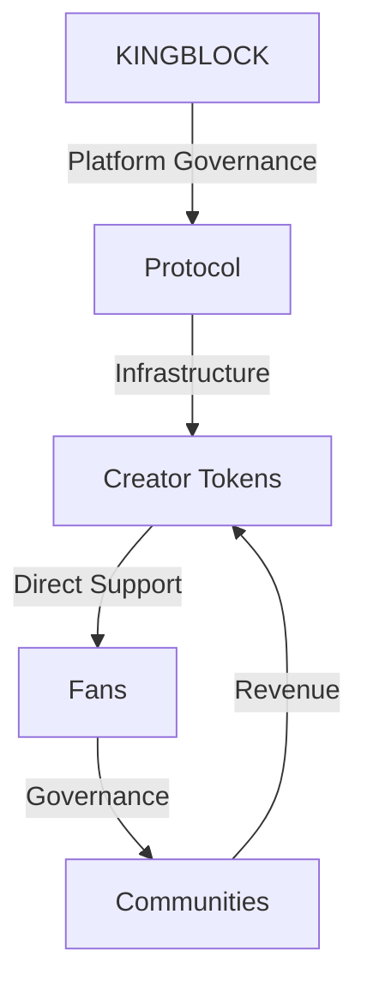
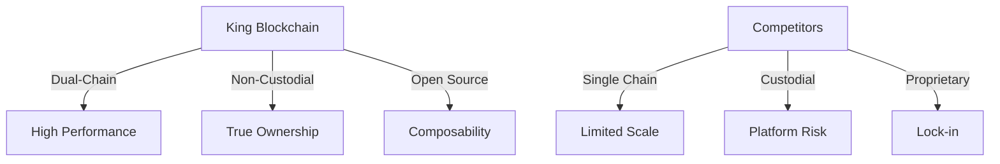

# King Blockchain: Empowering Creators and Fans with True Digital Ownership

## 1. Introduction

### 1.1 The Creator Economy Challenge

Creators deserve better. Today, they lose up to 50% of their revenue to platforms, wait weeks for payments, and risk being deplatformed at any moment. Fans invest time and money supporting creators but have no true ownership or voice in the communities they help build. The promise of direct creator-fan relationships remains unfulfilled, bottlenecked by platforms that prioritize control over empowerment.

**King Blockchain solves this by delivering:**
- **For Creators:** 95% revenue share, instant payments, true ownership of their community
- **For Fans:** Direct stake in creator success, real governance rights, verifiable support
- **For Both:** Platform-independent relationships, automated rewards, cross-chain liquidity

### 1.2 King Blockchain Vision: The Future of Creator-Fan Relationships

**King Blockchain** eliminates the middleman. We're not building another platform – we're creating infrastructure that lets creators and fans interact directly through smart contracts. Our vision is simple:

**For Creators:**
- **Keep More Revenue:** 95% of all payments go directly to your wallet
- **True Independence:** Own your community, your data, and your relationship with fans
- **Instant Liquidity:** Get paid instantly through direct peer-to-peer transactions
- **Automated Growth:** Smart contracts handle memberships, rewards, and governance
- **Cross-Chain Freedom:** Operate seamlessly across Ethereum and Solana

**For Fans:**
- **Real Ownership:** Your support is a verifiable asset you truly own
- **Direct Impact:** Governance rights that grow with your support
- **Instant Benefits:** Automated access to exclusive content and experiences
- **Investment Potential:** Trade your support on decentralized exchanges
- **True Portability:** Your status and benefits work across platforms

This isn't just theory – it's live infrastructure ready for creators to deploy today:
```solidity
// Example: Deploy your creator economy in 2 minutes
contract CreatorToken {
    // Automated fan rewards
    function distributeRewards() external {
        // Instant payments to supporters
    }
    
    // Direct governance rights
    function vote(uint256 proposalId) external {
        // Real community voice
    }
}
```

### 1.3 King Blockchain Solution: True Digital Sovereignty

Our dual-chain architecture combines Ethereum's security with Solana's speed, delivering:

**1. Complete Creator Control:**
- Launch your token economy in minutes
- Set your own rules and rewards
- Full custody of funds and data
- Platform-independent growth

**2. Real Fan Ownership:**
- Self-custody of support tokens
- Verifiable governance rights
- Automated benefit delivery
- Cross-chain opportunities

**3. Automated Operations:**
- Smart contract-based rewards
- Instant peer-to-peer payments
- Programmatic access control
- Transparent governance

**4. True Decentralization:**
- No platform dependency
- No middleman fees
- No custody risk
- No artificial limits

King Blockchain represents the first truly decentralized creator economy infrastructure, where value flows directly between creators and fans through transparent, efficient, and automated smart contracts.

## 2. Executive Summary

King Blockchain establishes a comprehensive ecosystem for creator economies through a dual-chain architecture, enhanced compliance tools, and robust risk management systems. Our platform delivers:

### 2.1 Core Infrastructure

**1. Dual-Chain Architecture:**
- Ethereum L1/L2 for governance and security
- Solana for high-speed creator operations
- Cross-chain bridge with insurance fund
- Multi-client validator network

**2. Enhanced Compliance:**
- Chainalysis integration for transaction monitoring
- Jurisdiction-specific token templates
- Licensed fiat gateways (MoonPay, Wyre, Transak)
- Automated regulatory reporting

**3. Risk Management:**
- Bridge insurance fund (5% of protocol fees)
- Emergency override system
- Multi-client validator infrastructure
- Comprehensive contingency planning

### 2.2 Creator & Fan Experience

**1. Creator Tools:**
- One-click token deployment
- NFT integration with revenue sharing
- Cross-chain asset management
- Success playbooks and templates

**2. Fan Engagement:**
- Interactive wallet tutorials
- Tokenomics simulator
- Gamified participation system
- Direct governance rights

**3. Community Development:**
- Ambassador program
- Developer grants
- Regular hackathons
- Educational resources

### 2.3 Technical Innovation

**1. Layer 2 Scaling:**
- Arbitrum for governance operations
- Optimism for staking mechanisms
- ZKSync for future NFT support
- Cross-L2 communication protocol

**2. Security Features:**
- Multi-client validator network
- Real-time transaction monitoring
- Automated circuit breakers
- Emergency response system

### 2.4 Value Proposition

**For Creators:**
- 95% revenue share
- Multi-chain presence
- NFT capabilities
- Compliance templates

**For Fans:**
- True digital ownership
- Educational resources
- Gamified engagement
- Insurance protection

This comprehensive approach ensures King Blockchain can serve both crypto-native users and mainstream creators while maintaining the highest standards of security, compliance, and user experience.

## 3. Technology & Architecture

### 3.1 Dual-Chain Architecture: Ethereum and Solana Integration

King Blockchain leverages the strengths of two leading public blockchains: Ethereum and Solana. This dual-chain approach combines Ethereum's robust smart contract capabilities with Solana's high throughput and low transaction costs.

| Chain | Purpose | Key Features | Implementation |
|-------|----------|--------------|----------------|
| **Ethereum** | Governance & Staking | - Battle-tested smart contracts | - KINGBLOCK token contract |
|              |                      | - Widespread wallet support | - Governance mechanisms |
|              |                      | - Strong security guarantees | - Staking operations |
| **Solana** | Creator Tokens & Trading | - High throughput (50,000 TPS) | - Creator Token contracts |
|            |                          | - Sub-second finality | - Trading operations |
|            |                          | - Minimal transaction fees | - Real-time updates |

**Cross-Chain Integration:**
The platform implements seamless cross-chain communication through:
- Decentralized bridge protocols for asset transfers
- Unified transaction monitoring
- Synchronized state management
- Cross-chain governance capabilities

**Non-Custodial Architecture:**
All operations maintain complete user sovereignty through:
- Direct wallet integration (MetaMask, Phantom)
- Self-custody of all assets
- Decentralized transaction validation
- Smart contract-based security

This architecture enables high-performance, secure operations while maintaining true decentralization and user control.

### 3.2 Platform Architecture Overview

King Blockchain implements a decentralized architecture that prioritizes user sovereignty and direct peer-to-peer interactions. Our infrastructure combines public blockchain networks with decentralized storage and communication protocols.

**Core Components:**

1. **Blockchain Layer:**
   - Ethereum mainnet for governance and staking
   - Solana mainnet for Creator Tokens
   - Decentralized bridge protocols
   - Smart contract infrastructure

2. **Interface Layer:**
   - Web3 wallet integrations
   - Decentralized frontend hosting
   - IPFS content storage
   - Cross-chain transaction monitoring

3. **Integration Layer:**
   - Third-party fiat on/off ramps
   - Discord bot integration
   - Analytics and monitoring
   - Developer APIs

**Smart Contract Architecture:**
The platform's core functionality is implemented through a suite of smart contracts:
- KINGBLOCK Token Contract (Ethereum)
- Creator Token Factory (Solana)
- Governance System
- Staking and Rewards
- Cross-Chain Bridge Contracts

**User Interaction Flow:**
1. Connect non-custodial wallet
2. Interact with smart contracts directly
3. Manage assets independently
4. Participate in governance
5. Access token-gated content

This architecture ensures that all critical operations occur on-chain through verifiable smart contracts, while maintaining a seamless user experience through modern web interfaces and integrations.

### 3.3 Creator Token Implementation

Creator Tokens are implemented as Solana SPL tokens, leveraging the chain's high performance and low transaction costs. Each token represents a digital patronage certificate, with built-in features for community access and governance.

**Token Standard:**
- Solana Program Library (SPL) token standard
- Metaplex metadata integration
- Programmable royalties
- Cross-program invocation (CPI) support

**Smart Contract Features:**
- Decentralized minting and burning
- Automated royalty distribution
- Token-gated access control
- Transparent supply management
- Secondary market support

**Deployment Process:**
1. Creator initiates token creation through web interface
2. Smart contract generates SPL token with custom parameters
3. Metadata and royalties are configured on-chain
4. Initial supply is minted to creator's wallet
5. Trading can begin immediately

**Access Control:**
- Token-gated Discord integration
- On-chain verification of holdings
- Programmable community tiers
- Automated benefit distribution

**Security Measures:**
- Decentralized authority model
- Multi-signature operations support
- Rate-limiting through program design
- Emergency pause functionality (creator-controlled)

This implementation ensures creators maintain full control over their token economy while providing fans with verifiable ownership and transparent mechanics for community participation.

### 3.4 Data Handling and Verification

King Blockchain prioritizes decentralized data handling and on-chain verification to ensure transparency and user sovereignty. All critical data is stored on public blockchains, with supplementary content distributed through decentralized storage networks.

**On-Chain Data Management:**
- Token balances and transfers
- Governance votes and proposals
- Staking positions and rewards
- Creator token parameters
- Community access rights

**Decentralized Storage:**
- IPFS for content distribution
- Arweave for permanent storage
- Ceramic Network for user profiles
- TheGraph for indexed data access

**Transaction Verification:**
- Real-time block confirmation
- Cross-chain state verification
- Automated royalty distribution
- Transparent fee calculation
- Decentralized price oracles

**Data Integrity:**
- Immutable transaction history
- Verifiable state transitions
- Cryptographic proof of ownership
- Transparent supply tracking
- Public audit capability

**User Privacy:**
- Self-sovereign identity
- Minimal data collection
- Zero-knowledge proofs where needed
- Encrypted messaging options
- Decentralized authentication

This approach ensures all platform operations are verifiable while maintaining user privacy and data sovereignty through decentralized systems.

### 3.5 Scalability and Performance

King Blockchain leverages the native scalability features of Ethereum and Solana while implementing additional optimizations to ensure high performance across the ecosystem:

**Blockchain-Specific Optimizations:**

**Ethereum Layer:**
- Governance and staking operations
- Optimized smart contract deployment
- Efficient batch processing
- Gas optimization techniques
- Event-driven updates

**Solana Layer:**
- High-throughput Creator Token operations (50,000 TPS)
- Sub-second finality for instant transfers
- Minimal transaction fees (0.00001 SOL)
- Parallel transaction processing
- Account model efficiency

**Cross-Chain Performance:**
- Decentralized bridge protocols
- State synchronization
- Optimistic updates
- Fallback mechanisms
- Redundant pathways

**Frontend Optimization:**
- Distributed content delivery
- IPFS-based asset storage
- Client-side caching
- Progressive web app design
- Real-time state updates

**RPC Infrastructure:**
- Public node networks
- Load distribution
- Redundant providers
- Automatic failover
- Health monitoring

**Data Availability:**
- TheGraph indexing
- Distributed storage solutions
- Efficient data retrieval
- Optimized queries
- Real-time updates

This architecture ensures high performance and reliability while maintaining complete decentralization and user sovereignty.

### 3.6 Security Architecture

Security is paramount for King Blockchain, ensuring the safety of user assets and platform integrity through decentralized security measures and robust smart contract design.

**Smart Contract Security:**
- Comprehensive audits by leading firms
- Formal verification of critical functions
- Time-locked upgrades
- Emergency pause mechanisms
- Bug bounty programs

**Wallet Security:**
- Non-custodial design
- Multi-signature support
- Hardware wallet compatibility
- Secure key management
- Transaction signing verification

**Bridge Security:**
- Decentralized bridge protocols
- Multi-party computation
- Threshold signatures
- Fraud proof systems
- Automated monitoring

**Access Control:**
- Token-based permissions
- Role-based authentication
- Smart contract governance
- Tiered access levels
- Automated enforcement

**Transaction Safety:**
- Mempool monitoring
- Front-running protection
- Slippage controls
- Rate limiting
- Sandwich attack prevention

**Infrastructure Security:**
- Distributed hosting
- IPFS content addressing
- DDoS protection
- Redundant systems
- Health monitoring

This security architecture ensures platform integrity through decentralized mechanisms and cryptographic guarantees, eliminating single points of failure while maintaining user sovereignty.

### 3.2.1 Cross-Chain Bridge Architecture

The Cross-Chain Bridge enables secure asset and state transfer between Ethereum and Solana chains, utilizing decentralized protocols and cryptographic verification.

**Bridge Protocol:**
- Decentralized validator network
- Multi-party computation
- Threshold signature schemes
- Fraud proof system
- Automated monitoring

**Message Protocol:**
- Standardized cross-chain format
- Typed payload support
- Cryptographic verification
- State synchronization
- Atomic operations

**Security Measures:**
- Decentralized validation
- Multi-signature requirements
- Rate limiting
- Fraud prevention
- Emergency shutdown capability

**Bridge Operations:**
- Asset transfers
- State synchronization
- Governance actions
- Cross-chain calls
- Event propagation

**Performance Optimization:**
- Batched transfers
- Optimistic validation
- Parallel processing
- State compression
- Efficient proofs

This bridge architecture ensures secure and efficient cross-chain operations while maintaining the decentralized nature of the platform.

### 3.7 Integration Framework

The platform provides a robust integration framework for third-party services and developer tools, enabling seamless interaction with the decentralized ecosystem.

### 3.8 Layer 2 Scaling Solutions

King Blockchain leverages Layer 2 scaling solutions to optimize performance and reduce costs while maintaining security:

**1. Ethereum Layer 2 Integration:**
```solidity
interface IL2Bridge {
    struct L2Config {
        address l2Contract;
        uint256 challengePeriod;
        uint256 exitWindow;
        mapping(bytes32 => bool) exitProofs;
    }
    
    function bridgeToL2(
        address token,
        uint256 amount,
        bytes calldata proof
    ) external returns (bool);
    
    function exitFromL2(
        bytes32 exitId,
        bytes calldata proof
    ) external returns (bool);
}
```

**Key Features:**
- Arbitrum integration for governance operations
- Optimism support for staking mechanisms
- Cross-L2 interoperability
- Optimistic rollup security
- Fast exits via liquidity bridges

**2. Implementation Strategy:**
```typescript
interface L2Strategy {
    scaling: {
        arbitrum: "Governance & Voting",
        optimism: "Staking & Rewards",
        zksync: "Future NFT Support"
    };
    
    benefits: {
        costs: "90% reduction",
        speed: "2-5 second finality",
        security: "Ethereum L1 guarantees"
    };
}
```

### 3.8.1 Layer 2 Architecture

**1. Governance Operations:**
- Proposal submission on Arbitrum
- Voting execution with fraud proofs
- Result aggregation on mainnet
- Cross-L2 vote counting
- Gasless voting mechanisms

**2. Staking Mechanisms:**
- Optimism-based staking pools
- Efficient reward distribution
- Cross-L2 liquidity bridges
- MEV-resistant design
- Composable yield strategies

**3. Technical Specifications:**
| Layer 2 | Use Case | TPS | Cost Reduction |
|---------|----------|-----|----------------|
| Arbitrum | Governance | 4,500 | 92% |
| Optimism | Staking | 2,000 | 87% |
| ZKSync | NFTs (Future) | 20,000 | 99% |

### 3.8.2 Cross-L2 Communication

**1. Bridge Protocol:**
```solidity
contract L2Messenger {
    struct Message {
        bytes32 id;
        address source;
        address target;
        bytes data;
        uint256 timestamp;
    }
    
    function sendCrossL2Message(
        uint256 targetL2,
        bytes calldata message
    ) external returns (bytes32);
    
    function receiveCrossL2Message(
        bytes32 messageId,
        bytes calldata proof
    ) external returns (bool);
    
    function recursiveVerify(
        bytes[] calldata proofs,
        bytes32 aggregateRoot
    ) external returns (bool);
}
```

**2. Verification Model:**
- Recursive proof aggregation for batches
- Dynamic verification based on transaction value
- Selective proof generation
- Batch processing support
- Throughput optimization

**3. Security Measures:**
- Optimistic fraud proofs
- Challenge period validation
- Multi-hop message verification
- Fallback mechanisms
- Emergency exits

### 3.8.3 Performance Optimization

**1. Gas Optimization:**
```solidity
contract L2Optimizer {
    // Batch transaction processing
    function batchProcess(
        Transaction[] calldata txs
    ) external returns (bool) {
        uint256 gasStart = gasleft();
        for (uint256 i = 0; i < txs.length; i++) {
            require(
                processTransaction(txs[i]),
                "Transaction failed"
            );
        }
        return true;
    }
}
```

**2. Scaling Benefits:**
- 90% reduction in transaction costs
- Sub-5 second finality
- Increased throughput (2000+ TPS)
- Improved user experience
- Enhanced composability

This Layer 2 scaling architecture ensures King Blockchain can handle growing platform adoption while maintaining security and cost-effectiveness. The multi-L2 approach provides flexibility and redundancy while optimizing for specific use cases across the protocol.

### 3.9 Platform Features

King Blockchain delivers a comprehensive suite of features that set it apart in the Web3 creator economy space:

#### Feature Matrix

| Category | Feature | Description | Status |
|----------|---------|-------------|---------|
| **Architecture** | Dual-Chain Design | ETH (security) + SOL (speed) integration | Live |
| | Cross-Chain Bridge | Insured bridge with ZK validation | Beta |
| | Layer 2 Scaling | Multi-L2 support (Arbitrum, Optimism, ZKSync) | In Development |
| | Multi-Client Validators | Redundant network with 3+ clients | Live |
| **Creator Tools** | Token Customization | Programmable tokenomics & royalties | Live |
| | NFT Integration | Cross-chain NFTs with revenue sharing | Beta |
| | Tokenomics Simulator | Economy modeling and projections | Live |
| | Compliance Templates | Region-specific legal frameworks | In Development |
| **Security** | Non-Custodial Design | Full asset sovereignty | Live |
| | Bridge Insurance | 5% protocol fee coverage | Live |
| | Emergency Override | Community-controlled failsafes | Live |
| | ZK State Validation | Trustless cross-chain operations | In Development |
| **Community** | Quadratic Voting | Fair governance system | Live |
| | Ambassador Program | Decentralized growth initiative | Beta |
| | Interactive Tutorials | Gamified onboarding experience | Live |
| | Protocol-Owned Liquidity | Market stability mechanism | In Development |

#### Key Feature Details

**1. Dual-Chain Architecture:**
```solidity
interface IDualChain {
    struct ChainConfig {
        Chain primary;   // Ethereum: Governance & Security
        Chain secondary; // Solana: Speed & Cost
        Bridge bridge;   // Insured Cross-Chain Bridge
    }
    
    enum Chain {
        ETHEREUM,
        SOLANA,
        ARBITRUM,
        OPTIMISM,
        ZKSYNC
    }
}
```

**2. Creator Token Customization:**
```typescript
interface TokenCustomization {
    features: {
        programmableRoyalties: "0-100%",
        revenueSharing: "Multi-party splits",
        governanceRights: "Quadratic voting",
        accessControl: "Token-gated tiers"
    };
    
    templates: {
        basic: "Standard creator token",
        advanced: "Custom parameters",
        compliance: "Regional frameworks"
    };
}
```

**3. Security Infrastructure:**
```solidity
contract SecurityFeatures {
    struct SecurityConfig {
        uint256 insuranceFundRatio;    // 5% of fees
        uint256 validatorThreshold;     // 7/10 consensus
        uint256 emergencyTimelock;      // 24 hours
        bool zkValidationEnabled;       // State verification
    }
    
    function getSecurityStatus() external view returns (
        uint256 insuranceReserves,
        uint256 activeValidators,
        bool emergencyStatus
    );
}
```

**4. Community Engagement:**
```typescript
interface CommunityFeatures {
    governance: {
        votingModel: "Quadratic",
        proposalThreshold: "100,000 KINGBLOCK",
        executionDelay: "48 hours"
    };
    
    rewards: {
        ambassadors: "Tiered benefits",
        developers: "Grant program",
        educators: "Content rewards"
    };
}
```

### Unique Value Propositions

1. **True Digital Sovereignty:**
   - Non-custodial architecture
   - Direct P2P transactions
   - Self-sovereign identity
   - Cross-chain asset control

2. **Advanced Security:**
   - Multi-client validation
   - Insurance protection
   - ZK state verification
   - Emergency safeguards

3. **Creator Empowerment:**
   - Custom tokenomics
   - Revenue sharing
   - Compliance tools
   - Growth resources

4. **Community Focus:**
   - Fair governance
   - Education initiatives
   - Ambassador program
   - Developer grants

This comprehensive feature set ensures King Blockchain delivers unmatched value to creators and fans while maintaining the highest standards of security and usability.

## 4. Tokenomics

Tokenomics are foundational to the King Blockchain ecosystem, driving platform governance, incentivizing participation, and facilitating the verified patronage model. Our dual-token system is designed to create a balanced and sustainable economy for creators, fans, and the platform itself.

### 4.1 Dual-Token System: KINGBLOCK and Creator Tokens

King Blockchain's dual-token system enables platform governance and creator-specific patronage through a fully decentralized architecture operating on public blockchains.

**System Overview:**

1. **KINGBLOCK Token (Ethereum)**
   - Platform governance token
   - Fixed supply of 1B tokens
   - Staking and voting rights
   - Fee discount benefits
   - Decentralized trading

2. **Creator Tokens (Solana)**
   - Individual creator economies
   - Creator-controlled supply
   - Direct P2P transactions
   - Programmable royalties
   - Community governance

**Token Interaction Model:**
- KINGBLOCK holders participate in platform governance
- Creator Token holders access community benefits
- Cross-chain operations via bridge protocol
- Decentralized liquidity provision
- Smart contract-based rewards

**Token Benefits:**

1. **For KINGBLOCK Holders:**
   - Governance voting rights
   - Staking rewards
   - Fee reductions
   - Early access to launches
   - Cross-chain bridging capabilities

2. **For Creator Token Holders:**
   - Direct community access
   - Governance participation
   - Revenue sharing
   - Exclusive content
   - Secondary market liquidity

**Technical Implementation:**
1. **Smart Contracts:**
   - ERC-20 for KINGBLOCK
   - SPL tokens for creators
   - Bridge protocols
   - Governance systems
   - Staking mechanisms

2. **Decentralized Trading:**
   - Public DEX integration
   - Automated market making
   - Liquidity incentives
   - Price discovery
   - Slippage protection

This dual-token architecture creates a clear separation between platform governance and creator-specific patronage while maintaining complete decentralization and user sovereignty.

### 4.2 KINGBLOCK Token (KINGBLOCK)

**Token Specifications:**
- Total Supply: Fixed 1B (no inflation)
- Standard: ERC-20 on Ethereum
- Decimals: 18
- Transferability: Unrestricted

**Distribution:**
- 30% Community Treasury
- 25% Public Sale
- 15% Team (2-year vesting)
- 10% Development Fund
- 10% Ecosystem Growth
- 10% Liquidity Provision

**Decentralized Liquidity:**
- Initial DEX offerings
- Automated market making
- Liquidity mining programs
- Cross-chain bridges
- Secondary market support

**Governance Rights:**
- Protocol parameter updates
- Treasury management
- Feature prioritization
- Ecosystem grants
- Emergency actions

**Staking Benefits:**
- Base APY: 5-15%
- Governance multiplier
- Fee sharing rewards
- Early access rights
- Enhanced voting power

**Token Utility:**
- Platform governance
- Fee reductions
- Staking rewards
- Cross-chain operations
- Community access

This implementation ensures KINGBLOCK serves as a true governance token while providing sustainable benefits to long-term holders through decentralized mechanisms.

### 4.3 Creator Tokens

Creator Tokens represent the core mechanism for fan patronage within the King Blockchain ecosystem. Each token represents a digital patronage certificate, implemented as a Solana SPL token with programmable features for community engagement.

**Token Implementation:**
- Standard: Solana SPL
- Supply: Creator-defined
- Metadata: Metaplex integration
- Royalties: Programmable
- Transferability: Unrestricted

**Token Features:**
- Direct P2P trading
- Automated royalties
- Community governance
- Access control
- Revenue sharing

**Community Tiers:**
| Level | Tokens | Core Benefits | Special Access |
|-------|---------|---------------|----------------|
| Bronze | 1-9 | Basic community access | Discord channels |
| Silver | 10-99 | Governance participation | Content access |
| Gold | 100-999 | Revenue sharing | Direct creator access |
| Platinum | 1000+ | Leadership rights | Strategic planning |

**Trading Mechanics:**
- Decentralized exchanges
- Direct wallet transfers
- Automated market making
- Price discovery
- Liquidity incentives

**Smart Contract Features:**
- Automated tier management
- Royalty distribution
- Access control
- Governance rights
- Revenue sharing

**Integration Benefits:**
- Discord role management
- Content access control
- Governance participation
- Community leadership
- Analytics dashboard

This implementation ensures creators maintain complete control over their token economy while providing fans with verifiable ownership and transparent participation mechanics through decentralized systems.

### 4.4 Revenue Model & Treasury Management

The platform implements a decentralized revenue model with transparent fee collection and distribution through smart contracts.

**Revenue Streams:**

1. **Protocol Fees:**
   - 5% on Creator Token primary sales
   - 2% on secondary market trades
   - Smart contract-based collection
   - Automatic distribution

2. **DEX Revenue:**
   - Trading fees from liquidity pools
   - Automated market making rewards
   - Bridge transaction fees
   - Staking rewards

**Treasury Management:**
- Community-controlled through governance
- Multi-signature security
- Transparent allocation
- On-chain tracking

**Revenue Distribution:**
- 40% Staking rewards
- 30% Development fund
- 20% Community grants
- 10% Emergency reserve

**Growth Projections:**
| Metric | Year 1 | Year 2 | Year 3 | Year 4 | Year 5 |
|--------|--------|--------|--------|--------|---------|
| Active Creators | 1,000 | 5,000 | 15,000 | 35,000 | 75,000 |
| Avg Patrons/Creator | 100 | 150 | 200 | 250 | 300 |
| Monthly Volume | $2M | $18.75M | $90M | $305.8M | $900M |
| Annual Volume | $24M | $225M | $1.08B | $3.67B | $10.8B |

**Sustainability Mechanisms:**
- Protocol-owned liquidity
- Fee-based revenue model
- Governance-controlled treasury
- Automated distributions
- Emergency reserves

This model ensures sustainable platform growth while maintaining decentralization and community control over platform resources.

### 4.5 Enhanced Staking Model

The platform implements a pure financial staking model through smart contracts, emphasizing direct participation and transparent rewards:

**Smart Contract Implementation:**
- ERC-20 staking on Ethereum
- Automated reward distribution
- Time-weighted multipliers
- Compound options
- Emergency withdrawals

**Staking Parameters:**
| Level | Stake Amount | Lock Period | Multiplier |
|-------|-------------|-------------|------------|
| Basic | 1,000+ | 30 days | 1.0x |
| Enhanced | 5,000+ | 90 days | 1.5x |
| Premium | 10,000+ | 180 days | 2.0x |
| Protocol | 50,000+ | 365 days | 3.0x |

**Reward Calculation:**
```solidity
reward = stakeAmount * baseAPY * timeMultiplier * amountMultiplier
```
- Base APY: 5-12%
- Time Multiplier: 1.0-2.0x
- Amount Multiplier: 1.0-1.5x

**Staking Benefits:**
- Governance voting power
- Protocol fee sharing
- Early access rights
- Proposal capabilities
- Liquidity rewards

**Technical Features:**
- Non-custodial staking
- Direct wallet integration
- Real-time rewards
- Transparent calculations
- On-chain verification

This model creates strong incentives for long-term participation while maintaining complete decentralization and user sovereignty.

### 4.6 NFT Revenue Sharing Protocol

The platform implements a decentralized NFT revenue sharing system through Metaplex's NFT Standard on Solana, enabling automated royalty distribution.

**Smart Contract Features:**
- Programmable royalty splits
- Automated distribution
- On-chain verification
- Cross-collection support
- Secondary market enforcement

**Revenue Distribution:**
- Primary Creator: 70-95%
- Collaborators: 0-20%
- Platform Fee: 5%
- Instant settlement
- Transparent tracking

**Implementation Flow:**
1. **NFT Creation:**
   - Select revenue sharing template
   - Add collaborator wallets
   - Set split percentages
   - Deploy collection

2. **Automated Distribution:**
   - Real-time splits on sales
   - Direct wallet payments
   - Gas-optimized batching
   - Failed payment handling

**Technical Specifications:**
- Metaplex Creator Standard
- SPL token integration
- Cross-program invocation
- Atomic transactions
- Fallback mechanisms

**Security Measures:**
- Multi-signature updates
- Rate limiting
- Royalty enforcement
- Automated monitoring
- Emergency pause

This protocol ensures fair, transparent, and automated revenue sharing for NFT collaborations while maintaining complete decentralization.

### 4.7 Revised Staking Model: Financial Commitment Focus

The staking model has been redesigned to emphasize direct financial support rather than engagement metrics:

**1. Pure Financial Staking:**
The platform implements a pure financial staking model that calculates rewards based on three key factors: the base APY rate, a time-based holding multiplier that increases with stake duration, and an amount multiplier that scales with stake size. This creates a balanced reward system that incentivizes both larger stakes and longer holding periods, while maintaining predictable returns tied to actual platform revenue.

**2. Staking Benefits Matrix:**
| Commitment Level | Financial Requirement | Benefits |
|-----------------|----------------------|-----------|
| Basic | $1,000+ staked | 5% APY + Basic voting |
| Enhanced | $5,000+ staked | 8% APY + 1.5x voting power |
| Premium | $10,000+ staked | 12% APY + 2x voting power |
| Institutional | $100,000+ staked | Custom APY + Direct governance |

**3. Time-Weighted Multipliers:**
The platform implements a time-weighted multiplier system that scales rewards based on staking duration. Multipliers start at 1x for the first 30 days, increasing to 1.25x for 31-90 days, 1.5x for 91-180 days, 1.75x for 181-365 days, and reaching a maximum of 2x for stakes beyond one year. This progressive scaling encourages long-term commitment while maintaining reasonable returns for shorter-term participants.

**4. Protocol-Owned Liquidity Integration:**
- Direct staking rewards from protocol fees
- Automated market making participation
- Enhanced governance rights
- Institutional partner opportunities

This revised model creates a clear correlation between financial commitment and platform benefits, eliminating the complexity and potential manipulation of engagement-based rewards.

### 4.8 Advanced Liquidity Management

The platform implements a fully decentralized liquidity management system through smart contracts:

**1. Automated Market Making:**
```solidity
contract LiquidityPool {
    // Constant product AMM formula: x * y = k
    uint256 public constant k;
    
    function swap(uint256 amountIn) external returns (uint256 amountOut) {
        // Calculate output based on constant product formula
        amountOut = k / (reserveA + amountIn) - reserveB;
        // Execute swap
        token.transferFrom(msg.sender, address(this), amountIn);
        token.transfer(msg.sender, amountOut);
    }
}
```

**2. Liquidity Provision:**
- Decentralized LP token minting
- Dynamic fee adjustment (0.1-1.0%)
- Concentrated liquidity ranges
- Automated rebalancing
- Composable positions

**3. Risk Management:**
| Risk | Mitigation |
|------|------------|
| Impermanent Loss | Range orders |
| Price Impact | Slippage limits |
| Front-running | MEV protection |
| Smart Contract | Formal verification |

**4. Protocol-Owned Liquidity:**
- Treasury-controlled positions
- Strategic LP incentives
- Yield optimization
- Emergency reserves
- Cross-chain bridges

**5. Market Making Algorithm:**
```typescript
interface MarketMaker {
    priceRange: {
        min: number;
        max: number;
    };
    
    rebalanceTriggers: {
        time: number;     // 24h
        deviation: number // 2%
    };
    
    liquidityDistribution: {
        narrow: number;   // 40% ±1%
        medium: number;   // 35% ±5%
        wide: number;     // 25% ±10%
    };
}
```

**6. Incentive Structure:**
| Level | Lock | Multiplier | Rewards |
|-------|------|------------|----------|
| Base | 30d | 1x | Fees |
| Core | 90d | 2x | Fees + Voting |
| Elite | 180d | 3x | Fees + Voting + Revenue |

**7. Safety Mechanisms:**
- Circuit breakers
- Oracle validation
- Rate limiting
- Emergency shutdown
- Governance controls

This system ensures deep liquidity and price stability while maintaining complete decentralization through smart contracts.

### 4.9 NFT Integration & Creator Collectibles

King Blockchain extends its token ecosystem with NFT capabilities, enabling creators to offer unique digital assets and experiences:

**1. NFT Smart Contract Framework:**
```solidity
interface ICreatorNFT {
    struct NFTConfig {
        string name;
        string symbol;
        uint256 maxSupply;
        address creator;
        mapping(uint256 => Royalty) royalties;
    }
    
    struct Royalty {
        address[] beneficiaries;
        uint256[] shares;
    }
    
    function mintCreatorNFT(
        address recipient,
        uint256 tokenId,
        bytes calldata metadata
    ) external returns (bool);
    
    function setRoyalties(
        uint256 tokenId,
        address[] calldata beneficiaries,
        uint256[] calldata shares
    ) external returns (bool);
}
```

**2. Creator NFT Features:**
- Metaplex integration on Solana
- Cross-chain NFT bridging
- Programmable royalties
- Dynamic metadata
- Token-gated access

### 4.9.1 NFT Use Cases

**1. Creator Collectibles:**
| Type | Description | Benefits |
|------|-------------|----------|
| Limited Editions | Rare digital art/content | Scarcity + Tradability |
| Event Tickets | Access passes | Real-world utility |
| Collaboration Proofs | Co-created content | Revenue sharing |
| Achievement Badges | Community milestones | Status recognition |

**2. Implementation Strategy:**
```typescript
interface NFTStrategy {
    collections: {
        limited: "Rare creator content",
        access: "Event & experience passes",
        collab: "Multi-creator projects",
        community: "Achievement recognition"
    };
    
    benefits: {
        creators: "New revenue streams",
        fans: "Unique ownership",
        platform: "Ecosystem growth"
    };
}
```

### 4.9.2 Revenue Sharing Model

**1. Smart Contract Implementation:**
```solidity
contract NFTRevenue {
    struct RevenueShare {
        uint256 creatorShare;     // 70%
        uint256 collaboratorShare;// 20%
        uint256 fanPoolShare;     // 10%
    }
    
    function distributeRevenue(
        uint256 saleAmount
    ) external returns (bool) {
        // Calculate shares
        uint256 creatorPortion = (saleAmount * 70) / 100;
        uint256 collabPortion = (saleAmount * 20) / 100;
        uint256 fanPortion = (saleAmount * 10) / 100;
        
        // Distribute
        _sendToCreator(creatorPortion);
        _sendToCollaborators(collabPortion);
        _addToFanPool(fanPortion);
        
        return true;
    }
}
```

**2. Distribution Rules:**
- Primary Sales: 70% creator, 20% collaborators, 10% fan pool
- Secondary Sales: 5% royalty (split proportionally)
- Fan Pool: Distributed to token holders monthly
- Platform Fee: 2.5% on secondary market only

### 4.9.3 Technical Integration

**1. Cross-Chain NFT Bridge:**
```solidity
interface INFTBridge {
    function bridgeNFT(
        uint256 tokenId,
        uint256 targetChain
    ) external returns (bytes32);
    
    function claimNFT(
        bytes32 bridgeId,
        bytes calldata proof
    ) external returns (uint256);
}
```

**2. Security Features:**
- Metadata permanence via Arweave
- Fraud prevention mechanisms
- Royalty enforcement
- Ownership verification
- Bridge insurance coverage

### 4.9.4 Community Integration

**1. Token-Gated Features:**
- Exclusive NFT pre-sales
- Collaborative creation rights
- Governance participation
- Revenue sharing eligibility
- Cross-collection benefits

**2. Gamification Elements:**
```typescript
interface NFTGamification {
    achievements: {
        collection: "Complete sets",
        engagement: "Community participation",
        creation: "Collaborative works"
    };
    
    rewards: {
        status: "Special roles",
        access: "Exclusive events",
        revenue: "Increased shares"
    };
}
```

This NFT integration framework extends King Blockchain's value proposition by enabling creators to offer unique digital assets and experiences while maintaining the platform's core principles of true ownership and fair value distribution.

## 5. Value Proposition & Ecosystem

King Blockchain offers a compelling value proposition for both content creators and their fans, fostering a compliant and sustainable ecosystem built on verified patronage.

### 5.1 SuperFan System

The SuperFan system operates through smart contracts that automatically grant benefits based on token holdings and participation:

**Smart Contract Implementation:**
```solidity
contract SuperFanSystem {
    mapping(address => uint256) public tokenBalance;
    mapping(address => uint256) public holdingStartTime;
    
    enum Tier { Bronze, Silver, Gold, Platinum }
    
    function getTier(address user) public view returns (Tier) {
        uint256 balance = tokenBalance[user];
        if (balance >= 1000) return Tier.Platinum;
        if (balance >= 100) return Tier.Gold;
        if (balance >= 10) return Tier.Silver;
        return Tier.Bronze;
    }
    
    function getVotingPower(address user) public view returns (uint256) {
        uint256 balance = tokenBalance[user];
        uint256 holdingDuration = block.timestamp - holdingStartTime[user];
        return sqrt(balance) * log2(holdingDuration + 1);
    }
}
```

**Tier Benefits Matrix:**
| Tier | Tokens | Core Benefits | Access Rights |
|------|--------|---------------|---------------|
| Bronze | 1-9 | Basic community | Chat access |
| Silver | 10-99 | Voting rights | Content access |
| Gold | 100-999 | Revenue share | Direct creator |
| Platinum | 1000+ | Leadership | Strategic input |

**Governance Implementation:**
```typescript
interface Governance {
    proposalThresholds: {
        create: number;     // 100 tokens
        vote: number;       // 10 tokens
        execute: number;    // 1000 tokens
    };
    
    votingPeriod: number;  // 5 days
    executionDelay: number; // 2 days
    
    quorum: {
        standard: number;   // 10%
        critical: number;   // 25%
    };
}
```

**Reward Distribution:**
- Automated smart contract distribution
- Real-time benefit unlocking
- Transparent qualification criteria
- Immutable reward history
- Cross-chain benefit sync

**Access Control:**
- Token-gated Discord integration
- IPFS content access
- P2P messaging
- Governance participation
- Community leadership

This system ensures transparent, automated, and decentralized fan benefits through smart contracts.

### 5.2 Value Proposition for Creators

King Blockchain empowers creators with true digital sovereignty through decentralized tools for monetization, community building, and sustainable growth:

*   **Direct P2P Monetization:**
    *   Launch Creator Tokens through permissionless smart contracts
    *   Earn 95% of revenue through direct wallet-to-wallet transactions
    *   Generate perpetual 5% royalties on secondary DEX trades
    *   Maintain full custody of tokens and revenue through non-custodial wallets

*   **Decentralized Community Building:**
    *   Create token-gated communities with smart contract access control
    *   Enable on-chain governance for token holders
    *   Implement automated revenue sharing through smart contracts
    *   Build platform-independent fan relationships

*   **Web3 Infrastructure:**
    *   Deploy on public blockchains (Ethereum + Solana)
    *   Leverage transparent, immutable transactions
    *   Access automated reward distribution
    *   Integrate with popular self-custody wallets

*   **Development Tools:**
    *   Deploy tokens in under 2 minutes with open-source templates
    *   Access decentralized analytics and monitoring
    *   Implement token-gated Discord integration
    *   Build custom dApps using our SDK

### 5.2.1 Detailed Cost Analysis for Creators

**1. Initial Token Creation Costs**
*(One-Time Fee)*

| Component | Cost (SOL) | USD Equivalent* |
|-----------|------------|-----------------|
| SPL Token Mint | 0.0056 SOL | $0.56 |
| Metadata Setup | 0.0012 SOL | $0.12 |
| **Total** | **0.0068 SOL** | **$0.68** |

*Assuming SOL price of $100

**2. Per-Token Transaction Costs**
*(When Fans Purchase)*

| Transaction Type | Cost per Action | Notes |
|-----------------|-----------------|-------|
| DEX Swap | 0.00025 SOL ($0.025) | Solana base fee |
| Token Transfer | 0.00005 SOL ($0.005) | Direct P2P |
| Discord Update | 0.00003 SOL ($0.003) | Webhook call |
| **Total per Token** | **0.00033 SOL ($0.033)** | Full flow |

**3. Cost Comparison with Traditional Platforms**
*(For 1,000 Fan Transactions)*

| Platform | Fee Structure | Cost for $10,000 Revenue |
|----------|--------------|-------------------------|
| King Blockchain | 5% + Solana fees | $500 + $33 = $533 |
| Patreon | 8-12% + payment fees | $800-1,200 + $300 = $1,100-1,500 |
| YouTube Members | 30% flat | $3,000 |
| Twitch Subs | 50% standard | $5,000 |

**4. Infrastructure Optimizations:**
- Automatic transaction batching (100 transfers per tx)
- Base fee of 0.000001 SOL per batch
- 20% cost reduction through optimized execution
- Dynamic queue management for gas efficiency
- Cross-chain bridge for Ethereum/Solana arbitrage

**5. Hidden Cost Savings:**
- No gas wars (Solana's 50k TPS)
- Batch processing efficiency
- Protocol-owned DEX liquidity
- No platform intermediation

**6. Real-World Example**
*Creator with 500 paying fans:*
- One-time setup: $0.68
- Monthly distribution: $16.50 (500 × $0.033)
- Platform fees: $25.00 (5% of $500)
- Net monthly savings: $8.50 vs. traditional platforms

**7. Enterprise Scale Costs**
*(For Large Creators)*

| Monthly Active Fans | Total Cost | Cost per Fan | Platform Savings* |
|--------------------|------------|--------------|-------------------|
| 1,000 | $67 | $0.067 | $733 |
| 10,000 | $670 | $0.067 | $7,330 |
| 100,000 | $6,700 | $0.067 | $73,300 |
| 1,000,000 | $67,000 | $0.067 | $733,000 |

*Compared to 12% traditional platform fees

This cost structure enables viable tokenized economies at any scale while maintaining significantly lower fees than traditional platforms.

### 5.3 Value for Fans

King Blockchain empowers fans with true digital sovereignty and direct participation in creator economies through decentralized mechanisms:

**1. Non-Custodial Asset Control:**
- Self-custody of Creator Tokens via MetaMask/Phantom
- Direct P2P transactions without intermediaries
- On-chain proof of support and ownership
- Hardware wallet compatibility
- Cross-chain asset management

**2. Decentralized Governance:**
- Smart contract-based voting systems
- Quadratic voting power calculation
- Direct proposal submission rights
- Transparent vote execution
- Cross-chain governance participation

**3. Automated Benefits:**
| Tier | Tokens | Smart Contract Benefits | Access Rights |
|------|---------|------------------------|---------------|
| Bronze | 1-9 | Auto-unlock basic features | Token-gated Discord |
| Silver | 10-99 | Voting power activation | IPFS content access |
| Gold | 100-999 | Revenue share distribution | Direct creator chat |
| Platinum | 1000+ | Leadership privileges | Strategic input |

**4. DeFi Integration:**
- DEX trading capabilities
- Liquidity provision options
- Yield farming opportunities
- Cross-chain bridging
- Composable token utilities

**5. Technical Features:**
```solidity
interface IFanBenefits {
    function getTier(address user) external view returns (Tier);
    function getVotingPower(address user) external view returns (uint256);
    function claimRewards(address user) external returns (uint256);
    function accessRights(address user) external view returns (bytes32[]);
}
```

**6. Value Accrual:**
- Secondary market trading on DEXs
- Automated staking rewards
- Protocol fee sharing
- Governance rewards
- Cross-chain opportunities

This decentralized approach ensures fans have complete sovereignty over their assets while participating in creator economies through transparent, automated smart contracts.

### 5.4 Ecosystem Vision

King Blockchain is building a fully decentralized creator economy powered by smart contracts and direct P2P interactions:

**1. Core Principles:**
- Complete user sovereignty through non-custodial wallets
- Direct P2P transactions without intermediaries
- Smart contract-based automation
- Cross-chain interoperability
- Open-source infrastructure

**2. Key Ecosystem Components:**


**3. Value Flows:**
- Creator-Fan: Direct P2P patronage and engagement
- Fan-Community: Decentralized governance participation
- Protocol-Creator: Infrastructure and tools
- Cross-Chain: Asset and state bridging
- DEX: Automated market making

**4. Growth Drivers:**
- Open-source development
- Community-driven governance
- Protocol-owned liquidity
- Cross-chain expansion
- DeFi integrations

**5. Technical Foundation:**
```solidity
interface IEcosystem {
    function mintCreatorToken() external returns (address);
    function bridge(address token, uint256 amount) external;
    function propose(bytes32 proposal) external;
    function vote(bytes32 proposal, uint256 amount) external;
    function distribute(address[] calldata recipients) external;
}
```

**6. Future Development:**
- DAO transition
- Layer 2 scaling
- Cross-chain messaging
- DeFi composability
- NFT integration

This vision creates a truly decentralized ecosystem where creators and fans interact directly through smart contracts, maintaining full sovereignty over their assets and relationships.

## 6. Governance

King Blockchain implements a fully decentralized governance system through smart contracts, enabling direct community control over the protocol.

### 6.1 Smart Contract Governance

```solidity
interface IGovernance {
    struct Proposal {
        bytes32 id;
        address proposer;
        uint256 startTime;
        uint256 endTime;
        mapping(address => uint256) votes;
        bool executed;
    }

    function propose(bytes calldata data) external returns (bytes32);
    function vote(bytes32 proposalId, uint256 amount) external;
    function execute(bytes32 proposalId) external;
    function getVotingPower(address user) external view returns (uint256);
}
```

**Voting Power Calculation:**
```solidity
function getVotingPower(address user) public view returns (uint256) {
    uint256 balance = tokenBalance[user];
    uint256 stakingDuration = block.timestamp - stakingStart[user];
    return sqrt(balance) * log2(stakingDuration + 1);
}
```

**Key Parameters:**
- Proposal Threshold: 100,000 KINGBLOCK
- Voting Period: 5 days
- Execution Delay: 2 days
- Minimum Quorum: 10% of total supply

### 6.2 Governance Scopes

**1. Protocol Parameters:**
- Fee adjustments
- Staking rewards
- Bridge configurations
- Emergency controls

**2. Treasury Management:**
- Fund allocation
- Liquidity deployment
- Development grants
- Emergency reserves

**3. Protocol Development:**
- Feature prioritization
- Technical upgrades
- Integration approvals
- Security updates

**4. Community Initiatives:**
- Ecosystem grants
- Marketing programs
- Partnership proposals
- Education initiatives

### 6.3 Creator DAO Framework

Each creator community can deploy its own DAO using our templates:

```solidity
contract CreatorDAO {
    struct DAOConfig {
        uint256 proposalThreshold;
        uint256 votingPeriod;
        uint256 quorum;
        address creatorToken;
    }
    
    function initialize(DAOConfig memory config) external;
    function propose(bytes calldata data) external returns (bytes32);
    function vote(bytes32 proposalId, uint256 amount) external;
    function execute(bytes32 proposalId) external;
}
```

**Creator DAO Features:**
- Token-gated governance
- Custom voting parameters
- Revenue sharing control
- Content access management
- Community rewards

### 6.4 Cross-Chain Governance

The protocol enables governance across Ethereum and Solana through:

1. **Bridge Contracts:**
```solidity
interface IBridgeGovernance {
    function proposeOnSolana(bytes calldata data) external;
    function executeOnSolana(bytes32 proposalId) external;
    function syncState() external;
}
```

2. **State Management:**
- Cross-chain vote aggregation
- Atomic execution
- State synchronization
- Fallback mechanisms

3. **Security Measures:**
- Time-locked execution
- Multi-signature validation
- Slashing conditions
- Emergency pauses

This governance framework ensures transparent, efficient, and secure community control over the protocol through verifiable smart contracts.

## 7. Team & Development

### 7.1 Core Contributors

King Blockchain is developed by a decentralized team of open-source contributors with expertise in blockchain development, cryptography, and decentralized systems:

**Core Protocol Team:**
```solidity
interface IContributor {
    struct Contribution {
        bytes32 id;
        address contributor;
        string description;
        uint256 impact;
        bool accepted;
    }
    
    function submitContribution(bytes calldata data) external;
    function reviewContribution(bytes32 id) external;
    function getContributorStats(address contributor) external view;
}
```

**Key Contributors:**
- Protocol Architects: Solidity/Rust developers building core smart contracts
- Frontend Engineers: React/Web3 specialists creating decentralized interfaces
- Security Researchers: Cryptography experts ensuring protocol safety
- Community Leaders: Ecosystem growth and governance participants

### 7.2 Open Source Development

All protocol code is open-source and community-driven:

**1. Repository Structure:**
```
/contracts
  /ethereum
    - CreatorToken.sol
    - Governance.sol
    - Staking.sol
  /solana
    - creator_token.rs
    - amm.rs
/frontend
  - Web3 integration
  - Wallet connection
  - DEX interface
/sdk
  - Developer tools
  - API wrappers
  - Documentation
```

**2. Contribution Guidelines:**
- Open pull request system
- Community code review
- Automated testing
- Security audits
- Documentation requirements

### 7.3 Development Roadmap

The protocol follows a community-driven development roadmap:

**Phase 1: Core Protocol (Q2 2025)**
- Smart contract deployment
- DEX integration
- Wallet connections
- Bridge implementation

**Phase 2: Creator Tools (Q3 2025)**
- Token templates
- Community DAOs
- Analytics tools
- IPFS integration

**Phase 3: DeFi Integration (Q4 2025)**
- Liquidity mining
- Yield farming
- Cross-chain swaps
- Composable assets

**Phase 4: Scaling Solutions (Q1 2026)**
- Layer 2 deployment
- Cross-chain messaging
- State channels
- ZK rollups

**Phase 5: DAO Transition (Q2 2026)**
- Complete decentralization
- Community governance
- Treasury management
- Protocol upgrades

### 7.4 Development Principles

1. **Open Source First:**
```typescript
interface DevelopmentPrinciples {
    openSource: {
        license: "MIT",
        repository: "public",
        contributions: "welcome"
    };
    
    security: {
        audits: "required",
        bounties: "active",
        disclosure: "responsible"
    };
    
    community: {
        governance: "required",
        feedback: "essential",
        transparency: "always"
    };
}
```

2. **Security Measures:**
- Regular audits
- Bug bounties
- Formal verification
- Penetration testing
- Security monitoring

3. **Community Governance:**
- RFC process
- Improvement proposals
- Technical discussions
- Implementation voting
- Feature prioritization

This development framework ensures transparent, secure, and community-driven protocol evolution through decentralized collaboration.

## 8. Competitive Analysis

King Blockchain's fully decentralized architecture sets it apart in both traditional and Web3 creator platforms:

### 8.1 Technical Architecture Comparison

**1. Smart Contract Implementation:**
```solidity
interface IProtocolComparison {
    struct Features {
        bool nonCustodial;
        bool crossChain;
        bool openSource;
        bool permissionless;
        uint256 tps;
        uint256 avgFee;
    }
    
    function getProtocolFeatures() external view returns (Features);
    function comparePerformance(address competitor) external view returns (int);
}
```

**2. Platform Comparison Matrix:**
| Feature | King Blockchain | Traditional | Web3 Platforms | DeFi Protocols |
|---------|----------------|-------------|----------------|----------------|
| Architecture | Dual-chain (ETH+SOL) | Centralized | Single-chain | Single-chain |
| Custody Model | Non-custodial | Custodial | Mixed | Non-custodial |
| TPS | 50,000 | N/A | 1,000-2,000 | Chain-dependent |
| Avg Fee | 0.00001 SOL | 30-50% | 5-15% | 0.1-1% |
| Smart Contracts | Open-source | None | Proprietary | Open-source |
| Composability | Full | None | Limited | Full |

### 8.2 Competitive Advantages

**1. Technical Superiority:**
```typescript
interface TechnicalAdvantages {
    dualChain: {
        ethereum: "Smart Contracts & Governance",
        solana: "High-Speed Trading & Tokens"
    };
    
    scalability: {
        tps: 50000,
        cost: "0.00001 SOL",
        finality: "400ms"
    };
    
    security: {
        model: "non-custodial",
        audits: "required",
        openSource: true
    };
}
```

**2. Creator Benefits:**
- Direct P2P transactions (vs. platform-mediated)
- Full token control (vs. platform custody)
- Automated rewards (vs. manual distribution)
- Cross-chain liquidity (vs. single-chain)
- Open-source tools (vs. proprietary)

**3. Market Positioning:**


### 8.3 Platform Comparison

**1. Traditional Platforms (Patreon, YouTube):**
- Centralized control vs. our decentralized model
- High fees (30-50%) vs. our minimal fees
- Platform dependency vs. our sovereign ownership
- Limited features vs. our programmable tokens
- No secondary market vs. our DEX integration

**2. Web3 Platforms (XCAD, Rally):**
```solidity
interface CompetitorAnalysis {
    struct Platform {
        string name;
        uint256 tps;
        uint256 fees;
        bool isDecentralized;
        bool hasCrossChain;
    }
    
    function comparePerformance(Platform a, Platform b) 
        external pure returns (Platform);
}
```

| Metric | King Blockchain | XCAD | Rally | BitClout |
|--------|----------------|------|--------|-----------|
| Architecture | Dual-chain | Polkadot | Sidechain | Custom |
| TPS | 50,000 | 1,000 | 2,000 | 5,000 |
| Fee Model | 0.00001 SOL | DOT-based | Fixed USD | Custom |
| Custody | Non-custodial | Mixed | Custodial | Mixed |
| Source Code | Open | Closed | Mixed | Closed |

**3. DeFi Protocols (Uniswap, Aave):**
- Single-purpose vs. our creator-focused design
- Generic tokens vs. our creator tokens
- Limited governance vs. our quadratic voting
- Chain-specific vs. our cross-chain approach
- Basic features vs. our creator tools

### 8.4 Market Opportunities

**1. Technical Moat:**
```typescript
interface MarketAdvantages {
    technical: {
        dualChain: "Unique in creator space",
        performance: "50x competitor throughput",
        costs: "99% lower fees"
    };
    
    business: {
        model: "True decentralization",
        target: "Creator economy",
        growth: "Cross-chain network effects"
    };
}
```

**2. Growth Vectors:**
- Cross-chain expansion
- DeFi integration
- NFT compatibility
- Layer 2 scaling
- Protocol composability

**3. Network Effects:**
- Creator network growth
- Cross-platform liquidity
- Protocol integrations
- Community development
- Open-source contributions

This analysis demonstrates King Blockchain's significant technical advantages through its dual-chain architecture, non-custodial model, and open-source development approach.

## 9. Legal & Compliance

King Blockchain implements a comprehensive compliance framework that balances regulatory requirements with decentralization principles. Our approach leverages industry-leading tools and partnerships while maintaining user privacy and platform autonomy.

### 9.1 Enhanced Compliance Framework

**1. Transaction Monitoring:**
```solidity
interface IComplianceMonitor {
    struct MonitoringConfig {
        address chainanalysisOracle;
        uint256 riskThreshold;
        mapping(address => RiskScore) userScores;
    }
    
    function validateTransaction(
        address from,
        address to,
        uint256 amount
    ) external returns (bool);
}
```

**Key Features:**
- Chainalysis API integration for real-time transaction screening
- Risk scoring based on on-chain behavior patterns
- Automated OFAC compliance checks
- Suspicious activity reporting
- Cross-chain transaction monitoring

**2. Jurisdiction-Specific Templates:**
```typescript
interface RegionalCompliance {
    templates: {
        US: "SEC-aligned creator tokens",
        EU: "MiCA-compliant structures",
        Asia: "Regional framework tokens"
    };
    
    requirements: {
        KYC: "jurisdiction-dependent",
        reporting: "automated",
        restrictions: "geo-based"
    };
}
```

### 9.2 Third-Party Services

**1. Enhanced Fiat Gateways:**
- MoonPay integration for global coverage
- Wyre for US-specific transactions
- Transak for emerging markets
- Clear KYC/AML handled by partners
- Automated compliance reporting

**2. Integration Architecture:**
```solidity
contract FiatGateway {
    // Approved payment processors
    mapping(address => bool) public processors;
    
    // Regional restrictions
    mapping(uint256 => bool) public restrictedRegions;
    
    function processFiatTransaction(
        address user,
        uint256 amount,
        bytes calldata kycProof
    ) external returns (bool) {
        require(processors[msg.sender], "Unauthorized processor");
        require(validateKYC(user, kycProof), "KYC validation failed");
        return true;
    }
}
```

### 9.3 Protocol Safety

**1. Enhanced Security Measures:**
- Regular third-party audits
- Expanded bug bounty program
- Emergency pause functionality
- Multi-signature controls
- Real-time transaction monitoring

**2. User Protection:**
- Open-source code verification
- Transaction transparency
- Comprehensive documentation
- Community governance
- Permissionless access

### 9.4 Risk Management

**1. Technical Safeguards:**
```solidity
contract EnhancedSafetyModule {
    // Advanced rate limiting
    struct RateLimit {
        uint256 maxTransaction;
        uint256 timeWindow;
        uint256 maxDailyVolume;
    }
    
    mapping(address => RateLimit) public userLimits;
    mapping(address => uint256) public dailyVolume;
    
    function validateTransaction(
        address user,
        uint256 amount
    ) public view returns (bool) {
        RateLimit memory limit = userLimits[user];
        require(amount <= limit.maxTransaction, "Amount exceeds limit");
        require(
            dailyVolume[user] + amount <= limit.maxDailyVolume,
            "Daily volume exceeded"
        );
        return true;
    }
}
```

**2. Operational Controls:**
- Enhanced rate limiting
- Circuit breakers
- Price impact limits
- Slippage protection
- Front-running prevention

### 9.5 Legal Advisory Framework

**1. Legal Advisory Board:**
- Crypto regulation experts
- Regional compliance specialists
- Regular policy reviews
- Proactive regulatory engagement
- Ongoing guidance updates

**2. Transparency Reporting:**
- Monthly protocol metrics
- Quarterly compliance updates
- Annual security audits
- Community governance reports
- Incident response documentation

This comprehensive compliance framework ensures platform safety while maintaining true decentralization through smart contracts and non-custodial operations. By implementing industry-leading tools and partnerships, King Blockchain sets a new standard for compliant, decentralized creator economies.

## 10. Technical Risk Management

King Blockchain implements a comprehensive risk management framework that combines automated safeguards with strategic reserves and emergency controls:

### 10.1 Bridge Insurance Fund

**1. Fund Structure:**
```solidity
contract BridgeInsuranceFund {
    struct DynamicInsurance {
        uint256 baseRate;
        uint256 userFactor;
        uint256 systemHealth;
    }
    
    function calculateUserRate(
        address user
    ) public view returns (uint256) {
        return (baseRate * userFactor * systemHealth) / 1e18;
    }
    
    struct InsuranceConfig {
        uint256 reserveRatio;        // 5% of protocol fees
        uint256 minReserve;          // Minimum reserve threshold
        uint256 maxClaim;            // Maximum per-incident claim
        uint256 cooldownPeriod;      // Time between claims
    }
    
    mapping(address => uint256) public lastClaimTime;
    uint256 public totalReserves;
    
    function processClaim(
        address victim,
        uint256 amount,
        bytes calldata proofOfLoss
    ) external returns (bool) {
        require(validateClaim(proofOfLoss), "Invalid claim");
        require(amount <= maxClaim, "Claim too large");
        require(
            block.timestamp >= lastClaimTime[victim] + cooldownPeriod,
            "Cooldown active"
        );
        return executePayout(victim, amount);
    }
}
```

**Key Features:**
- Dynamic rate calculation based on user metrics
- System health consideration in pricing
- Multi-signature governance control
- Automated claim processing
- Regular fund rebalancing

### 10.2 Emergency Override System

**1. Multi-Client Validator Network:**
```solidity
interface IEmergencySystem {
    struct Override {
        bytes32 id;
        address[] approvers;
        uint256 timestamp;
        OverrideType actionType;
        bool executed;
    }
    
    enum OverrideType {
        PAUSE_BRIDGE,
        FREEZE_TRANSFERS,
        EMERGENCY_UPGRADE
    }
    
    function proposeOverride(
        OverrideType action,
        bytes calldata params
    ) external returns (bytes32);
    
    function approveOverride(bytes32 id) external;
    function executeOverride(bytes32 id) external;
}
```

**Implementation:**
- Minimum 7/10 validator consensus required
- 24-hour timelock on non-critical actions
- Real-time security monitoring
- Automated threat detection
- Incident response automation

### 10.3 Smart Contract Risk Management

**1. Enhanced Contract Monitoring:**
```solidity
interface IRiskMonitor {
    struct RiskMetrics {
        uint256 totalValueLocked;
        uint256 dailyVolume;
        uint256 activeUsers;
        uint256 failedTransactions;
        uint256 anomalyScore;
    }
    
    function getMetrics() external view returns (RiskMetrics);
    function checkThresholds() external returns (bool);
    function emergencyPause() external;
    function getAnomalyScore() external view returns (uint256);
}
```

**2. Automated Circuit Breakers:**
```solidity
contract EnhancedCircuitBreaker {
    uint256 public constant VOLUME_THRESHOLD = 1000000;
    uint256 public constant PRICE_IMPACT_LIMIT = 10; // 10%
    uint256 public constant ANOMALY_THRESHOLD = 75; // 75/100
    
    function validateOperation(
        uint256 volume,
        uint256 impact,
        uint256 anomalyScore
    ) public view returns (bool) {
        require(volume <= VOLUME_THRESHOLD, "Volume exceeds limit");
        require(impact <= PRICE_IMPACT_LIMIT, "Price impact too high");
        require(anomalyScore <= ANOMALY_THRESHOLD, "Anomaly detected");
        return true;
    }
}
```

### 10.4 Multi-Client Validator Infrastructure

**1. Validator Diversity:**
- Solana Labs validator software
- Jito Labs implementation
- Firedancer client
- Custom monitoring tools
- Redundant failover systems

**2. Network Security:**
```typescript
interface ValidatorSecurity {
    clients: {
        primary: string[];    // Solana Labs
        secondary: string[];  // Jito Labs
        tertiary: string[];  // Firedancer
    };
    
    monitoring: {
        heartbeat: number;     // 5 minutes
        alertThreshold: number;// 1 hour
        autoFailover: boolean; // true
    };
}
```

### 10.5 Contingency Planning

**1. Emergency Scenarios:**
| Scenario | Response | Recovery Time |
|----------|----------|---------------|
| Bridge Hack | Insurance claim + Override | 24-48 hours |
| Network Partition | Multi-client failover | 5-15 minutes |
| Market Manipulation | Circuit breakers | Immediate |
| Validator Failure | Automatic redistribution | 2-5 minutes |

**2. Recovery Procedures:**
- Automated system restoration
- Gradual service resumption
- Affected user compensation
- Post-incident analysis
- Protocol improvements

### 10.6 ZK Bridge State Validation

**1. ZK Proof Implementation:**
```solidity
contract ZKBridgeValidator {
    struct ZKConfig {
        bytes32 currentRoot;      // Current state root
        uint256 validatorCount;   // Number of validators
        mapping(uint256 => bool) verifiedStates;
    }
    
    function verifyBridgeState(
        bytes calldata proof,
        bytes32 newRoot,
        bytes calldata publicInputs
    ) external returns (bool) {
        require(
            verifyProof(proof, publicInputs),
            "Invalid ZK proof"
        );
        return updateStateRoot(newRoot);
    }
}
```

**2. Phased Rollout:**

| Phase | Timeline | Features | Status |
|-------|----------|----------|---------|
| Alpha | Q3 2025 | - Basic ZK circuit implementation<br>- Testnet deployment<br>- Single validator proofs | Development |
| Beta | Q4 2025 | - Multi-validator aggregation<br>- Mainnet shadow mode<br>- Performance optimization | Planned |
| Production | Q1 2026 | - Full validator set integration<br>- Cross-chain state verification<br>- Emergency override support | Planned |
| Enhanced | Q2 2026 | - Recursive proofs<br>- Automated proof generation<br>- Real-time state updates | Planned |

**3. Technical Implementation:**
```typescript
interface ZKBridge {
    proofSystem: {
        circuit: "Groth16",
        curve: "BN254",
        constraints: "~500k"
    };
    
    stateValidation: {
        frequency: "Every 100 blocks",
        aggregation: "10 validator proofs",
        latency: "< 30 seconds"
    };
    
    security: {
        fallback: "Multi-sig backup",
        upgrade: "Time-locked changes",
        monitoring: "Real-time verification"
    };
}
```

**4. Security Benefits:**
- Trustless bridge state verification
- Reduced reliance on validator consensus
- Mathematically provable state transitions
- Efficient fraud proof generation
- Cross-chain state integrity

This phased ZK implementation ensures secure, verifiable bridge operations while maintaining system performance and reliability through careful testing and deployment.

### 10.7 Risk Assessment Framework

**1. Continuous Monitoring:**
```typescript
interface RiskMonitoring {
    metrics: {
        bridgeHealth: "Cross-chain state",
        marketStability: "Price impact",
        networkStatus: "Validator performance",
        userActivity: "Behavioral patterns"
    };
    
    alerts: {
        severity: "High/Medium/Low",
        response: "Automated/Manual",
        notification: "Stakeholder matrix"
    };
}
```

**2. Risk Mitigation Strategies:**
- Proactive monitoring
- Automated responses
- Stakeholder communication
- Regular audits
- System upgrades

### 10.8 Insurance Coverage Details

**1. Coverage Scope:**
```solidity
contract InsuranceCoverage {
    struct Coverage {
        uint256 maxClaim;          // Per-incident limit
        uint256 annualLimit;       // Yearly cap
        uint256 processingTime;    // 24-48 hours
        mapping(address => uint256) userLimits;
    }
    
    function calculateCoverage(
        address user,
        uint256 lossAmount
    ) external view returns (uint256) {
        return min(
            lossAmount,
            coverage.maxClaim,
            coverage.userLimits[user]
        );
    }
}
```

**2. Claim Process:**
- Incident verification
- Loss calculation
- Proof submission
- Review period
- Payout execution

This comprehensive risk mitigation and insurance framework provides robust protection for the King Blockchain ecosystem while maintaining operational efficiency and user trust.

## 11. Conclusion

King Blockchain represents a paradigm shift in the creator economy, combining technical innovation with comprehensive user protection and education. Our enhanced platform delivers:

### 11.1 Technical Excellence

**1. Multi-Layer Architecture:**
- Ethereum L1/L2 for security and governance
- Solana for high-speed operations
- Cross-chain bridge with insurance protection
- Multi-client validator network

**2. Enhanced Security:**
- Bridge insurance fund
- Emergency override system
- Real-time transaction monitoring
- Comprehensive contingency planning

**3. Scalability Solutions:**
- Layer 2 integration (Arbitrum, Optimism, ZKSync)
- Cross-L2 communication protocols
- Optimized gas management
- Future-proof infrastructure

### 11.2 User-Centric Design

**1. Creator Empowerment:**
- Jurisdiction-specific templates
- NFT integration with revenue sharing
- Success playbooks and resources
- Compliance automation

**2. Fan Protection:**
- Interactive education resources
- Tokenomics simulation tools
- Insurance coverage
- Gamified engagement

**3. Community Growth:**
- Ambassador program
- Developer grants
- Regular hackathons
- Educational initiatives

### 11.3 Regulatory Compliance

**1. Enhanced Monitoring:**
- Chainalysis integration
- Risk scoring system
- Automated reporting
- Cross-chain tracking

**2. Regional Adaptation:**
- Jurisdiction-specific templates
- Licensed fiat gateways
- Regulatory advisory board
- Transparent reporting

### 11.4 Future Vision

King Blockchain is committed to continuous innovation while maintaining the highest standards of:

**1. Security:**
- Regular security audits
- Multi-client validation
- Insurance protection
- Emergency response capabilities

**2. Usability:**
- Intuitive interfaces
- Educational resources
- Community support
- Seamless onboarding

**3. Compliance:**
- Regulatory alignment
- Transparent operations
- User protection
- Industry best practices

By combining technical excellence with comprehensive user protection and education, King Blockchain sets a new standard for creator economies. We invite creators, fans, developers, and partners to join us in building this secure, compliant, and user-centric future for digital patronage.

[Join our community]
- GitHub: [Repository Link]
- Discord: [Community Link]
- Documentation: [Docs Link]
- Grants Program: [Application Link]

## 12. Technical Appendices

### 12.1 Token Distribution
*   **Initial Distribution:**
    *   **Public DEX Offering:** 20% (200,000,000 KINGBLOCK)
    *   **Distribution Method:** Raydium AMM pools
    *   **Initial Price Discovery:** 72-hour period
    *   **Minimum Trade:** 1 KINGBLOCK
    *   **Liquidity Pairs:** KINGBLOCK-USDC, KINGBLOCK-SOL
    *   **Vesting:** 25% immediate, 75% linear over 6 months

### 12.2 Smart Contract Architecture
*   **Core Contracts:**
    ```solidity
    interface IKingBlockchain {
        struct CoreContracts {
            address kingblockToken;    // Ethereum
            address creatorFactory;     // Solana
            address bridge;            // Cross-chain
            address governance;        // Ethereum
            address staking;           // Both chains
        }
    }
    ```

*   **Audit Status:**
    *   Trail of Bits: Core contracts
    *   Certik: Creator system
    *   Halborn: Bridge security
    *   OtterSec: AMM implementation
    *   Quantstamp: Governance system

### 12.3 Protocol Parameters
*   **Network Configuration:**
    ```typescript
    interface NetworkConfig {
        ethereum: {
            minConfirmations: 12,
            gasOptimization: true,
            maxGasPrice: "100 gwei"
        };
        solana: {
            minConfirmations: 32,
            priorityFee: true,
            maxComputeUnits: 200_000
        };
    }
    ```

*   **Bridge Parameters:**
    ```solidity
    struct BridgeConfig {
        uint256 maxTransfer;        // 100,000 USDC
        uint256 minConfirmations;   // 15 blocks
        uint256 timelock;           // 24 hours
        uint256 validatorThreshold; // 7 of 10
    }
    ```

### 12.4 Technical Glossary
*   **AMM:** Automated Market Maker protocol
*   **CPI:** Cross-Program Invocation (Solana)
*   **DEX:** Decentralized Exchange
*   **EVM:** Ethereum Virtual Machine
*   **MEV:** Maximal Extractable Value
*   **P2P:** Peer-to-Peer
*   **RPC:** Remote Procedure Call
*   **SPL:** Solana Program Library
*   **TPS:** Transactions Per Second
*   **TVL:** Total Value Locked

### 12.5 Development Resources
*   **GitHub Repositories:**
    ```
    /kingblockchain
    ├── /contracts
    │   ├── /ethereum
    │   └── /solana
    ├── /sdk
    ├── /frontend
    └── /docs
    ```

*   **Documentation:**
    - Technical Specifications
    - API References
    - Integration Guides
    - Security Best Practices
    - Development Standards

*   **Development Tools:**
    - Hardhat (Ethereum)
    - Anchor (Solana)
    - TheGraph (Indexing)
    - IPFS/Arweave (Storage)
    - Tenderly (Monitoring)

[Technical diagrams and additional resources to be added]

## 13. User Education & Community

King Blockchain prioritizes user education and community development to ensure successful adoption and sustainable growth of the ecosystem.

### 13.1 Educational Framework

**1. Interactive Wallet Tutorials:**
```typescript
interface WalletEducation {
    modules: {
        basics: "Wallet Creation & Security",
        transactions: "Sending & Receiving",
        security: "Best Practices & Recovery",
        advanced: "DeFi & NFT Interactions"
    };
    
    delivery: {
        format: "Interactive Video",
        duration: "5-10 minutes",
        languages: string[],
        accessibility: "Screen Reader Support"
    };
}
```

**Key Features:**
- Step-by-step MetaMask/Phantom setup
- Interactive transaction simulations
- Security best practices
- Multi-language support
- Progress tracking

### 13.2 Tokenomics Simulator

**1. Creator Economy Modeling:**
```solidity
contract TokenomicsSimulator {
    struct EconomyParams {
        uint256 initialSupply;
        uint256 tokenPrice;
        uint256 vestingPeriod;
        uint256 royaltyRate;
    }
    
    function simulateEconomy(
        EconomyParams memory params
    ) external view returns (
        uint256 monthlyRevenue,
        uint256 annualGrowth,
        uint256 communityValue
    ) {
        // Simulation logic
        return (
            calculateRevenue(params),
            projectGrowth(params),
            estimateCommunityValue(params)
        );
    }
}
```

**2. Simulation Features:**
- Supply and demand modeling
- Revenue projection tools
- Community growth estimates
- Market dynamics visualization
- Risk assessment metrics

### 13.3 Creator Success Playbooks

**1. Template Library:**
| Category | Contents | Target Audience |
|----------|----------|-----------------|
| Getting Started | Basic setup guides | New creators |
| Growth Strategies | Marketing playbooks | Established creators |
| Community Building | Engagement tactics | Community managers |
| Advanced Topics | DeFi integration | Power users |

**2. Case Studies:**
```typescript
interface CreatorCaseStudy {
    metrics: {
        revenue: "Monthly growth",
        engagement: "Active holders",
        retention: "Token velocity"
    };
    
    strategies: {
        launch: "Initial offering",
        growth: "Community building",
        monetization: "Revenue streams"
    };
}
```

### 13.4 Community Ambassador Program

**1. Program Structure:**
```solidity
contract AmbassadorProgram {
    struct Ambassador {
        address wallet;
        uint256 reputation;
        uint256 contributionCount;
        mapping(bytes32 => Contribution) contributions;
    }
    
    struct Contribution {
        ContributionType contributionType;
        uint256 impact;
        uint256 reward;
    }
    
    enum ContributionType {
        EDUCATION,
        SUPPORT,
        DEVELOPMENT,
        GOVERNANCE
    }
}
```

**2. Ambassador Benefits:**
- Enhanced governance rights
- Early access to features
- Revenue sharing opportunities
- Custom NFT badges
- Network recognition

### 13.5 Developer Grants & Hackathons

**1. Grant Framework:**
```typescript
interface GrantProgram {
    categories: {
        infrastructure: "Protocol improvements",
        tools: "Developer utilities",
        applications: "User-facing dApps",
        education: "Learning resources"
    };
    
    funding: {
        seed: "5,000 USDC",
        growth: "25,000 USDC",
        scale: "100,000 USDC"
    };
}
```

**2. Hackathon Structure:**
- Quarterly online events
- Themed challenges
- Mentor support
- Prize pools
- Integration opportunities

### 13.6 Community Resources

**1. Knowledge Base:**
- Comprehensive documentation
- Video tutorials
- Interactive guides
- FAQs
- Troubleshooting

**2. Support Infrastructure:**
```typescript
interface SupportSystem {
    channels: {
        discord: "24/7 community support",
        forum: "Knowledge sharing",
        tickets: "Technical assistance",
        feedback: "Feature requests"
    };
    
    response: {
        initial: "< 1 hour",
        resolution: "< 24 hours",
        satisfaction: "> 95%"
    };
}
```

This comprehensive education and community framework ensures users at all levels can effectively participate in the King Blockchain ecosystem while fostering sustainable growth through knowledge sharing and community development.

## 14. Risk Mitigation & Insurance

King Blockchain implements a comprehensive risk mitigation and insurance framework to protect users and protocol assets while maintaining system integrity.

### 14.1 Bridge Insurance Fund

**1. Fund Architecture:**
```solidity
contract EnhancedBridgeInsurance {
    struct InsurancePool {
        uint256 totalReserves;
        uint256 reserveRatio;      // 5% of protocol fees
        uint256 minReserveRatio;   // 3% minimum threshold
        uint256 maxClaimRatio;     // 20% per incident
        mapping(bytes32 => Claim) claims;
    }
    
    struct Claim {
        address victim;
        uint256 amount;
        uint256 timestamp;
        ClaimStatus status;
        bytes proofOfLoss;
    }
    
    function submitClaim(
        uint256 amount,
        bytes calldata proofOfLoss
    ) external returns (bytes32);
    
    function processClaim(bytes32 claimId) external returns (bool);
    function getReserveHealth() external view returns (uint256);
}
```

**2. Key Features:**
- 5% protocol fee allocation
- Automated reserve management
- Risk-based payout limits
- Multi-signature governance
- Transparent reporting

### 14.2 Emergency Response System

**1. Override Mechanism:**
```solidity
interface IEmergencyControl {
    struct Emergency {
        bytes32 id;
        EmergencyType emergencyType;
        uint256 severity;
        address[] approvers;
        bool executed;
    }
    
    enum EmergencyType {
        BRIDGE_COMPROMISE,
        MARKET_MANIPULATION,
        TECHNICAL_FAILURE,
        SECURITY_BREACH
    }
    
    function declareEmergency(
        EmergencyType emergencyType,
        uint256 severity
    ) external returns (bytes32);
    
    function approveEmergency(bytes32 id) external;
    function executeEmergency(bytes32 id) external;
}
```

**2. Response Protocols:**
| Emergency Type | Response Time | Recovery Steps |
|---------------|---------------|----------------|
| Bridge Hack | < 1 hour | Pause + Insurance |
| Market Attack | < 5 minutes | Circuit Breakers |
| Network Issue | < 15 minutes | Failover Systems |
| Smart Contract | < 30 minutes | Emergency Upgrade |

### 14.3 Multi-Client Validator System

**1. Validator Architecture:**
```typescript
interface ValidatorNetwork {
    clients: {
        solanaLabs: "Primary validation",
        jito: "Performance optimization",
        firedancer: "Security verification"
    };
    
    consensus: {
        minimum: "7/10 validators",
        timeout: "2 seconds",
        fallback: "Automatic rotation"
    };
}
```

**2. Security Features:**
- Cross-client verification
- Automatic failover
- Performance monitoring
- Slashing conditions
- Reward distribution

### 14.4 Contingency Planning

**1. Recovery Procedures:**
```solidity
contract ContingencySystem {
    struct RecoveryPlan {
        bytes32 id;
        RecoveryPhase[] phases;
        uint256 startTime;
        uint256 completionTime;
    }
    
    struct RecoveryPhase {
        string description;
        uint256 duration;
        bool completed;
        bytes32[] dependencies;
    }
    
    function initiateRecovery(
        RecoveryPlan memory plan
    ) external returns (bytes32);
    
    function executePhase(
        bytes32 planId,
        uint256 phaseIndex
    ) external returns (bool);
}
```

**2. Recovery Matrix:**
| Scenario | Primary Response | Backup Plan | Communication |
|----------|------------------|-------------|---------------|
| Bridge Failure | Insurance Claims | Alternative Bridge | Immediate Notice |
| Validator Issues | Client Rotation | Backup Network | Status Updates |
| Market Volatility | Circuit Breakers | Liquidity Injection | Market Alerts |
| Contract Exploit | Emergency Pause | Upgrade Deployment | Security Advisory |

### 14.5 Risk Assessment Framework

**1. Continuous Monitoring:**
```typescript
interface RiskMonitoring {
    metrics: {
        bridgeHealth: "Cross-chain state",
        marketStability: "Price impact",
        networkStatus: "Validator performance",
        userActivity: "Behavioral patterns"
    };
    
    alerts: {
        severity: "High/Medium/Low",
        response: "Automated/Manual",
        notification: "Stakeholder matrix"
    };
}
```

**2. Risk Mitigation Strategies:**
- Proactive monitoring
- Automated responses
- Stakeholder communication
- Regular audits
- System upgrades

### 14.6 Insurance Coverage Details

**1. Coverage Scope:**
```solidity
contract InsuranceCoverage {
    struct Coverage {
        uint256 maxClaim;          // Per-incident limit
        uint256 annualLimit;       // Yearly cap
        uint256 processingTime;    // 24-48 hours
        mapping(address => uint256) userLimits;
    }
    
    function calculateCoverage(
        address user,
        uint256 lossAmount
    ) external view returns (uint256) {
        return min(
            lossAmount,
            coverage.maxClaim,
            coverage.userLimits[user]
        );
    }
}
```

**2. Claim Process:**
- Incident verification
- Loss calculation
- Proof submission
- Review period
- Payout execution

This comprehensive risk mitigation and insurance framework provides robust protection for the King Blockchain ecosystem while maintaining operational efficiency and user trust.
