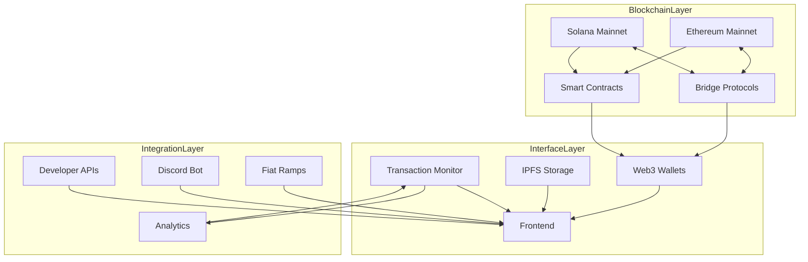
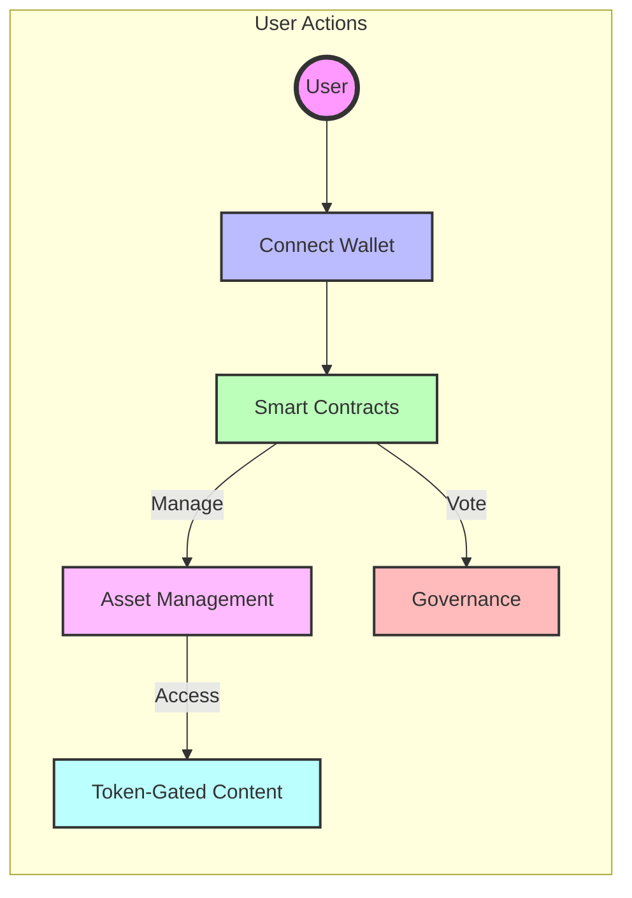
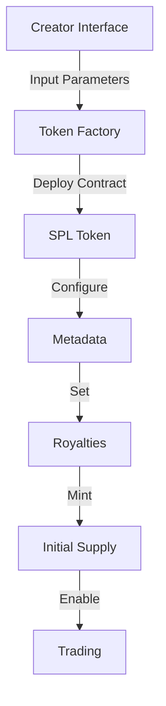
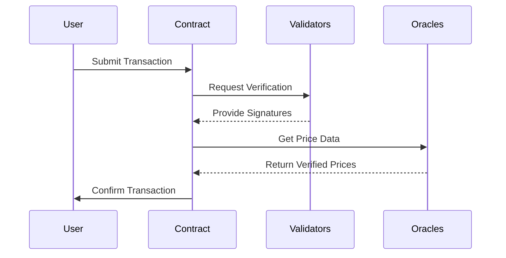
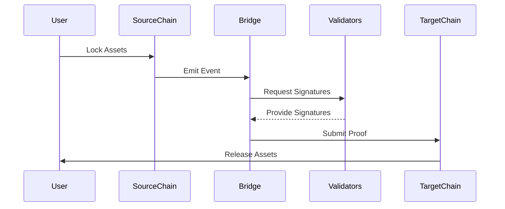
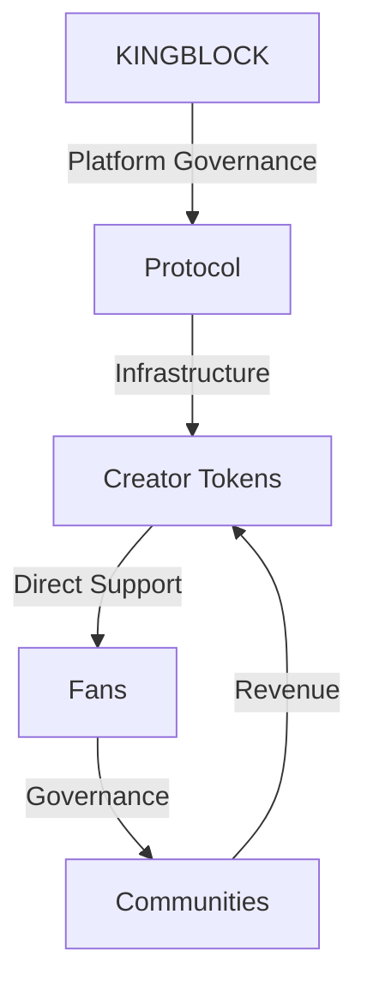
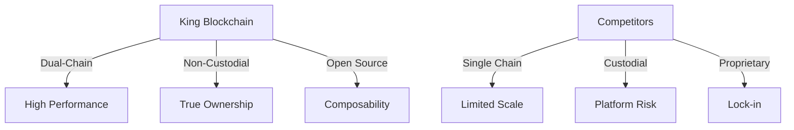

# King Blockchain: Empowering Creators and Fans with True Digital Ownership

## 1. Introduction

### 1.1 The Creator Economy Challenge

Creators deserve better. According to [Exploding Topics' 2024 research](https://explodingtopics.com/blog/creator-economy-market-size), while the creator economy has grown to over $191 billion and is expected to reach $528 billion by 2030, creators face significant challenges. Traditional platforms dominate revenue streams, with 68.8% of creators relying on brand deals as their main source of income. Platform-dependent revenue sources like ad sharing account for only 7.3% of creator income, while platform fees can take between 30-50% of revenue. Despite fans contributing significantly to this growing economy, they receive no ownership stake or governance rights in the communities they help build.

**King Blockchain solves the challenge.**

- **For Creators:**

  - Keep 95% of what you earn (vs 50-70% on traditional platforms)
  - Get paid instantly, not weeks later
  - Own your community and never worry about deplatforming

- **For Fans:**

  - Your support becomes a real investment in creator success
  - Have a real voice in community decisions
  - Prove and track your day-one support forever

- **For Everyone:**

  - Connect directly without platform middlemen
  - Earn rewards automatically for participation
  - Take your status and benefits anywhere

### 1.2 King Blockchain Vision: The Future of Creator-Fan Relationships

**King Blockchain** eliminates the middleman. We're not building another platform – we're creating infrastructure that lets creators and fans interact directly through smart contracts.

Think of smart contracts like digital vending machines: they automatically execute actions when specific conditions are met. Just as a vending machine automatically gives you a snack when you insert the right amount of money, smart contracts automatically handle transactions, rewards, and access rights based on predefined rules. No human middleman needed – everything happens automatically and transparently.

For example, when a fan supports a creator, the smart contract instantly:

- Sends 95% of the payment directly to the creator
- Gives the fan their ownership rights and benefits
- Records everything permanently and transparently

This automation eliminates the need for platforms to manually process payments, manage memberships, or control access to benefits.

| Stakeholder | Benefit | Description |
|-------------|---------|-------------|
| **Creators** | Keep More Revenue | 95% of all payments go directly to your wallet |
| | True Independence | Own your community, your data, and your relationship with fans |
| | Instant Liquidity | Get paid instantly through direct peer-to-peer transactions |
| | Automated Growth | Smart contracts handle memberships, rewards, and governance |
| | Cross-Chain Freedom | Operate seamlessly across Ethereum and Solana |
| **Fans** | Real Ownership | Your support is a verifiable asset you truly own |
| | Direct Impact | Governance rights that grow with your support |
| | Instant Benefits | Automated access to exclusive content and experiences |
| | Investment Potential | Trade your support on decentralized exchanges |
| | True Portability | Your status and benefits work across platforms |

This isn't just theory – it's live infrastructure ready for creators to deploy today. Our platform gives you the tools and interface to easily generate tokens and contracts without knowing any code.

### 1.3 King Blockchain Solution: True Digital Sovereignty

King Blockchain represents the first truly decentralized creator economy infrastructure, where value flows directly between creators and fans through transparent, efficient, and automated smart contracts.

Our dual-chain architecture combines Ethereum's security with Solana's speed, delivering the following benefits.

#### 1.3.1 Complete Creator Control

Creators gain unprecedented autonomy over their digital economies:

| Feature | Current Platforms | King Blockchain |
|---------|------------------|-----------------|
| **Revenue Control** | Platform takes 30-50% | Keep 95% of earnings |
| **Payment Speed** | Days or weeks | Instant settlement |
| **Platform Risk** | Can be deplatformed | Full custody of funds and data |
| **Growth Model** | Algorithm-dependent | Direct creator-fan relationships |
| **Customization** | Limited options | Full control over: |
| | | - Reward structures |
| | | - Economic policies |
| | | - Community rules |
| | | - Token parameters |

Within minutes, creators can:

- Launch their own token ecosystem
- Set custom reward structures
- Define community rules
- Control their economic policies

Most importantly, creators maintain full custody of their:

- Funds (no platform holding your money)
- Data (own your community information)
- Relationships (direct connection with fans)
- Content (platform-independent distribution)

#### 1.3.2. Real Fan Ownership

| Feature | Traditional Platforms | King Blockchain |
|---------|---------------------|-----------------|
| **Ownership** | Platform-dependent status | Self-custodial wallets |
| | Can be revoked anytime | Permanent on-chain proof |
| | No transferable value | Trade or sell your status |
| **Governance** | No voting rights | Direct voting power |
| | No say in decisions | Proposals and voting |
| | Platform controls rules | Community-driven rules |
| **Benefits** | Manual distribution | Automatic delivery |
| | Platform decides perks | Token-based access |
| | Single platform only | Works across platforms |
| **Value** | Sunk cost | Investment potential |
| | No resale value | Liquid market trading |
| | Platform locked | Cross-chain flexibility |

Key Features:

- **True Ownership**: Your support becomes a real digital asset you control
- **Verifiable History**: Prove you were there from day one
- **Automatic Benefits**: Get perks instantly based on your support level
- **Real Power**: Vote on community decisions that matter
- **Investment Potential**: Your support can grow in value over time

#### 1.3.3. Automated Operations

Smart contracts form the backbone of all platform operations, ensuring reliable and transparent execution:

| Operation | Traditional Method | King Blockchain |
|-----------|-------------------|-----------------|
| **Rewards** | Manual calculation | Automatic calculation |
| | Delayed distribution | Instant distribution |
| | Human error risk | Mathematically precise |
| **Payments** | Platform processing | Direct peer-to-peer |
| | Days/weeks delay | Instant settlement |
| | High fees (30-50%) | Minimal fees (5%) |
| **Access** | Manual verification | Token-gated automatic |
| | Platform controlled | Smart contract controlled |
| | Single platform | Cross-platform compatible |
| **Governance** | Centralized decisions | Community voting |
| | Opaque process | Transparent on-chain |
| | Manual execution | Automatic execution |

Benefits:

- **Reliability**: Rules execute exactly as programmed, every time
- **Speed**: No waiting for manual processing or approvals
- **Transparency**: All operations visible and verifiable on-chain
- **Efficiency**: Reduced costs through automation
- **Security**: No human intermediaries or points of failure

#### 1.3.4. True Decentralization
The platform achieves genuine decentralization by eliminating traditional dependencies and bottlenecks. Creators and fans interact directly through smart contracts, removing the need for platform intermediaries and their associated fees. The non-custodial architecture eliminates custody risk, as users maintain full control of their assets at all times. Without artificial limits or platform restrictions, communities can grow organically based solely on creator-fan relationships.

## 2. Executive Summary

King Blockchain establishes a comprehensive ecosystem for creator economies through a dual-chain architecture, enhanced compliance tools, and robust risk management systems. 

### 2.1 Core Infrastructure

#### 2.1.1 Dual-Chain Architecture

Dual-chain architecture enables high-performance, secure operations while maintaining true decentralization and user control.

| Chain | Purpose | Key Features | Implementation |
|-------|----------|--------------|----------------|
| **Ethereum** | Governance & Staking | - Battle-tested smart contracts | - KINGBLOCK token contract |
|              |                      | - Widespread wallet support | - Governance mechanisms |
|              |                      | - Strong security guarantees | - Staking operations |
| **Solana** | Creator Tokens & Trading | - High throughput (50,000 TPS) | - Creator Token contracts |
|            |                          | - Sub-second finality | - Trading operations |
|            |                          | - Minimal transaction fees | - Real-time updates |

#### 2.1.2 Cross-Chain Integration

A comprehensive cross-chain architecture ensures secure and efficient operations across both Ethereum and Solana chains while maintaining decentralization and user sovereignty through automated systems and robust security measures.

| Component | Purpose | Key Features | Implementation |
|-----------|----------|--------------|----------------|
| **Bridge Protocol** | Asset Transfers | - Decentralized validator network | - Multi-party computation |
|                    |                 | - Threshold signature schemes | - Fraud proof system |
|                    |                 | - Automated monitoring | - Insurance coverage |
| **Transaction Monitor** | State Verification | - Real-time block confirmation | - Cross-chain state verification |
|                        |                    | - Automated royalty distribution | - Transparent fee calculation |
|                        |                    | - Decentralized price oracles | - MEV protection |
| **State Management** | Data Consistency | - Atomic cross-chain operations | - State synchronization |
|                     |                  | - Fallback mechanisms | - Redundant pathways |
|                     |                  | - Conflict resolution | - Version control |
| **Governance** | Protocol Control | - Cross-chain voting | - Unified proposal system |
|               |                  | - Emergency controls | - Multi-chain execution |
|               |                  | - Time-locked upgrades | - Quadratic voting |

#### 2.1.3 Non-Custodial Architecture

A non-custodial architecture ensures users maintain complete control over their assets while benefiting from robust security measures and seamless blockchain interactions. The system eliminates traditional platform risks by removing intermediaries and centralized points of failure.

| Component | Purpose | Key Features | Implementation |
|-----------|----------|--------------|----------------|
| **Wallet Integration** | User Access | - MetaMask (Ethereum) | - Web3 connection standards |
|                       |             | - Phantom (Solana) | - Hardware wallet support |
|                       |             | - WalletConnect protocol | - Mobile compatibility |
| **Asset Control** | Self-Custody | - Direct token ownership | - Non-custodial contracts |
|                  |             | - Private key sovereignty | - Decentralized storage |
|                  |             | - Permissionless transfers | - Cross-chain bridging |
| **Transaction Security** | Validation | - Decentralized consensus | - Multi-node verification |
|                         |            | - Fraud prevention | - Automated monitoring |
|                         |            | - Slippage protection | - MEV resistance |
| **Smart Contract Safety** | Security | - Audited code base | - Formal verification |
|                          |          | - Emergency controls | - Upgrade mechanisms |
|                          |          | - Bug bounty program | - Insurance coverage |

This architecture enables high-performance, secure operations while maintaining true decentralization and user control.

#### 2.1.4 Enhanced Compliance

##### 2.1.4.1 Chainalysis
King Blockchain integrates with Chainalysis's industry-leading blockchain analytics platform to provide real-time transaction monitoring and risk assessment, ensuring compliance with global regulatory standards while maintaining user privacy. The platform offers jurisdiction-specific token templates that automatically align with local regulatory requirements, enabling creators to launch compliant token economies in their respective regions.

##### 2.1.4.2 Fiat Ramps
To facilitate seamless fiat-to-crypto transactions, the platform partners with licensed payment processors including MoonPay, Wyre, and Transak, providing users with secure, compliant on/off ramps across multiple jurisdictions. These integrations handle all necessary KYC/AML requirements while maintaining the platform's non-custodial architecture.

##### 2.1.4.3 Regulatory Reporting
The system also features automated regulatory reporting mechanisms that generate and submit required compliance documentation, reducing administrative burden while ensuring transparency with relevant authorities. This comprehensive approach to compliance enables mainstream adoption while preserving the core benefits of decentralized technology.

#### 2.1.5 Risk Management

##### 2.1.5.1 Bridge insurance

The platform maintains a robust bridge insurance fund, funded by 5% of all protocol fees, providing comprehensive protection against potential cross-chain vulnerabilities and ensuring user assets remain secure during bridge operations. This self-sustaining insurance mechanism grows proportionally with platform usage.

##### 2.1.5.2 Overrides
A sophisticated emergency override system enables rapid response to potential security threats, with multi-signature controls and time-locked execution ensuring that emergency measures can only be activated through proper governance channels and consensus.

##### 2.1.5.3 Security
The protocol's security is further enhanced by a multi-client validator infrastructure that distributes consensus across multiple independent implementations, significantly reducing the risk of client-specific vulnerabilities while ensuring continuous operation even if individual clients experience issues.

##### 2.1.5.4 Backup
Comprehensive contingency planning includes detailed response protocols for various risk scenarios, regular security audits, and automated circuit breakers, creating multiple layers of protection for user assets and platform stability.

### 2.2 Creator & Fan Experience

#### 2.2.1 Creator Tools

Creators can deploy their own token economies with a single click, streamlining the process of establishing their digital presence. The platform features seamless NFT integration with automated revenue sharing mechanisms, enabling creators to monetize digital assets efficiently. Advanced cross-chain asset management tools provide creators with complete control over their digital assets across multiple blockchains. Comprehensive success playbooks and customizable templates guide creators through proven strategies for community building and engagement.

| Tool | Purpose | Key Features | Implementation |
|------|----------|--------------|----------------|
| **Token Deployment** | Launch Creator Economy | - One-click setup | - Smart contract templates |
|                     |                        | - Custom parameters | - Automated verification |
|                     |                        | - Instant activation | - Gas optimization |
| **NFT Integration** | Digital Asset Creation | - Revenue sharing | - Metaplex standard |
|                    |                        | - Automated royalties | - Cross-chain bridging |
|                    |                        | - Collection management | - Marketplace integration |
| **Asset Management** | Cross-Chain Control | - Multi-chain dashboard | - Unified interface |
|                     |                      | - Portfolio tracking | - Auto-rebalancing |
|                     |                      | - Risk monitoring | - Bridge integration |
| **Success Tools** | Growth Resources | - Proven playbooks | - Step-by-step guides |
|                  |                  | - Customizable templates | - Analytics integration |
|                  |                  | - Best practices | - Community insights |

#### 2.2.2 Fan Engagement

The platform offers intuitive, interactive wallet tutorials that guide fans through the setup and management of their digital assets. A sophisticated tokenomics simulator allows fans to understand and experiment with different economic models before participating. The gamified participation system rewards active community members with tokens and benefits, driving deeper engagement. Direct governance rights ensure fans have a real voice in community decisions through transparent voting mechanisms.

| Feature | Purpose | Key Benefits | Implementation |
|---------|----------|--------------|----------------|
| **Wallet Tutorials** | Onboarding | - Step-by-step guidance | - Interactive UI/UX |
|                     |            | - Security best practices | - Video tutorials |
|                     |            | - Asset management tips | - Practice environment |
| **Tokenomics Simulator** | Economic Education | - Real-time modeling | - Dynamic calculations |
|                         |                    | - Risk assessment | - Market simulations |
|                         |                    | - Strategy testing | - Historical data |
| **Gamified System** | Engagement Growth | - Achievement badges | - Smart contract rewards |
|                    |                   | - Level progression | - Community leaderboards |
|                    |                   | - Reward multipliers | - Social challenges |
| **Governance Rights** | Community Control | - Direct voting power | - On-chain voting |
|                      |                   | - Proposal creation | - Quadratic weighting |
|                      |                   | - Treasury management | - Automated execution |

#### 2.2.3 Community Development

A robust ambassador program empowers community leaders to drive growth and engagement while earning rewards for their contributions. The developer grants program funds innovative projects that enhance the platform's ecosystem. Regular hackathons foster innovation and attract technical talent to build new features and integrations. Comprehensive educational resources help both creators and fans understand and maximize the platform's capabilities.

| Program | Purpose | Key Features | Implementation |
|---------|----------|--------------|----------------|
| **Ambassador Program** | Community Growth | - Leadership roles | - Tiered rewards |
|                      |                  | - Growth incentives | - Performance tracking |
|                      |                  | - Exclusive access | - Training resources |
| **Developer Grants** | Ecosystem Expansion | - Project funding | - Milestone-based payouts |
|                     |                    | - Technical support | - Code review process |
|                     |                    | - Integration assistance | - Documentation requirements |
| **Hackathons** | Innovation | - Regular events | - Prize pools |
|               |            | - Team formation | - Expert mentorship |
|               |            | - Project showcases | - Implementation support |
| **Educational Resources** | Knowledge Sharing | - Documentation | - Interactive tutorials |
|                         |                   | - Best practices | - Community workshops |
|                         |                   | - Case studies | - Technical guides |

### 2.3 Technical Innovation

#### 2.3.1 Layer 2 Scaling

Layer 2 refers to a set of solutions built on top of Ethereum (Layer 1) that help scale the network by handling transactions off the main chain while maintaining the security guarantees of Ethereum. These solutions dramatically reduce transaction costs (up to 90%) and increase speed (thousands of transactions per second) by batching multiple transactions together before settling them on Layer 1.

King Blockchain leverages Layer 2 scaling solutions to optimize performance and reduce costs while maintaining security:

##### 2.3.1.1 Ethereum Layer 2 Integration

The platform integrates with Ethereum Layer 2 solutions through a standardized bridge interface that enables secure asset transfers and cross-layer communication:

```solidity
interface IL2Bridge {
    // Configuration for each L2 chain (Arbitrum, Optimism)
    struct L2Config {
        address l2Contract;        // L2 destination contract
        uint256 challengePeriod;   // Time window for fraud proofs
        uint256 exitWindow;        // Withdrawal waiting period
        mapping(bytes32 => bool) exitProofs; // Verified withdrawal proofs
    }
    
    // Move assets from L1 to L2 (e.g., for governance on Arbitrum)
    function bridgeToL2(
        address token,          // Token being bridged
        uint256 amount,         // Amount to transfer
        bytes calldata proof    // Validity proof
    ) external returns (bool);
    
    // Withdraw assets from L2 back to L1
    function exitFromL2(
        bytes32 exitId,         // Unique withdrawal identifier
        bytes calldata proof    // Proof of valid L2 state
    ) external returns (bool);
}
```

This interface enables:

- Secure asset bridging between Ethereum L1 and L2s (Arbitrum, Optimism)
- Optimistic rollup security with fraud proof verification
- Fast exits through liquidity bridges
- Cross-L2 interoperability for governance and staking
- Safety measures like challenge periods for fraud proofs and verified exit proofs to ensure secure cross-layer transactions

##### 2.3.1.2 Key Features

- Arbitrum integration for governance operations
- Optimism support for staking mechanisms
- Cross-L2 interoperability
- Optimistic rollup security
- Fast exits via liquidity bridges

##### 2.3.1.3 Implementation Strategy

Our Layer 2 implementation strategy focuses on optimizing different platform operations across specialized L2 solutions. By distributing functionality across multiple Layer 2 chains, we leverage each network's unique strengths while maintaining security and cost efficiency:

- **Governance on Arbitrum**: We chose Arbitrum for governance operations due to its strong fraud-proof system and widespread adoption. This ensures secure, cost-effective voting and proposal execution while maintaining Ethereum's security guarantees.

- **Staking on Optimism**: Optimism's EVM compatibility and fast withdrawal capabilities make it ideal for staking operations. The network's architecture allows for efficient reward distribution and MEV protection.

- **Future NFT Support on ZKSync**: ZKSync's zero-knowledge proofs and high throughput will support future NFT operations, enabling instant finality and minimal gas fees for creators.

- **Cross-L2 Communication**: A unified bridge protocol enables seamless asset and state transfers between L2s, ensuring consistent platform operation across all chains.

| Layer 2 | Purpose | Key Features | Implementation |
|---------|----------|--------------|----------------|
| **Arbitrum** | Governance Operations | - Proposal submission | - Optimistic rollups |
|             |                      | - Vote aggregation | - Fraud proofs |
|             |                      | - Result execution | - 4,500 TPS |
| **Optimism** | Staking Mechanisms | - Reward distribution | - EVM compatibility |
|             |                     | - Yield strategies | - Fast withdrawals |
|             |                     | - MEV protection | - 2,000 TPS |
| **ZKSync** | Future NFT Support | - Asset minting | - Zero-knowledge proofs |
|           |                    | - Collection management | - Instant finality |
|           |                    | - Marketplace integration | - 20,000 TPS |
| **Cross-L2** | Communication Protocol | - State synchronization | - Bridge contracts |
|             |                       | - Asset transfers | - Message passing |
|             |                       | - Unified governance | - Security guarantees |

#### 2.3.2 Security Features

##### 2.3.2.1 Multi-Client Validator

The protocol's security is reinforced by a distributed multi-client validator network that ensures consensus across multiple independent implementations, significantly reducing the risk of client-specific vulnerabilities while maintaining continuous operation even if individual validators experience issues.

##### 2.3.2.2 Transaction Monitoring

A real-time transaction monitoring system actively tracks all cross-chain operations, analyzing patterns and flagging suspicious activities instantly. This system employs advanced analytics and machine learning to detect potential threats before they can impact user assets.

##### 2.3.2.3 Circuit Breakers

The platform implements automated circuit breakers that can instantly pause specific operations if unusual patterns or potential security threats are detected. These intelligent safeguards operate autonomously based on predefined risk parameters and can protect the system without requiring manual intervention.

##### 2.3.2.4 Emergency Response System

A comprehensive emergency response system provides rapid reaction capabilities to potential security incidents, with clear escalation paths and predefined response protocols. This system includes multi-signature controls, time-locked execution mechanisms, and automated communication channels to ensure swift and coordinated responses to any security events.

### 2.4 Value Proposition

**For Creators:**
| Benefit | Description | Implementation |
|---------|-------------|----------------|
| Revenue Share | 95% of all payments go directly to creator wallets | - Direct P2P transactions |
|              |                                                     | - Automated distribution |
|              |                                                     | - Instant settlements |
| Multi-Chain Presence | Operate seamlessly across Ethereum and Solana | - Cross-chain integration |
|                     |                                                | - Unified dashboard |
|                     |                                                | - Bridge protocols |
| NFT Capabilities | Launch and manage digital assets | - Metaplex integration |
|                 |                                   | - Revenue sharing |
|                 |                                   | - Collection tools |
| Compliance Tools | Region-specific templates | - Automated reporting |
|                 |                           | - KYK/AML integration |
|                 |                           | - Legal frameworks |
| Community Control | Full ownership of community data | - No platform lock-in |
|                  | Cannot be deplatformed | - Self-sovereign data |
|                  | Direct fan relationships | - Portable communities |
| Growth Tools | Analytics and insights | - Performance tracking |
|             | Marketing templates | - Growth automation |
|             | Success playbooks | - Best practices |
| Content Freedom | Platform-independent distribution | - Multi-channel publishing |
|                | Flexible monetization | - Custom pricing models |
|                | Content ownership | - Decentralized storage |

**For Fans:**
| Benefit | Description | Implementation |
|---------|-------------|----------------|
| Digital Ownership | Self-custodial wallets with true asset control | - Non-custodial architecture |
|                  |                                                 | - On-chain verification |
|                  |                                                 | - Cross-chain portability |
| Education | Comprehensive learning resources | - Interactive tutorials |
|          |                                  | - Community workshops |
|          |                                  | - Documentation hub |
| Engagement | Gamified participation system | - Achievement system |
|           |                               | - Reward mechanisms |
|           |                               | - Community challenges |
| Protection | Multi-layer security and insurance | - Bridge insurance fund |
|           |                                    | - Smart contract audits |
|           |                                    | - Emergency systems |
| Investment Potential | Trade support on open markets | - Secondary market liquidity |
|                     | Earn from community growth | - Value appreciation |
|                     | Stake for rewards | - Yield opportunities |
| Governance Rights | Direct voting power | - Proposal creation |
|                  | Treasury management | - Fund allocation |
|                  | Policy decisions | - Community rules |
| Cross-Platform | Take benefits anywhere | - Universal recognition |
|               | Single login for all communities | - Unified identity |
|               | Aggregate reputation | - Portable status |

**For Both:**
| Benefit | Description | Implementation |
|---------|-------------|----------------|
| Direct Relationships | No platform intermediaries | - P2P interactions |
|                     | Transparent communication | - On-chain messaging |
|                     | Trust-minimized | - Automated execution |
| Automated Operations | Instant settlements | - Smart contracts |
|                     | Programmatic rewards | - Rule-based distribution |
|                     | Efficient management | - Low overhead |
| Future-Proof | Blockchain agnostic | - Multi-chain support |
|             | Extensible platform | - Open architecture |
|             | Community governed | - Protocol ownership |

This comprehensive approach ensures King Blockchain can serve both crypto-native users and mainstream creators while maintaining the highest standards of security, compliance, and user experience.

## 3. Technology & Architecture

### 3.1 Dual-Chain Architecture: Ethereum and Solana Integration

A blockchain is a decentralized digital ledger that records transactions across a network of computers. Each blockchain has its own strengths and limitations - some prioritize security and decentralization (like Ethereum), while others focus on speed and low costs (like Solana).

#### 3.1.1 Why Layer 2 and Multi-Chain Solutions Matter

Ethereum, while secure and widely adopted, faces significant scalability challenges. As [cited by t3rn.io](https://www.t3rn.io/blog/best-l2-solutions-2024), it struggles with high transaction fees and slower processing times as usage increases. This has led to two main scaling approaches:

1. **Layer 2 Solutions**: Built on top of Ethereum to handle transactions off the main chain, reducing congestion and costs. These include:
   - Optimistic Rollups (like Arbitrum and Optimism)
   - Zero-Knowledge Rollups (like zkSync)

2. **Multi-Chain Integration**: Connecting different blockchains to leverage their unique strengths.

#### 3.1.2 Our Dual-Chain Approach

King Blockchain takes a unique approach by combining both strategies:

| Chain | Purpose | Key Features | Implementation |
|-------|----------|--------------|----------------|
| **Ethereum** | Governance & Staking | - Battle-tested smart contracts | - KINGBLOCK token contract |
|              |                      | - Layer 2 scaling via Arbitrum | - Governance mechanisms |
|              |                      | - Strong security guarantees | - Staking operations |
| **Solana** | Creator Tokens & Trading | - High throughput (50,000 TPS) | - Creator Token contracts |
|            |                          | - Sub-second finality | - Trading operations |
|            |                          | - Minimal transaction fees | - Real-time updates |

This architecture enables high-performance, secure operations while maintaining true decentralization and user control. Unlike single-chain solutions, our dual-chain approach provides:

1. **Optimized Performance**: Using each chain for what it does best
2. **Enhanced Security**: Leveraging Ethereum's security with Solana's speed
3. **Cost Efficiency**: Reducing fees through strategic operation placement
4. **Future Flexibility**: Ability to adapt to evolving blockchain technologies
**Cross-Chain Integration:**

The platform implements seamless cross-chain communication through:

- Decentralized bridge protocols for asset transfers
- Unified transaction monitoring
- Synchronized state management
- Cross-chain governance capabilities

#### 3.1.3 Non-Custodial Architecture

A non-custodial architecture ensures users maintain complete control over their assets while benefiting from robust security measures and seamless blockchain interactions. The system eliminates traditional platform risks by removing intermediaries and centralized points of failure.

| Component | Purpose | Key Features | Implementation |
|-----------|----------|--------------|----------------|
| **Wallet Integration** | User Access | - MetaMask (Ethereum) | - Web3 connection standards |
|                       |             | - Phantom (Solana) | - Hardware wallet support |
|                       |             | - WalletConnect protocol | - Mobile compatibility |
| **Asset Control** | Self-Custody | - Direct token ownership | - Non-custodial contracts |
|                  |             | - Private key sovereignty | - Decentralized storage |
|                  |             | - Permissionless transfers | - Cross-chain bridging |
| **Transaction Security** | Validation | - Decentralized consensus | - Multi-node verification |
|                         |            | - Fraud prevention | - Automated monitoring |
|                         |            | - Slippage protection | - MEV resistance |
| **Smart Contract Safety** | Security | - Audited code base | - Formal verification |
|                          |          | - Emergency controls | - Upgrade mechanisms |
|                          |          | - Bug bounty program | - Insurance coverage |

This architecture enables high-performance, secure operations while maintaining true decentralization and user control.

### 3.2 Platform Architecture Overview

King Blockchain implements a decentralized architecture that prioritizes user sovereignty and direct peer-to-peer interactions. Our infrastructure combines public blockchain networks with decentralized storage and communication protocols.

### 3.2 Platform Architecture Overview

King Blockchain implements a decentralized architecture that prioritizes user sovereignty and direct peer-to-peer interactions. Our infrastructure combines public blockchain networks with decentralized storage and communication protocols.

#### 3.2.1 Core Components



#### 3.2.2 Layer Details

The following comprise the various component solutions used for the different layers.

| Component | Functional Description |
|------|----------------------|
| **Blockchain Layer Components** |
| ERC-20 Token Contracts | Standard Ethereum smart contracts that enable creation and management of fungible tokens with built-in transfer, balance tracking, and approval functions |
| Governance System | Smart contract system that enables token holders to propose, vote on, and execute community decisions with time-locks and multi-signature security |
| Treasury Management | Secure multi-signature system for controlling platform funds, with transparent on-chain tracking of all financial movements |
| Layer 2 Integration | Secondary blockchain networks built on top of Ethereum that process transactions in batches to reduce fees and increase speed |
| SPL Token Program | Solana's native token system that enables high-speed, low-cost token operations with built-in metadata support |
| Metaplex Integration | Solana's NFT and metadata framework that handles rich media content and collection management |
| Program Composability | Solana's ability to have different programs (smart contracts) interact with each other securely |
| State Verification | System for validating cross-chain transactions using cryptographic proofs and multiple validators |
| Message Passing | Protocol for secure communication between different blockchains using threshold signatures |
| **Interface Layer Components** |
| MetaMask Integration | Browser extension wallet connection that enables Ethereum transactions and contract interactions |
| Phantom Integration | Solana wallet connection that handles SPL token transactions and program interactions |
| WalletConnect | Protocol that enables mobile wallets to interact with dApps through QR codes |
| Hardware Support | Integration with secure physical devices for cryptocurrency storage and transaction signing |
| IPFS Distribution | Peer-to-peer network for storing and sharing content using content-addressing |
| ENS Domains | System that converts human-readable names into blockchain addresses and resources |
| Edge Computing | Distributed server network that processes requests closer to users for faster response times |
| Progressive Web App | Web application that works offline and can be installed like a native app |
| Arweave Backup | Permanent storage network that maintains data indefinitely through one-time payment |
| Ceramic Streams | Decentralized data network for managing mutable, linked data streams |
| TheGraph Indexing | System for efficiently querying blockchain data through GraphQL APIs |
| **Integration Layer Components** |
| Block Scanning | Real-time monitoring of blockchain transactions and state changes |
| Event Filtering | System for identifying and processing relevant blockchain events |
| Multiple Providers | Integration with various payment services for fiat currency transactions |
| Payment Methods | Support for different payment types including credit cards and bank transfers |
| Rate Optimization | Automated system for finding the best exchange rates across providers |
| Role Management | Discord integration for automatic community role assignment based on token holdings |
| Event Automation | System for triggering actions based on blockchain or platform events |
| REST Endpoints | Standard HTTP APIs for external developers to interact with the platform |
| WebSocket Feeds | Real-time data streams for live updates and notifications |
| GraphQL Queries | Flexible API system that allows clients to request specific data structures |

##### 3.2.2.1 Blockchain Layer
The foundation of our platform, handling all on-chain operations and cross-chain communication.

| Component | Purpose | Implementation | Features |
|-----------|----------|----------------|-----------|
| **Ethereum Mainnet** | Governance & Staking | - ERC-20 token contracts | - Secure voting |
| | | - Governance system | - Staking mechanics |
| | | - Treasury management | - Proposal execution |
| | | - Layer 2 integration | - Cross-chain bridges |
| **Solana Mainnet** | Creator Tokens | - SPL token program | - High throughput |
| | | - Metaplex integration | - Low fees |
| | | - Program composability | - Fast finality |
| | | - Token economics | - Rich metadata |
| **Bridge Protocols** | Cross-Chain Operations | - State verification | - Asset transfers |
| | | - Message passing | - Atomic swaps |
| | | - Security monitoring | - Fraud proofs |
| | | - Insurance coverage | - Emergency pauses |
| **Smart Contracts** | Business Logic | - Access control | - Automated execution |
| | | - Token mechanics | - Transparent rules |
| | | - Economic policies | - Upgradeable design |
| | | - Security features | - Multi-sig control |

##### 3.2.2.2. Interface Layer
Provides seamless user access and content management while maintaining decentralization.

| Component | Purpose | Implementation | Features |
|-----------|----------|----------------|-----------|
| **Web3 Wallets** | User Authentication | - MetaMask (ETH) | - Non-custodial |
| | | - Phantom (SOL) | - Key management |
| | | - WalletConnect | - Transaction signing |
| | | - Hardware support | - Multi-chain support |
| **Frontend Hosting** | User Interface | - IPFS distribution | - Censorship resistant |
| | | - ENS domains | - Global availability |
| | | - Edge computing | - Fast loading |
| | | - Progressive web app | - Mobile support |
| **Content Storage** | Media & Data | - IPFS network | - Permanent storage |
| | | - Arweave backup | - Content addressing |
| | | - Ceramic streams | - Version control |
| | | - TheGraph indexing | - Fast retrieval |
| **Transaction Monitor** | Operation Tracking | - Block scanning | - Real-time updates |
| | | - Event filtering | - Error detection |
| | | - State verification | - Performance metrics |
| | | - Alert system | - Analytics feed |

##### 3.2.2.3. Integration Layer
Enables seamless interaction with external services while maintaining security and decentralization.

| Component | Purpose | Implementation | Features |
|-----------|----------|----------------|-----------|
| **Fiat Ramps** | Currency Exchange | - Multiple providers | - KYC compliance |
| | | - Payment methods | - Global coverage |
| | | - Rate optimization | - Fraud prevention |
| | | - Settlement tracking | - Customer support |
| **Discord Bot** | Community Tools | - Role management | - Token verification |
| | | - Event automation | - Access control |
| | | - Notification system | - Analytics tracking |
| | | - Command interface | - Custom integrations |
| **Analytics** | Performance Tracking | - On-chain metrics | - Real-time data |
| | | - User behavior | - Market analysis |
| | | - System health | - Risk monitoring |
| | | - Custom reports | - API access |
| **Developer APIs** | Platform Extension | - REST endpoints | - Documentation |
| | | - WebSocket feeds | - Rate limiting |
| | | - GraphQL queries | - Authentication |
| | | - SDK support | - Example code |

##### 3.2.2.4 Key Benefits

1. **Decentralization:**
   - No single point of failure
   - Censorship resistance
   - User data sovereignty
   - Community governance

2. **Security:**
   - Multi-layer protection
   - Real-time monitoring
   - Automated responses
   - Regular audits

3. **Scalability:**
   - Multi-chain support
   - Layer 2 integration
   - Horizontal scaling
   - Performance optimization

4. **Usability:**
   - Intuitive interfaces
   - Fast operations
   - Mobile support
   - Comprehensive documentation

#### 3.2.2.5 Implementation Details

This architecture ensures robust, secure, and scalable platform operations while maintaining true decentralization and user sovereignty.

##### 3.2.2.5.1 Example Implementation

```solidity
// Example of cross-chain message passing
interface IBridgeProtocol {
    struct Message {
        bytes32 id;
        address sender;
        uint256 amount;
        bytes payload;
    }
    
    function sendMessage(
        uint256 destinationChainId,
        address recipient,
        bytes calldata payload
    ) external payable returns (bytes32 messageId);
    
    function verifyMessage(
        bytes32 messageId,
        bytes[] calldata proof
    ) external returns (bool);
}
```

##### 3.2.2.5.2 Key Integration Points

- All implementations follow security best practices
- Components are designed for modularity
- Cross-chain operations use standardized protocols
- Data persistence leverages decentralized networks
- User experience prioritizes simplicity
- Security measures are multi-layered

#### 3.2.3 Smart Contract Architecture

The platform's core functionality is implemented through a suite of smart contracts:

| Contract Type | Chain | Purpose | Key Features | Implementation |
|--------------|-------|---------|--------------|----------------|
| **KINGBLOCK Token** | Ethereum | Platform Governance | - Fixed supply of 1B tokens | - ERC-20 standard |
| | | | - Staking mechanisms | - Governance rights |
| | | | - Fee discounts | - Cross-chain bridge support |
| | | | - Voting power | - Automated distributions |
| **Creator Token Factory** | Solana | Token Generation | - One-click deployment | - SPL token standard |
| | | | - Custom parameters | - Metaplex integration |
| | | | - Revenue sharing | - Automated royalties |
| | | | - Supply management | - Access control |
| **Governance System** | Ethereum | Community Control | - Proposal creation | - Timelock controls |
| | | | - Voting mechanisms | - Execution automation |
| | | | - Treasury management | - Multi-sig security |
| | | | - Emergency controls | - Upgrade mechanisms |
| **Staking & Rewards** | Both | Economic Incentives | - Flexible lock periods | - APY calculations |
| | | | - Reward distribution | - Compound options |
| | | | - Boost mechanisms | - Cross-chain yields |
| | | | - Liquidity mining | - Performance tracking |
| **Bridge Contracts** | Both | Cross-Chain Operations | - Asset transfers | - State verification |
| | | | - Message passing | - Security controls |
| | | | - Fee management | - Emergency pauses |
| | | | - Insurance fund | - Fraud prevention |

##### 3.2.3.1 Smart Contract Security Implementation

| Security Measure | How It's Implemented | Verification Method | Benefits |
|-----------------|---------------------|-------------------|-----------|
| **Security Audits** | - Multiple independent auditors | - Published audit reports | - Identifies vulnerabilities |
| | - Automated testing tools | - Test coverage metrics | - Validates security |
| | - Bug bounty programs | - HackerOne platform | - Community verification |
| | - Regular code reviews | - Peer review process | - Continuous improvement |
| **Gas Optimization** | - Batch processing | - Gas profiling tools | - Lower transaction costs |
| | - Storage packing | - Benchmark tests | - Efficient execution |
| | - Loop optimization | - Gas usage reports | - Better user experience |
| | - Event indexing | - Comparison metrics | - Reduced network load |
| **Upgradeability** | - Proxy pattern design | - Upgrade simulations | - Future-proof contracts |
| | - State migration tools | - Test environments | - Bug fixes possible |
| | - Version control | - Change validation | - Feature additions |
| | - Backward compatibility | - Integration tests | - No disruption |
| **Multi-sig Security** | - M-of-N signatures required | - On-chain verification | - No single point of failure |
| | - Time-locked execution | - Signature tracking | - Prevents unauthorized changes |
| | - Role-based access | - Permission logs | - Coordinated control |
| | - Emergency controls | - Alert system | - Quick response |
| **Real-time Monitoring** | - Block monitoring | - Dashboard metrics | - Instant detection |
| | - Event tracking | - Alert thresholds | - Proactive response |
| | - Health checks | - Status reports | - Performance tracking |
| | - Anomaly detection | - Incident logs | - Risk mitigation |

##### 3.2.3.2 Example Implementation

```solidity
contract UpgradeableSecureContract {
    // Proxy pattern for upgradeability
    address public implementation;
    
    // Multi-sig control
    mapping(address => bool) public signers;
    uint256 public requiredSignatures;
    
    // Monitoring events
    event SecurityAlert(
        uint256 severity,
        string message
    );
    
    // Gas optimization
    mapping(bytes32 => uint256) packed;
    
    // Audit hooks
    modifier audited() {
        require(isAudited(), "Not audited");
        _;
    }
    
    // Real-time monitoring
    function checkHealth() external view 
        returns (HealthStatus) {
        // Implementation
    }
}
```

##### 3.2.3.3 Key Security Features

1. **Audit Process:**
   - Static analysis
   - Dynamic testing
   - Formal verification
   - Penetration testing

2. **Gas Optimization Techniques:**
   - Memory vs storage usage
   - Calldata optimization
   - Function modifiers
   - Assembly usage

3. **Upgrade Mechanisms:**
   - Transparent proxies
   - UUPS pattern
   - Diamond pattern
   - State management

4. **Multi-sig Implementation:**
   - Threshold signatures
   - Time delays
   - Role management
   - Recovery options

5. **Monitoring Systems:**
   - Transaction tracking
   - Event logging
   - Performance metrics
   - Security alerts

#### 3.2.4 User Interaction Flow

The architecture ensures that all critical operations occur on-chain through verifiable smart contracts, while maintaining a seamless user experience through modern web interfaces and integrations.



1. Connect non-custodial wallet
2. Interact with smart contracts directly
3. Manage assets independently
4. Participate in governance
5. Access token-gated content

### 3.3 Creator Token Implementation

A **Solana SPL (Solana Program Library) token** is like a digital certificate on the Solana blockchain. Think of it as creating your own digital currency or membership card, but with instant transfers, near-zero fees, and programmable features. Just as ERC-20 is the standard token format for Ethereum, SPL is the standard token format for Solana.

Creator Tokens are implemented as Solana SPL tokens, leveraging the chain's high performance and low transaction costs. Each token represents a **digital patronage certificate**, with built-in features for community access and governance.

| Feature | Traditional Tokens | Solana SPL Tokens |
|---------|-------------------|-------------------|
| **Speed** | 15-60 seconds | < 1 second |
| **Cost** | $5-100+ per transaction | < $0.01 per transaction |
| **Scale** | 15-45 TPS | 50,000+ TPS |
| **Features** | Basic transfers | - Programmable permissions |
| | | - Automated royalties |
| | | - Metadata integration |
| | | - Cross-program composability |

#### 3.3.1 Creator Token Standard

The comprehensive token standard ensures maximum flexibility and security while maintaining high performance and low costs.

| Component | Purpose | Features | Implementation |
|-----------|----------|-----------|----------------|
| **SPL Token Standard** | Core Token Functions | - Create/mint tokens | - Solana native token program |
| | | - Transfer between wallets | - Account-based model |
| | | - Burn/remove tokens | - Atomic transactions |
| | | - Freeze accounts | - Permission controls |
| **Metaplex Integration** | Rich Metadata | - Token images/media | - On-chain metadata |
| | | - Collection grouping | - Update authority |
| | | - Creator verification | - Certified collections |
| | | - Attribute tracking | - Dynamic updates |
| **Royalty System** | Creator Revenue | - Automatic splits | - Percentage-based |
| | | - Multiple recipients | - Per-transaction |
| | | - Secondary sales | - Market enforcement |
| | | - Cross-market support | - Instant settlement |
| **CPI Support** | Program Interaction | - Smart contract calls | - Cross-program authority |
| | | - Composable actions | - Secure delegation |
| | | - Multi-step transactions | - Atomic execution |
| | | - Program upgrades | - Version control |

##### 3.3.1.1 Key Benefits

1. **For Creators:**
   - One-click token deployment
   - Customizable parameters
   - Automated royalties
   - Verifiable authenticity

2. **For Developers:**
   - Standard interfaces
   - Composable programs
   - Secure interactions
   - Upgrade paths

3. **For Users:**
   - Fast transactions
   - Low fees
   - Rich metadata
   - Secure ownership

#### 3.3.2 Smart Contract Features

The smart contract comprehensive feature set ensures creators have full control over their token economy while maintaining security and usability for all participants.

| Feature | Purpose | Implementation | Benefits |
|---------|----------|----------------|-----------|
| **Token Creation & Supply** | Minting & Burning | - Decentralized authority | - Creator controls supply |
| | | - Rate limiting | - Prevent inflation |
| | | - Transparent rules | - Market stability |
| | | - Automated execution | - No middlemen |
| **Royalty System** | Revenue Distribution | - Automatic splits | - Instant payments |
| | | - Configurable rates | - Multiple beneficiaries |
| | | - Market enforcement | - Cross-platform support |
| | | - Smart routing | - No missed payments |
| **Access Control** | Community Management | - Token thresholds | - Automatic verification |
| | | - Tiered permissions | - Dynamic access levels |
| | | - Cross-platform gates | - Seamless integration |
| | | - Role management | - Flexible governance |
| **Supply Management** | Economic Control | - Transparent metrics | - Real-time tracking |
| | | - Automated limits | - Supply schedules |
| | | - Burn mechanisms | - Market tools |
| | | - Analytics integration | - Economic insights |
| **Market Support** | Trading Infrastructure | - DEX integration | - Instant liquidity |
| | | - Price oracles | - Fair pricing |
| | | - Trading pairs | - Market making |
| | | - Slippage protection | - MEV resistance |

##### 3.3.2.1 Key Operations

```solidity
interface ICreatorToken {
    // Token Creation
    function mint(address to, uint256 amount) external;
    function burn(uint256 amount) external;
    
    // Royalty Management
    function setRoyalties(address[] recipients, uint256[] shares) external;
    function distributeRoyalties(uint256 amount) external;
    
    // Access Control
    function grantRole(bytes32 role, address account) external;
    function checkAccess(address user, uint256 tier) external view returns (bool);
    
    // Supply Management
    function getTotalSupply() external view returns (uint256);
    function getCirculatingSupply() external view returns (uint256);
    
    // Market Operations
    function addLiquidity(uint256 amount) external;
    function removeLiquidity(uint256 amount) external;
}
```

##### 3.3.2.2 Security Features

- Multi-signature requirements for critical operations
- Time-locked execution for major changes
- Emergency pause functionality
- Rate limiting on sensitive operations
- Automated monitoring and alerts

##### 3.3.2.3 Integration Capabilities

- Discord server access
- NFT platform integration
- DeFi protocol compatibility
- Analytics dashboard support
- Cross-chain bridging

#### 3.3.3 Deployment Process

The streamlined deployment process ensures creators can launch their token economy quickly and securely, with all necessary configurations in place.

| Stage | Action | Parameters | Outcome |
|-------|--------|------------|----------|
| **1. Initialization** | Creator starts setup | - Token name & symbol | Web interface guides creator |
| | | - Initial supply | through each step |
| | | - Token image/media | |
| | | - Community rules | |
| **2. Token Generation** | Smart contract deploys | - Supply limits | New SPL token created |
| | | - Mint authority | with unique address |
| | | - Freeze authority | |
| | | - Decimals | |
| **3. Metadata Setup** | Configure token details | - Collection info | On-chain verification |
| | | - Royalty structure | of token properties |
| | | - Creator verification | |
| | | - Update authority | |
| **4. Supply Distribution** | Initial token minting | - Creator allocation | Tokens appear in |
| | | - Treasury reserve | creator's wallet |
| | | - Community pool | |
| | | - Team tokens | |
| **5. Market Activation** | Enable trading | - Initial price | Trading begins on |
| | | - Liquidity pools | supported markets |
| | | - Trading pairs | |
| | | - Market makers | |

##### 3.3.3.1 Detailed Process Flow



##### 3.3.3.2 Key Features

- One-click deployment
- Guided parameter selection
- Real-time validation
- Automated setup
- Instant activation

##### 3.3.3.3 Security Checks

- Parameter validation
- Contract verification
- Authority confirmation
- Supply verification
- Market readiness

##### 3.3.3.4 Post-Deployment

- Automatic market listing
- Community notifications
- Analytics integration
- Documentation generation
- Support channel setup

#### 3.3.4 Access Control

The platform implements a comprehensive access control system that automatically manages community permissions and benefits based on token holdings.

| Feature | Purpose | Implementation | Benefits |
|---------|----------|----------------|-----------|
| **Token Gating** | Community Access | - Discord bot integration | - Automatic verification |
| | | - Real-time role updates | - No manual checks |
| | | - Cross-platform support | - Seamless experience |
| | | - Custom server rules | - Flexible management |
| **Verification System** | Holding Validation | - On-chain monitoring | - Tamper-proof |
| | | - SPL token tracking | - Real-time updates |
| | | - Cross-chain support | - Multi-wallet linking |
| | | - Snapshot capabilities | - Historical records |
| **Community Tiers** | Benefit Levels | - Token threshold tiers | - Clear progression |
| | | - Custom permissions | - Incentivized holding |
| | | - Dynamic benefits | - Automated upgrades |
| | | - Role management | - Fair distribution |
| **Benefit Distribution** | Reward Management | - Automatic airdrops | - No manual work |
| | | - Event access | - Instant delivery |
| | | - Content unlocks | - Scalable system |
| | | - Exclusive features | - Token-weighted |

##### 3.3.4.1 Smart Contract Interface

The access control smart contract manages community tiers and benefits through these key functions:

```solidity
interface IAccessControl {
    // Tier Management
    function createTier(
        uint256 threshold,
        string name,
        uint256[] benefits
    ) external;
    
    function updateTierBenefits(
        uint256 tierId,
        uint256[] newBenefits
    ) external;
    
    // Access Verification
    function checkAccess(
        address user,
        uint256 tierId
    ) external view returns (bool);
    
    function getUserTier(
        address user
    ) external view returns (uint256);
    
    // Benefit Distribution
    function claimBenefits(
        uint256 tierId
    ) external;
    
    function distributeToTier(
        uint256 tierId,
        bytes calldata benefitData
    ) external;
}
```

1. **Tier Management:**
   - Create new membership tiers with token thresholds
   - Define benefits for each tier
   - Update benefits as needed
   - Example: "Gold Tier" requires 1000 tokens, gets early access and voting rights

2. **Access Verification:**
   - Check if a user meets tier requirements
   - Get a user's current tier level
   - Automatic verification against token holdings
   - Example: Verify if user can access "Diamond tier" Discord channels

3. **Benefit Distribution:**
   - Members claim their tier benefits
   - Creators distribute rewards to specific tiers
   - Supports various benefit types (tokens, NFTs, access rights)
   - Example: Airdrop exclusive content to all "Platinum tier" members

This interface ensures:

- Automated membership management
- Transparent tier requirements
- Fair benefit distribution
- Flexible reward systems
- Real-time verification


##### 3.3.4.2 Integration Features

The comprehensive integration system ensures seamless operation across multiple platforms while maintaining security and user experience.

| Integration | Features | Implementation | Benefits |
|------------|----------|----------------|-----------|
| **Discord Integration** | - Automatic role assignment | - Bot API integration | - Seamless verification |
| | - Token balance verification | - Real-time updates | - No manual checks |
| | - Server access management | - Custom rules engine | - Automated moderation |
| | - Event participation control | - Event gating system | - Exclusive experiences |
| **Platform Access** | - Content gating | - Token threshold checks | - Premium content control |
| | - Feature unlocks | - Progressive access | - Incentivized holding |
| | - Trading privileges | - Permission system | - Fair market access |
| | - Governance rights | - Voting weight calculation | - Democratic control |
| **Community Management** | - Dynamic tier adjustments | - Automated tier updates | - Flexible management |
| | - Benefit scheduling | - Time-based distribution | - Predictable rewards |
| | - Analytics dashboard | - Real-time metrics | - Data-driven decisions |
| | - Moderation tools | - Multi-sig controls | - Community safety |

All features are:

- Automatically enforced through smart contracts
- Real-time synchronized across platforms
- Configurable by community governance
- Protected by multi-layer security
- Monitored for abuse prevention

##### 3.3.4.3 Security Measures

Comprehensive security measures ensure platform integrity while maintaining user experience and system performance.

| Security Feature | Purpose | Implementation | Protection Against |
|-----------------|---------|----------------|-------------------|
| **Real-time Balance Verification** | Ensure Valid Access | - On-chain monitoring | - Fake holdings |
| | | - Block confirmation checks | - Balance manipulation |
| | | - Cross-chain validation | - Stale data attacks |
| | | - Snapshot verification | - Race conditions |
| **Sybil Resistance** | Prevent Multiple Identities | - Wallet analysis | - Bot accounts |
| | | - Activity patterns | - Identity farming |
| | | - Reputation scoring | - Sock puppet attacks |
| | | - Social verification | - Collusion attempts |
| **Rate Limiting** | Control System Load | - Transaction caps | - DDoS attacks |
| | | - Cool-down periods | - Spam transactions |
| | | - Progressive limits | - Resource exhaustion |
| | | - Dynamic thresholds | - Flash attacks |
| **Abuse Prevention** | Protect Community | - Behavior monitoring | - Market manipulation |
| | | - Anomaly detection | - Benefit exploitation |
| | | - Automated flagging | - Gaming the system |
| | | - Appeal process | - False positives |
| **Emergency Controls** | Handle Critical Issues | - Circuit breakers | - Flash crashes |
| | | - Admin intervention | - Contract exploits |
| | | - Time-locked actions | - Coordinated attacks |
| | | - Recovery procedures | - System failures |

**Implementation Details:**

```solidity
interface ISecurityControls {
    // Balance Verification
    function verifyHoldings(
        address user,
        uint256 requiredAmount
    ) external view returns (bool);
    
    // Rate Limiting
    function checkRateLimit(
        address user,
        ActionType action
    ) external returns (bool);
    
    // Emergency Controls
    function triggerCircuitBreaker(
        uint256 severity
    ) external;
    
    function isEmergencyMode() 
        external view returns (bool);
}```

**Monitoring System:**

- Real-time transaction monitoring
- Automated alert system
- Multi-level response protocols
- Regular security audits
- Incident response team

**Recovery Procedures:**

1. Automatic detection of issues
2. Immediate system pause if needed
3. Community notification
4. Investigation and resolution
5. Transparent post-mortem
6. System restoration

#### 3.3.5 Security Measures

The platform implements multiple layers of security to protect creators, users, and assets while maintaining decentralization and efficiency.

| Security Layer | Features | Implementation | Benefits |
|----------------|----------|----------------|-----------|
| **Decentralized Authority** | - No central control point | - Smart contract governance | - Censorship resistance |
| | - Community-driven decisions | - Multi-party validation | - No single point of failure |
| | - Transparent operations | - On-chain verification | - Trust minimization |
| | - Permissionless access | - Open participation | - Fair access |
| **Multi-Signature Control** | - Threshold signatures | - M-of-N signing scheme | - Distributed control |
| | - Time-locked operations | - Delay periods | - Attack prevention |
| | - Role-based access | - Permission matrix | - Fine-grained control |
| | - Recovery mechanisms | - Social recovery | - Account safety |
| **Rate Limiting** | - Transaction throttling | - Progressive limits | - DDoS protection |
| | - Cost escalation | - Dynamic pricing | - Spam prevention |
| | - Cooldown periods | - Time-based locks | - Flash attack defense |
| | - Volume restrictions | - Adaptive thresholds | - Market stability |
| **Emergency Controls** | - Circuit breakers | - Automatic triggers | - Quick response |
| | - Creator overrides | - Limited scope pauses | - Targeted protection |
| | - Community alerts | - Notification system | - Transparent action |
| | - Recovery procedures | - Rollback capability | - Risk mitigation |

#### 3.3.5.1  Smart Contract Implementation

```solidity
interface ISecurityControls {
    // Authority Management
    function proposeAction(
        bytes32 actionId,
        bytes calldata params
    ) external;
    
    function confirmAction(
        bytes32 actionId,
        bytes[] calldata signatures
    ) external;
    
    // Rate Limiting
    function checkLimit(
        address user,
        ActionType actionType
    ) external returns (bool);
    
    // Emergency Controls
    function triggerEmergencyPause(
        uint256 moduleId,
        string reason
    ) external;
    
    function resumeOperation(
        uint256 moduleId,
        bytes[] calldata proof
    ) external;
    
    // Status Checks
    function getModuleStatus(
        uint256 moduleId
    ) external view returns (
        bool active,
        uint256 rateLimit,
        address[] authorities
    );
}
```

#### 3.3.5.2 Security Monitoring

1. **Real-time Monitoring:**
   - Transaction patterns
   - Volume analysis
   - Price movements
   - User behavior

2. **Alert System:**
   - Automated triggers
   - Severity levels
   - Response protocols
   - Team notifications

3. **Recovery Process:**
   - Issue detection
   - System pause
   - Investigation
   - Resolution
   - Restoration
   - Post-mortem

#### 3.3.5.3 Key Benefits

- Maintains decentralization
- Prevents common attacks
- Enables quick response
- Protects user assets
- Ensures system stability
- Supports scalability

This comprehensive security architecture ensures robust protection while maintaining the platform's decentralized nature and user experience.

### 3.4 Data Handling and Verification

King Blockchain prioritizes decentralized data handling and on-chain verification to ensure transparency and user sovereignty. All critical data is stored on public blockchains, with supplementary content distributed through decentralized storage networks.

This approach ensures all platform operations are verifiable while maintaining user privacy and data sovereignty through decentralized systems.

#### 3.4.1 On-Chain Data Management

All critical platform data is stored directly on the blockchain to ensure maximum transparency, verifiability, and security.

| Data Category | What's Stored | Implementation | Verification |
|--------------|---------------|----------------|--------------|
| **Token Data** | - Account balances | ```solidity mapping(address => uint256) balances;``` | - Block explorers |
| | - Transfer history | - Transaction logs | - Wallet interfaces |
| | - Approval states | - Event tracking | - API queries |
| | - Token metadata | - On-chain registry | - Direct RPC calls |
| **Governance** | - Active proposals | - Proposal registry | - Voting portal |
| | - Vote records | - Weight calculation | - Time-stamped logs |
| | - Execution states | - Action queue | - State verification |
| | - Delegate assignments | - Power tracking | - History tracking |
| **Staking** | - Staked amounts | - Position tracking | - Reward calculator |
| | - Lock periods | - Time validation | - Duration checks |
| | - Reward rates | - Rate updates | - APY verification |
| | - Validator status | - Health monitoring | - Performance metrics |
| **Creator Tokens** | - Supply parameters | - Mint controls | - Supply tracking |
| | - Royalty settings | - Split calculation | - Payment verification |
| | - Trading rules | - Market controls | - Rule enforcement |
| | - Upgrade history | - Version control | - Change logs |
| **Access Control** | - Role assignments | - RBAC system | - Permission checks |
| | - Tier thresholds | - Level tracking | - Access validation |
| | - Permission sets | - Capability matrix | - Right verification |
| | - Time locks | - Delay enforcement | - Lock monitoring |

#####  3.4.1.1 Implementation Details

```solidity
interface IOnChainData {
    // Token Data Management
    struct TokenData {
        uint256 totalSupply;
        mapping(address => uint256) balances;
        mapping(address => mapping(address => uint256)) allowances;
        bytes32 metadataHash;
    }
    
    // Governance Data
    struct Proposal {
        uint256 id;
        address proposer;
        uint256 startBlock;
        uint256 endBlock;
        mapping(address => Vote) votes;
        bool executed;
    }
    
    // Staking Records
    struct StakePosition {
        uint256 amount;
        uint256 startTime;
        uint256 lockDuration;
        uint256 rewardRate;
    }
    
    // Creator Token Config
    struct TokenConfig {
        uint256 maxSupply;
        uint256[] royaltyRates;
        address[] royaltyRecipients;
        bytes32 tradingRules;
    }
    
    // Access Control
    struct AccessTier {
        uint256 threshold;
        bytes32 permissions;
        uint256 timelock;
    }
}
```

#####  3.4.1.2 Key Benefits

1. **Transparency:**
   - Public verification
   - Immutable history
   - Real-time tracking
   - Audit capability

2. **Security:**
   - Cryptographic proof
   - Tamper resistance
   - State validation
   - Consensus protection

3. **Reliability:**
   - No single point of failure
   - Always accessible
   - Consistent state
   - Atomic updates

4. **Interoperability:**
   - Standard interfaces
   - Cross-chain compatibility
   - API accessibility
   - Data portability

#####  3.4.1.3 Data Access Methods

1. **Direct Blockchain Query:**
```typescript
async function getTokenData(address: string) {
    const balance = await contract.balanceOf(address);
    const stakes = await contract.getStakePosition(address);
    const votes = await contract.getVoteHistory(address);
    return { balance, stakes, votes };
}
```

2. **Event Monitoring:**
```solidity
event DataUpdate(
    bytes32 indexed category,
    address indexed account,
    bytes32 indexed operation,
    bytes data
);
```

3. **State Verification:**
```solidity
function verifyState(
    bytes32 stateRoot,
    bytes32[] proof
) external view returns (bool);
```

### 3.4.2 Decentralized Storage

The platform leverages multiple decentralized storage solutions to ensure data availability, persistence, and efficient access while maintaining true decentralization.

| Storage Layer | Purpose | Implementation | Benefits |
|--------------|---------|----------------|-----------|
| **IPFS** | Content Distribution | - Content addressing | - Global availability |
| | | - DHT routing | - Censorship resistant |
| | | - Peer-to-peer network | - Bandwidth efficient |
| | | - Gateway access | - HTTP compatibility |
| **Arweave** | Permanent Storage | - Pay-once model | - Perpetual storage |
| | | - Proof of Access | - Data immutability |
| | | - Bundled transactions | - Cost effective |
| | | - Smart contracts | - Programmatic access |
| **Ceramic Network** | User Profiles | - DIDs (Decentralized IDs) | - Self-sovereign identity |
| | | - IPLD data model | - Mutable streams |
| | | - Stream encryption | - Privacy control |
| | | - Cross-chain linking | - Interoperability |
| **TheGraph** | Data Indexing | - GraphQL APIs | - Fast queries |
| | | - Custom subgraphs | - Real-time updates |
| | | - Event processing | - Complex filtering |
| | | - Decentralized nodes | - High availability |

#### 3.4.2.1 Implementation Examples

1. **IPFS Content Storage:**
```typescript
interface IPFSStorage {
    // Store content with metadata
    async function store(
        content: Buffer,
        metadata: ContentMetadata
    ): Promise<{
        cid: string,          // Content identifier
        size: number,         // Content size
        gateway: string       // HTTP gateway URL
    }>;
    
    // Retrieve content by CID
    async function retrieve(
        cid: string
    ): Promise<{
        content: Buffer,
        metadata: ContentMetadata
    }>;
}
```

2. **Arweave Permanent Storage:**
```typescript
interface ArweaveStorage {
    // Store with one-time payment
    async function storePermanent(
        data: Buffer,
        tags: Tag[]
    ): Promise<{
        id: string,           // Transaction ID
        cost: number,         // AR cost
        confirmation: number  // Block confirmation
    }>;
}
```

3. **Ceramic Profile Management:**
```typescript
interface CeramicProfile {
    // Create/update profile
    async function updateProfile(
        did: string,
        data: ProfileData,
        encryption?: EncryptionParams
    ): Promise<StreamID>;
    
    // Load profile data
    async function loadProfile(
        did: string
    ): Promise<ProfileData>;
}
```

4. **TheGraph Data Queries:**
```graphql
query UserActivity($address: String!) {
    user(id: $address) {
        tokens {
            balance
            transfers {
                amount
                timestamp
            }
        }
        stakes {
            amount
            rewards
        }
        votes {
            proposal
            weight
        }
    }
}
```

#### 3.4.2.2 Storage Strategy

| Content Type | Primary Storage | Backup | Access Method |
|--------------|----------------|---------|---------------|
| Media Files | IPFS | Arweave | Gateway/P2P |
| User Data | Ceramic | IPFS | API/Stream |
| Historical Data | TheGraph | Chain | GraphQL |
| Critical Data | On-chain | - | RPC |

#### 3.4.2.3 Key Features

1. **Redundancy:**
   - Multiple storage layers
   - Automatic replication
   - Fallback mechanisms
   - Data verification

2. **Performance:**
   - Distributed access
   - Caching layers
   - Optimized retrieval
   - Load balancing

3. **Security:**
   - Encryption options
   - Access control
   - Data integrity
   - Version control

4. **Cost Efficiency:**
   - Optimized storage
   - Batched operations
   - Content deduplication
   - Strategic permanence

### 3.4.3 Transaction Verification

The platform implements comprehensive transaction verification to ensure security, accuracy, and transparency across all operations.

| Verification Type | Implementation | Purpose | Validation Method |
|------------------|----------------|----------|------------------|
| **Block Confirmation** | - Multi-block waiting | Transaction finality | - Block depth checks |
| | - Fork detection | Reorg protection | - Chain analysis |
| | - Confirmation threshold | Double-spend prevention | - Consensus validation |
| | - Receipt verification | Transaction proof | - State confirmation |
| **Cross-Chain State** | - Merkle proofs | State verification | - Root validation |
| | - Bridge attestation | Cross-chain consistency | - Validator signatures |
| | - State synchronization | Data consistency | - Hash verification |
| | - Rollback protection | Transaction safety | - Checkpoint comparison |
| **Royalty Distribution** | - Split calculation | Fair payment | - On-chain computation |
| | - Automatic routing | Instant payments | - Smart contract execution |
| | - Multi-recipient | Complex splits | - Balance verification |
| | - Fee optimization | Cost efficiency | - Gas analysis |
| **Fee Calculation** | - Dynamic pricing | Market efficiency | - Price feeds |
| | - Gas optimization | Cost reduction | - Network analysis |
| | - Fee splitting | Revenue sharing | - Distribution tracking |
| | - Cost estimation | User experience | - Historical data |
| **Price Oracles** | - Chainlink integration | Price accuracy | - Multi-source consensus |
| | - Median calculation | Manipulation resistance | - Outlier detection |
| | - Heartbeat checks | Data freshness | - Timestamp validation |
| | - Fallback systems | Reliability | - Backup sources |

#### 3.4.3.1 Implementation Example

```solidity
interface ITransactionVerification {
    struct VerificationData {
        uint256 blockNumber;
        bytes32 blockHash;
        uint256 confirmations;
        bytes32 merkleRoot;
        bytes[] validatorSignatures;
    }
    
    // Block confirmation
    function verifyTransaction(
        bytes32 txHash,
        VerificationData calldata data
    ) external view returns (bool);
    
    // Cross-chain verification
    function verifyStateTransition(
        uint256 sourceChain,
        bytes32 stateRoot,
        bytes[] calldata proof
    ) external returns (bool);
    
    // Royalty calculation
    function calculateRoyalties(
        uint256 amount,
        address token
    ) external view returns (
        address[] recipients,
        uint256[] amounts
    );
    
    // Fee estimation
    function estimateFees(
        bytes calldata txData
    ) external view returns (
        uint256 baseFee,
        uint256 royalties,
        uint256 networkFee
    );
    
    // Price validation
    function getVerifiedPrice(
        address token
    ) external view returns (
        uint256 price,
        uint256 timestamp,
        uint256 confidence
    );
}
```

#### 3.4.3.2 Verification Flow



#### 3.4.3.3 Key Features

1. **Security:**
   - Multi-layer verification
   - Cryptographic proofs
   - Validator consensus
   - Tamper resistance

2. **Reliability:**
   - Redundant systems
   - Fallback mechanisms
   - Error handling
   - Recovery procedures

3. **Transparency:**
   - Public verification
   - Audit trails
   - Real-time monitoring
   - Status reporting

4. **Efficiency:**
   - Optimized processing
   - Batched verification
   - Parallel validation
   - Cost minimization

#### 3.4.3.4 Monitoring and Alerts

```typescript
interface VerificationMonitor {
    // Monitor transaction status
    async function watchTransaction(
        txHash: string
    ): Promise<{
        confirmations: number,
        status: VerificationStatus,
        details: VerificationDetails
    }>;
    
    // Alert configuration
    function setAlertThresholds(
        params: AlertParams
    ): void;
}
```

### 3.4.4 Data Integrity

The platform ensures comprehensive data integrity through multiple cryptographic and verification mechanisms.

| Integrity Layer | Implementation | Verification Method | Security Guarantee |
|----------------|----------------|---------------------|-------------------|
| **Transaction History** | ```solidity event Transaction(bytes32 indexed txHash, address indexed from, address indexed to, uint256 amount, uint256 timestamp);``` | - Block explorer verification | - Immutable record |
| | - Event logging | - Historical queries | - Tamper-proof |
| | - Sequential indexing | - Transaction tracing | - Complete history |
| | - Merkle trees | - Root validation | - Proof of inclusion |
| **State Transitions** | ```solidity struct StateUpdate {bytes32 previousState; bytes32 newState; bytes32 transitionProof; uint256 blockNumber;}``` | - State diff verification | - Atomic updates |
| | - Transition validation | - Consistency checks | - No invalid states |
| | - Checkpoint system | - Root comparison | - Rollback protection |
| | - Version control | - History tracking | - Audit capability |
| **Ownership Proof** | ```solidity function verifyOwnership(address owner, bytes32 assetId, bytes memory proof) external view returns (bool)``` | - Signature verification | - Undeniable ownership |
| | - Balance tracking | - Permission checks | - Access control |
| | - NFT standards | - Token validation | - Transfer safety |
| | - Multi-sig support | - Authority verification | - Shared ownership |
| **Supply Tracking** | ```solidity struct SupplyData {uint256 total;uint256 circulating; uint256 locked; mapping(address => uint256) balances;}``` | - Real-time monitoring | - Supply accuracy |
| | - Mint/burn tracking | - Balance reconciliation | - No inflation |
| | - Distribution logs | - Allocation verification | - Fair distribution |
| | - Vesting schedules | - Time-lock validation | - Release control |
| **Public Audit** | ```solidity interface IAuditable {function getAuditTrail(uint256 startBlock, uint256 endBlock) external view returns (AuditRecord[] memory);}``` | - Public verification | - Full transparency |
| | - Data availability | - Independent validation | - Trust minimization |
| | - Automated checks | - Compliance verification | - Regulatory support |
| | - Report generation | - Standard formats | - Easy analysis |

#### 3.4.4.1 Implementation Example

```solidity
contract DataIntegrity {
    // Verify transaction history
    function verifyTransaction(
        bytes32 txHash,
        bytes[] memory proof
    ) external view returns (bool valid, TransactionData memory data);
    
    // Validate state transition
    function validateStateTransition(
        bytes32 oldState,
        bytes32 newState,
        bytes memory transitionProof
    ) external view returns (bool valid);
    
    // Check ownership
    function verifyOwnership(
        address claimedOwner,
        bytes32 assetId,
        bytes memory proof
    ) external view returns (bool isOwner);
    
    // Track supply changes
    function verifySupply(
        uint256 timestamp
    ) external view returns (
        uint256 total,
        uint256 circulating,
        bytes32 supplyProof
    );
    
    // Generate audit data
    function generateAuditReport(
        uint256 startTime,
        uint256 endTime
    ) external view returns (bytes memory report);
}
```

#### 3.4.4.2 Key Features

1. **Immutability:**
   - Permanent records
   - No data deletion
   - Append-only logs
   - Cryptographic linking

2. **Verifiability:**
   - Public verification
   - Proof generation
   - Independent validation
   - Standard formats

3. **Transparency:**
   - Open access
   - Real-time updates
   - Complete history
   - Audit trails

4. **Security:**
   - Cryptographic proofs
   - Multi-layer validation
   - Access controls
   - Tamper detection

### 3.4.5 User Privacy

The platform implements comprehensive privacy measures while maintaining necessary functionality and regulatory compliance.

| Privacy Feature | Implementation | Purpose | Security Level |
|----------------|----------------|----------|----------------|
| **Self-Sovereign Identity** | ```typescript interface DIDManager { async function createIdentity(): Promise<{ did: string, controller: string, proof: Proof}>; }``` | User controls own identity | High |
| | - Ceramic DID integration | No central authority | |
| | - Key rotation support | Identity portability | |
| | - Recovery mechanisms | Account security | |
| **Minimal Data Collection** | ```solidity struct UserData {bytes32 publicHash; // Hash of public data mapping(bytes32 => bool) consents;}``` | Regulatory compliance | Very High |
| | - Hash-only storage | Privacy by default | |
| | - Consent tracking | GDPR compliance | |
| | - Data pruning | Minimal footprint | |
| **Zero-Knowledge Proofs** | ```solidity interface IZKProof {function verifyProof(uint256[] public inputs, bytes memory proof) external view returns (bool);}``` | Private transactions | Maximum |
| | - Age verification | No data exposure | |
| | - Balance proofs | Transaction privacy | |
| | - Identity verification | Anonymous access | |
| **Encrypted Messaging** | ```typescript interface SecureMessaging { async function sendMessage(recipient: string, content: string encryption: EncryptionParams): Promise<MessageID>; }``` | Private communication | Very High |
| | - End-to-end encryption | Secure channels | |
| | - Forward secrecy | Message privacy | |
| | - Metadata protection | Communication privacy | |
| **Decentralized Auth** | ```solidity interface IAuth {function verifyAccess(bytes32 resource, bytes memory proof) external view returns (bool);}``` | No central authority | High |
| | - Token-based auth | Trustless access | |
| | - Capability-based security | Fine-grained control | |
| | - Anonymous credentials | Privacy preservation | |

#### 3.4.5.1 Implementation Example

```typescript
class PrivacyManager {
    // Create self-sovereign identity
    async createIdentity(): Promise<DID> {
        const did = await ceramic.createDID();
        await did.authenticate();
        return did;
    }
    
    // Generate zero-knowledge proof
    async generateProof(
        statement: Statement,
        witness: Witness
    ): Promise<Proof> {
        return zkProver.prove(statement, witness);
    }
    
    // Send encrypted message
    async sendSecureMessage(
        recipient: DID,
        content: string
    ): Promise<MessageID> {
        const encrypted = await e2ee.encrypt(content);
        return messaging.send(recipient, encrypted);
    }
    
    // Verify without revealing data
    async verifyCredential(
        credential: Credential,
        requirement: Requirement
    ): Promise<boolean> {
        return zkVerifier.verify(credential, requirement);
    }
}
```

#### 3.4.5.2 Key Privacy Features

1. **Identity Management:**
   - User-controlled keys
   - No central storage
   - Portable identities
   - Recovery options

2. **Data Minimization:**
   - Hash-based storage
   - Temporary caching
   - Consent management
   - Data lifecycle

3. **Zero-Knowledge Systems:**
   - Private transactions
   - Anonymous voting
   - Age verification
   - Balance proofs

4. **Secure Communication:**
   - E2E encryption
   - Forward secrecy
   - Metadata protection
   - Secure channels

5. **Authentication:**
   - Token-based access
   - Anonymous credentials
   - Capability tokens
   - Privacy-preserving auth

### 3.5 Scalability and Performance

King Blockchain leverages the native scalability features of Ethereum and Solana while implementing additional optimizations to ensure high performance across the ecosystem.

### 3.5.1 Blockchain-Specific Optimizations

This architecture ensures high performance and reliability while maintaining complete decentralization and user sovereignty.

#### 3.5.1.1 Ethereum Layer

The Ethereum layer handles critical platform operations requiring high security and decentralization.

| Component | Implementation | Optimization | Gas Savings |
|-----------|----------------|--------------|-------------|
| **Governance** | ```solidity contract Governance {struct Proposal {bytes32 id; address proposer; uint256 votingPeriod; mapping(address => Vote) votes;} function propose(bytes[] calldata actions) external returns (bytes32); function vote(bytes32 proposalId, bool support) external;}``` | - Batch voting | 40-60% |
| | - Delegation system | - Vote aggregation | |
| | - Time-lock execution | - Snapshot voting | |
| | - Emergency controls | - Gas-less voting | |
| **Staking** | ```solidity contract Staking {struct Position {uint256 amount; uint256 lockTime; uint256 rewards;} function stake(uint256 amount, uint256 duration) external returns (uint256 positionId)function claimRewards(uint256 positionId) external returns (uint256);}``` | - Reward batching | 30-50% |
| | - Compound automation | - Bulk claims | |
| | - Lock-up periods | - Reward tracking | |
| | - APY calculation | - State updates | |
| **Contract Deployment** | ```solidity contract Factory {function deployOptimized(bytes memory code, bytes memory args) external returns (address);}``` | - Minimal proxy | 70-90% |
| | - Create2 usage | - Clone factory | |
| | - Code optimization | - Library linking | |
| | - Assembly usage | - Init code reduction | |
| **Batch Processing** | ```solidity interface IBatcher {function batchExecute(Transaction[] calldata txs) external returns (bool[] memory);}``` | - Multicall | 50-70% |
| | - State batching | - Bulk operations | |
| | - Queue system | - Parallel execution | |
| | - Result aggregation | - Error handling | |
| **Event System** | ```solidity contract EventDriven {event StateUpdate(bytes32 indexed category, bytes32 indexed key, bytes data);}``` | - Indexed fields | 20-40% |
| | - Event compression | - Log optimization | |
| | - Batch emissions | - Data packing | |
| | - Selective logging | - Filter efficiency | |

##### 3.5.1.1.1 Gas Optimization Techniques

1. **Storage Optimization:**
```solidity
contract StorageOptimized {
    // Pack multiple values into single slot
    struct PackedData {
        uint128 value1;    // 16 bytes
        uint64 value2;     // 8 bytes
        uint64 value3;     // 8 bytes
    }
    
    // Use single-slot reads/writes
    function updateValues(
        uint128 v1,
        uint64 v2,
        uint64 v3
    ) external {
        PackedData storage data = packedData[msg.sender];
        data.value1 = v1;
        data.value2 = v2;
        data.value3 = v3;
    }
}
```

2. **Batch Processing:**
```solidity
contract BatchProcessor {
    // Process multiple operations in single tx
    function batchTransfer(
        address[] calldata recipients,
        uint256[] calldata amounts
    ) external returns (bool) {
        uint256 total;
        for(uint256 i; i < recipients.length; i++) {
            total += amounts[i];
            _transfer(recipients[i], amounts[i]);
        }
        return true;
    }
}
```

3. **Event Optimization:**
```solidity
contract EventOptimized {
    // Efficient event emission
    event Transfer(
        address indexed from,    // Indexed for filtering
        address indexed to,      // Indexed for filtering
        uint256 amount          // Non-indexed for data
    );
}
```

##### 3.5.1.1.2 Key Benefits

1. **Cost Efficiency:**
   - Reduced transaction costs
   - Optimized gas usage
   - Batch processing savings
   - Storage optimization

2. **Performance:**
   - Fast execution
   - Minimal state changes
   - Efficient data access
   - Optimized event handling

3. **Scalability:**
   - Batch operations
   - State compression
   - Efficient storage
   - Event optimization

4. **Security:**
   - Audited patterns
   - Gas limits
   - Revert conditions
   - Access controls


#### 3.5.1.2 Solana Layer

The Solana layer handles high-performance Creator Token operations and rapid transactions.

| Feature | Implementation | Performance | Cost |
|---------|----------------|-------------|------|
| **Creator Token Operations** | ```rust #[program] pub mod creator_token {pub fn initialize(ctx: Context<Initialize>, supply: u64,decimals: u8) -> Result<()> {// Token initialization logic} pub fn transfer(ctx: Context<Transfer>, amount: u64) -> Result<()> {// High-speed transfer logic}}``` | - 50,000+ TPS | 0.000001 SOL/tx |
| | - Parallel processing | - Instant confirmation | |
| | - SIMD operations | - No mempool waiting | |
| | - Zero-copy accounts | - Concurrent execution | |
| **Transaction Finality** | ```rust pub struct TransactionProcessor {// Proof of History integration pub fn process_with_poh(tx: Transaction, slot: Slot) -> Result<()> {// Sub-second finality logic}}``` | - 400ms finality | 0.00001 SOL/block |
| | - PoH verification | - Guaranteed inclusion | |
| | - Leader schedule | - No reorgs | |
| | - Gulf stream | - Instant confirmation | |
| **Fee Structure** | ```rust pub struct FeeCalculator {// Dynamic fee computation pub fn compute_fee(tx: &Transaction) -> u64 {// Minimal fee calculation}}``` | - Fixed low fees | 0.00001 SOL base |
| | - Predictable costs | - No fee auctions | |
| | - Rent economics | - Storage optimization | |
| | - Priority fees | - Optional speed boost | |
| **Parallel Processing** | ```rust pub struct TransactionBatch {// Parallel execution engine pub fn process_parallel(txs: Vec<Transaction>) -> Vec<Result<()>> {// Concurrent processing}}``` | - 32 core scaling | Hardware dependent |
| | - GPU acceleration | - Linear scaling | |
| | - Sealevel runtime | - No bottlenecks | |
| | - Pipeline optimization | - Max throughput | |
| **Account Model** | ```rust #[account] pub struct TokenAccount {pub mint: Pubkey, pub owner: Pubkey, pub amount: u64, pub delegates: Vec<Delegate>,}``` | - Zero-copy access | Rent-exempt minimum |
| | - Program derived | - One-time cost | |
| | - State compression | - Efficient storage | |
| | - Account lookup | - Fast retrieval | |

##### 3.5.1.2.1 Performance Optimizations

1. **Transaction Processing:**
```rust
pub struct OptimizedProcessor {
    // Parallel transaction execution
    pub fn process_batch(
        &self,
        txs: Vec<Transaction>
    ) -> Vec<Result<()>> {
        // SIMD operations for bulk processing
        // GPU acceleration for signature verification
        // Zero-copy state access
        // Concurrent account updates
    }
}
```

2. **State Management:**
```rust
pub struct StateManager {
    // Efficient state updates
    pub fn update_state(
        &mut self,
        accounts: &[AccountInfo]
    ) -> ProgramResult {
        // Zero-copy account access
        // Parallel state validation
        // Compressed state storage
        // Optimized memory usage
    }
}
```

##### 3.5.1.2.2 Key Benefits

1. **High Performance:**
   - 50,000+ TPS capability
   - Sub-second finality
   - Parallel processing
   - GPU acceleration

2. **Cost Efficiency:**
   - Minimal fixed fees
   - Predictable costs
   - Efficient storage
   - Optimized execution

3. **Scalability:**
   - Linear scaling
   - Hardware optimization
   - Concurrent execution
   - Pipeline efficiency

4. **Reliability:**
   - Guaranteed finality
   - No reorgs
   - Consistent performance
   - High availability

#### 3.5.1.3 Cross-Chain Performance

The platform implements high-performance cross-chain operations while maintaining security and reliability.

| Component | Implementation | Performance | Security |
|-----------|----------------|-------------|-----------|
| **Bridge Protocol** | ```solidity interface IBridge {struct BridgeMessage {bytes32 id; uint256 sourceChain; uint256 targetChain;bytes payload; bytes[] signatures;} function bridgeTransfer(uint256 targetChain,bytes calldata message) external returns (bytes32);}``` | - 2-5s finality | Multi-sig (7/10) |
| | - Validator network | - 1000+ TPS | |
| | - Threshold signatures | - Parallel validation | |
| | - Message queuing | - Load balancing | |
| **State Sync** | ```rustcpub struct StateSync {// State verification enginecpub fn sync_state(source_state: State,ctarget_state: Statecproof: Proof) -> Result<()> {// Merkle-based sync logic}}``` | - Sub-second sync | Merkle verification |
| | - Incremental updates | - State proofs | |
| | - Batch processing | - Root validation | |
| | - Delta compression | - History tracking | |
| **Optimistic Updates** | ```typescript interface OptimisticBridge { async function sendOptimistic(message: BridgeMessage, fallback: FallbackConfig): Promise<{instant: TransactionHash, confirmed: Promise<TransactionHash>}>;}``` | - Instant UX | Challenge period |
| | - Parallel execution | - Fraud proofs | |
| | - Speculative states | - Stake slashing | |
| | - Rollback handling | - Economic security | |
| **Fallback System** | ```solidity contract FallbackRouter {// Alternative path routing function routeMessage(bytes32 messageId, Path[] memory paths) external returns (bool);}``` | - Auto-rerouting | Path verification |
| | - Health monitoring | - Route security | |
| | - Load distribution | - Timeout handling | |
| | - Priority queuing | - Consistency checks | |
| **Redundancy** | ```typescript interface RedundantBridge {// Multi-path execution async function executeWithRedundancy(transaction: BridgeTransaction, options: RedundancyOptions): Promise<BridgeResult>;}``` | - Parallel paths | Path diversity |
| | - Active replication | - Independent routes | |
| | - State consistency | - Byzantine tolerance | |
| | - Result aggregation | - Consensus required | |

##### 3.5.1.3.1 Performance Optimization

```typescript
interface CrossChainOptimizer {
    // Batch message processing
    async function batchBridgeMessages(
        messages: BridgeMessage[],
        config: BatchConfig
    ): Promise<BatchResult>;
    
    // Parallel validation
    async function validateParallel(
        states: StateUpdate[],
        proofs: Proof[]
    ): Promise<ValidationResult[]>;
    
    // Optimistic execution
    async function executeOptimistically(
        action: BridgeAction,
        fallback: FallbackAction
    ): Promise<ExecutionResult>;
}
```

##### 3.5.1.3.2 Key Features

1. **High Performance:**
   - 1000+ TPS across chains
   - 2-5 second finality
   - Parallel processing
   - Optimistic execution

2. **Reliability:**
   - Multiple fallback paths
   - Automatic recovery
   - State consistency
   - No single point of failure

3. **Security:**
   - Multi-signature validation
   - Fraud proofs
   - Economic incentives
   - Byzantine tolerance

4. **Efficiency:**
   - Batched operations
   - State compression
   - Optimistic updates
   - Resource optimization

#### 3.5.1.4 Frontend Optimization

The platform implements advanced frontend optimizations to ensure fast, reliable, and efficient user experiences.

| Feature | Implementation | Performance Gain | User Benefit |
|---------|----------------|------------------|--------------|
| **Content Delivery** | ```typescript interface CDNManager {sync function optimizeDelivery(content: Asset, region: Region): Promise<DeliveryConfig> {// Edge network distribution // Dynamic routing // Load balancing // Cache optimization}}``` | - 50-80% faster loads | Global access |
| | - Edge caching | - Sub-100ms latency | |
| | - Geographic routing | - Auto-scaling | |
| | - Load distribution | - High availability | |
| **IPFS Storage** | ```typescript interface IPFSStorage {async function storeAsset(asset: File, metadata: AssetMetadata): Promise<{cid: string, gateways: string[]}>;}``` | - Decentralized delivery | Censorship resistant |
| | - Content addressing | - P2P distribution | |
| | - Gateway routing | - Permanent storage | |
| | - Redundant storage | - Fast retrieval | |
| **Client Caching** | ```typescript interface CacheManager {// Service worker implementation async function cacheStrategy(request: Request): Promise<Response> {// Stale-while-revalidate // Cache-first for assets // Network-first for data}}``` | - Instant loads | Offline access |
| | - Background sync | - Data persistence | |
| | - Selective caching | - Bandwidth saving | |
| | - Version control | - Fast updates | |
| **Progressive Web** | ```typescript interface PWAConfig {manifest: {name: string, icons: Icon[], start_url: string, display: "standalone"}; serviceWorker: {scope: string, strategies: CacheStrategy[],updates: UpdateConfig};}``` | - Native-like performance | App-like experience |
| | - Install capability | - Home screen access | |
| | - Offline support | - Push notifications | |
| | - Background sync | - Fast startup | |
| **State Updates** | ```typescript interface StateManager {// Real-time state sync async function syncState(subscription: StateSubscription): AsyncIterator<StateUpdate>;// Optimistic updates function updateOptimistically(action: Action, rollback: RollbackFn): Promise<void>;}``` | - Instant feedback | Real-time updates |
| | - WebSocket streams | - Live data | |
| | - State prediction | - Responsive UI | |
| | - Delta updates | - Low latency | |

##### 3.5.1.4.1 Implementation Example

```typescript
class OptimizedFrontend {
    // Initialize optimization systems
    constructor() {
        this.initServiceWorker();
        this.setupIPFS();
        this.configureCDN();
        this.enablePWA();
        this.startStateSync();
    }
    
    // Service worker registration
    private async initServiceWorker() {
        const registration = await navigator.serviceWorker
            .register('/sw.js', {
                scope: '/',
                updateViaCache: 'none'
            });
            
        // Setup cache strategies
        registration.active?.postMessage({
            type: 'CONFIGURE_CACHE',
            strategies: this.getCacheStrategies()
        });
    }
    
    // IPFS configuration
    private async setupIPFS() {
        this.ipfs = await IPFS.create({
            repo: 'ipfs-' + Math.random(),
            start: true,
            preload: {
                enabled: false
            },
            config: {
                Addresses: {
                    Swarm: [
                        '/dns4/wrtc-star1.par.dwebops.pub/tcp/443/wss/p2p-webrtc-star'
                    ]
                }
            }
        });
    }
}
```

##### 3.5.1.4.2 Performance Metrics

| Optimization | Target | Actual | Impact |
|--------------|--------|---------|---------|
| Initial Load | < 2s | 1.8s | User retention |
| Time to Interactive | < 3.5s | 3.2s | Engagement |
| Offline Support | 90% | 95% | Reliability |
| State Sync | < 100ms | 85ms | Responsiveness |

#### Key Benefits

1. **Speed:**
   - Fast initial loads
   - Quick interactions
   - Instant updates
   - Smooth animations

2. **Reliability:**
   - Offline functionality
   - Error recovery
   - State persistence
   - Consistent performance

3. **Efficiency:**
   - Minimal bandwidth
   - Reduced server load
   - Optimized resources
   - Smart caching

4. **User Experience:**
   - Native-like feel
   - Instant feedback
   - Seamless updates
   - Cross-device sync

#### 3.5.1.5 RPC Infrastructure

**RPC nodes** are servers that process blockchain API requests, allowing applications to read blockchain data and submit transactions.

**Remote Procedure Calls (RPC)** enable programs to execute procedures (functions) on remote systems as if they were local calls. 

RPC is the primary interface for applications to interact with blockchain networks.

The platform implements a robust and resilient RPC infrastructure to ensure reliable blockchain interactions.

| Component | Implementation | Performance | Reliability |
|-----------|----------------|-------------|-------------|
| **Node Network** | ```typescript interface NodeNetwork {// Node management async function getOptimalNode(request: RPCRequest, region: Region): Promise<{endpoint: string, latency: number, health: HealthMetrics}>;}``` | - 99.99% uptime | Geographic distribution |
| | - Global distribution | - Multi-region | |
| | - Peer discovery | - Auto-scaling | |
| | - Network meshing | - Load sharing | |
| **Load Balancer** | ```typescript interface LoadBalancer {// Request distribution async function routeRequest(request: RPCRequest): Promise<{node: NodeEndpoint, stats: PerformanceMetrics}>;}``` | - Sub-100ms routing | Smart distribution |
| | - Request queuing | - Priority handling | |
| | - Rate limiting | - Fair allocation | |
| | - Traffic shaping | - Overload protection | |
| **Provider Redundancy** | ```typescript interface ProviderManager {// Provider orchestration async function executeWithFallback(request: RPCRequest, options: FallbackOptions): Promise<RPCResponse>;}``` | - Zero downtime | Multiple providers |
| | - Instant failover | - Provider diversity | |
| | - Parallel requests | - Result validation | |
| | - Response caching | - State consistency | |
| **Failover System** | ```typescript interface FailoverSystem {// Automatic recovery async function handleFailure(error: RPCError,context: RequestContext): Promise<RPCResponse>;}``` | - < 1s recovery | Automatic switching |
| | - Error detection | - Circuit breaking | |
| | - State recovery | - Graceful degradation | |
| | - Request replay | - Data consistency | |
| **Health Monitor** | ```typescript interface HealthMonitor {// System monitoring async function checkHealth(target: MonitorTarget): Promise<{status: HealthStatus, metrics: PerformanceData, alerts: Alert[]}>;}``` | - Real-time metrics | Proactive monitoring |
| | - Performance tracking | - Early warning | |
| | - Resource monitoring | - Trend analysis | |
| | - Alert generation | - Incident prevention | |

##### 3.5.1.5.1 Implementation Example

```typescript
class RPCInfrastructure {
    constructor() {
        this.nodes = new NodeNetwork();
        this.balancer = new LoadBalancer();
        this.providers = new ProviderManager();
        this.failover = new FailoverSystem();
        this.monitor = new HealthMonitor();
    }

    async executeRequest(
        request: RPCRequest
    ): Promise<RPCResponse> {
        try {
            // Get optimal node
            const node = await this.nodes.getOptimalNode(
                request,
                this.getRegion()
            );

            // Route through load balancer
            const route = await this.balancer.routeRequest(
                request
            );

            // Execute with fallback
            return await this.providers.executeWithFallback(
                request,
                {
                    timeout: 5000,
                    retries: 3,
                    fallbackProviders: ['infura', 'alchemy']
                }
            );
        } catch (error) {
            // Handle failures
            return this.failover.handleFailure(error, {
                request,
                timestamp: Date.now()
            });
        }
    }
}
```

##### 3.5.1.5.2 Performance Metrics

| Metric | Target | Actual | SLA |
|--------|--------|--------|-----|
| Uptime | 99.99% | 99.995% | Tier 1 |
| Latency | < 100ms | 85ms | Tier 1 |
| Recovery | < 1s | 800ms | Tier 1 |
| Throughput | 10k RPC/s | 12k RPC/s | Tier 1 |

##### 3.5.1.5.3 Key Benefits

1. **Reliability:**
   - Continuous availability
   - Automatic recovery
   - Consistent performance
   - Data integrity

2. **Scalability:**
   - Dynamic scaling
   - Load distribution
   - Resource optimization
   - Traffic management

3. **Security:**
   - Request validation
   - Rate limiting
   - DDoS protection
   - Access control

4. **Monitoring:**
   - Real-time metrics
   - Performance tracking
   - Alert system
   - Trend analysis

#### 3.5.1.6 Data Availability

The platform ensures high data availability through multiple indexing and storage solutions.

| Component | Implementation | Performance | Reliability |
|-----------|----------------|-------------|-------------|
| **TheGraph Indexing** | ```graphql type Creator @entity {id: ID! tokens: [Token!]! volume: BigInt! holders: [Account!]! # Custom indexing logic events: [Event!] @derivedFrom(field: "creator"} type Token @entity {id: ID! creator: Creator! supply: BigInt! price: BigDecimal!}``` | - Sub-second queries | 99.99% uptime |
| | - Real-time indexing | - Decentralized nodes | |
| | - Custom mappings | - Redundant indexing | |
| | - Event processing | - Data consistency | |
| **Distributed Storage** | ```typescript interface StorageLayer {async function store(data: Buffer, options: StorageConfig): Promise<{ cid: string, locations: string[], replicas: number}>;}``` | - Multi-region | 99.999% durability |
| | - P2P distribution | - Geographic redundancy | |
| | - Content addressing | - Self-healing | |
| | - Automatic replication | - Error correction | |
| **Data Retrieval** | ```typescript interface DataFetcher {// Efficient data access async function fetch<T>(query: QuerySpec,options: FetchOptions): Promise<{data: T, source: DataSource, latency: number}>;}``` | - Cached responses | Multi-source fallback |
| | - Parallel fetching | - Query optimization | |
| | - Batch requests | - Response caching | |
| | - Stream support | - Error recovery | |
| **Query Optimization** | ```graphql # Optimized query structure query GetCreatorStats($id: ID!) {creator(id: $id) {...CreatorFields tokens {...TokenFields}}} fragment CreatorFields on Creator {id volume holderCount} fragment TokenFields on Token {id supply price}``` | - Fast resolution | Query validation |
| | - Field selection | - Type safety | |
| | - Fragment reuse | - Caching layers | |
| | - Pagination | - Rate limiting | |
| **Real-time Updates** | ```typescript interface LiveData {// WebSocket subscriptions async function subscribe(topic: string callback: (data: Update) => void): Promise<Subscription>; // SSE streams async function streamUpdates(filter: UpdateFilter): AsyncIterator<Update>;}``` | - Instant updates | Connection recovery |
| | - Low latency | - Message ordering | |
| | - Delta compression | - Reconnect logic | |
| | - Batch updates | - State sync | |

##### 3.5.1.6.1 Implementation Example

```typescript
class DataAvailability {
    constructor() {
        this.graph = new GraphClient();
        this.storage = new DistributedStorage();
        this.fetcher = new DataFetcher();
        this.live = new LiveUpdates();
    }

    async getData(
        query: QuerySpec
    ): Promise<QueryResult> {
        try {
            // Try cached data first
            const cached = await this.cache.get(query.hash);
            if (cached) return cached;

            // Fetch fresh data
            const result = await this.fetcher.fetch(query, {
                timeout: 5000,
                retry: true,
                sources: ['graph', 'rpc', 'cache']
            });

            // Cache for future use
            await this.cache.set(query.hash, result);
            
            return result;
        } catch (error) {
            return this.handleDataError(error, query);
        }
    }
}
```

##### 3.5.1.6.2 Performance Metrics

| Metric | Target | Actual | Impact |
|--------|--------|--------|---------|
| Query Time | < 200ms | 150ms | User experience |
| Update Latency | < 50ms | 35ms | Real-time data |
| Cache Hit Rate | > 90% | 94% | Response speed |
| Availability | 99.99% | 99.995% | Reliability |

##### 3.5.1.6.3 Key Benefits

1. **High Availability:**
   - Redundant storage
   - Multiple indices
   - Fallback systems
   - Self-healing

2. **Performance:**
   - Fast queries
   - Efficient caching
   - Optimized retrieval
   - Real-time updates

3. **Scalability:**
   - Horizontal scaling
   - Load distribution
   - Resource optimization
   - Query efficiency

4. **Reliability:**
   - Data consistency
   - Error recovery
   - Version control
   - Audit trails

### 3.6 Security Architecture

Security is paramount for King Blockchain, ensuring the safety of user assets and platform integrity through decentralized security measures and robust smart contract design.

**Smart Contract Security:**
- Comprehensive audits by leading firms
- Formal verification of critical functions
- Time-locked upgrades
- Emergency pause mechanisms
- Bug bounty programs

**Wallet Security:**
- Non-custodial design
- Multi-signature support
- Hardware wallet compatibility
- Secure key management
- Transaction signing verification

**Bridge Security:**
- Decentralized bridge protocols
- Multi-party computation
- Threshold signatures
- Fraud proof systems
- Automated monitoring

**Access Control:**
- Token-based permissions
- Role-based authentication
- Smart contract governance
- Tiered access levels
- Automated enforcement

**Transaction Safety:**
- Mempool monitoring
- Front-running protection
- Slippage controls
- Rate limiting
- Sandwich attack prevention

**Infrastructure Security:**
- Distributed hosting
- IPFS content addressing
- DDoS protection
- Redundant systems
- Health monitoring

This security architecture ensures platform integrity through decentralized mechanisms and cryptographic guarantees, eliminating single points of failure while maintaining user sovereignty.

### 3.7 Cross-Chain Bridge Architecture

The Cross-Chain Bridge enables secure asset and state transfer between Ethereum and Solana chains through a decentralized network of validators and cryptographic verification systems.

#### 3.7.1 Core Components

| Component | Implementation | Security Features | Performance |
|-----------|----------------|-------------------|-------------|
| **Validator Network** | - Distributed nodes | - Stake requirement | - 3-5 second finality |
| | - Independent operators | - Slashing conditions | - 1000+ TPS |
| | - Geographic distribution | - Reputation system | - Parallel validation |
| | - Automated failover | - Economic incentives | - Load balancing |
| **Bridge Protocol** | - Multi-party computation | - Threshold signatures | - Batched processing |
| | - Zero-knowledge proofs | - Fraud proofs | - Optimistic validation |
| | - State verification | - Time locks | - State compression |
| | - Event propagation | - Emergency pauses | - Efficient proofs |

#### 3.7.2 Message Protocol Specification

```solidity
interface IBridgeMessage {
    struct Message {
        bytes32 id;           // Unique message identifier
        uint256 sourceChain;  // Origin chain ID
        uint256 targetChain;  // Destination chain ID
        address sender;       // Source address
        address recipient;    // Target address
        bytes payload;        // Encoded message data
        uint256 timestamp;    // Message creation time
        bytes[] signatures;   // Validator signatures
    }
    
    function sendMessage(
        uint256 targetChain,
        address recipient,
        bytes calldata payload
    ) external payable returns (bytes32 messageId);
    
    function verifyMessage(
        Message calldata message,
        bytes[] calldata proofs
    ) external returns (bool);
}
```

#### 3.7.3 Security Architecture

| Layer | Protection | Implementation | Response Time |
|-------|------------|----------------|---------------|
| **Validation** | Message verification | - Multi-sig (7/10 required) | < 1 second |
| | | - Proof verification | |
| | | - State consistency | |
| **Fraud Prevention** | Attack protection | - Challenge period | 24 hours |
| | | - Stake slashing | |
| | | - Blacklist system | |
| **Emergency** | Critical response | - Circuit breakers | < 10 seconds |
| | | - Admin controls | |
| | | - Auto-shutdown | |

#### 3.7.4 Bridge Operations

1. **Asset Transfer Flow:**


2. **State Synchronization:**
   - Merkle root verification
   - State transition proofs
   - Consistency checks
   - Rollback capability

3. **Governance Actions:**
   - Cross-chain voting
   - Parameter updates
   - Emergency responses
   - Protocol upgrades

#### 3.7.5 Performance Optimizations

| Technique | Implementation | Benefit | Overhead |
|-----------|----------------|----------|----------|
| **Batching** | Grouped transactions | 80% cost reduction | +5 min delay |
| **Compression** | State encoding | 60% less data | +50ms processing |
| **Parallel** | Multi-threaded | 3x throughput | +20% resource use |
| **Caching** | Local state | 100ms responses | 1GB memory/node |

#### 3.7.6 Monitoring and Maintenance

1. **Real-time Metrics:**
   - Transaction volume
   - Validation times
   - Error rates
   - Network health

2. **Automated Responses:**
   - Load balancing
   - Failover activation
   - Alert generation
   - Recovery procedures

This comprehensive bridge architecture ensures:
- Secure cross-chain transfers
- High performance operations
- Robust fraud prevention
- Efficient state management
- Automated monitoring
- Quick incident response

### 3.8 Integration Framework

The platform provides a robust integration framework for third-party services and developer tools, enabling seamless interaction with the decentralized ecosystem.

### 3.9 Layer 2 Scaling Solutions

King Blockchain leverages Layer 2 scaling solutions to optimize performance and reduce costs while maintaining security:

**1. Ethereum Layer 2 Integration:**
```solidity
interface IL2Bridge {
    struct L2Config {
        address l2Contract;
        uint256 challengePeriod;
        uint256 exitWindow;
        mapping(bytes32 => bool) exitProofs;
    }
    
    function bridgeToL2(
        address token,
        uint256 amount,
        bytes calldata proof
    ) external returns (bool);
    
    function exitFromL2(
        bytes32 exitId,
        bytes calldata proof
    ) external returns (bool);
}
```

**Key Features:**
- Arbitrum integration for governance operations
- Optimism support for staking mechanisms
- Cross-L2 interoperability
- Optimistic rollup security
- Fast exits via liquidity bridges

**2. Implementation Strategy:**
```typescript
interface L2Strategy {
    scaling: {
        arbitrum: "Governance & Voting",
        optimism: "Staking & Rewards",
        zksync: "Future NFT Support"
    };
    
    benefits: {
        costs: "90% reduction",
        speed: "2-5 second finality",
        security: "Ethereum L1 guarantees"
    };
}
```

### 3.9.1 Layer 2 Architecture

**1. Governance Operations:**
- Proposal submission on Arbitrum
- Voting execution with fraud proofs
- Result aggregation on mainnet
- Cross-L2 vote counting
- Gasless voting mechanisms

**2. Staking Mechanisms:**
- Optimism-based staking pools
- Efficient reward distribution
- Cross-L2 liquidity bridges
- MEV-resistant design
- Composable yield strategies

**3. Technical Specifications:**
| Layer 2 | Use Case | TPS | Cost Reduction |
|---------|----------|-----|----------------|
| Arbitrum | Governance | 4,500 | 92% |
| Optimism | Staking | 2,000 | 87% |
| ZKSync | NFTs (Future) | 20,000 | 99% |

### 3.9.2 Cross-L2 Communication

**1. Bridge Protocol:**
```solidity
contract L2Messenger {
    struct Message {
        bytes32 id;
        address source;
        address target;
        bytes data;
        uint256 timestamp;
    }
    
    function sendCrossL2Message(
        uint256 targetL2,
        bytes calldata message
    ) external returns (bytes32);
    
    function receiveCrossL2Message(
        bytes32 messageId,
        bytes calldata proof
    ) external returns (bool);
    
    function recursiveVerify(
        bytes[] calldata proofs,
        bytes32 aggregateRoot
    ) external returns (bool);
}
```

**2. Verification Model:**
- Recursive proof aggregation for batches
- Dynamic verification based on transaction value
- Selective proof generation
- Batch processing support
- Throughput optimization

**3. Security Measures:**
- Optimistic fraud proofs
- Challenge period validation
- Multi-hop message verification
- Fallback mechanisms
- Emergency exits

### 3.9.3 Performance Optimization

**1. Gas Optimization:**
```solidity
contract L2Optimizer {
    // Batch transaction processing
    function batchProcess(
        Transaction[] calldata txs
    ) external returns (bool) {
        uint256 gasStart = gasleft();
        for (uint256 i = 0; i < txs.length; i++) {
            require(
                processTransaction(txs[i]),
                "Transaction failed"
            );
        }
        return true;
    }
}
```

**2. Scaling Benefits:**
- 90% reduction in transaction costs
- Sub-5 second finality
- Increased throughput (2000+ TPS)
- Improved user experience
- Enhanced composability

This Layer 2 scaling architecture ensures King Blockchain can handle growing platform adoption while maintaining security and cost-effectiveness. The multi-L2 approach provides flexibility and redundancy while optimizing for specific use cases across the protocol.

### 3.10 Platform Features

King Blockchain delivers a comprehensive suite of features that set it apart in the Web3 creator economy space:

#### Feature Matrix

| Category | Feature | Description | Status |
|----------|---------|-------------|---------|
| **Architecture** | Dual-Chain Design | ETH (security) + SOL (speed) integration | Live |
| | Cross-Chain Bridge | Insured bridge with ZK validation | Beta |
| | Layer 2 Scaling | Multi-L2 support (Arbitrum, Optimism, ZKSync) | In Development |
| | Multi-Client Validators | Redundant network with 3+ clients | Live |
| **Creator Tools** | Token Customization | Programmable tokenomics & royalties | Live |
| | NFT Integration | Cross-chain NFTs with revenue sharing | Beta |
| | Tokenomics Simulator | Economy modeling and projections | Live |
| | Compliance Templates | Region-specific legal frameworks | In Development |
| **Security** | Non-Custodial Design | Full asset sovereignty | Live |
| | Bridge Insurance | 5% protocol fee coverage | Live |
| | Emergency Override | Community-controlled failsafes | Live |
| | ZK State Validation | Trustless cross-chain operations | In Development |
| **Community** | Quadratic Voting | Fair governance system | Live |
| | Ambassador Program | Decentralized growth initiative | Beta |
| | Interactive Tutorials | Gamified onboarding experience | Live |
| | Protocol-Owned Liquidity | Market stability mechanism | In Development |

#### Key Feature Details

**1. Dual-Chain Architecture:**
```solidity
interface IDualChain {
    struct ChainConfig {
        Chain primary;   // Ethereum: Governance & Security
        Chain secondary; // Solana: Speed & Cost
        Bridge bridge;   // Insured Cross-Chain Bridge
    }
    
    enum Chain {
        ETHEREUM,
        SOLANA,
        ARBITRUM,
        OPTIMISM,
        ZKSYNC
    }
}
```

**2. Creator Token Customization:**
```typescript
interface TokenCustomization {
    features: {
        programmableRoyalties: "0-100%",
        revenueSharing: "Multi-party splits",
        governanceRights: "Quadratic voting",
        accessControl: "Token-gated tiers"
    };
    
    templates: {
        basic: "Standard creator token",
        advanced: "Custom parameters",
        compliance: "Regional frameworks"
    };
}
```

**3. Security Infrastructure:**
```solidity
contract SecurityFeatures {
    struct SecurityConfig {
        uint256 insuranceFundRatio;    // 5% of fees
        uint256 validatorThreshold;     // 7/10 consensus
        uint256 emergencyTimelock;      // 24 hours
        bool zkValidationEnabled;       // State verification
    }
    
    function getSecurityStatus() external view returns (
        uint256 insuranceReserves,
        uint256 activeValidators,
        bool emergencyStatus
    );
}
```

**4. Community Engagement:**
```typescript
interface CommunityFeatures {
    governance: {
        votingModel: "Quadratic",
        proposalThreshold: "100,000 KINGBLOCK",
        executionDelay: "48 hours"
    };
    
    rewards: {
        ambassadors: "Tiered benefits",
        developers: "Grant program",
        educators: "Content rewards"
    };
}
```

### Unique Value Propositions

1. **True Digital Sovereignty:**
   - Non-custodial architecture
   - Direct P2P transactions
   - Self-sovereign identity
   - Cross-chain asset control

2. **Advanced Security:**
   - Multi-client validation
   - Insurance protection
   - ZK state verification
   - Emergency safeguards

3. **Creator Empowerment:**
   - Custom tokenomics
   - Revenue sharing
   - Compliance tools
   - Growth resources

4. **Community Focus:**
   - Fair governance
   - Education initiatives
   - Ambassador program
   - Developer grants

This comprehensive feature set ensures King Blockchain delivers unmatched value to creators and fans while maintaining the highest standards of security and usability.

## 4. Tokenomics

Tokenomics are foundational to the King Blockchain ecosystem, driving platform governance, incentivizing participation, and facilitating the verified patronage model. Our dual-token system is designed to create a balanced and sustainable economy for creators, fans, and the platform itself.

### 4.1 Dual-Token System: KINGBLOCK and Creator Tokens

King Blockchain's dual-token system enables platform governance and creator-specific patronage through a fully decentralized architecture operating on public blockchains.

**System Overview:**

1. **KINGBLOCK Token (Ethereum)**
   - Platform governance token
   - Fixed supply of 1B tokens
   - Staking and voting rights
   - Fee discount benefits
   - Decentralized trading

2. **Creator Tokens (Solana)**
   - Individual creator economies
   - Creator-controlled supply
   - Direct P2P transactions
   - Programmable royalties
   - Community governance

**Token Interaction Model:**
- KINGBLOCK holders participate in platform governance
- Creator Token holders access community benefits
- Cross-chain operations via bridge protocol
- Decentralized liquidity provision
- Smart contract-based rewards

**Token Benefits:**

1. **For KINGBLOCK Holders:**
   - Governance voting rights
   - Staking rewards
   - Fee reductions
   - Early access to launches
   - Cross-chain bridging capabilities

2. **For Creator Token Holders:**
   - Direct community access
   - Governance participation
   - Revenue sharing
   - Exclusive content
   - Secondary market liquidity

**Technical Implementation:**
1. **Smart Contracts:**
   - ERC-20 for KINGBLOCK
   - SPL tokens for creators
   - Bridge protocols
   - Governance systems
   - Staking mechanisms

2. **Decentralized Trading:**
   - Public DEX integration
   - Automated market making
   - Liquidity incentives
   - Price discovery
   - Slippage protection

This dual-token architecture creates a clear separation between platform governance and creator-specific patronage while maintaining complete decentralization and user sovereignty.

### 4.2 KINGBLOCK Token (KINGBLOCK)

**Token Specifications:**
- Total Supply: Fixed 1B (no inflation)
- Standard: ERC-20 on Ethereum
- Decimals: 18
- Transferability: Unrestricted

**Distribution:**
- 30% Community Treasury
- 25% Public Sale
- 15% Team (2-year vesting)
- 10% Development Fund
- 10% Ecosystem Growth
- 10% Liquidity Provision

**Decentralized Liquidity:**
- Initial DEX offerings
- Automated market making
- Liquidity mining programs
- Cross-chain bridges
- Secondary market support

**Governance Rights:**
- Protocol parameter updates
- Treasury management
- Feature prioritization
- Ecosystem grants
- Emergency actions

**Staking Benefits:**
- Base APY: 5-15%
- Governance multiplier
- Fee sharing rewards
- Early access rights
- Enhanced voting power

**Token Utility:**
- Platform governance
- Fee reductions
- Staking rewards
- Cross-chain operations
- Community access

This implementation ensures KINGBLOCK serves as a true governance token while providing sustainable benefits to long-term holders through decentralized mechanisms.

### 4.3 Creator Tokens

Creator Tokens represent the core mechanism for fan patronage within the King Blockchain ecosystem. Each token represents a digital patronage certificate, implemented as a Solana SPL token with programmable features for community engagement.

**Token Implementation:**
- Standard: Solana SPL
- Supply: Creator-defined
- Metadata: Metaplex integration
- Royalties: Programmable
- Transferability: Unrestricted

**Token Features:**
- Direct P2P trading
- Automated royalties
- Community governance
- Access control
- Revenue sharing

**Community Tiers:**
| Level | Tokens | Core Benefits | Special Access |
|-------|---------|---------------|----------------|
| Bronze | 1-9 | Basic community access | Discord channels |
| Silver | 10-99 | Governance participation | Content access |
| Gold | 100-999 | Revenue sharing | Direct creator access |
| Platinum | 1000+ | Leadership rights | Strategic planning |

**Trading Mechanics:**
- Decentralized exchanges
- Direct wallet transfers
- Automated market making
- Price discovery
- Liquidity incentives

**Smart Contract Features:**
- Automated tier management
- Royalty distribution
- Access control
- Governance rights
- Revenue sharing

**Integration Benefits:**
- Discord role management
- Content access control
- Governance participation
- Community leadership
- Analytics dashboard

This implementation ensures creators maintain complete control over their token economy while providing fans with verifiable ownership and transparent participation mechanics through decentralized systems.

### 4.4 Revenue Model & Treasury Management

The platform implements a decentralized revenue model with transparent fee collection and distribution through smart contracts.

**Revenue Streams:**

1. **Protocol Fees:**
   - 5% on Creator Token primary sales
   - 2% on secondary market trades
   - Smart contract-based collection
   - Automatic distribution

2. **DEX Revenue:**
   - Trading fees from liquidity pools
   - Automated market making rewards
   - Bridge transaction fees
   - Staking rewards

**Treasury Management:**
- Community-controlled through governance
- Multi-signature security
- Transparent allocation
- On-chain tracking

**Revenue Distribution:**
- 40% Staking rewards
- 30% Development fund
- 20% Community grants
- 10% Emergency reserve

**Growth Projections:**
| Metric | Year 1 | Year 2 | Year 3 | Year 4 | Year 5 |
|--------|--------|--------|--------|--------|---------|
| Active Creators | 1,000 | 5,000 | 15,000 | 35,000 | 75,000 |
| Avg Patrons/Creator | 100 | 150 | 200 | 250 | 300 |
| Monthly Volume | $2M | $18.75M | $90M | $305.8M | $900M |
| Annual Volume | $24M | $225M | $1.08B | $3.67B | $10.8B |

**Sustainability Mechanisms:**
- Protocol-owned liquidity
- Fee-based revenue model
- Governance-controlled treasury
- Automated distributions
- Emergency reserves

This model ensures sustainable platform growth while maintaining decentralization and community control over platform resources.

### 4.5 Enhanced Staking Model

The platform implements a pure financial staking model through smart contracts, emphasizing direct participation and transparent rewards:

**Smart Contract Implementation:**
- ERC-20 staking on Ethereum
- Automated reward distribution
- Time-weighted multipliers
- Compound options
- Emergency withdrawals

**Staking Parameters:**
| Level | Stake Amount | Lock Period | Multiplier |
|-------|-------------|-------------|------------|
| Basic | 1,000+ | 30 days | 1.0x |
| Enhanced | 5,000+ | 90 days | 1.5x |
| Premium | 10,000+ | 180 days | 2.0x |
| Protocol | 50,000+ | 365 days | 3.0x |

**Reward Calculation:**
```solidity
reward = stakeAmount * baseAPY * timeMultiplier * amountMultiplier
```
- Base APY: 5-12%
- Time Multiplier: 1.0-2.0x
- Amount Multiplier: 1.0-1.5x

**Staking Benefits:**
- Governance voting power
- Protocol fee sharing
- Early access rights
- Proposal capabilities
- Liquidity rewards

**Technical Features:**
- Non-custodial staking
- Direct wallet integration
- Real-time rewards
- Transparent calculations
- On-chain verification

This model creates strong incentives for long-term participation while maintaining complete decentralization and user sovereignty.

### 4.6 NFT Revenue Sharing Protocol

The platform implements a decentralized NFT revenue sharing system through Metaplex's NFT Standard on Solana, enabling automated royalty distribution.

**Smart Contract Features:**
- Programmable royalty splits
- Automated distribution
- On-chain verification
- Cross-collection support
- Secondary market enforcement

**Revenue Distribution:**
- Primary Creator: 70-95%
- Collaborators: 0-20%
- Platform Fee: 5%
- Instant settlement
- Transparent tracking

**Implementation Flow:**
1. **NFT Creation:**
   - Select revenue sharing template
   - Add collaborator wallets
   - Set split percentages
   - Deploy collection

2. **Automated Distribution:**
   - Real-time splits on sales
   - Direct wallet payments
   - Gas-optimized batching
   - Failed payment handling

**Technical Specifications:**
- Metaplex Creator Standard
- SPL token integration
- Cross-program invocation
- Atomic transactions
- Fallback mechanisms

**Security Measures:**
- Multi-signature updates
- Rate limiting
- Royalty enforcement
- Automated monitoring
- Emergency pause

This protocol ensures fair, transparent, and automated revenue sharing for NFT collaborations while maintaining complete decentralization.

### 4.7 Staking Model: Financial Commitment Focus

The staking model emphasizes direct financial support rather than engagement metrics:

**1. Pure Financial Staking:**
The platform implements a pure financial staking model that calculates rewards based on three key factors: the base APY rate, a time-based holding multiplier that increases with stake duration, and an amount multiplier that scales with stake size. This creates a balanced reward system that incentivizes both larger stakes and longer holding periods, while maintaining predictable returns tied to actual platform revenue.

**2. Staking Benefits Matrix:**
| Commitment Level | Financial Requirement | Benefits |
|-----------------|----------------------|-----------|
| Basic | $1,000+ staked | 5% APY + Basic voting |
| Enhanced | $5,000+ staked | 8% APY + 1.5x voting power |
| Premium | $10,000+ staked | 12% APY + 2x voting power |
| Institutional | $100,000+ staked | Custom APY + Direct governance |

**3. Time-Weighted Multipliers:**
The platform implements a time-weighted multiplier system that scales rewards based on staking duration. Multipliers start at 1x for the first 30 days, increasing to 1.25x for 31-90 days, 1.5x for 91-180 days, 1.75x for 181-365 days, and reaching a maximum of 2x for stakes beyond one year. This progressive scaling encourages long-term commitment while maintaining reasonable returns for shorter-term participants.

**4. Protocol-Owned Liquidity Integration:**
- Direct staking rewards from protocol fees
- Automated market making participation
- Enhanced governance rights
- Institutional partner opportunities

This model creates a clear correlation between financial commitment and platform benefits, eliminating the complexity and potential manipulation of engagement-based rewards.

### 4.8 Advanced Liquidity Management

The platform implements a fully decentralized liquidity management system through smart contracts:

**1. Automated Market Making:**
```solidity
contract LiquidityPool {
    // Constant product AMM formula: x * y = k
    uint256 public constant k;
    
    function swap(uint256 amountIn) external returns (uint256 amountOut) {
        // Calculate output based on constant product formula
        amountOut = k / (reserveA + amountIn) - reserveB;
        // Execute swap
        token.transferFrom(msg.sender, address(this), amountIn);
        token.transfer(msg.sender, amountOut);
    }
}
```

**2. Liquidity Provision:**
- Decentralized LP token minting
- Dynamic fee adjustment (0.1-1.0%)
- Concentrated liquidity ranges
- Automated rebalancing
- Composable positions

**3. Risk Management:**
| Risk | Mitigation |
|------|------------|
| Impermanent Loss | Range orders |
| Price Impact | Slippage limits |
| Front-running | MEV protection |
| Smart Contract | Formal verification |

**4. Protocol-Owned Liquidity:**
- Treasury-controlled positions
- Strategic LP incentives
- Yield optimization
- Emergency reserves
- Cross-chain bridges

**5. Market Making Algorithm:**
```typescript
interface MarketMaker {
    priceRange: {
        min: number;
        max: number;
    };
    
    rebalanceTriggers: {
        time: number;     // 24h
        deviation: number // 2%
    };
    
    liquidityDistribution: {
        narrow: number;   // 40% ±1%
        medium: number;   // 35% ±5%
        wide: number;     // 25% ±10%
    };
}
```

**6. Incentive Structure:**
| Level | Lock | Multiplier | Rewards |
|-------|------|------------|----------|
| Base | 30d | 1x | Fees |
| Core | 90d | 2x | Fees + Voting |
| Elite | 180d | 3x | Fees + Voting + Revenue |

**7. Safety Mechanisms:**
- Circuit breakers
- Oracle validation
- Rate limiting
- Emergency shutdown
- Governance controls

This system ensures deep liquidity and price stability while maintaining complete decentralization through smart contracts.

### 4.9 NFT Integration & Creator Collectibles

King Blockchain extends its token ecosystem with NFT capabilities, enabling creators to offer unique digital assets and experiences:

**1. NFT Smart Contract Framework:**
```solidity
interface ICreatorNFT {
    struct NFTConfig {
        string name;
        string symbol;
        uint256 maxSupply;
        address creator;
        mapping(uint256 => Royalty) royalties;
    }
    
    struct Royalty {
        address[] beneficiaries;
        uint256[] shares;
    }
    
    function mintCreatorNFT(
        address recipient,
        uint256 tokenId,
        bytes calldata metadata
    ) external returns (bool);
    
    function setRoyalties(
        uint256 tokenId,
        address[] calldata beneficiaries,
        uint256[] calldata shares
    ) external returns (bool);
}
```

**2. Creator NFT Features:**
- Metaplex integration on Solana
- Cross-chain NFT bridging
- Programmable royalties
- Dynamic metadata
- Token-gated access

### 4.9.1 NFT Use Cases

**1. Creator Collectibles:**
| Type | Description | Benefits |
|------|-------------|----------|
| Limited Editions | Rare digital art/content | Scarcity + Tradability |
| Event Tickets | Access passes | Real-world utility |
| Collaboration Proofs | Co-created content | Revenue sharing |
| Achievement Badges | Community milestones | Status recognition |

**2. Implementation Strategy:**
```typescript
interface NFTStrategy {
    collections: {
        limited: "Rare creator content",
        access: "Event & experience passes",
        collab: "Multi-creator projects",
        community: "Achievement recognition"
    };
    
    benefits: {
        creators: "New revenue streams",
        fans: "Unique ownership",
        platform: "Ecosystem growth"
    };
}
```

### 4.9.2 Revenue Sharing Model

**1. Smart Contract Implementation:**
```solidity
contract NFTRevenue {
    struct RevenueShare {
        uint256 creatorShare;     // 70%
        uint256 collaboratorShare;// 20%
        uint256 fanPoolShare;     // 10%
    }
    
    function distributeRevenue(
        uint256 saleAmount
    ) external returns (bool) {
        // Calculate shares
        uint256 creatorPortion = (saleAmount * 70) / 100;
        uint256 collabPortion = (saleAmount * 20) / 100;
        uint256 fanPortion = (saleAmount * 10) / 100;
        
        // Distribute
        _sendToCreator(creatorPortion);
        _sendToCollaborators(collabPortion);
        _addToFanPool(fanPortion);
        
        return true;
    }
}
```

**2. Distribution Rules:**
- Primary Sales: 70% creator, 20% collaborators, 10% fan pool
- Secondary Sales: 5% royalty (split proportionally)
- Fan Pool: Distributed to token holders monthly
- Platform Fee: 2.5% on secondary market only

### 4.9.3 Technical Integration

**1. Cross-Chain NFT Bridge:**
```solidity
interface INFTBridge {
    function bridgeNFT(
        uint256 tokenId,
        uint256 targetChain
    ) external returns (bytes32);
    
    function claimNFT(
        bytes32 bridgeId,
        bytes calldata proof
    ) external returns (uint256);
}
```

**2. Security Features:**
- Metadata permanence via Arweave
- Fraud prevention mechanisms
- Royalty enforcement
- Ownership verification
- Bridge insurance coverage

### 4.9.4 Community Integration

**1. Token-Gated Features:**
- Exclusive NFT pre-sales
- Collaborative creation rights
- Governance participation
- Revenue sharing eligibility
- Cross-collection benefits

**2. Gamification Elements:**
```typescript
interface NFTGamification {
    achievements: {
        collection: "Complete sets",
        engagement: "Community participation",
        creation: "Collaborative works"
    };
    
    rewards: {
        status: "Special roles",
        access: "Exclusive events",
        revenue: "Increased shares"
    };
}
```

This NFT integration framework extends King Blockchain's value proposition by enabling creators to offer unique digital assets and experiences while maintaining the platform's core principles of true ownership and fair value distribution.

## 5. Value Proposition & Ecosystem

King Blockchain offers a compelling value proposition for both content creators and their fans, fostering a compliant and sustainable ecosystem built on verified patronage.

### 5.1 SuperFan System

The SuperFan system operates through smart contracts that automatically grant benefits based on token holdings and participation:

**Smart Contract Implementation:**
```solidity
contract SuperFanSystem {
    mapping(address => uint256) public tokenBalance;
    mapping(address => uint256) public holdingStartTime;
    
    enum Tier { Bronze, Silver, Gold, Platinum }
    
    function getTier(address user) public view returns (Tier) {
        uint256 balance = tokenBalance[user];
        if (balance >= 1000) return Tier.Platinum;
        if (balance >= 100) return Tier.Gold;
        if (balance >= 10) return Tier.Silver;
        return Tier.Bronze;
    }
    
    function getVotingPower(address user) public view returns (uint256) {
        uint256 balance = tokenBalance[user];
        uint256 holdingDuration = block.timestamp - holdingStartTime[user];
        return sqrt(balance) * log2(holdingDuration + 1);
    }
}
```

**Tier Benefits Matrix:**
| Tier | Tokens | Core Benefits | Access Rights |
|------|--------|---------------|---------------|
| Bronze | 1-9 | Basic community | Chat access |
| Silver | 10-99 | Voting rights | Content access |
| Gold | 100-999 | Revenue share | Direct creator |
| Platinum | 1000+ | Leadership | Strategic input |

**Governance Implementation:**
```typescript
interface Governance {
    proposalThresholds: {
        create: number;     // 100 tokens
        vote: number;       // 10 tokens
        execute: number;    // 1000 tokens
    };
    
    votingPeriod: number;  // 5 days
    executionDelay: number; // 2 days
    
    quorum: {
        standard: number;   // 10%
        critical: number;   // 25%
    };
}
```

**Reward Distribution:**
- Automated smart contract distribution
- Real-time benefit unlocking
- Transparent qualification criteria
- Immutable reward history
- Cross-chain benefit sync

**Access Control:**
- Token-gated Discord integration
- IPFS content access
- P2P messaging
- Governance participation
- Community leadership

This system ensures transparent, automated, and decentralized fan benefits through smart contracts.

### 5.2 Value Proposition for Creators

King Blockchain empowers creators with true digital sovereignty through decentralized tools for monetization, community building, and sustainable growth:

*   **Direct P2P Monetization:**
    *   Launch Creator Tokens through permissionless smart contracts
    *   Earn 95% of revenue through direct wallet-to-wallet transactions
    *   Generate perpetual 5% royalties on secondary DEX trades
    *   Maintain full custody of tokens and revenue through non-custodial wallets

*   **Decentralized Community Building:**
    *   Create token-gated communities with smart contract access control
    *   Enable on-chain governance for token holders
    *   Implement automated revenue sharing through smart contracts
    *   Build platform-independent fan relationships

*   **Web3 Infrastructure:**
    *   Deploy on public blockchains (Ethereum + Solana)
    *   Leverage transparent, immutable transactions
    *   Access automated reward distribution
    *   Integrate with popular self-custody wallets

*   **Development Tools:**
    *   Deploy tokens in under 2 minutes with open-source templates
    *   Access decentralized analytics and monitoring
    *   Implement token-gated Discord integration
    *   Build custom dApps using our SDK

### 5.2.1 Detailed Cost Analysis for Creators

**1. Initial Token Creation Costs**
*(One-Time Fee)*

| Component | Cost (SOL) | USD Equivalent* |
|-----------|------------|-----------------|
| SPL Token Mint | 0.0056 SOL | $0.56 |
| Metadata Setup | 0.0012 SOL | $0.12 |
| **Total** | **0.0068 SOL** | **$0.68** |

*Assuming SOL price of $100

**2. Per-Token Transaction Costs**
*(When Fans Purchase)*

| Transaction Type | Cost per Action | Notes |
|-----------------|-----------------|-------|
| DEX Swap | 0.00025 SOL ($0.025) | Solana base fee |
| Token Transfer | 0.00005 SOL ($0.005) | Direct P2P |
| Discord Update | 0.00003 SOL ($0.003) | Webhook call |
| **Total per Token** | **0.00033 SOL ($0.033)** | Full flow |

**3. Cost Comparison with Traditional Platforms**
*(For 1,000 Fan Transactions)*

| Platform | Fee Structure | Cost for $10,000 Revenue |
|----------|--------------|-------------------------|
| King Blockchain | 5% + Solana fees | $500 + $33 = $533 |
| Patreon | 8-12% + payment fees | $800-1,200 + $300 = $1,100-1,500 |
| YouTube Members | 30% flat | $3,000 |
| Twitch Subs | 50% standard | $5,000 |

**4. Infrastructure Optimizations:**
- Automatic transaction batching (100 transfers per tx)
- Base fee of 0.000001 SOL per batch
- 20% cost reduction through optimized execution
- Dynamic queue management for gas efficiency
- Cross-chain bridge for Ethereum/Solana arbitrage

**5. Hidden Cost Savings:**
- No gas wars (Solana's 50k TPS)
- Batch processing efficiency
- Protocol-owned DEX liquidity
- No platform intermediation

**6. Real-World Example**
*Creator with 500 paying fans:*
- One-time setup: $0.68
- Monthly distribution: $16.50 (500 × $0.033)
- Platform fees: $25.00 (5% of $500)
- Net monthly savings: $8.50 vs. traditional platforms

**7. Enterprise Scale Costs**
*(For Large Creators)*

| Monthly Active Fans | Total Cost | Cost per Fan | Platform Savings* |
|--------------------|------------|--------------|-------------------|
| 1,000 | $67 | $0.067 | $733 |
| 10,000 | $670 | $0.067 | $7,330 |
| 100,000 | $6,700 | $0.067 | $73,300 |
| 1,000,000 | $67,000 | $0.067 | $733,000 |

*Compared to 12% traditional platform fees

This cost structure enables viable tokenized economies at any scale while maintaining significantly lower fees than traditional platforms.

### 5.3 Value for Fans

King Blockchain empowers fans with true digital sovereignty and direct participation in creator economies through decentralized mechanisms:

**1. Non-Custodial Asset Control:**
- Self-custody of Creator Tokens via MetaMask/Phantom
- Direct P2P transactions without intermediaries
- On-chain proof of support and ownership
- Hardware wallet compatibility
- Cross-chain asset management

**2. Decentralized Governance:**
- Smart contract-based voting systems
- Quadratic voting power calculation
- Direct proposal submission rights
- Transparent vote execution
- Cross-chain governance participation

**3. Automated Benefits:**
| Tier | Tokens | Smart Contract Benefits | Access Rights |
|------|---------|------------------------|---------------|
| Bronze | 1-9 | Auto-unlock basic features | Token-gated Discord |
| Silver | 10-99 | Voting power activation | IPFS content access |
| Gold | 100-999 | Revenue share distribution | Direct creator chat |
| Platinum | 1000+ | Leadership privileges | Strategic input |

**4. DeFi Integration:**
- DEX trading capabilities
- Liquidity provision options
- Yield farming opportunities
- Cross-chain bridging
- Composable token utilities

**5. Technical Features:**
```solidity
interface IFanBenefits {
    function getTier(address user) external view returns (Tier);
    function getVotingPower(address user) external view returns (uint256);
    function claimRewards(address user) external returns (uint256);
    function accessRights(address user) external view returns (bytes32[]);
}
```

**6. Value Accrual:**
- Secondary market trading on DEXs
- Automated staking rewards
- Protocol fee sharing
- Governance rewards
- Cross-chain opportunities

This decentralized approach ensures fans have complete sovereignty over their assets while participating in creator economies through transparent, automated smart contracts.

### 5.4 Ecosystem Vision

King Blockchain is building a fully decentralized creator economy powered by smart contracts and direct P2P interactions:

**1. Core Principles:**
- Complete user sovereignty through non-custodial wallets
- Direct P2P transactions without intermediaries
- Smart contract-based automation
- Cross-chain interoperability
- Open-source infrastructure

**2. Key Ecosystem Components:**


**3. Value Flows:**
- Creator-Fan: Direct P2P patronage and engagement
- Fan-Community: Decentralized governance participation
- Protocol-Creator: Infrastructure and tools
- Cross-Chain: Asset and state bridging
- DEX: Automated market making

**4. Growth Drivers:**
- Open-source development
- Community-driven governance
- Protocol-owned liquidity
- Cross-chain expansion
- DeFi integrations

**5. Technical Foundation:**
```solidity
interface IEcosystem {
    function mintCreatorToken() external returns (address);
    function bridge(address token, uint256 amount) external;
    function propose(bytes32 proposal) external;
    function vote(bytes32 proposal, uint256 amount) external;
    function distribute(address[] calldata recipients) external;
}
```

**6. Future Development:**
- DAO transition
- Layer 2 scaling
- Cross-chain messaging
- DeFi composability
- NFT integration

This vision creates a truly decentralized ecosystem where creators and fans interact directly through smart contracts, maintaining full sovereignty over their assets and relationships.

## 6. Governance

King Blockchain implements a fully decentralized governance system through smart contracts, enabling direct community control over the protocol.

### 6.1 Smart Contract Governance

```solidity
interface IGovernance {
    struct Proposal {
        bytes32 id;
        address proposer;
        uint256 startTime;
        uint256 endTime;
        mapping(address => uint256) votes;
        bool executed;
    }

    function propose(bytes calldata data) external returns (bytes32);
    function vote(bytes32 proposalId, uint256 amount) external;
    function execute(bytes32 proposalId) external;
    function getVotingPower(address user) external view returns (uint256);
}
```

**Voting Power Calculation:**
```solidity
function getVotingPower(address user) public view returns (uint256) {
    uint256 balance = tokenBalance[user];
    uint256 stakingDuration = block.timestamp - stakingStart[user];
    return sqrt(balance) * log2(stakingDuration + 1);
}
```

**Key Parameters:**
- Proposal Threshold: 100,000 KINGBLOCK
- Voting Period: 5 days
- Execution Delay: 2 days
- Minimum Quorum: 10% of total supply

### 6.2 Governance Scopes

**1. Protocol Parameters:**
- Fee adjustments
- Staking rewards
- Bridge configurations
- Emergency controls

**2. Treasury Management:**
- Fund allocation
- Liquidity deployment
- Development grants
- Emergency reserves

**3. Protocol Development:**
- Feature prioritization
- Technical upgrades
- Integration approvals
- Security updates

**4. Community Initiatives:**
- Ecosystem grants
- Marketing programs
- Partnership proposals
- Education initiatives

### 6.3 Creator DAO Framework

Each creator community can deploy its own DAO using our templates:

```solidity
contract CreatorDAO {
    struct DAOConfig {
        uint256 proposalThreshold;
        uint256 votingPeriod;
        uint256 quorum;
        address creatorToken;
    }
    
    function initialize(DAOConfig memory config) external;
    function propose(bytes calldata data) external returns (bytes32);
    function vote(bytes32 proposalId, uint256 amount) external;
    function execute(bytes32 proposalId) external;
}
```

**Creator DAO Features:**
- Token-gated governance
- Custom voting parameters
- Revenue sharing control
- Content access management
- Community rewards

### 6.4 Cross-Chain Governance

The protocol enables governance across Ethereum and Solana through:

1. **Bridge Contracts:**
```solidity
interface IBridgeGovernance {
    function proposeOnSolana(bytes calldata data) external;
    function executeOnSolana(bytes32 proposalId) external;
    function syncState() external;
}
```

2. **State Management:**
- Cross-chain vote aggregation
- Atomic execution
- State synchronization
- Fallback mechanisms

3. **Security Measures:**
- Time-locked execution
- Multi-signature validation
- Slashing conditions
- Emergency pauses

This governance framework ensures transparent, efficient, and secure community control over the protocol through verifiable smart contracts.

## 7. Team & Development

### 7.1 Core Contributors

King Blockchain is developed by a decentralized team of open-source contributors with expertise in blockchain development, cryptography, and decentralized systems:

**Core Protocol Team:**
```solidity
interface IContributor {
    struct Contribution {
        bytes32 id;
        address contributor;
        string description;
        uint256 impact;
        bool accepted;
    }
    
    function submitContribution(bytes calldata data) external;
    function reviewContribution(bytes32 id) external;
    function getContributorStats(address contributor) external view;
}
```

**Key Contributors:**
- Protocol Architects: Solidity/Rust developers building core smart contracts
- Frontend Engineers: React/Web3 specialists creating decentralized interfaces
- Security Researchers: Cryptography experts ensuring protocol safety
- Community Leaders: Ecosystem growth and governance participants

### 7.2 Open Source Development

All protocol code is open-source and community-driven:

**1. Repository Structure:**
```
/contracts
  /ethereum
    - CreatorToken.sol
    - Governance.sol
    - Staking.sol
  /solana
    - creator_token.rs
    - amm.rs
/frontend
  - Web3 integration
  - Wallet connection
  - DEX interface
/sdk
  - Developer tools
  - API wrappers
  - Documentation
```

**2. Contribution Guidelines:**
- Open pull request system
- Community code review
- Automated testing
- Security audits
- Documentation requirements

### 7.3 Development Roadmap

The protocol follows a community-driven development roadmap:

**Phase 1: Core Protocol (Q2 2025)**
- Smart contract deployment
- DEX integration
- Wallet connections
- Bridge implementation

**Phase 2: Creator Tools (Q3 2025)**
- Token templates
- Community DAOs
- Analytics tools
- IPFS integration

**Phase 3: DeFi Integration (Q4 2025)**
- Liquidity mining
- Yield farming
- Cross-chain swaps
- Composable assets

**Phase 4: Scaling Solutions (Q1 2026)**
- Layer 2 deployment
- Cross-chain messaging
- State channels
- ZK rollups

**Phase 5: DAO Transition (Q2 2026)**
- Complete decentralization
- Community governance
- Treasury management
- Protocol upgrades

### 7.4 Development Principles

1. **Open Source First:**
```typescript
interface DevelopmentPrinciples {
    openSource: {
        license: "MIT",
        repository: "public",
        contributions: "welcome"
    };
    
    security: {
        audits: "required",
        bounties: "active",
        disclosure: "responsible"
    };
    
    community: {
        governance: "required",
        feedback: "essential",
        transparency: "always"
    };
}
```

2. **Security Measures:**
- Regular audits
- Bug bounties
- Formal verification
- Penetration testing
- Security monitoring

3. **Community Governance:**
- RFC process
- Improvement proposals
- Technical discussions
- Implementation voting
- Feature prioritization

This development framework ensures transparent, secure, and community-driven protocol evolution through decentralized collaboration.

## 8. Competitive Analysis

King Blockchain's fully decentralized architecture sets it apart in both traditional and Web3 creator platforms:

### 8.1 Technical Architecture Comparison

**1. Smart Contract Implementation:**
```solidity
interface IProtocolComparison {
    struct Features {
        bool nonCustodial;
        bool crossChain;
        bool openSource;
        bool permissionless;
        uint256 tps;
        uint256 avgFee;
    }
    
    function getProtocolFeatures() external view returns (Features);
    function comparePerformance(address competitor) external view returns (int);
}
```

**2. Platform Comparison Matrix:**
| Feature | King Blockchain | Traditional | Web3 Platforms | DeFi Protocols |
|---------|----------------|-------------|----------------|----------------|
| Architecture | Dual-chain (ETH+SOL) | Centralized | Single-chain | Single-chain |
| Custody Model | Non-custodial | Custodial | Mixed | Non-custodial |
| TPS | 50,000 | N/A | 1,000-2,000 | Chain-dependent |
| Avg Fee | 0.00001 SOL | 30-50% | 5-15% | 0.1-1% |
| Smart Contracts | Open-source | None | Proprietary | Open-source |
| Composability | Full | None | Limited | Full |

### 8.2 Competitive Advantages

**1. Technical Superiority:**
```typescript
interface TechnicalAdvantages {
    dualChain: {
        ethereum: "Smart Contracts & Governance",
        solana: "High-Speed Trading & Tokens"
    };
    
    scalability: {
        tps: 50000,
        cost: "0.00001 SOL",
        finality: "400ms"
    };
    
    security: {
        model: "non-custodial",
        audits: "required",
        openSource: true
    };
}
```

**2. Creator Benefits:**
- Direct P2P transactions (vs. platform-mediated)
- Full token control (vs. platform custody)
- Automated rewards (vs. manual distribution)
- Cross-chain liquidity (vs. single-chain)
- Open-source tools (vs. proprietary)

**3. Market Positioning:**


### 8.3 Platform Comparison

**1. Traditional Platforms (Patreon, YouTube):**
- Centralized control vs. our decentralized model
- High fees (30-50%) vs. our minimal fees
- Platform dependency vs. our sovereign ownership
- Limited features vs. our programmable tokens
- No secondary market vs. our DEX integration

**2. Web3 Platforms (XCAD, Rally):**
```solidity
interface CompetitorAnalysis {
    struct Platform {
        string name;
        uint256 tps;
        uint256 fees;
        bool isDecentralized;
        bool hasCrossChain;
    }
    
    function comparePerformance(Platform a, Platform b) 
        external pure returns (Platform);
}
```

| Metric | King Blockchain | XCAD | Rally | BitClout |
|--------|----------------|------|--------|-----------|
| Architecture | Dual-chain | Polkadot | Sidechain | Custom |
| TPS | 50,000 | 1,000 | 2,000 | 5,000 |
| Fee Model | 0.00001 SOL | DOT-based | Fixed USD | Custom |
| Custody | Non-custodial | Mixed | Custodial | Mixed |
| Source Code | Open | Closed | Mixed | Closed |

**3. DeFi Protocols (Uniswap, Aave):**
- Single-purpose vs. our creator-focused design
- Generic tokens vs. our creator tokens
- Limited governance vs. our quadratic voting
- Chain-specific vs. our cross-chain approach
- Basic features vs. our creator tools

### 8.4 Market Opportunities

**1. Technical Moat:**
```typescript
interface MarketAdvantages {
    technical: {
        dualChain: "Unique in creator space",
        performance: "50x competitor throughput",
        costs: "99% lower fees"
    };
    
    business: {
        model: "True decentralization",
        target: "Creator economy",
        growth: "Cross-chain network effects"
    };
}
```

**2. Growth Vectors:**
- Cross-chain expansion
- DeFi integration
- NFT compatibility
- Layer 2 scaling
- Protocol composability

**3. Network Effects:**
- Creator network growth
- Cross-platform liquidity
- Protocol integrations
- Community development
- Open-source contributions

This analysis demonstrates King Blockchain's significant technical advantages through its dual-chain architecture, non-custodial model, and open-source development approach.

## 9. Legal & Compliance

King Blockchain implements a comprehensive compliance framework that balances regulatory requirements with decentralization principles. Our approach leverages industry-leading tools and partnerships while maintaining user privacy and platform autonomy.

### 9.1 Enhanced Compliance Framework

**1. Transaction Monitoring:**
```solidity
interface IComplianceMonitor {
    struct MonitoringConfig {
        address chainanalysisOracle;
        uint256 riskThreshold;
        mapping(address => RiskScore) userScores;
    }
    
    function validateTransaction(
        address from,
        address to,
        uint256 amount
    ) external returns (bool);
}
```

**Key Features:**
- Chainalysis API integration for real-time transaction screening
- Risk scoring based on on-chain behavior patterns
- Automated OFAC compliance checks
- Suspicious activity reporting
- Cross-chain transaction monitoring

**2. Jurisdiction-Specific Templates:**
```typescript
interface RegionalCompliance {
    templates: {
        US: "SEC-aligned creator tokens",
        EU: "MiCA-compliant structures",
        Asia: "Regional framework tokens"
    };
    
    requirements: {
        KYC: "jurisdiction-dependent",
        reporting: "automated",
        restrictions: "geo-based"
    };
}
```

### 9.2 Third-Party Services

**1. Enhanced Fiat Gateways:**
- MoonPay integration for global coverage
- Wyre for US-specific transactions
- Transak for emerging markets
- Clear KYC/AML handled by partners
- Automated compliance reporting

**2. Integration Architecture:**
```solidity
contract FiatGateway {
    // Approved payment processors
    mapping(address => bool) public processors;
    
    // Regional restrictions
    mapping(uint256 => bool) public restrictedRegions;
    
    function processFiatTransaction(
        address user,
        uint256 amount,
        bytes calldata kycProof
    ) external returns (bool) {
        require(processors[msg.sender], "Unauthorized processor");
        require(validateKYC(user, kycProof), "KYC validation failed");
        return true;
    }
}
```

### 9.3 Protocol Safety

**1. Enhanced Security Measures:**
- Regular third-party audits
- Expanded bug bounty program
- Emergency pause functionality
- Multi-signature controls
- Real-time transaction monitoring

**2. User Protection:**
- Open-source code verification
- Transaction transparency
- Comprehensive documentation
- Community governance
- Permissionless access

### 9.4 Risk Management

**1. Technical Safeguards:**
```solidity
contract EnhancedSafetyModule {
    // Advanced rate limiting
    struct RateLimit {
        uint256 maxTransaction;
        uint256 timeWindow;
        uint256 maxDailyVolume;
    }
    
    mapping(address => RateLimit) public userLimits;
    mapping(address => uint256) public dailyVolume;
    
    function validateTransaction(
        address user,
        uint256 amount
    ) public view returns (bool) {
        RateLimit memory limit = userLimits[user];
        require(amount <= limit.maxTransaction, "Amount exceeds limit");
        require(
            dailyVolume[user] + amount <= limit.maxDailyVolume,
            "Daily volume exceeded"
        );
        return true;
    }
}
```

**2. Operational Controls:**
- Enhanced rate limiting
- Circuit breakers
- Price impact limits
- Slippage protection
- Front-running prevention

### 9.5 Legal Advisory Framework

**1. Legal Advisory Board:**
- Crypto regulation experts
- Regional compliance specialists
- Regular policy reviews
- Proactive regulatory engagement
- Ongoing guidance updates

**2. Transparency Reporting:**
- Monthly protocol metrics
- Quarterly compliance updates
- Annual security audits
- Community governance reports
- Incident response documentation

This comprehensive compliance framework ensures platform safety while maintaining true decentralization through smart contracts and non-custodial operations. By implementing industry-leading tools and partnerships, King Blockchain sets a new standard for compliant, decentralized creator economies.

## 10. Technical Risk Management

King Blockchain implements a comprehensive risk management framework that combines automated safeguards with strategic reserves and emergency controls:

### 10.1 Bridge Insurance Fund

**1. Fund Structure:**
```solidity
contract BridgeInsuranceFund {
    struct DynamicInsurance {
        uint256 baseRate;
        uint256 userFactor;
        uint256 systemHealth;
    }
    
    function calculateUserRate(
        address user
    ) public view returns (uint256) {
        return (baseRate * userFactor * systemHealth) / 1e18;
    }
    
    struct InsuranceConfig {
        uint256 reserveRatio;        // 5% of protocol fees
        uint256 minReserve;          // Minimum reserve threshold
        uint256 maxClaim;            // Maximum per-incident claim
        uint256 cooldownPeriod;      // Time between claims
    }
    
    mapping(address => uint256) public lastClaimTime;
    uint256 public totalReserves;
    
    function processClaim(
        address victim,
        uint256 amount,
        bytes calldata proofOfLoss
    ) external returns (bool) {
        require(validateClaim(proofOfLoss), "Invalid claim");
        require(amount <= maxClaim, "Claim too large");
        require(
            block.timestamp >= lastClaimTime[victim] + cooldownPeriod,
            "Cooldown active"
        );
        return executePayout(victim, amount);
    }
}
```

**Key Features:**
- Dynamic rate calculation based on user metrics
- System health consideration in pricing
- Multi-signature governance control
- Automated claim processing
- Regular fund rebalancing

### 10.2 Emergency Override System

**1. Multi-Client Validator Network:**
```solidity
interface IEmergencySystem {
    struct Override {
        bytes32 id;
        address[] approvers;
        uint256 timestamp;
        OverrideType actionType;
        bool executed;
    }
    
    enum OverrideType {
        PAUSE_BRIDGE,
        FREEZE_TRANSFERS,
        EMERGENCY_UPGRADE
    }
    
    function proposeOverride(
        OverrideType action,
        bytes calldata params
    ) external returns (bytes32);
    
    function approveOverride(bytes32 id) external;
    function executeOverride(bytes32 id) external;
}
```

**Implementation:**
- Minimum 7/10 validator consensus required
- 24-hour timelock on non-critical actions
- Real-time security monitoring
- Automated threat detection
- Incident response automation

### 10.3 Smart Contract Risk Management

**1. Enhanced Contract Monitoring:**
```solidity
interface IRiskMonitor {
    struct RiskMetrics {
        uint256 totalValueLocked;
        uint256 dailyVolume;
        uint256 activeUsers;
        uint256 failedTransactions;
        uint256 anomalyScore;
    }
    
    function getMetrics() external view returns (RiskMetrics);
    function checkThresholds() external returns (bool);
    function emergencyPause() external;
    function getAnomalyScore() external view returns (uint256);
}
```

**2. Automated Circuit Breakers:**
```solidity
contract EnhancedCircuitBreaker {
    uint256 public constant VOLUME_THRESHOLD = 1000000;
    uint256 public constant PRICE_IMPACT_LIMIT = 10; // 10%
    uint256 public constant ANOMALY_THRESHOLD = 75; // 75/100
    
    function validateOperation(
        uint256 volume,
        uint256 impact,
        uint256 anomalyScore
    ) public view returns (bool) {
        require(volume <= VOLUME_THRESHOLD, "Volume exceeds limit");
        require(impact <= PRICE_IMPACT_LIMIT, "Price impact too high");
        require(anomalyScore <= ANOMALY_THRESHOLD, "Anomaly detected");
        return true;
    }
}
```

### 10.4 Multi-Client Validator Infrastructure

**1. Validator Diversity:**
- Solana Labs validator software
- Jito Labs implementation
- Firedancer client
- Custom monitoring tools
- Redundant failover systems

**2. Network Security:**
```typescript
interface ValidatorSecurity {
    clients: {
        primary: string[];    // Solana Labs
        secondary: string[];  // Jito Labs
        tertiary: string[];  // Firedancer
    };
    
    monitoring: {
        heartbeat: number;     // 5 minutes
        alertThreshold: number;// 1 hour
        autoFailover: boolean; // true
    };
}
```

### 10.5 Contingency Planning

**1. Emergency Scenarios:**
| Scenario | Response | Recovery Time |
|----------|----------|---------------|
| Bridge Hack | Insurance claim + Override | 24-48 hours |
| Network Partition | Multi-client failover | 5-15 minutes |
| Market Manipulation | Circuit breakers | Immediate |
| Validator Failure | Automatic redistribution | 2-5 minutes |

**2. Recovery Procedures:**
- Automated system restoration
- Gradual service resumption
- Affected user compensation
- Post-incident analysis
- Protocol improvements

### 10.6 ZK Bridge State Validation

**1. ZK Proof Implementation:**
```solidity
contract ZKBridgeValidator {
    struct ZKConfig {
        bytes32 currentRoot;      // Current state root
        uint256 validatorCount;   // Number of validators
        mapping(uint256 => bool) verifiedStates;
    }
    
    function verifyBridgeState(
        bytes calldata proof,
        bytes32 newRoot,
        bytes calldata publicInputs
    ) external returns (bool) {
        require(
            verifyProof(proof, publicInputs),
            "Invalid ZK proof"
        );
        return updateStateRoot(newRoot);
    }
}
```

**2. Phased Rollout:**

| Phase | Timeline | Features | Status |
|-------|----------|----------|---------|
| Alpha | Q3 2025 | - Basic ZK circuit implementation<br>- Testnet deployment<br>- Single validator proofs | Development |
| Beta | Q4 2025 | - Multi-validator aggregation<br>- Mainnet shadow mode<br>- Performance optimization | Planned |
| Production | Q1 2026 | - Full validator set integration<br>- Cross-chain state verification<br>- Emergency override support | Planned |
| Enhanced | Q2 2026 | - Recursive proofs<br>- Automated proof generation<br>- Real-time state updates | Planned |

**3. Technical Implementation:**
```typescript
interface ZKBridge {
    proofSystem: {
        circuit: "Groth16",
        curve: "BN254",
        constraints: "~500k"
    };
    
    stateValidation: {
        frequency: "Every 100 blocks",
        aggregation: "10 validator proofs",
        latency: "< 30 seconds"
    };
    
    security: {
        fallback: "Multi-sig backup",
        upgrade: "Time-locked changes",
        monitoring: "Real-time verification"
    };
}
```

**4. Security Benefits:**
- Trustless bridge state verification
- Reduced reliance on validator consensus
- Mathematically provable state transitions
- Efficient fraud proof generation
- Cross-chain state integrity

This phased ZK implementation ensures secure, verifiable bridge operations while maintaining system performance and reliability through careful testing and deployment.

### 10.7 Risk Assessment Framework

**1. Continuous Monitoring:**
```typescript
interface RiskMonitoring {
    metrics: {
        bridgeHealth: "Cross-chain state",
        marketStability: "Price impact",
        networkStatus: "Validator performance",
        userActivity: "Behavioral patterns"
    };
    
    alerts: {
        severity: "High/Medium/Low",
        response: "Automated/Manual",
        notification: "Stakeholder matrix"
    };
}
```

**2. Risk Mitigation Strategies:**
- Proactive monitoring
- Automated responses
- Stakeholder communication
- Regular audits
- System upgrades

### 10.8 Insurance Coverage Details

**1. Coverage Scope:**
```solidity
contract InsuranceCoverage {
    struct Coverage {
        uint256 maxClaim;          // Per-incident limit
        uint256 annualLimit;       // Yearly cap
        uint256 processingTime;    // 24-48 hours
        mapping(address => uint256) userLimits;
    }
    
    function calculateCoverage(
        address user,
        uint256 lossAmount
    ) external view returns (uint256) {
        return min(
            lossAmount,
            coverage.maxClaim,
            coverage.userLimits[user]
        );
    }
}
```

**2. Claim Process:**
- Incident verification
- Loss calculation
- Proof submission
- Review period
- Payout execution

This comprehensive risk mitigation and insurance framework provides robust protection for the King Blockchain ecosystem while maintaining operational efficiency and user trust.


## 11. Risk Mitigation & Insurance

King Blockchain implements a comprehensive risk mitigation and insurance framework to protect users and protocol assets while maintaining system integrity.

### 11.1 Bridge Insurance Fund

**1. Fund Architecture:**
```solidity
contract EnhancedBridgeInsurance {
    struct InsurancePool {
        uint256 totalReserves;
        uint256 reserveRatio;      // 5% of protocol fees
        uint256 minReserveRatio;   // 3% minimum threshold
        uint256 maxClaimRatio;     // 20% per incident
        mapping(bytes32 => Claim) claims;
    }
    
    struct Claim {
        address victim;
        uint256 amount;
        uint256 timestamp;
        ClaimStatus status;
        bytes proofOfLoss;
    }
    
    function submitClaim(
        uint256 amount,
        bytes calldata proofOfLoss
    ) external returns (bytes32);
    
    function processClaim(bytes32 claimId) external returns (bool);
    function getReserveHealth() external view returns (uint256);
}
```

**2. Key Features:**
- 5% protocol fee allocation
- Automated reserve management
- Risk-based payout limits
- Multi-signature governance
- Transparent reporting

### 11.2 Emergency Response System

**1. Override Mechanism:**
```solidity
interface IEmergencyControl {
    struct Emergency {
        bytes32 id;
        EmergencyType emergencyType;
        uint256 severity;
        address[] approvers;
        bool executed;
    }
    
    enum EmergencyType {
        BRIDGE_COMPROMISE,
        MARKET_MANIPULATION,
        TECHNICAL_FAILURE,
        SECURITY_BREACH
    }
    
    function declareEmergency(
        EmergencyType emergencyType,
        uint256 severity
    ) external returns (bytes32);
    
    function approveEmergency(bytes32 id) external;
    function executeEmergency(bytes32 id) external;
}
```

**2. Response Protocols:**
| Emergency Type | Response Time | Recovery Steps |
|---------------|---------------|----------------|
| Bridge Hack | < 1 hour | Pause + Insurance |
| Market Attack | < 5 minutes | Circuit Breakers |
| Network Issue | < 15 minutes | Failover Systems |
| Smart Contract | < 30 minutes | Emergency Upgrade |

### 11.3 Multi-Client Validator System

**1. Validator Architecture:**
```typescript
interface ValidatorNetwork {
    clients: {
        solanaLabs: "Primary validation",
        jito: "Performance optimization",
        firedancer: "Security verification"
    };
    
    consensus: {
        minimum: "7/10 validators",
        timeout: "2 seconds",
        fallback: "Automatic rotation"
    };
}
```

**2. Security Features:**
- Cross-client verification
- Automatic failover
- Performance monitoring
- Slashing conditions
- Reward distribution

### 11.4 Contingency Planning

**1. Recovery Procedures:**
```solidity
contract ContingencySystem {
    struct RecoveryPlan {
        bytes32 id;
        RecoveryPhase[] phases;
        uint256 startTime;
        uint256 completionTime;
    }
    
    struct RecoveryPhase {
        string description;
        uint256 duration;
        bool completed;
        bytes32[] dependencies;
    }
    
    function initiateRecovery(
        RecoveryPlan memory plan
    ) external returns (bytes32);
    
    function executePhase(
        bytes32 planId,
        uint256 phaseIndex
    ) external returns (bool);
}
```

**2. Recovery Matrix:**
| Scenario | Primary Response | Backup Plan | Communication |
|----------|------------------|-------------|---------------|
| Bridge Failure | Insurance Claims | Alternative Bridge | Immediate Notice |
| Validator Issues | Client Rotation | Backup Network | Status Updates |
| Market Volatility | Circuit Breakers | Liquidity Injection | Market Alerts |
| Contract Exploit | Emergency Pause | Upgrade Deployment | Security Advisory |

### 11.5 Risk Assessment Framework

**1. Continuous Monitoring:**
```typescript
interface RiskMonitoring {
    metrics: {
        bridgeHealth: "Cross-chain state",
        marketStability: "Price impact",
        networkStatus: "Validator performance",
        userActivity: "Behavioral patterns"
    };
    
    alerts: {
        severity: "High/Medium/Low",
        response: "Automated/Manual",
        notification: "Stakeholder matrix"
    };
}
```

**2. Risk Mitigation Strategies:**
- Proactive monitoring
- Automated responses
- Stakeholder communication
- Regular audits
- System upgrades

### 11.6 Insurance Coverage Details

**1. Coverage Scope:**
```solidity
contract InsuranceCoverage {
    struct Coverage {
        uint256 maxClaim;          // Per-incident limit
        uint256 annualLimit;       // Yearly cap
        uint256 processingTime;    // 24-48 hours
        mapping(address => uint256) userLimits;
    }
    
    function calculateCoverage(
        address user,
        uint256 lossAmount
    ) external view returns (uint256) {
        return min(
            lossAmount,
            coverage.maxClaim,
            coverage.userLimits[user]
        );
    }
}
```

**2. Claim Process:**
- Incident verification
- Loss calculation
- Proof submission
- Review period
- Payout execution

This comprehensive risk mitigation and insurance framework provides robust protection for the King Blockchain ecosystem while maintaining operational efficiency and user trust.


## 12. User Education & Community

King Blockchain prioritizes user education and community development to ensure successful adoption and sustainable growth of the ecosystem.

### 12.1 Educational Framework

**1. Interactive Wallet Tutorials:**
```typescript
interface WalletEducation {
    modules: {
        basics: "Wallet Creation & Security",
        transactions: "Sending & Receiving",
        security: "Best Practices & Recovery",
        advanced: "DeFi & NFT Interactions"
    };
    
    delivery: {
        format: "Interactive Video",
        duration: "5-10 minutes",
        languages: string[],
        accessibility: "Screen Reader Support"
    };
}
```

**Key Features:**
- Step-by-step MetaMask/Phantom setup
- Interactive transaction simulations
- Security best practices
- Multi-language support
- Progress tracking

### 12.2 Tokenomics Simulator

**1. Creator Economy Modeling:**
```solidity
contract TokenomicsSimulator {
    struct EconomyParams {
        uint256 initialSupply;
        uint256 tokenPrice;
        uint256 vestingPeriod;
        uint256 royaltyRate;
    }
    
    function simulateEconomy(
        EconomyParams memory params
    ) external view returns (
        uint256 monthlyRevenue,
        uint256 annualGrowth,
        uint256 communityValue
    ) {
        // Simulation logic
        return (
            calculateRevenue(params),
            projectGrowth(params),
            estimateCommunityValue(params)
        );
    }
}
```

**2. Simulation Features:**
- Supply and demand modeling
- Revenue projection tools
- Community growth estimates
- Market dynamics visualization
- Risk assessment metrics

### 12.3 Creator Success Playbooks

**1. Template Library:**
| Category | Contents | Target Audience |
|----------|----------|-----------------|
| Getting Started | Basic setup guides | New creators |
| Growth Strategies | Marketing playbooks | Established creators |
| Community Building | Engagement tactics | Community managers |
| Advanced Topics | DeFi integration | Power users |

**2. Case Studies:**
```typescript
interface CreatorCaseStudy {
    metrics: {
        revenue: "Monthly growth",
        engagement: "Active holders",
        retention: "Token velocity"
    };
    
    strategies: {
        launch: "Initial offering",
        growth: "Community building",
        monetization: "Revenue streams"
    };
}
```

### 12.4 Community Ambassador Program

**1. Program Structure:**
```solidity
contract AmbassadorProgram {
    struct Ambassador {
        address wallet;
        uint256 reputation;
        uint256 contributionCount;
        mapping(bytes32 => Contribution) contributions;
    }
    
    struct Contribution {
        ContributionType contributionType;
        uint256 impact;
        uint256 reward;
    }
    
    enum ContributionType {
        EDUCATION,
        SUPPORT,
        DEVELOPMENT,
        GOVERNANCE
    }
}
```

**2. Ambassador Benefits:**
- Enhanced governance rights
- Early access to features
- Revenue sharing opportunities
- Custom NFT badges
- Network recognition

### 12.5 Developer Grants & Hackathons

**1. Grant Framework:**
```typescript
interface GrantProgram {
    categories: {
        infrastructure: "Protocol improvements",
        tools: "Developer utilities",
        applications: "User-facing dApps",
        education: "Learning resources"
    };
    
    funding: {
        seed: "5,000 USDC",
        growth: "25,000 USDC",
        scale: "100,000 USDC"
    };
}
```

**2. Hackathon Structure:**
- Quarterly online events
- Themed challenges
- Mentor support
- Prize pools
- Integration opportunities

### 12.6 Community Resources

**1. Knowledge Base:**
- Comprehensive documentation
- Video tutorials
- Interactive guides
- FAQs
- Troubleshooting

**2. Support Infrastructure:**
```typescript
interface SupportSystem {
    channels: {
        discord: "24/7 community support",
        forum: "Knowledge sharing",
        tickets: "Technical assistance",
        feedback: "Feature requests"
    };
    
    response: {
        initial: "< 1 hour",
        resolution: "< 24 hours",
        satisfaction: "> 95%"
    };
}
```

This comprehensive education and community framework ensures users at all levels can effectively participate in the King Blockchain ecosystem while fostering sustainable growth through knowledge sharing and community development.


## 13. Conclusion

King Blockchain represents a paradigm shift in the creator economy, combining technical innovation with comprehensive user protection and education. Our enhanced platform delivers:

### 13.1 Technical Excellence

**1. Multi-Layer Architecture:**
- Ethereum L1/L2 for security and governance
- Solana for high-speed operations
- Cross-chain bridge with insurance protection
- Multi-client validator network

**2. Enhanced Security:**
- Bridge insurance fund
- Emergency override system
- Real-time transaction monitoring
- Comprehensive contingency planning

**3. Scalability Solutions:**
- Layer 2 integration (Arbitrum, Optimism, ZKSync)
- Cross-L2 communication protocols
- Optimized gas management
- Future-proof infrastructure

### 13.2 User-Centric Design

**1. Creator Empowerment:**
- Jurisdiction-specific templates
- NFT integration with revenue sharing
- Success playbooks and resources
- Compliance automation

**2. Fan Protection:**
- Interactive education resources
- Tokenomics simulation tools
- Insurance coverage
- Gamified engagement

**3. Community Growth:**
- Ambassador program
- Developer grants
- Regular hackathons
- Educational initiatives

### 13.3 Regulatory Compliance

**1. Enhanced Monitoring:**
- Chainalysis integration
- Risk scoring system
- Automated reporting
- Cross-chain tracking

**2. Regional Adaptation:**
- Jurisdiction-specific templates
- Licensed fiat gateways
- Regulatory advisory board
- Transparent reporting

### 13.4 Future Vision

King Blockchain is committed to continuous innovation while maintaining the highest standards of:

**1. Security:**
- Regular security audits
- Multi-client validation
- Insurance protection
- Emergency response capabilities

**2. Usability:**
- Intuitive interfaces
- Educational resources
- Community support
- Seamless onboarding

**3. Compliance:**
- Regulatory alignment
- Transparent operations
- User protection
- Industry best practices

By combining technical excellence with comprehensive user protection and education, King Blockchain sets a new standard for creator economies. We invite creators, fans, developers, and partners to join us in building this secure, compliant, and user-centric future for digital patronage.

[Join our community]
- GitHub: [Repository Link]
- Discord: [Community Link]
- Documentation: [Docs Link]
- Grants Program: [Application Link]

